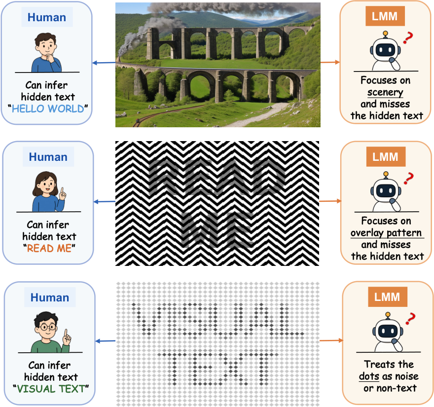
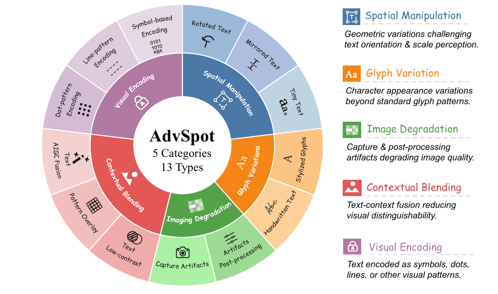
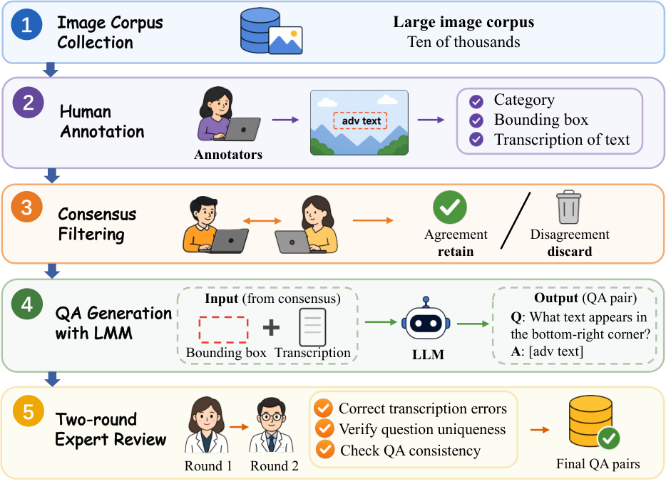
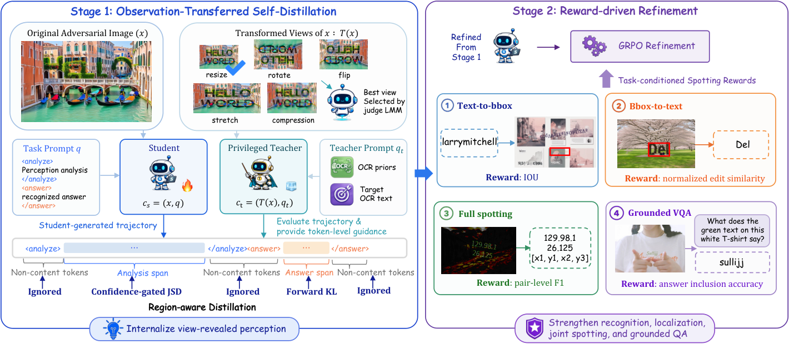
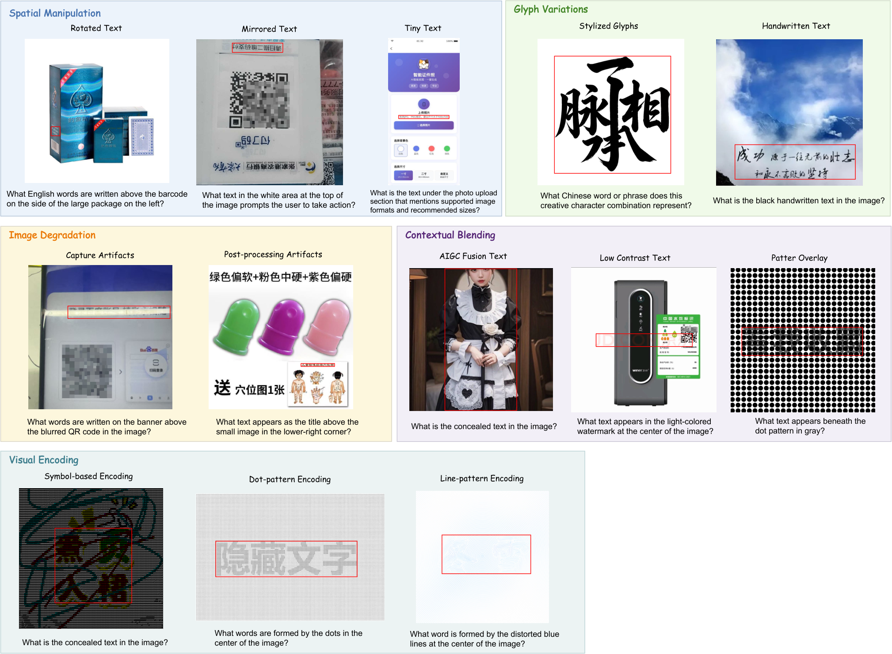

# ArmorOCR: 通过观察迁移自蒸馏实现基础化对抗性视觉感知

Linhan Cao    Siyuan Li    Jun Lan    Liangbo He    Guannan Li    Xiaolei Huang    Jun Jia    Shuheng Zhou    Huijia Zhu    Weiqiang Wang    Wei Sun

###### 摘要

大型多模态模型（LMMs）已展现出强大的OCR识别能力，但仍然容易受到对抗性视觉文本的影响——这些文本对人类可读，但模型难以定位和识别。现有的OCR基准主要关注自然场景或文档风格的文本，而对抗性OCR评测在规模、任务覆盖范围或区域感知评估方面仍然有限。在本文中，我们将对抗性OCR形式化为一个基础化OCR感知任务，并引入AdvSpot，这是首个用于基础化对抗性OCR评测的基准。AdvSpot包含390张带有区域级标注的图像，涵盖5个主要类别和13种细粒度的对抗性OCR类型。为应对这一挑战，我们提出了ArmorOCR，这是一个用于鲁棒对抗性OCR感知的两阶段训练框架。ArmorOCR采用两阶段训练策略：第一阶段通过在线策略自蒸馏（OPSD）从特权转换观察中获取缺失的对抗性OCR感知能力；第二阶段利用群相对策略优化（GRPO），通过定位、识别、完整检测和视觉问答（VQA）的任务条件化奖励精炼基础化OCR感知。在我们的AdvSpot、其他对抗性OCR基准以及通用OCR基准上的实验表明，ArmorOCR持续改进对抗性OCR感知能力，同时保持了具有竞争力的通用OCR能力。

代码 — https://github.com/ant-research/ArmorOCR

## 引言

OCR是大型多模态模型（Large Multimodal Models, LMMs）[^29] [^12] [^34]的一项基础能力，但其在具有挑战性的视觉条件下的可靠性仍然有限[^13] [^9]。如图1所示，某些视觉文本模式暴露了明显的人类-AI感知差距：人类可以轻松从视觉上下文中恢复预期文本，而当前的LMMs可能会错误定位、忽略或误读它。我们将这类模式称为*对抗性OCR模式*（adversarial OCR patterns）。这些模式暴露了LMMs视觉文本感知中的系统性弱点，凸显了进行系统性评测和针对性模型改进的必要性，以弥合这一差距并发展更鲁棒的OCR能力。

现有的OCR基准[^15] [^26] [^8]推进了跨多样化自然视觉内容的通用OCR评测，但对对抗性OCR模式的覆盖有限。最近的对抗性OCR基准[^25] [^14]开始关注这一场景，但在规模、任务多样性或区域级标注方面仍存在局限。此外，仅识别评测无法充分洞察模型是否已识别出相关文本区域，还是仅从全局上下文或语言先验推断出答案。

受此限制启发，我们将对抗性OCR形式化为一个基础化OCR感知任务（grounded OCR perception task），其中模型需要定位相关文本区域、识别对抗性文本内容，并在具有挑战性的视觉条件下回答区域特定的问题。这一形式化支持区域级验证，并对对抗性OCR失败进行更细粒度的分析。

为实例化这一形式化，我们引入AdvSpot，这是首个用于基础化对抗性OCR感知的基准。AdvSpot提供了迄今为止最全面的对抗性OCR模式感知分类法，涵盖5个主要类别和13种细粒度类型，这些类型根据其底层OCR失败机制进行组织。它包含390张图像，提供区域级标注，涵盖边界框（bounding box）、文本转录、类别标签和区域定位视觉问答（VQA）对。这些标注共同支持对基础化对抗性OCR感知的系统性评测，涵盖定位、识别和区域特定问答。

最近针对对抗性OCR感知的方法[^25] [^13]依赖于"图像思考"策略[^11] [^22]，在推理时应用裁剪、缩放或翻转等转换，以揭示从原始视图难以感知的对抗性文本。尽管有效，这些方法引入了额外的推理延迟和部署复杂性，促使我们思考：*转换视图所揭示的感知信息能否在训练期间内化到模型参数中？*

为回答这个问题，我们提出了ArmorOCR，这是一个两阶段训练框架，它将转换视图揭示的视觉证据内化，实现单次前向传播的基础化对抗性OCR感知，而无需在推理时使用额外的视觉转换或工具。在第1阶段，我们执行带有响应区域感知token加权的在线策略自蒸馏（OPSD）。学生模型仅观察原始图像，教师模型则以特权转换视图为条件（两者共享相同骨干网络）。沿着学生在线策略轨迹的token级分布引导将特权观察揭示的感知能力迁移到学生模型，建立了鲁棒的感知基础。然而，自蒸馏仍受限于教师模型的性能上限，并且缺乏对多样化基础化OCR目标的显式优化。第2阶段采用群相对策略优化（GRPO），利用定位、识别、完整检测和区域定位VQA的任务条件化奖励来联合优化这些互补能力。

我们的贡献总结如下：

- 我们引入了AdvSpot，这是首个用于基础化对抗性OCR感知的基准，具有迄今为止最全面的对抗性OCR模式分类法和区域级标注，支持对对抗性OCR感知进行细粒度评测。
- 我们提出了ArmorOCR，这是一个两阶段框架，通过特权观察迁移内化转换视图揭示的感知能力，并通过任务条件化GRPO精炼基础化OCR感知。
- 在AdvSpot、现有对抗性OCR基准和通用OCR基准上的大量实验表明，ArmorOCR持续改进对抗性OCR感知能力，同时保持了具有竞争力的通用OCR能力。

## 相关工作

### OCR感知基准

现有的OCR基准[^21] [^18] [^17] [^24]，如OCRBench[^15]、CCOCR[^26]和OCRBench-v2[^8]，评测了多样化场景下的视觉文本感知，包括自然场景、文档和多语言内容。然而，它们对对抗性OCR模式的覆盖有限。

最近的对抗性OCR基准开始弥补这一差距。AdvOCR[^25]关注对抗性OCR鲁棒性，但在规模和分类法方面仍存在局限，而SmuggleBench[^14]评测图像级的隐藏文本提取，但没有区域定位或专门设计的问答。相比之下，AdvSpot基于全面的失败机制分类法，提供边界框、转录、区域定位VQA和感知类型标签。

### 对抗性OCR感知方法

现有的对抗性OCR感知方法主要在推理时恢复困难的视觉文本。VACoT[^25]采用"图像思考"范式[^5] [^30] [^33]，动态应用裁剪和缩放等视觉转换，而SemVink[^13]表明放大视图可以揭示AI生成图像中隐藏的文本。尽管有效，这些方法引入了额外的推理时开销。Li等人[^14]通过详细的链式思考（CoT）提示改进隐藏文本提取，但这类基于提示的策略需要针对特定基准进行适配。ArmorOCR能够在原始图像上进行单次前向推理，无需额外的视觉转换或扩展推理过程。

### 自蒸馏与强化学习

在线策略自蒸馏（OPSD）[^31]在学生模型自己采样的轨迹上训练它，教师模型配备特权信息以提供token级分布引导。最近的多模态研究[^28] [^4] [^23]进一步将特权信息从文本扩展到视觉表示。例如，Vision-OPD[^28]将来自裁剪条件化教师的细粒度感知迁移到全图学生。ArmorOCR将这一原则扩展到对抗性OCR，通过将特权视图教师揭示的感知迁移到原始视图学生。

强化学习已被广泛用于通过优化任务特定奖励进行LMM对齐[^20] [^10] [^32] [^27]，例如GRPO[^10]，它使用多个采样响应之间的相对奖励进行策略优化，而无需显式的值模型。这种奖励驱动的优化适用于对抗性OCR感知，其中定位、识别、检测和基础化问答可以通过任务特定奖励直接优化。

| 维度 | AdvOCR | SmuggleBench | AdvSpot |
| --- | --- | --- | --- |
| 图像数量 | 100 | 1,700 | 390 |
| 感知类型数量 | – | 6 | 13 |
| 边界框标注 | ✗ | ✗ | ✓ |
| 区域感知问答 | ✗ | ✗ | ✓ |

表1：与先前对抗性OCR基准的比较。

## 基准：AdvSpot

AdvSpot在三个方面改进了对抗性OCR基准。首先，它通过根据底层失败机制组织对抗性OCR感知类型，提供了更广泛和更系统的覆盖。其次，它引入了细粒度标注，包括边界框、转录、感知类型标签和区域定位VQA对。第三，它提供了一个区域定位评测框架用于对抗性OCR感知，能够进行比仅识别评测更具信息量的评估。表1将AdvSpot与现有对抗性OCR基准进行了比较。

### 任务定义

AdvSpot将基础化对抗性OCR感知实例化为一个区域定位VQA任务。每个实例表示为

$$
\mathcal{S}=(x,\mathcal{C}^{\star},b^{\star},t^{\star},q,a^{\star}),
$$

其中$x$是包含对抗性OCR模式的图像，$\mathcal{C}^{\star}$是与标注文本区域$b^{\star}$关联的感知类型标签集合，$t^{\star}$是其转录。问题$q$通过视觉属性或空间上下文唯一地指向区域-文本对$(b^{\star},t^{\star})$，$a^{\star}$是对应的答案。

在评测期间，模型仅接收$(x,q)$。正确回答要求模型将问题定位到相关文本区域、识别对抗性文本并提供区域特定的答案。这一形式化支持对对抗性OCR感知进行基础化评测。

### 分类法

AdvSpot包含5个主要类别和13种细粒度的对抗性OCR类型，按感知失败机制分组，如图2所示，详细定义和示例见附录A.1。

### 标注与问答构建

我们通过人在回路的流程构建AdvSpot，如图3所示。我们首先收集了数万张可能包含对抗性OCR模式的候选图像。每张图像由两名标注员独立标注边界框、转录和根据我们的分类法标注感知类型标签。我们仅保留两名标注员标注一致的区域，并丢弃没有一致区域的图像。对于每个保留的区域，我们使用Qwen3-VL-235B-A22B-Instruct在给定图像、边界框和转录的条件下生成区域定位的问答对；详细提示见附录A.2。随后，每个问答对经过两轮专家审查：纠正错误，验证问题是否唯一指向目标区域，确保答案与已验证转录保持一致。

### 评测协议

我们使用VQA准确率作为主要指标。如果完整的参考答案作为模型预测的连续子串出现，则认为预测是正确的：

$$
\mathrm{Acc}(\hat{a},a^{\star})=\mathbb{I}\!\left[a^{\star}\preceq_{\mathrm{sub}}\hat{a}\right],
$$

其中$u\preceq_{\mathrm{sub}}v$表示$u$是$v$的连续子串。这一标准允许额外的解释性内容，同时要求完整的参考答案。

为了直接评测区域定位，我们额外计算预测边界框$\hat{b}$与真实边界框$b^{\star}$之间的交并比（IoU）：

$$
\mathrm{IoU}(\hat{b},b^{\star})=\frac{\left|\hat{b}\cap b^{\star}\right|}{\left|\hat{b}\cup b^{\star}\right|}.
$$

VQA准确率评测区域特定答案的正确性，而IoU显式测量定位质量。详细的评测提示见附录A.3。

<table><tbody><tr><td rowspan="3">类别</td><td rowspan="3">子类型</td><td colspan="4">开源Qwen3-VL系列</td><td colspan="4">闭源专有LMMs</td><td>我们的LMM</td></tr><tr><td>8B（基线模型）</td><td>30B- A3B</td><td>32B</td><td>235B- A22B</td><td>Claude- Sonnet-4.5</td><td>GPT-4o</td><td>GPT-5</td><td>Gemini- 2.5 Flash</td><td>Armor- OCR</td></tr><tr><td></td><td></td><td></td><td></td><td></td><td></td><td></td><td></td><td></td></tr><tr><td rowspan="2">成像退化</td><td>捕获伪影</td><td>56.7</td><td>56.7</td><td>50.0</td><td>56.7</td><td>3.3</td><td>20.0</td><td>30.0</td><td>56.7</td><td>60.0</td></tr><tr><td>后处理</td><td>50.0</td><td>63.3</td><td>70.0</td><td>63.3</td><td>26.7</td><td>43.3</td><td>40.0</td><td>76.7</td><td>56.7</td></tr><tr><td rowspan="3">空间操纵</td><td>旋转文本</td><td>53.3</td><td>56.7</td><td>73.3</td><td>53.3</td><td>6.7</td><td>26.7</td><td>30.0</td><td>50.0</td><td>56.7</td></tr><tr><td>镜像文本</td><td>33.3</td><td>36.7</td><td>33.3</td><td>33.3</td><td>6.7</td><td>13.3</td><td>23.3</td><td>26.7</td><td>60.0</td></tr><tr><td>微小文本</td><td>63.3</td><td>63.3</td><td>73.3</td><td>66.7</td><td>50.0</td><td>50.0</td><td>60.0</td><td>86.7</td><td>56.7</td></tr><tr><td rowspan="2">字形变体</td><td>风格化字形</td><td>36.7</td><td>43.3</td><td>40.0</td><td>46.7</td><td>13.3</td><td>16.7</td><td>43.3</td><td>23.3</td><td>30.0</td></tr><tr><td>手写文本</td><td>66.7</td><td>56.7</td><td>63.3</td><td>63.3</td><td>13.3</td><td>33.3</td><td>40.0</td><td>50.0</td><td>63.3</td></tr><tr><td rowspan="3">视觉编码</td><td>符号编码</td><td>0.0</td><td>2.5</td><td>0.0</td><td>5.0</td><td>0.0</td><td>20.0</td><td>32.5</td><td>12.5</td><td>52.5</td></tr><tr><td>点阵编码</td><td>6.7</td><td>10.0</td><td>6.7</td><td>10.0</td><td>3.3</td><td>20.0</td><td>26.7</td><td>10.0</td><td>53.3</td></tr><tr><td>线条编码</td><td>6.7</td><td>13.3</td><td>3.3</td><td>13.0</td><td>0.0</td><td>20.0</td><td>20.0</td><td>3.3</td><td>60.0</td></tr><tr><td rowspan="3">上下文融合</td><td>AIGC融合文本</td><td>2.5</td><td>5.0</td><td>10.0</td><td>7.5</td><td>0.0</td><td>0.5</td><td>2.5</td><td>5.0</td><td>75.0</td></tr><tr><td>低对比度文本</td><td>42.9</td><td>48.6</td><td>51.4</td><td>48.6</td><td>11.4</td><td>31.4</td><td>34.4</td><td>37.1</td><td>51.4</td></tr><tr><td>图案叠加</td><td>11.4</td><td>11.4</td><td>11.4</td><td>11.4</td><td>0.0</td><td>5.7</td><td>8.6</td><td>8.6</td><td>48.6</td></tr><tr><td>平均准确率</td><td>–</td><td>31.2</td><td>34.3</td><td>35.3</td><td>34.8</td><td>9.8</td><td>23.2</td><td>30.0</td><td>32.3</td><td>55.7</td></tr><tr><td>平均IoU</td><td>–</td><td>49.1</td><td>50.6</td><td>51.9</td><td>47.5</td><td>10.4</td><td>15.9</td><td>35.0</td><td>28.0</td><td>63.3</td></tr></tbody></table>

表2：AdvSpot上的细粒度准确率和平均定位IoU。所有值以百分比（%）报告。最佳和次佳结果分别以粗体和下划线突出显示。平均准确率和平均IoU分别表示准确率和IoU的样本加权平均值。类别级IoU结果见附录A.3。后续表格采用相同约定。

## 方法：ArmorOCR

我们提出了ArmorOCR（图4），这是一个通过观察迁移和奖励驱动精炼进行对抗性OCR感知的两阶段框架。ArmorOCR基于以下观察：对抗性OCR失败源于两个挑战：（1）原始视图可能隐藏了感知对抗性文本所需的关键视觉线索，以及（2）仅有对抗性感知不足以完成需要定位、识别和基础化问答的基础化OCR任务。ArmorOCR首先通过OPSD将特权观察揭示的转换感知迁移到学生模型，然后通过带有任务条件化奖励的GRPO优化基础化OCR感知。

### 第1阶段：观察迁移自蒸馏

受对抗性OCR难度通常依赖于视角这一观察的启发[^13]，我们旨在将转换视图揭示的感知优势在训练期间迁移到模型中。基于OPSD，我们提出了观察迁移自蒸馏（OTSD），其中以特权转换视图为条件的教师模型引导学生模型。

设$x$为原始对抗性图像，$q$为任务提示。提示$q$指示模型在<analyze>和</analyze>标签内提供中间感知分析，然后在<answer>和</answer>标签内提供最终识别答案。学生模型仅以原始图像和任务提示为条件：

$$
c_{s}=(x,q).
$$

相反，教师模型以特权观察为条件：

$$
c_{t}=(\mathcal{T}(x),q_{t}),
$$

其中$\mathcal{T}(x)$表示$x$的转换视图。我们考虑五种转换：缩放、拉伸、旋转、翻转和压缩。对于每张图像，评判LMM Qwen3-VL-235B-A22B-Instruct选择识别准确率最高的转换视图。教师提示$q_{t}$在$q$基础上扩展，补充对抗性OCR先验和目标OCR文本信息，使教师能够理解对抗性视觉模式并提供可靠的token级答案引导。更多细节见附录B.1。

学生模型首先采样一个在线策略响应：

$$
\hat{y}\sim\pi_{\theta}(\cdot\mid c_{s}).
$$

然后教师模型在特权观察下评估学生生成的轨迹。在token位置$i$，学生和教师分布为：

$$
p_{s}^{i}=\pi_{\theta}(\cdot\mid c_{s},\hat{y}_{<i}),\quad p_{t}^{i}=\pi_{\theta}^{\prime}(\cdot\mid c_{t},\hat{y}_{<i}).
$$

原始OPSD对所有响应token一视同仁地执行蒸馏，忽略了它们在最终OCR预测中的不同角色。分析token编码了可能不确定的中间感知，答案token直接决定转录，结构token不包含任务相关内容。我们引入了响应区域感知的蒸馏损失，将响应划分为分析跨度$\mathcal{R}_{\text{ana}}$、答案跨度$\mathcal{R}_{\text{ans}}$和使用预定义标签的非内容结构token。

对于分析token，均匀应用蒸馏可能传播不确定或嘈杂的中间推理。我们使用置信门控的Jensen-Shannon散度（JSD）[^16]来选择性地迁移可靠的教师信号：

$$
\mathcal{L}_{\text{ana}}^{i}=g_{i}D_{\mathrm{JSD}}^{\beta}(p_{t}^{i}\|p_{s}^{i}),\quad i\in\mathcal{R}_{\text{ana}},
$$

其中$D_{\mathrm{JSD}}^{\beta}$表示混合系数为$\beta$的广义JSD。token级置信权重定义为

$$
g_{i}=\sigma\left(\gamma\left[\max_{k}\log p_{t}^{i}(k)-\max_{k}\log p_{s}^{i}(k)\right]\right),
$$

其中$\sigma(\cdot)$是sigmoid函数，$\gamma$控制置信门的锐度。当特权教师比学生更自信时，权重$g_{i}$增加，在具有可靠教师引导的位置加强蒸馏，同时抑制不确定信号。

对于直接决定最终OCR转录的答案token，我们使用前向KL散度应用更强的监督：

$$
\mathcal{L}_{\text{ans}}^{i}=\mathrm{KL}(p_{t}^{i}\|p_{s}^{i}),\quad i\in\mathcal{R}_{\text{ans}}.
$$

在特权观察和OCR引导的条件下，教师提供了可靠的目标答案分布。我们对所有答案token分配均匀权重，因为每个都对最终转录有贡献。

非内容token，如结构标记，被排除在损失之外，因为它们仅编码输出格式，不对对抗性文本感知有贡献。由此产生的目标选择性地迁移中间感知，同时对最终OCR输出施加直接监督：

$$
\mathcal{L}_{\mathrm{OTSD}}=\frac{\sum_{i\in\mathcal{R}_{\text{ana}}}\mathcal{L}_{\text{ana}}^{i}+\sum_{i\in\mathcal{R}_{\text{ans}}}\mathcal{L}_{\text{ans}}^{i}}{\sum_{i\in\mathcal{R}_{\text{ana}}}g_{i}+|\mathcal{R}_{\text{ans}}|+\epsilon}.
$$

<table><tbody><tr><td rowspan="3">基准</td><td rowspan="3">任务</td><td colspan="4">开源Qwen3-VL系列</td><td colspan="2">闭源LMMs</td><td colspan="3">专用LMMs</td></tr><tr><td>8B（基线模型）</td><td>30B- A3B</td><td>32B</td><td>235B- A22B</td><td>GPT-5</td><td>Gemini- 2.5 Flash</td><td>VACoT</td><td>Smuggle- CoT</td><td>Armor- OCR</td></tr><tr><td></td><td></td><td></td><td></td><td></td><td></td><td></td><td></td><td></td></tr><tr><td rowspan="3">AdvOCR</td><td>真实世界</td><td>30.0</td><td>34.0</td><td>44.0</td><td>44.0</td><td>12.0</td><td>34.0</td><td>62.0</td><td>–</td><td>44.0</td></tr><tr><td>合成</td><td>12.0</td><td>12.0</td><td>8.0</td><td>12.0</td><td>22.0</td><td>12.0</td><td>48.0</td><td>–</td><td>68.0</td></tr><tr><td>平均</td><td>21.0</td><td>23.0</td><td>26.0</td><td>28.0</td><td>17.0</td><td>23.0</td><td>55.0</td><td>–</td><td>56.0</td></tr><tr><td rowspan="7">SmuggleBench</td><td>微小文本</td><td>26.1</td><td>25.9</td><td>23.6</td><td>25.1</td><td>18.2</td><td>26.3</td><td>–</td><td>30.2</td><td>33.0</td></tr><tr><td>遮挡文本</td><td>18.2</td><td>23.2</td><td>19.1</td><td>19.6</td><td>9.7</td><td>24.1</td><td>–</td><td>26.1</td><td>17.5</td></tr><tr><td>低对比度</td><td>3.0</td><td>8.8</td><td>3.5</td><td>6.5</td><td>4.0</td><td>12.5</td><td>–</td><td>8.5</td><td>6.5</td></tr><tr><td>手写</td><td>31.7</td><td>30.4</td><td>29.3</td><td>33.7</td><td>15.8</td><td>15.4</td><td>–</td><td>31.7</td><td>27.0</td></tr><tr><td>艺术性</td><td>14.1</td><td>14.5</td><td>11.6</td><td>15.6</td><td>11.1</td><td>8.7</td><td>–</td><td>18.6</td><td>19.0</td></tr><tr><td>AI幻觉</td><td>0.0</td><td>0.3</td><td>0.8</td><td>0.8</td><td>0.3</td><td>0.0</td><td>–</td><td>0.0</td><td>8.2</td></tr><tr><td>平均</td><td>13.3</td><td>14.8</td><td>14.3</td><td>14.6</td><td>8.5</td><td>12.4</td><td>–</td><td>16.4</td><td>17.1</td></tr></tbody></table>

表3：在其他对抗性OCR基准上的结果：AdvOCR和SmuggleBench。

### 第2阶段：奖励驱动精炼

第1阶段建立了模型的对抗性文本感知能力，但教师引导的蒸馏仍受限于教师监督，并且不直接优化基础化OCR任务所需的多样化目标。我们应用带有任务条件化奖励的GRPO来使模型与基础化对抗性OCR感知对齐。具体而言，我们构建了四个互补任务：用于定位的文本到边界框、用于识别的边界框到文本、用于联合区域-文本预测的完整检测，以及用于区域特定问答的区域定位VQA。

对于文本到边界框，模型通过预测给定文本字符串对应的边界框来执行文本条件化区域定位。定位奖励定义为预测边界框与真实边界框之间的IoU：

$$
R_{\mathrm{t2b}}=\mathrm{IoU}(\hat{b},b^{\star}).
$$

对于边界框到文本，模型通过预测给定边界框对应的转录来执行区域条件化文本识别。设$\hat{t}$和$t^{\star}$分别表示预测和真实转录。我们采用归一化Levenshtein相似度作为识别奖励：

$$
R_{\mathrm{b2t}}=1-\frac{\mathrm{ED}(\hat{t},t^{\star})}{\max(|\hat{t}|,|t^{\star}|)},
$$

其中$\mathrm{ED}(\cdot,\cdot)$表示Levenshtein编辑距离。

对于完整检测，模型联合预测多个文本区域及其对应的转录。只有当定位和识别约束都满足时，预测的边界框-文本对才被视为有效匹配：

$$
\mathrm{IoU}(\hat{b},b^{\star})\geq\theta_{\mathrm{iou}},\quad\mathrm{Sim}(\hat{t},t^{\star})\geq 1-\theta_{\mathrm{edit}},
$$

其中$\mathrm{Sim}(\cdot,\cdot)$表示归一化Levenshtein相似度，$\theta_{\mathrm{iou}}$和$\theta_{\mathrm{edit}}$分别是定位和识别匹配的预定义阈值。我们在预测和真实对之间执行贪婪匹配，并使用对级F1分数作为联合检测奖励：

$$
R_{\mathrm{joint}}=\frac{2PR}{P+R},
$$

其中$P$和$R$分别表示匹配边界框-文本对的精确率和召回率。

对于区域定位VQA，模型回答基于标注对抗性文本区域的问题。我们使用归一化答案包含作为奖励：

$$
R_{\mathrm{vqa}}=\mathbb{I}[a^{\star}\subseteq\hat{a}].
$$

给定采样响应$\hat{y}$、其真实目标$y^{\star}$和任务类型$\tau$，最终奖励定义为：

$$
R(y,y^{\star},\tau)=\begin{cases}R_{\mathrm{t2b}},&\tau=\texttt{text\_to\_bbox},\\
R_{\mathrm{b2t}},&\tau=\texttt{bbox\_to\_text},\\
R_{\mathrm{joint}},&\tau=\texttt{full\_spotting},\\
R_{\mathrm{vqa}},&\tau=\texttt{vqa}.\end{cases}
$$

## 实验

### 实验设置

基准。我们在两组基准上评测模型。对于对抗性OCR感知，我们在我们提出的AdvSpot和两个现有的对抗性OCR相关基准AdvOCR[^25]和SmuggleBench[^14]上评测模型。对于通用OCR感知，我们进一步在三个广泛使用的通用OCR基准上评测：CCOCR[^26]、OCRBench[^15]和OCRBench-v2[^8]。

模型。我们比较了开源和专有LMMs。对于开源模型，我们评测了不同规模的Qwen3-VL系列[^3]。对于专有模型，我们包括Claude-Sonnet-4.5[^2]、GPT-4o[^1]、GPT-5[^19]和Gemini-2.5 Flash[^6]。附录A.4报告了额外的基准结果。对于现有的对抗性OCR基准，我们还比较了特定于基准的方法：用于AdvOCR的VACoT[^25]和用于SmuggleBench的Smuggle-CoT[^14]1。

训练细节。由于大规模对抗性OCR数据的稀缺性，我们构建了自动化数据合成流程来生成具有可控对抗性模式的阶段特定训练集。合成训练数据具有多样化对抗性模式，提供可扩展的监督信号。所有评测均在零样本设置下进行。第1阶段使用50K样本来建立对抗性OCR感知，而第2阶段使用70K样本，丰富了更难的对抗性案例，用于细粒度基础化OCR优化。详细的数据生成过程见附录C.1。ArmorOCR使用Qwen3-VL-8B-Instruct作为骨干网络。在第1阶段，教师模型保持冻结，学生模型通过提议的OTSD进行优化。在第2阶段，我们使用带有任务条件化奖励的GRPO进一步优化模型，每个提示采样8个rollout响应。公式（14）中的超参数$\theta_{\mathrm{iou}}$和$\theta_{\mathrm{edit}}$分别设置为$0.5$和$0.1$。两个阶段都在PPU-810E加速器上训练。详细的训练配置见附录C.2。

指标。对于AdvSpot，我们报告VQA准确率和定位IoU。对于AdvOCR，我们报告由Qwen3-30B-A3B-2507[^3]评测的pass@1准确率，遵循其官方评测协议。对于SmuggleBench，我们关注其"感知盲点"子集，这与我们的任务最为一致，并报告原始论文中引入的TER指标。对于三个通用OCR基准，我们采用开源评测工具包VLMEvalKit[^7]，其结果与官方指标基本一致，并报告总体基准分数。

### 性能分析

AdvSpot结果分析。表2展示了AdvSpot上的结果。开源和闭源大型多模态模型在我们的基准上均面临严峻挑战，整体准确率低于36%。符号编码和AIGC融合文本仍然极具挑战性，大多数模型在这些类型上的准确率几乎为零。这些失败表明，当前的大型多模态模型在对抗性OCR模式面前仍然脆弱，尤其是涉及视觉编码和上下文融合的模式。相比之下，ArmorOCR实现了最佳的整体性能，相比其基础模型提升了24.5%。在AIGC融合文本上的提升尤为显著，ArmorOCR的性能超过最强竞争模型65%。ArmorOCR还实现了最高的平均定位IoU，表明其在区域定位和基础化对抗性OCR感知方面均具有强大能力。此外，不同模型之间IoU与准确率趋势的不匹配表明，仅凭答案准确率并不能保证可靠的区域定位。例如，Gemini-2.5 Flash实现了具有竞争力的准确率，但仅获得28.0%的IoU，比GPT-5低7%，尽管后者的准确率更低。这突显了联合评估定位和感知能力对于细粒度分析对抗性OCR失败的重要性。

其他对抗性OCR基准的结果。表3总结了AdvOCR和SmuggleBench上的结果。ArmorOCR在两个基准上均实现了最高的平均准确率。在AdvOCR上，ArmorOCR在合成分割数据集上的表现超过工具辅助的VACoT方法20%，该分割数据集专注于更具挑战性的对抗性模式。在SmuggleBench上，ArmorOCR实现了比Smuggle-CoT更好的整体性能，在AI Illusions类别上获得了8%的显著提升，尽管后者依赖于更大的235B模型和详细的CoT提示。这些结果证明了ArmorOCR在多样化对抗性OCR场景中的有效性和鲁棒性。

**图5**：ArmorOCR在三个标准OCR基准上的通用OCR能力保持情况。

通用OCR能力。一个潜在的担忧是，提升对抗性OCR感知可能会降低通用OCR能力。我们在三个通用OCR基准上评估了基础模型和ArmorOCR。如图5所示，尽管未使用额外的通用OCR训练数据，ArmorOCR在所有基准上保持了与基础模型相当的性能。这表明我们的训练策略在提升对抗性OCR鲁棒性的同时，很大程度上保持了通用OCR能力。

### 消融研究

我们在AdvSpot上进行所有消融研究，因为它提供了全面的评估环境。结果报告在表4中。

阶段消融。我们首先评估两阶段训练设计。完整的ArmorOCR优于两个单阶段变体，表明阶段1和阶段2是互补的。尽管单独的阶段2显著改善了定位能力，但在视觉问答准确率上仅带来有限的提升，这突显了首先内化转换视图所揭示的对抗性OCR感知的重要性。在阶段1的基础上构建阶段2进一步将准确率性能提升了6.8%，表明任务条件化奖励优化有效地将阶段1中获得的感知能力转化为更准确的区域定位答案。

阶段1组件消融。我们进一步分析了阶段1中的两个关键设计：视觉迁移和响应区域感知蒸馏。移除视觉迁移会使教师模型仅以原始图像和特权文本信息为条件，产生4.1%的边际准确率提升，从而表明特权转换观察比单独的文本信息提供了更有效的监督。用标准的OPSD JSD损失替换我们的响应区域感知目标也会降低性能，证明了重要性引导的选择性蒸馏能够实现更有效的知识迁移。

阶段2奖励消融。我们最后评估了阶段2中每个任务条件化奖励的贡献。移除任何奖励都会导致性能下降，表明定位、识别、检测和区域定位视觉问答目标各自都提供了有用的监督。它们的互补效应共同增强了基础化对抗性OCR感知能力。

<table><tbody><tr><td colspan="2">阶段1</td><td colspan="4">阶段2</td><td rowspan="2">IoU</td><td rowspan="2">准确率</td></tr><tr><td>VT</td><td>RAD</td><td><math><semantics><msub><mi>R</mi> <mi>t2b</mi></msub> <annotation>R_{\mathrm{t2b}}</annotation></semantics></math></td><td><math><semantics><msub><mi>R</mi> <mi>b2t</mi></msub> <annotation>R_{\mathrm{b2t}}</annotation></semantics></math></td><td><math><semantics><msub><mi>R</mi> <mi>joint</mi></msub> <annotation>R_{\mathrm{joint}}</annotation></semantics></math></td><td><math><semantics><msub><mi>R</mi> <mi>vqa</mi></msub> <annotation>R_{\mathrm{vqa}}</annotation></semantics></math></td></tr><tr><td colspan="8">基线</td></tr><tr><td></td><td></td><td></td><td></td><td></td><td></td><td>49.1</td><td>31.2</td></tr><tr><td colspan="8">阶段消融</td></tr><tr><td></td><td></td><td>✓</td><td>✓</td><td>✓</td><td>✓</td><td>61.2</td><td>39.8</td></tr><tr><td>✓</td><td>✓</td><td></td><td></td><td></td><td></td><td>58.7</td><td>48.9</td></tr><tr><td colspan="8">阶段1组件消融</td></tr><tr><td></td><td>✓</td><td></td><td></td><td></td><td></td><td>52.2</td><td>35.3</td></tr><tr><td>✓</td><td></td><td></td><td></td><td></td><td></td><td>54.1</td><td>46.6</td></tr><tr><td colspan="8">阶段2奖励消融</td></tr><tr><td>✓</td><td>✓</td><td></td><td>✓</td><td>✓</td><td>✓</td><td>60.4</td><td>52.1</td></tr><tr><td>✓</td><td>✓</td><td>✓</td><td></td><td>✓</td><td>✓</td><td>61.5</td><td>52.4</td></tr><tr><td>✓</td><td>✓</td><td>✓</td><td>✓</td><td></td><td>✓</td><td>62.8</td><td>53.2</td></tr><tr><td>✓</td><td>✓</td><td>✓</td><td>✓</td><td>✓</td><td></td><td>62.8</td><td>50.1</td></tr><tr><td>✓</td><td>✓</td><td>✓</td><td>✓</td><td>✓</td><td>✓</td><td>63.3</td><td>55.7</td></tr></tbody></table>

表4：ArmorOCR在AdvSpot上的消融研究。VT和RAD分别表示视觉迁移和区域感知蒸馏。

## 结论

在这项工作中，我们引入了AdvSpot，这是一个具有全面分类体系的基础化对抗性OCR基准，用于评估对抗性OCR感知能力。AdvSpot超越了现有的OCR基准，专注于对人类可读但对大型多模态模型具有挑战性的视觉操纵文本。我们进一步提出了ArmorOCR，这是一个用于鲁棒基础化对抗性OCR感知的两阶段框架。ArmorOCR首先通过观察迁移自蒸馏内化转换视图揭示的感知能力，然后使用任务条件化GRPO奖励联合优化定位、识别、检测和区域定位视觉问答。实验表明，ArmorOCR在保持通用OCR能力的同时，持续改善对抗性OCR感知能力。我们希望AdvSpot和ArmorOCR将促进未来在挑战性条件下可靠且可泛化的视觉文本感知方面的研究。

## 参考文献

ArmorOCR: Grounded Adversarial Visual Perception via Observation-Transferred Self-Distillation

补充材料

## 附录A 我们基准的更多细节

### 每个分类的详细定义

我们的分类体系根据潜在的OCR失败机制进行组织。具体而言，AdvSpot将对抗性OCR模式分为5个主要类别和13个细粒度子类型，详细说明如下。

- **空间操纵**。此类别包含改变文本空间布局或几何属性的对抗性模式，使定位和识别更具挑战性。
