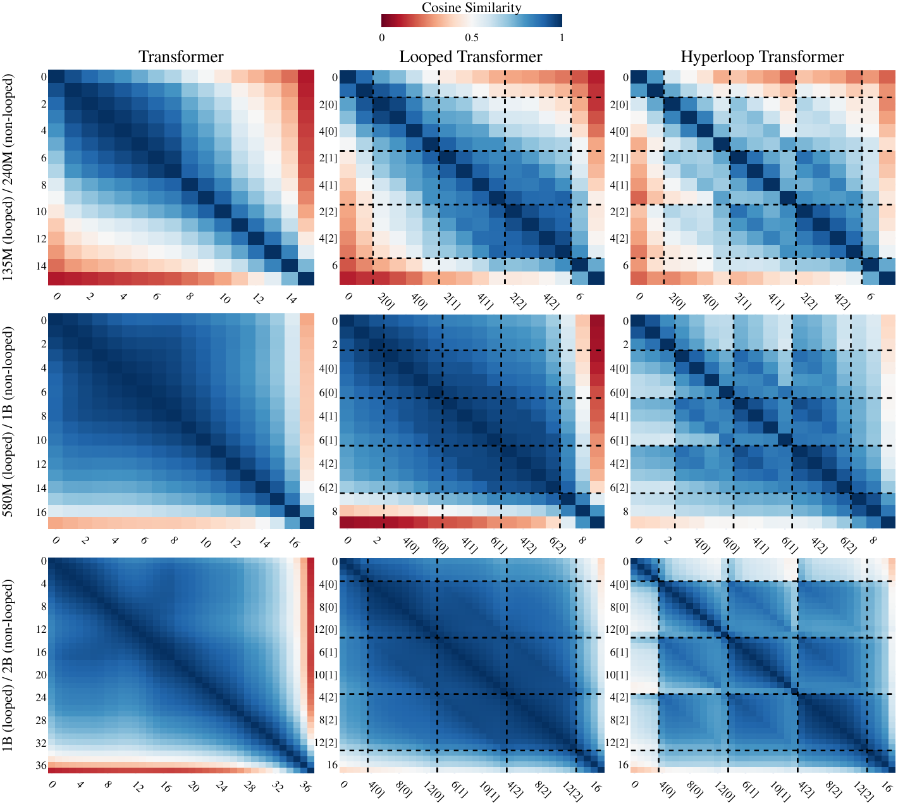

# 超循环 Transformer

Abbas Zeitoun    Lucas Torroba-Hennigen    Yoon Kim

###### 摘要

大语言模型（LLM）架构研究通常旨在在固定的计算/延迟预算下最大化模型质量。然而，许多应用场景（如边缘部署和设备端部署）还受到模型内存占用的进一步约束，因此需要用于语言建模的**参数高效**（parameter-efficient）架构。本文介绍了一种改善 LLM 参数效率的简单架构。我们的架构以循环 Transformer（Looped Transformer）作为核心组件，这种设计在深度方向复用 Transformer 层，因此比普通的深度匹配 Transformer 更具参数效率。我们将循环 Transformer 组织为三个块——起始块、中间块和结束块——其中每个块本身由多个 Transformer 层组成，只有中间块在深度方向循环应用。我们在循环的中间块中引入**超连接**（hyper-connections）[^42]，将残差流扩展为矩阵值残差流。超连接仅在每次循环后应用，因此增加的新参数和计算成本极少。在多个模型规模下，我们发现**超连接循环 Transformer**（Hyper-Connected Looped Transformer，简称 Hyperloop Transformer）尽管使用了大约 50% 更少的参数，但与深度匹配的 Transformer 和 mHC Transformer 基线相比仍能表现良好。这种性能在训练后权重量化中也得以保持，从而使超循环 Transformer 成为内存高效语言建模的一种有吸引力的架构。

## 1 引言

推进性能与效率的帕累托前沿是现代 LLM 架构研究的主要目标。在云端部署中，效率主要通过延迟来衡量，延迟取决于计算和通过内存层次结构的数据移动。由于此类环境中的内存相对充足，模型的内存占用相对于计算和数据移动而言通常是次要考虑因素。这使得参数**不**高效的架构（如混合专家模型（mixture-of-experts）[^35]）在云端部署中是可行的。相比之下，边缘部署和设备端部署不仅受到计算的约束，还受到可用内存总量的约束，后者通常小几个数量级。例如，现代智能手机通常具有 8GB-16GB 的 RAM。在这种场景下，模型的内存占用成为主要瓶颈，因为它直接影响模型是否能够被存储和执行。即使在云端部署中，将模型适配到更少的加速器上也可以减少通信开销并简化服务。展望未来，前沿模型可能会变得足够大，以至于参数内存总量即使在数据中心环境中也会成为一级约束。这些因素促使人们研究用于语言建模的**参数高效架构**，其目标是在给定计算约束下推进性能-内存前沿。

**循环 Transformer**（Looped Transformers）1 是在深度方向共享参数的 Transformer，因此比普通 Transformer 具有更高的参数效率。当循环次数可变时，它们还被证明可以克服固定深度 Transformer 的某些理论限制 [^12] [^44] [^43]，最近的实证工作表明它们在某些真实世界推理任务上表现特别好 [^11] [^49]。然而，当深度匹配时，循环 Transformer 在性能上通常仍然不如非循环基线，特别是从困惑度（perplexity）的角度来看 [^33]。

本文开发了一种简单的循环架构，在使用大约一半参数的同时，其性能优于深度匹配的 Transformer 基线。遵循先前的工作 [^2]，我们采用"中间循环"（middle cycle）策略，将 Transformer 组织为起始块、中间块和结束块，并只循环中间块。然后，我们将**超连接**（hyper-connections）[^48] [^42] 的一个变体（将残差流扩展为多条流）仅整合到循环块中。具体来说，我们在循环级别（即仅在每次循环迭代后）应用超连接，而不是在层级别应用，因此产生的额外参数和计算量极少。我们发现，我们的**超连接循环 Transformer**（Hyperloop Transformer）改善了性能-参数前沿，尽管使用了 50% 更少的参数，但与具有 240M、1B 和 2B 参数的深度匹配普通 Transformer 相比表现良好。这种性能在模型权重的训练后量化中也得以保持，从而使超循环 Transformer 成为内存高效语言建模的一种有吸引力的替代方案。

## 2 背景

### 2.1 循环 Transformer

对于长度为 $T$ 的输入，Transformer 通过注意力层和 MLP 层将第 $l$ 层的输入表示 $\mathbf{X}^{(l)}\in\mathbb{R}^{T\times C}$ 转换为输出 $\mathbf{X}^{(l+1)}\in\mathbb{R}^{T\times C}$：

$$
\displaystyle\mathbf{H}^{(l)}=\text{Attention}(\mathbf{X}^{(l)};\theta_{\text{attn}}^{(l)})+\mathbf{X}^{(l)},
$$
$$
\displaystyle\mathbf{X}^{(l+1)}=\text{MLP}(\mathbf{X}^{(l)};\theta_{\text{mlp}}^{(l)})+\mathbf{H}^{(l)}.
$$

这里 $\theta^{(l)}_{\text{attn}},\theta^{(l)}_{\text{MLP}}$ 分别是多头注意力和前馈层的层特定参数。2 令 $\mathcal{F}_{l}(\cdot)$ 表示应用 Transformer 层 $l$，则 $L$ 层 Transformer 通过 $\mathbf{X}^{(L)}=\mathcal{F}_{L}(\dots\mathcal{F}_{2}(\mathcal{F}_{1}(\mathbf{X}^{(1)}))\dots)$ 获得最终输出。循环 Transformer 在深度方向共享参数，例如，完全循环的模型将具有 $\mathbf{X}^{(L)}=\mathcal{F}_{1}(\dots\mathcal{F}_{1}(\mathcal{F}_{1}(\mathbf{X}^{(1)}))\dots)$。最近的工作表明，"中间循环"策略特别有效 [^2] [^33]，该策略将 Transformer 层划分为起始块、中间块和结束块3，并只循环中间块。我们在架构中也采用了这种中间循环策略。

### 2.2 超连接 Transformer

如上所示，Transformer 的每一层都会向 $C$ 维**残差流**（residual stream）添加内容。超连接 Transformer [^48] 通过"超连接"将残差流扩展为 $n\times C$ 维矩阵。在最近的**流形约束超连接**（manifold-constrained hyper-connections，简称 mHC）[^42] 中，深度 $l$ 时间步 $t$ 的残差流（由 $\mathbf{x}_{t}^{(l)}\in\mathbb{R}^{C}$ 给出）通过扩展因子 $n$ 扩展，产生 $n$ 条并行残差流 $\mathbf{y}_{t}^{(l)}\in\mathbb{R}^{n\times C}$。然后使用输入依赖的投影 $\mathbf{H}_{l,t}^{\text{pre}}$、$\mathbf{H}_{l,t}^{\text{post}}$ 和 $\mathbf{H}_{l,t}^{\text{res}}$ 对这个扩展的残差流进行读取、写入和混合。具体来说，深度 $l$ 的转换可以按如下方式计算：

$$
\displaystyle{\mathbf{z}}_{t}^{(l)}=\operatorname{RMSNorm}(\text{flatten}({\mathbf{y}}_{t}^{(l)})),
$$
$$
\displaystyle{\mathbf{H}}_{l,t}^{\text{pre}}=\sigma(\alpha_{l}^{\text{pre}}\cdot(\mathbf{W}_{l}^{\text{pre}}{\mathbf{z}}_{t}^{(l)})+\mathbf{b}_{l}^{\text{pre}}),
$$
$$
\displaystyle{\mathbf{H}}_{l,t}^{\text{post}}=2\cdot\sigma(\alpha_{l}^{\text{post}}\cdot(\mathbf{W}_{l}^{\text{post}}\mathbf{z}_{t}^{(l)})+\mathbf{b}_{l}^{\text{post}}),
$$
$$
\displaystyle{\mathbf{H}}_{l,t}^{\text{res}}=\text{sinkhorn}(\alpha_{l}^{\text{res}}\cdot\text{reshape}(\mathbf{W}_{l}^{\text{res}}{\mathbf{z}}_{t}^{(l)})+\mathbf{b}_{l}^{\text{res}}).
$$

这里 $\mathbf{W}_{l}^{\text{pre}}\in\mathbb{R}^{n\times nC}$、$\mathbf{W}_{l}^{\text{post}}\in\mathbb{R}^{n\times nC}$、$\mathbf{W}_{l}^{\text{res}}\in\mathbb{R}^{n^{2}\times nC}$ 是线性投影，$\alpha_{l}^{\text{pre}}$、$\alpha_{l}^{\text{post}}$、$\alpha_{l}^{\text{res}}\in\mathbb{R}$ 是可学习的标量，$\mathbf{b}_{l}^{\text{pre}}\in\mathbb{R}^{n}$、$\mathbf{b}_{l}^{\text{post}}\in\mathbb{R}^{n}$、$\mathbf{b}_{l}^{\text{res}}\in\mathbb{R}^{n\times n}$ 是可学习的偏置，$\text{reshape}(\cdot)$ 是一个将 $n^{2}$ 维向量转换为 $n\times n$ 矩阵的运算符。最后，$\text{sinkhorn}(\cdot)$ 应用 Sinkhorn-Knopp 算法**（通过迭代执行列归一化和行归一化，在极限情况下确保 $\mathbf{H}_{l,t}^{\text{res}}$ 是双随机矩阵，即位于 Birkhoff 多面体上）**。[^42] 发现 20 次 Sinkhorn-Knopp 迭代就足够了。

给定输入依赖的矩阵 $\mathbf{H}_{l,t}^{\text{pre}}\in\mathbb{R}^{1\times n}$、$\mathbf{H}_{l,t}^{\text{post}}\in\mathbb{R}^{n\times 1}$、$\mathbf{H}_{l,t}^{\text{res}}\in\mathbb{R}^{n\times n}$ 和 Transformer 层的子层 $\mathcal{F}_{l}\in\{\text{Attention}_{l},\text{MLP}_{l}\}$，mHC 通过以下方式在较小的 $C$ 维残差流中应用注意力/MLP 层：4

$$
\displaystyle\mathbf{y}^{(l+1)}_{t}=\mathbf{H}_{l,t}^{\text{res}}\mathbf{y}^{(l)}_{t}+\mathbf{H}_{l,t}^{\text{post}}\mathcal{F}_{l}(\mathbf{H}_{l,t}^{\text{pre}}\mathbf{y}_{t}^{(l)}).
$$

因此，mHC Transformer 使得在不产生太多额外计算的情况下使用更大的矩阵值残差流成为可能（因为计算密集的注意力/MLP 层仍然使用 $C$ 维输入/输出）。

图 1：（左）带有两次循环的普通中间循环 Transformer 架构。（右）超循环 Transformer，使用并行残差流，在每次循环后通过超连接 [^42] 进行写入。

## 3 超循环 Transformer

我们的架构如图 1 所示，极其简单。我们将 Transformer 划分为起始块、中间块和结束块，然后在循环中间块时在循环级别应用（修改版的）超连接。

具体来说，令 $\mathbf{X}_{\text{begin}}\in\mathbb{R}^{T\times C}$ 为应用起始块后的残差流。我们通过简单地复制 $n$ 次将其扩展为 $n$ 条并行流，从而得到 $\mathbf{Y}^{(0)}\in\mathbb{R}^{T\times n\times C}$，这将作为超连接循环块的输入。然后，我们按照上述方法为所有 $\{\mathbf{y}_{t}^{(0)}\}_{t=1}^{T}$ 计算输入依赖的矩阵 $\mathbf{H}_{0,t}^{\text{pre}},\mathbf{H}_{0,t}^{\text{post}},\mathbf{H}_{0,t}^{\text{res}}\in\mathbb{R}^{n\times n}$，但对 $\mathbf{H}_{0,t}^{\text{res}}$ 使用更简单的参数化：

$$
\displaystyle{\mathbf{H}}_{0,t}^{\text{res}}=\text{diag}(\sigma(\alpha_{0}^{\text{res}}\cdot(\mathbf{W}_{0}^{\text{res}}{\mathbf{z}}_{t}^{(0)})+\mathbf{b}_{0}^{\text{res}})),
$$

其中 $\mathbf{W}_{0}^{\text{res}}$ 现在是一个 $n\times nC$ 矩阵（而不是 $n^{2}\times nC$），$\mathbf{b}_{0}^{\text{res}}\in\mathbb{R}^{n}$。

我们在 $\mathbf{Y}^{(0)}$ 上使用 $\{\mathbf{H}_{0,t}^{\text{pre}}\}_{t=1}^{T}$ 来获得中间块的 $C$ 维输入，应用中间块，然后使用 $\{\mathbf{H}_{0,t}^{\text{post}}\}_{t=1}^{T}$ 投影回 $n\times C$ 残差流。我们在中间块之后添加一个"循环位置嵌入"（loop position embedding）$\mathbf{e}_{l}\in\mathbb{R}^{C}$，得到递归关系：

$$
\displaystyle\mathbf{y}^{(l+1)}_{t}=\mathbf{H}_{l,t}^{\text{res}}\mathbf{y}^{(l)}_{t}+\mathbf{H}_{l,t}^{\text{post}}\left(\mathcal{F}(\mathbf{H}_{l,t}^{\text{pre}}\mathbf{y}_{t}^{(l)})+\mathbf{e}_{l}\right).
$$

这个过程持续 $L$ 次循环以获得 $\mathbf{Y}^{(L)}$。最后，我们对 $\mathbf{Y}^{(L)}$ 在并行流上取平均，得到 $\mathbf{X}_{\text{end}}\in\mathbb{R}^{T\times C}$，它被用作结束块的输入。

我们的方法与原始 mHC 的不同之处在于：(1) 我们对 $\mathbf{H}_{l,t}^{\text{res}}$ 使用更简单的参数化，用对角矩阵上的 sigmoid 替代密集矩阵上的 $\text{sinkhorn}(\cdot)$ 运算符（我们发现这在性能上是足够的，同时更高效）；(2) 我们添加了循环位置嵌入，当将架构视为具有矩阵值隐藏状态 $\mathbf{Y}^{(0)}$ 的"深度方向 RNN"时，它充当每个时间（即循环）步的输入；(3) 我们仅在循环级别应用超连接，而不是在每个注意力/MLP 层之后（因此具有 3 次循环的架构将有 3 个超连接）。我们的架构也可以看作是循环 Transformer 的一种更灵活的参数化，它允许参数在循环迭代之间略有变化。具体来说，我们有循环特定的参数 $\{\mathbf{W}_{l}^{\tau},\mathbf{b}_{l}^{\tau},\alpha_{l}^{\tau},\mathbf{e}_{l}\}$（其中 $\tau\in\{\text{pre},\text{post},\text{res}\}$），它们可以在循环迭代 $l$ 之间变化。虽然这里的额外参数数量仍然很少，但我们认为这种参数化与严格在每次循环迭代之间强制参数共享的普通循环 Transformer 相比，允许模型表示以更灵活的方式变化。

## 4 实证研究

### 4.1 实验设置

我们在 FineWeb-Edu 数据集 [^22] 上训练各种规模的超循环 Transformer，以及深度匹配的普通 Transformer、循环 Transformer 和 mHC Transformer 基线。所有模型都使用 SwiGLU MLP 层 [^36] 和 RoPE 嵌入 [^37]。我们对 mHC 和超循环 Transformer 都使用 4 条并行残差流。对于循环模型，我们将（大约）25% 的可用参数分配给起始块，25% 的参数分配给结束块，剩余的 50% 分配给中间块，中间块循环三次。这使得循环模型包含的参数数量是其深度匹配基线的一半。我们在消融研究中对这些选择进行了消融实验。

我们在相应规模普通 Transformer 的 Chinchilla 最优 token 数 [^16] 的 $2.5\times$ 上训练模型**（Chinchilla 最优比例指训练 token 数为参数量的 20 倍）**。我们使用 Llama-2 分词器对数据进行分词，使用 AdamW 作为优化器，采用线性预热和余弦衰减学习率调度。我们的完整超参数可以在附录 A 中找到。

### 4.2 主要结果

对于困惑度，我们在来自 FineWeb-Edu 数据集的由 50M token 组成的留出集上评估我们的模型。结果如表 1 所示。我们的结果表明，虽然普通循环 Transformer 的性能可能不如深度匹配的 Transformer 基线，但超循环 Transformer 只需要额外 150-300K 参数（与普通循环 Transformer 相比）就能超越循环和非循环深度匹配基线模型。

虽然困惑度在这个规模上提供了更稳健的性能度量，但我们也在下游任务上评估我们的模型。具体来说，我们在 ARC [^5]、COPA [^13]、HellaSwag [^46]、LAMBADA [^29]、OpenBookQA [^24]、PIQA [^3]、RACE [^20]、SciQ [^40] 和 WinoGrande [^32] 上评估我们的模型。有趣的是，我们发现尽管使用了 50% 更少的参数并且在困惑度方面不如 Transformer 模型，循环 Transformer 在大多数任务上也优于普通 Transformer。这种优势证实了文献中报告的类似发现 [^33]。超循环 Transformer 总体上优于所有其他基线。按任务细分的结果可以在附录 B 中找到。

表 1：我们的架构和在 FineWeb-Edu 上预训练的基线的主要结果。对于循环模型，[2L $\rightarrow$ 4L $(\times 3)$ $\rightarrow$ 2L] 表示我们有 2 层起始层、4 层中间层循环 3 次和 2 层结束层。困惑度使用 BF16 和 INT4 精度计算，我们使用 GPTQ 量化到 INT4。任务准确率基于 BF16 精度。训练吞吐量测量 token/秒，基于配备 NVLink 的 8 个 H100。

<table><tbody><tr><td>模型</td><td>维度</td><td>展开深度</td><td>训练 Token 数</td><td colspan="2">参数量</td><td>困惑度 (BF16)</td><td>困惑度 (INT4)</td><td>任务准确率</td><td>训练吞吐量 (Toks/s)</td></tr><tr><td>Transformer</td><td rowspan="4">1024</td><td rowspan="4">16</td><td rowspan="4">12.5B</td><td><math><semantics><mn>238</mn> <annotation>238</annotation></semantics></math></td><td>M</td><td>14.65</td><td>14.85</td><td>41.1%</td><td>786K</td></tr><tr><td>mHC</td><td><math><semantics><mn>241</mn> <annotation>241</annotation></semantics></math></td><td>M</td><td>14.55</td><td>14.73</td><td>41.1%</td><td>514K</td></tr><tr><td>循环 [2L <math><semantics><mo>→</mo> <annotation>\rightarrow</annotation></semantics></math> 4L <math><semantics><mrow><mo>(</mo><mo>×</mo> <mn>3</mn><mo>)</mo></mrow> <annotation>(\times 3)</annotation></semantics></math> <math><semantics><mo>→</mo> <annotation>\rightarrow</annotation></semantics></math> 2L]</td><td><math><semantics><mn>135.5</mn> <annotation>135.5</annotation></semantics></math></td><td>M</td><td>14.85</td><td>15.18</td><td>41.4%</td><td>786K</td></tr><tr><td>超循环 [2L <math><semantics><mo>→</mo> <annotation>\rightarrow</annotation></semantics></math> 4L <math><semantics><mrow><mo>(</mo><mo>×</mo> <mn>3</mn><mo>)</mo></mrow> <annotation>(\times 3)</annotation></semantics></math> <math><semantics><mo>→</mo> <annotation>\rightarrow</annotation></semantics></math> 2L]</td><td><math><semantics><mn>135.7</mn> <annotation>135.7</annotation></semantics></math></td><td>M</td><td>14.40</td><td>14.68</td><td>41.6%</td><td>750K</td></tr><tr><td>Transformer</td><td rowspan="4">2048</td><td rowspan="4">18</td><td rowspan="4">50B</td><td><math><semantics><mn>990.5</mn> <annotation>990.5</annotation></semantics></math></td><td>M</td><td>10.19</td><td>10.27</td><td>48.0%</td><td>367K</td></tr><tr><td>mHC</td><td><math><semantics><mn>997.5</mn> <annotation>997.5</annotation></semantics></math></td><td>M</td><td>10.07</td><td>10.16</td><td>48.6%</td><td>237K</td></tr><tr><td>循环 [3L <math><semantics><mo>→</mo> <annotation>\rightarrow</annotation></semantics></math> 4L <math><semantics><mrow><mo>(</mo><mo>×</mo> <mn>3</mn><mo>)</mo></mrow> <annotation>(\times 3)</annotation></semantics></math> <math><semantics><mo>→</mo> <annotation>\rightarrow</annotation></semantics></math> 3L]</td><td><math><semantics><mn>579.4</mn> <annotation>579.4</annotation></semantics></math></td><td>M</td><td>10.02</td><td>10.24</td><td>49.2%</td><td>367K</td></tr><tr><td>超循环 [3L <math><semantics><mo>→</mo> <annotation>\rightarrow</annotation></semantics></math> 4L <math><semantics><mrow><mo>(</mo><mo>×</mo> <mn>3</mn><mo>)</mo></mrow> <annotation>(\times 3)</annotation></semantics></math> <math><semantics><mo>→</mo> <annotation>\rightarrow</annotation></semantics></math> 3L]</td><td><math><semantics><mn>579.7</mn> <annotation>579.7</annotation></semantics></math></td><td>M</td><td>9.65</td><td>9.81</td><td>49.8%</td><td>354K</td></tr><tr><td>Transformer</td><td rowspan="4">2048</td><td rowspan="4">38</td><td rowspan="4">100B</td><td><math><semantics><mn>2018</mn> <annotation>2018</annotation></semantics></math></td><td>M</td><td>8.60</td><td>8.71</td><td>52.8%</td><td>181K</td></tr><tr><td>mHC</td><td><math><semantics><mn>2033</mn> <annotation>2033</annotation></semantics></math></td><td>M</td><td>8.57</td><td>8.62</td><td>53.7%</td><td>109K</td></tr><tr><td>循环 [4L <math><semantics><mo>→</mo> <annotation>\rightarrow</annotation></semantics></math> 10L <math><semantics><mrow><mo>(</mo><mo>×</mo> <mn>3</mn><mo>)</mo></mrow> <annotation>(\times 3)</annotation></semantics></math> <math><semantics><mo>→</mo> <annotation>\rightarrow</annotation></semantics></math> 4L]</td><td><math><semantics><mn>990.5</mn> <annotation>990.5</annotation></semantics></math></td><td>M</td><td>8.68</td><td>8.97</td><td>53.3%</td><td>183K</td></tr><tr><td>超循环 [4L <math><semantics><mo>→</mo> <annotation>\rightarrow</annotation></semantics></math> 10L <math><semantics><mrow><mo>(</mo><mo>×</mo> <mn>3</mn><mo>)</mo></mrow> <annotation>(\times 3)</annotation></semantics></math> <math><semantics><mo>→</mo> <annotation>\rightarrow</annotation></semantics></math> 4L]</td><td><math><semantics><mn>990.8</mn> <annotation>990.8</annotation></semantics></math></td><td>M</td><td>8.49</td><td>8.59</td><td>54.6%</td><td>180K</td></tr></tbody></table>

#### 训练后量化

模型权重的训练后量化（Post-Training Quantization）是减少模型内存占用的标准方法。虽然循环模型具有**参数**效率，但如果模型更难量化，实际上将是**内存**低效的。由于使用更多 token 训练的模型已被证明通常更难量化 [^17] [^27]，循环模型也可能更难量化，因为循环层在"更多"输入上训练。据我们所知，循环与量化之间的交互效应以前从未被研究过。我们使用 GPTQ [^10] 将模型（最初以 BF16 权重的混合精度训练）量化到 INT4，我们修改了 GPTQ 算法，使循环层的 Hessian 估计聚合所有循环中该层的所有输入的激活。我们使用来自 FineWeb-Edu 的 1024 个序列的校准集，对所有模型规模使用 128 的组大小。生成的 INT4 模型的困惑度如表 1 所示。我们的结果表明，虽然循环 Transformer 与非循环模型相比对低精度量化确实可能更敏感，但超连接有助于缓解量化导致的一些性能下降。因此，超循环 Transformer 在仅权重量化设置中继续表现良好。

#### 训练效率

额外的超连接是否会增加训练开销？我们在配备 NVLink 的单节点 $8\times\text{H100}$ GPU 上测量每个预训练模型的训练吞吐量，并在表 1 中呈现结果。用于这些测量的模型在 PyTorch 中实现，并使用 torch.compile 编译，但没有任何进一步的优化。我们的结果表明，我们方法的直接 PyTorch 实现与 Transformer 和循环 Transformer 基线相比仅产生最小的速度减慢。这可以归因于仅在**循环间**级别应用超连接，并且对 $\mathbf{H}^{\text{res}}$ 使用更简单的结构，从而导致极少的内存和计算开销。另一方面，mHC Transformer 的直接实现会导致不可忽视的速度减慢。理论上，这种开销可以通过适当的底层优化来降低——例如，[^42] 报告他们的专用训练内核有 6.7% 的开销。然而，据我们所知，这个内核并未公开可用，而我们的方法几乎不增加任何开销且不需要任何复杂的系统工程，这是一个额外的优势。

表 2：在更多 token 上训练的最小（16 层）模型的困惑度结果。

<table><tbody><tr><td></td><td></td><td colspan="2">训练 Token 数</td></tr><tr><td>模型</td><td>参数量</td><td>12.5B</td><td>100B</td></tr><tr><td>Transformer</td><td>238.0 M</td><td>14.65</td><td>12.15</td></tr><tr><td>mHC</td><td>241.0 M</td><td>14.55</td><td>12.16</td></tr><tr><td>循环</td><td>135.5 M</td><td>14.85</td><td>12.56</td></tr><tr><td>超循环</td><td>135.7 M</td><td>14.40</td><td>12.19</td></tr></tbody></table>

#### 使用更多 token 训练

我们训练集中的 token 数量是非循环基线模型参数数量的 50 倍，即 [^16] 建议的计算最优 20 倍配方的 2.5 倍。然而，现代模型通常训练的 token 数量远超 Chinchilla 最优值。例如，LLaMA3-8B [^14] 在 15T token 上训练，而 OLMo3-7B [^26] 在 6T token 上训练。在这种过度训练区间中，循环模型的优势会减弱吗？为了研究这一点，我们在来自 FineWeb-Edu 的 100B token 上训练我们最小类别的模型，对应于 240M 非循环参数。这相当于 Chinchilla 最优 token 数的 20 倍，或每个参数约 400 个训练 token。结果如表 2 所示。我们发现，虽然循环 Transformer 的性能不如非循环基线，但超循环 Transformer 尽管处于过度训练设置中，仍然与这些基线保持竞争力。

### 4.3 消融研究
#### 循环次数

我们的主要实验使用 3 次循环。如果保持参数量不变，性能如何随循环次数变化？我们针对 136M 参数和 579M 参数的循环 Transformer 和超循环 Transformer，将循环次数从 2 次变化到 6 次，结果如图 2 所示。我们观察到随着循环次数增加，收益呈递减趋势，但在所有情况下超循环 Transformer 都优于循环 Transformer。

上述实验保持参数量不变并通过改变循环次数来改变深度。接下来，我们通过将中间循环设计得更小但循环更多次来重构中间循环，从而保持深度不变。结果如表 3 所示。我们发现可以获得更高的参数效率，但代价是性能略有下降。例如，我们的 477M 参数模型仍然优于完整的 1B Transformer。

现在我们针对 136M 参数 / 12.5B token 设置进行更多消融实验。

图 2：136M（左）和 579M（右）参数循环模型在不同循环次数下的困惑度。非循环 Transformer 基线分别具有 238M（左）和 991M（右）参数。每次循环包含 4 层 Transformer 层。

<table><tbody><tr><td>Model</td><td>Structure</td><td>Unrolled Depth</td><td>Params</td><td>PPL</td></tr><tr><td></td><td>2L <math><semantics><mo>→</mo> <annotation>\rightarrow</annotation></semantics></math> 4L <math><semantics><mrow><mo>(</mo><mo>×</mo> <mn>3</mn><mo>)</mo></mrow> <annotation>(\times 3)</annotation></semantics></math> <math><semantics><mo>→</mo> <annotation>\rightarrow</annotation></semantics></math> 2L</td><td rowspan="3">16 layers</td><td>136 M</td><td><math><semantics><mn>14.853</mn> <annotation>14.853</annotation></semantics></math></td></tr><tr><td>Looped Transformer</td><td>2L <math><semantics><mo>→</mo> <annotation>\rightarrow</annotation></semantics></math> 3L <math><semantics><mrow><mo>(</mo><mo>×</mo> <mn>4</mn><mo>)</mo></mrow> <annotation>(\times 4)</annotation></semantics></math> <math><semantics><mo>→</mo> <annotation>\rightarrow</annotation></semantics></math> 2L</td><td>123 M</td><td><math><semantics><mn>15.184</mn> <annotation>15.184</annotation></semantics></math></td></tr><tr><td></td><td>2L <math><semantics><mo>→</mo> <annotation>\rightarrow</annotation></semantics></math> 2L <math><semantics><mrow><mo>(</mo><mo>×</mo> <mn>6</mn><mo>)</mo></mrow> <annotation>(\times 6)</annotation></semantics></math> <math><semantics><mo>→</mo> <annotation>\rightarrow</annotation></semantics></math> 2L</td><td>110 M</td><td><math><semantics><mn>15.763</mn> <annotation>15.763</annotation></semantics></math></td></tr><tr><td></td><td>2L <math><semantics><mo>→</mo> <annotation>\rightarrow</annotation></semantics></math> 4L <math><semantics><mrow><mo>(</mo><mo>×</mo> <mn>3</mn><mo>)</mo></mrow> <annotation>(\times 3)</annotation></semantics></math> <math><semantics><mo>→</mo> <annotation>\rightarrow</annotation></semantics></math> 2L</td><td rowspan="3">16 layers</td><td>136 M</td><td><math><semantics><mn>14.404</mn> <annotation>14.404</annotation></semantics></math></td></tr><tr><td>Hyperloop Transformer</td><td>2L <math><semantics><mo>→</mo> <annotation>\rightarrow</annotation></semantics></math> 3L <math><semantics><mrow><mo>(</mo><mo>×</mo> <mn>4</mn><mo>)</mo></mrow> <annotation>(\times 4)</annotation></semantics></math> <math><semantics><mo>→</mo> <annotation>\rightarrow</annotation></semantics></math> 2L</td><td>123 M</td><td><math><semantics><mn>14.618</mn> <annotation>14.618</annotation></semantics></math></td></tr><tr><td></td><td>2L <math><semantics><mo>→</mo> <annotation>\rightarrow</annotation></semantics></math> 2L <math><semantics><mrow><mo>(</mo><mo>×</mo> <mn>6</mn><mo>)</mo></mrow> <annotation>(\times 6)</annotation></semantics></math> <math><semantics><mo>→</mo> <annotation>\rightarrow</annotation></semantics></math> 2L</td><td>110 M</td><td><math><semantics><mn>15.056</mn> <annotation>15.056</annotation></semantics></math></td></tr><tr><td></td><td>3L <math><semantics><mo>→</mo> <annotation>\rightarrow</annotation></semantics></math> 4L <math><semantics><mrow><mo>(</mo><mo>×</mo> <mn>3</mn><mo>)</mo></mrow> <annotation>(\times 3)</annotation></semantics></math> <math><semantics><mo>→</mo> <annotation>\rightarrow</annotation></semantics></math> 3L</td><td rowspan="3">18 layers</td><td>579 M</td><td><math><semantics><mn>10.019</mn> <annotation>10.019</annotation></semantics></math></td></tr><tr><td>Looped Transformer</td><td>3L <math><semantics><mo>→</mo> <annotation>\rightarrow</annotation></semantics></math> 3L <math><semantics><mrow><mo>(</mo><mo>×</mo> <mn>4</mn><mo>)</mo></mrow> <annotation>(\times 4)</annotation></semantics></math> <math><semantics><mo>→</mo> <annotation>\rightarrow</annotation></semantics></math> 3L</td><td>528 M</td><td><math><semantics><mn>10.124</mn> <annotation>10.124</annotation></semantics></math></td></tr><tr><td></td><td>3L <math><semantics><mo>→</mo> <annotation>\rightarrow</annotation></semantics></math> 2L <math><semantics><mrow><mo>(</mo><mo>×</mo> <mn>6</mn><mo>)</mo></mrow> <annotation>(\times 6)</annotation></semantics></math> <math><semantics><mo>→</mo> <annotation>\rightarrow</annotation></semantics></math> 3L</td><td>477 M</td><td><math><semantics><mn>10.357</mn> <annotation>10.357</annotation></semantics></math></td></tr><tr><td></td><td>3L <math><semantics><mo>→</mo> <annotation>\rightarrow</annotation></semantics></math> 4L <math><semantics><mrow><mo>(</mo><mo>×</mo> <mn>3</mn><mo>)</mo></mrow> <annotation>(\times 3)</annotation></semantics></math> <math><semantics><mo>→</mo> <annotation>\rightarrow</annotation></semantics></math> 2L</td><td rowspan="3">18 layers</td><td>579 M</td><td><math><semantics><mn>9.648</mn> <annotation>9.648</annotation></semantics></math></td></tr><tr><td>Hyperloop Transformer</td><td>3L <math><semantics><mo>→</mo> <annotation>\rightarrow</annotation></semantics></math> 3L <math><semantics><mrow><mo>(</mo><mo>×</mo> <mn>4</mn><mo>)</mo></mrow> <annotation>(\times 4)</annotation></semantics></math> <math><semantics><mo>→</mo> <annotation>\rightarrow</annotation></semantics></math> 3L</td><td>528 M</td><td><math><semantics><mn>9.717</mn> <annotation>9.717</annotation></semantics></math></td></tr><tr><td></td><td>3L <math><semantics><mo>→</mo> <annotation>\rightarrow</annotation></semantics></math> 2L <math><semantics><mrow><mo>(</mo><mo>×</mo> <mn>6</mn><mo>)</mo></mrow> <annotation>(\times 6)</annotation></semantics></math> <math><semantics><mo>→</mo> <annotation>\rightarrow</annotation></semantics></math> 3L</td><td>477 M</td><td><math><semantics><mn>9.862</mn> <annotation>9.862</annotation></semantics></math></td></tr></tbody></table>

表 3：保持深度固定在 16 层或 18 层的情况下，改变循环结构时循环 Transformer 和超循环 Transformer 的性能。

| Number of Streams $n$ | PPL |
| --- | --- |
| 2 | $14.429$ |
| 4 | $14.404$ |
| 6 | $14.379$ |
| 8 | $14.388$ |
| 10 | $14.349$ |

表 4：改变并行残差流数量时超循环 Transformer 的性能。

#### 并行流数量

我们按照原始 mHC 工作的建议选择 $n=4$ 条并行残差流。鉴于并行流数量提供了一个参数高效的扩展轴，通过增加 $n$ 能否获得进一步收益？表 4 展示了使用 3 次循环、不同数量并行残差流的 135M 参数超循环 Transformer 的结果，我们观察到 $n$ 的收益呈递减趋势。因此，虽然使用矩阵值残差流确实能提升性能，但这一扩展轴的收益很快面临递减。

#### 超连接数量

回顾一下，我们的超循环 Transformer 仅在每次循环后应用超连接，这使得额外的参数/计算开销极小。我们针对 135M 参数超循环 Transformer 的循环块内使用的超连接数量进行消融实验。

<table><tbody><tr><td colspan="2">Hyper</td><td rowspan="2">PPL</td></tr><tr><td colspan="2">connections</td></tr><tr><td>12</td><td>[every layer]</td><td>14.45</td></tr><tr><td>6</td><td>[every 2 layers]</td><td>14.50</td></tr><tr><td>4</td><td>[every 3 layers]</td><td>14.50</td></tr><tr><td>3</td><td>[every loop (ours)]</td><td>14.40</td></tr><tr><td>2</td><td>[every 6 layers]</td><td>14.50</td></tr><tr><td>1</td><td>[every 12 layers]</td><td>14.63</td></tr></tbody></table>

表 5：改变超连接数量时的性能。

为此，我们固定循环次数，仅改变超连接数量，或者等价地说，改变单个超连接跨越的 Transformer 块数量。这导致在某些设置中，超连接被应用在循环内部，或者跨越来自不同循环的 Transformer 块。即使在每个块之后应用超连接，Transformer 块内的子层仍保留其原有的跳跃连接。

| Parameterization | PPL |
| --- | --- |
| Identity | 14.61 |
| Sinkhorn | 14.59 |
| Diagonal \[ours\] | 14.40 |

表 6：转移矩阵 $\mathbf{H}^{\text{res}}$ 参数化方式的消融实验。

表 5 显示，在每次循环后应用超连接（而不是每层）是性能最好的设置。这或许有些反直觉，因为每层设置使用了最多的计算/参数。我们的结果可能表明，至少在循环情况下，必须更谨慎地选择在何处应用超连接。

#### $\mathbf{H}^{\text{res}}$ 参数化

超循环 Transformer 通过对并行残差流使用更简单的对角转移矩阵 $\mathbf{H}^{\text{res}}$ 来简化 mHC 公式，这与 mHC 中使用的双随机结构形成对比。这导致参数更少，计算量更小。这是否会损害我们方法的性能？如表 6 所示，我们发现情况并非如此。最简单的恒等参数化仅略微逊于 Sinkhorn 参数化，而我们的（数据依赖的）对角参数化进一步提升了性能。

| LoRA Rank | Params | PPL |
| --- | --- | --- |
| 0 \[Looped Transformer\] | 135.5M | 14.85 |
| 4 | 136.0M | 14.85 |
| 8 | 137.0M | 14.81 |
| 16 | 139.0M | 14.80 |
| 32 | 143.0M | 14.77 |
| Transformer | 238.0M | 14.65 |
| Hyperloop | 136.0M | 14.40 |

表 7：允许 Transformer 层通过 LoRA 在循环迭代间变化的实验。

#### 与 LoRA 循环 Transformer 的比较

由于超连接的权重在不同循环间是不同的，我们的超循环 Transformer 允许循环块在不同循环间略有差异。使用 LoRA 在循环间修改参数（如松弛递归 Transformer [^1] 中那样）是否表现更好？这些实验的结果如表 7 所示。我们发现，允许参数通过 LoRA 在循环间变化确实有些帮助，但超循环 Transformer 提供了一种更加参数高效的性能提升方法。

### 4.4 分析

为了更好地理解模型的内部工作机制，我们对其在 FineWeb-Edu 数据集的 50M token 上的内部表示进行了一系列定性分析。

| Params | Looped | Hyperloop |
| --- | --- | --- |
| 136M | $0.7429$ | $0.7382$ |
| 579M | $0.9152$ | $0.8723$ |
| 991M | $0.9226$ | $0.8714$ |

表 8：循环迭代间对应层之间的平均余弦相似度。

#### 表示相似度

我们假设，超循环架构的优越性能部分得益于超连接允许模型表示比普通循环情况更不受约束。为了验证这一点，我们在图 3 中分析了残差流随深度变化的余弦相似度。我们看到两种循环模型在循环块内都表现出相似性；特别是，我们还看到同一层在不同循环间输出的表示展现出高于预期的相似性。表 8 量化了所有循环层在循环间的平均相似度（例如，比较不同循环间中间层 1 的表示）。我们发现超循环模型的表示相似度确实更低，支持了我们的假设。

图 3：不同模型规模（行）和架构（列）下，每个（有效）层的内部残差流之间的成对余弦相似度。

#### 对数透镜分析

我们还进行了对数透镜风格的分析 [^25]。我们观察到"外部"残差流（即 mHC/超循环 Transformer 中的并行流；其他 Transformer 中的常规流）与词汇空间松散对齐。5 因此，我们能够将这些表示通过语言建模头得到下一个 token 的分布。由此，我们可以计算交叉熵、熵和分布 argmax 准确率的演变，如图 4 所示。我们看到超循环和普通循环 Transformer 都产生与词汇分布更对齐的表示，这可能是因为循环迫使模型在更接近词汇空间的地方运作。两种循环模型在循环结束时都表现出与词汇分布的最大对齐，这进一步证实了这一说法。有趣的是，我们的方法产生的模型具有比普通循环模型更高的对齐度，这表明超连接在这个方向上提供了额外的正则化。这可能表明超循环 Transformer 更适合早退出风格的推理策略，从而实现计算节省。

图 4：跨模型规模的对数透镜启发分析。每列对应一个模型规模，每行显示不同的指标：平均交叉熵（顶部）、词汇分布的平均熵（中部）和贪婪解码准确率（底部），通过语言建模头映射外部残差流计算得出。循环边界在每个面板顶部标出，但仅适用于循环模型。

## 5 讨论

本工作表明，将最近的超连接 [^42] 与循环 Transformer 结合可以推进语言模型的参数-性能前沿。我们研究了多种融合超连接的方法，并表明在循环级别使用简单的数据依赖对角转移矩阵是有效的，同时仅产生极小的额外参数/计算开销。我们发现了暗示性证据，表明我们方法的优越性能部分得益于超连接允许循环层的模型表示更灵活地偏离。虽然我们主要关注在控制计算量的情况下提高参数效率，但我们的对数透镜分析进一步表明，超循环 Transformer 可以通过早退出风格的推理策略实现计算效率提升。

我们的主要局限是规模。虽然我们在学术计算资源上进行了合理的实验，但尚不清楚整体效率提升（即超循环 Transformer 用 50% 更少的参数匹配 Transformer）是否在更大规模下仍然成立，尽管我们确实发现超循环 Transformer 在较小模型的过度训练区间中是有效的。虽然本工作主要动机是推进性能-效率前沿，但循环 Transformer 已被建议作为一种更好的架构来实现测试时扩展和改进推理 [^33] [^11] [^47] [^19]。因此，训练更深的超循环 Transformer（超连接参数可能在循环间共享以实现对训练中未见过的更长循环的泛化）以研究其测试时扩展和推理能力将是很有趣的。

## 6 相关工作

#### 循环 Transformer

循环 Transformer 最早由 [^9] 提出，并应用于 ALBERT [^21] 中的 BERT 风格模型。现代循环 Transformer 变体最初在合成设置中进行研究，发现它们在某些类型的合成任务上泛化能力更好 [^6] [^8] [^12] [^44] [^43]。然而，最近的工作已经展示了循环模型在真实语言建模中的实证有效性。[^7] 将通用 Transformer 推广到专家混合情况。[^33] 发现尽管从困惑度角度看循环模型表现不如非循环基线，但在某些类型的推理任务上表现更好。[^19] 研究了循环模型的合成多跳推理，发现它们可以泛化到比训练中见过的更多跳数。[^1] 和 [^23] 将预训练的非循环 Transformer 转换为循环架构。[^2] 提出了一种循环架构，在每个 token 基础上动态分配循环次数。[^11] 在可变循环次数上训练循环模型，并表明模型在下游任务上的性能随着测试时循环次数的增加而提升。[^18] 也通过在训练期间对深度进行条件化来实现推理时循环次数的灵活性。[^49] 通过现代语言建模流程的所有阶段训练循环语言模型，并提出了一种用于在动态循环次数后早退出的熵正则化目标。[^45] 展示了在下采样输入后循环块的有效性。[^31] 开发了循环 Transformer 的更稳定参数化，并推导了在固定参数量的情况下改变循环次数时的缩放定律（即如图 2 所示）。[^34] 通过改变循环结构和参数数量研究了循环 Transformer 的缩放定律。最后，[^4] 对循环 Transformer 进行了机制性分析，发现潜在状态遵循循环轨迹。

#### Transformer 中的残差连接

我们的工作也与修改 Transformer 中残差流连接模式的方法相关。[^48] 和 [^42] 将残差流扩展为残差矩阵，允许从模型中较早层到较晚层的更丰富连接。[^28] 以不同方式扩展残差流，使用不同的稀疏模式将 Transformer 块输出的隐藏状态与较早的隐藏状态平均。[^41]、[^15] 和 [^39] 更进一步，允许模型沿深度轴注意先前的隐藏状态。我们将循环 Transformer 与其他残差连接模式的整合留待未来工作。

## 7 结论

我们提出了一种简单的架构，将超连接与循环 Transformer 结合，提高了语言模型的参数效率，同时在训练和部署时仅增加极小的额外计算量。

## 致谢

我们感谢 Junhyun Lee、Munjo Kim 和 Oliver Sieberling 的有益讨论。本研究得到了三星研究基金和 Schmidt Sciences 的 AI2050 项目（资助编号 G-25-67980）的支持。

## 参考文献

## 附录 A 超参数

我们的 240M/136M 参数模型使用模型维度 $1024$，更大的模型使用模型维度 $2048$。我们将 SwiGLU 前馈维度设置为模型维度的 $2.75$ 倍，适用于所有模型规模。所有模型规模都使用具有 16 个注意力头的多头注意力，位置嵌入使用 RoPE base 为 10000。我们使用权重非共享的反嵌入矩阵，并将其参数数量包含在我们报告的模型规模中。

我们的模型在包含 256 个长度为 2048 的序列的批次上训练，对应每批 524K token。在所有训练运行中，我们使用最大学习率 $4\times 10^{-4}$，通过余弦衰减降至 $4\times 10^{-5}$。我们的 240M/136M 模型使用 1000 步预热，更大的模型使用 2000 步预热。对于 AdamW，我们使用 $(\beta_{1},\beta_{2})=(0.9,0.95)$ 和权重衰减 $0.1$。我们使用梯度归一化，最大值为 $1.0$。

## 附录 B 下游任务评估

表 9 展示了按任务分解的下游任务结果。

<table><tbody><tr><td>Model Parameters</td><td>Task</td><td>Transformer</td><td>mHC</td><td>Looped</td><td>Hyperloop</td></tr><tr><td rowspan="12">240M (non-looped) / 136M (looped)</td><td>ARC-Challenge</td><td>19.45%</td><td>21.25%</td><td>19.71%</td><td>20.56%</td></tr><tr><td>ARC-Easy</td><td>49.24%</td><td>49.79%</td><td>49.45%</td><td>50.63%</td></tr><tr><td>COPA</td><td>62.00%</td><td>60.00%</td><td>62.00%</td><td>63.00%</td></tr><tr><td>HellaSwag ⋆</td><td>31.96%</td><td>31.87%</td><td>31.37%</td><td>32.00%</td></tr><tr><td>LAMBADA (OpenAI)</td><td>24.14%</td><td>24.76%</td><td>25.17%</td><td>25.09%</td></tr><tr><td>LAMBADA (Standard)</td><td>17.95%</td><td>17.66%</td><td>18.03%</td><td>17.89%</td></tr><tr><td>OpenBookQA ⋆</td><td>30.60%</td><td>31.40%</td><td>30.80%</td><td>31.20%</td></tr><tr><td>PIQA ⋆</td><td>61.53%</td><td>61.37%</td><td>60.94%</td><td>63.33%</td></tr><tr><td>RACE</td><td>29.19%</td><td>26.32%</td><td>29.86%</td><td>28.71%</td></tr><tr><td>SciQ</td><td>76.60%</td><td>77.00%</td><td>74.50%</td><td>75.20%</td></tr><tr><td>WinoGrande</td><td>49.88%</td><td>50.12%</td><td>53.04%</td><td>50.20%</td></tr><tr><td>Average</td><td>41.14%</td><td>41.05%</td><td>41.35%</td><td>41.62%</td></tr><tr><td rowspan="12">1B (non-looped) / 579M (looped)</td><td>ARC-Challenge</td><td>25.68%</td><td>27.90%</td><td>27.73%</td><td>28.07%</td></tr><tr><td>ARC-Easy</td><td>59.30%</td><td>60.14%</td><td>62.46%</td><td>62.08%</td></tr><tr><td>COPA</td><td>70.00%</td><td>71.00%</td><td>73.00%</td><td>68.00%</td></tr><tr><td>HellaSwag ⋆</td><td>42.07%</td><td>42.80%</td><td>43.98%</td><td>46.22%</td></tr><tr><td>LAMBADA (OpenAI)</td><td>36.64%</td><td>36.11%</td><td>37.16%</td><td>39.05%</td></tr><tr><td>LAMBADA (Standard)</td><td>28.20%</td><td>27.94%</td><td>28.18%</td><td>30.62%</td></tr><tr><td>OpenBookQA ⋆</td><td>34.40%</td><td>33.40%</td><td>33.40%</td><td>33.80%</td></tr><tr><td>PIQA ⋆</td><td>66.43%</td><td>67.08%</td><td>67.14%</td><td>68.72%</td></tr><tr><td>RACE</td><td>30.53%</td><td>31.10%</td><td>31.77%</td><td>31.77%</td></tr><tr><td>SciQ</td><td>82.80%</td><td>83.90%</td><td>84.70%</td><td>86.30%</td></tr><tr><td>WinoGrande</td><td>52.17%</td><td>52.96%</td><td>51.62%</td><td>53.04%</td></tr><tr><td>Average</td><td>48.02%</td><td>48.58%</td><td>49.19%</td><td>49.79%</td></tr><tr><td rowspan="12">2B (non-looped) / 1B (looped)</td><td>ARC-Challenge</td><td>31.66%</td><td>31.74%</td><td>32.17%</td><td>33.70%</td></tr><tr><td>ARC-Easy</td><td>68.18%</td><td>66.96%</td><td>68.60%</td><td>69.02%</td></tr><tr><td>COPA</td><td>70.00%</td><td>74.00%</td><td>72.00%</td><td>74.00%</td></tr><tr><td>HellaSwag ⋆</td><td>51.44%</td><td>51.87%</td><td>52.21%</td><td>53.93%</td></tr><tr><td>LAMBADA (OpenAI)</td><td>42.89%</td><td>43.94%</td><td>43.37%</td><td>45.55%</td></tr><tr><td>LAMBADA (Standard)</td><td>35.16%</td><td>35.44%</td><td>34.06%</td><td>37.96%</td></tr><tr><td>OpenBookQA ⋆</td><td>37.80%</td><td>37.40%</td><td>36.20%</td><td>36.20%</td></tr><tr><td>PIQA ⋆</td><td>71.49%</td><td>70.89%</td><td>71.33%</td><td>71.27%</td></tr><tr><td>RACE</td><td>32.54%</td><td>34.64%</td><td>32.34%</td><td>33.59%</td></tr><tr><td>SciQ</td><td>85.50%</td><td>87.60%</td><td>88.50%</td><td>88.20%</td></tr><tr><td>WinoGrande</td><td>53.83%</td><td>56.35%</td><td>55.41%</td><td>57.06%</td></tr><tr><td>Average</td><td>52.77%</td><td>53.71%</td><td>53.29%</td><td>54.59%</td></tr></tbody></table>

表 9：三个模型规模设置下在下游任务上的准确率。对于标记有 $\star$ 的任务，我们通过 token 数量对不同多项选择续写的对数似然进行归一化。
## 附录 C 不同初始化的结果

论文主体中报告的结果使用了 Pytorch 默认初始化的模型。我们对 240M/136M 参数模型进行了额外的实验，测试了不同的初始化方式和学习率。

具体而言，默认情况下我们从 $\mathcal{N}(0,0.02)$ 分布初始化所有模型权重，但写入残差流的层除外，这些层按照 GPT-2 论文的方式从 $\mathcal{N}\left(0,0.02/\sqrt{2*\texttt{total\_unrolled\_depth}}\right)$ 初始化。我们针对所有模型在 {4e-4, 8e-4, 1.2e-4, 1.6e-3, 2e-3} 范围内调优学习率（1.6e-3 总体表现最佳）。最佳设置的困惑度结果如表 10 所示。

在这种可以说更标准的初始化方案下，mHC Transformer 表现尤为出色，而超循环 Transformer 能够与基线 Transformer 持平但未能超越，不过它确实显著优于普通的循环 Transformer。

<table><tbody><tr><td>Model</td><td>Dim</td><td>Unrolled Depth</td><td>Train Tokens</td><td colspan="2">Params</td><td>PPL (BF16)</td></tr><tr><td>Transformer</td><td rowspan="4">1024</td><td rowspan="4">16</td><td rowspan="4">12.5B</td><td><math><semantics><mn>238</mn> <annotation>238</annotation></semantics></math></td><td>M</td><td>12.94</td></tr><tr><td>mHC</td><td><math><semantics><mn>241</mn> <annotation>241</annotation></semantics></math></td><td>M</td><td>12.67</td></tr><tr><td>Looped [2L <math><semantics><mo>→</mo> <annotation>\rightarrow</annotation></semantics></math> 4L <math><semantics><mrow><mo>(</mo><mo>×</mo> <mn>3</mn><mo>)</mo></mrow> <annotation>(\times 3)</annotation></semantics></math> <math><semantics><mo>→</mo> <annotation>\rightarrow</annotation></semantics></math> 2L]</td><td><math><semantics><mn>135.5</mn> <annotation>135.5</annotation></semantics></math></td><td>M</td><td>13.47</td></tr><tr><td>Hyperloop [2L <math><semantics><mo>→</mo> <annotation>\rightarrow</annotation></semantics></math> 4L <math><semantics><mrow><mo>(</mo><mo>×</mo> <mn>3</mn><mo>)</mo></mrow> <annotation>(\times 3)</annotation></semantics></math> <math><semantics><mo>→</mo> <annotation>\rightarrow</annotation></semantics></math> 2L]</td><td><math><semantics><mn>135.7</mn> <annotation>135.7</annotation></semantics></math></td><td>M</td><td>13.08</td></tr></tbody></table>

表 10：我们的架构和基线在 FineWeb-Edu 上预训练，在进一步调优初始化和超参数后的困惑度结果。

[^1]: S. Bae, A. Fisch, H. Harutyunyan, Z. Ji, S. Kim, and T. Schuster Relaxed recursive transformers: effective parameter sharing with layer-wise lora. arXiv preprint arXiv:2410.20672. Cited by: §4.3, §6, footnote 1.

[^2]: S. Bae, Y. Kim, R. Bayat, S. Kim, J. Ha, T. Schuster, A. Fisch, H. Harutyunyan, Z. Ji, A. Courville, et al. Mixture-of-recursions: learning dynamic recursive depths for adaptive token-level computation. arXiv preprint arXiv:2507.10524. Cited by: §1, §2.1, §6, footnote 1.

[^3]: Y. Bisk, R. Zellers, R. L. Bras, J. Gao, and Y. Choi PIQA: reasoning about physical commonsense in natural language. In Thirty-Fourth AAAI Conference on Artificial Intelligence, Cited by: §4.2.

[^4]: H. Blayney, Á. Arroyo, J. Obando-Ceron, P. S. Castro, A. Courville, and M. M. B. andXiaowen Dong A mechanistic analysis of looped reasoning language models. arXiv preprint arXiv:2604.11791. Cited by: §6.

[^5]: P. Clark, I. Cowhey, O. Etzioni, T. Khot, A. Sabharwal, C. Schoenick, and O. Tafjord Think you have solved question answering? try arc, the ai2 reasoning challenge. External Links: 1803.05457, [Link](https://arxiv.org/abs/1803.05457) Cited by: §4.2.

[^6]: R. Csordás, K. Irie, and J. Schmidhuber The devil is in the detail: simple tricks improve systematic generalization of transformers. In Proceedings of the 2021 Conference on Empirical Methods in Natural Language Processing, pp. 619–634. Cited by: §6.

[^7]: R. Csordás, K. Irie, J. Schmidhuber, C. Potts, and C. D. Manning Moeut: mixture-of-experts universal transformers. Advances in Neural Information Processing Systems 37, pp. 28589–28614. Cited by: §6.

[^8]: R. Csordás, K. Irie, and J. Schmidhuber The neural data router: adaptive control flow in transformers improves systematic generalization. In Proceedings of ICLR, Cited by: §6.

[^9]: M. Dehghani, S. Gouws, O. Vinyals, J. Uszkoreit, and Ł. Kaiser Universal transformers. arXiv preprint arXiv:1807.03819. Cited by: §6, footnote 1.

[^10]: E. Frantar, S. Ashkboos, T. Hoefler, and D. Alistarh GPTQ: accurate post-training compression for generative pretrained transformers. arXiv preprint arXiv:2210.17323. Cited by: §4.2.

[^11]: J. Geiping, S. McLeish, N. Jain, J. Kirchenbauer, S. Singh, B. R. Bartoldson, B. Kailkhura, A. Bhatele, and T. Goldstein Scaling up test-time compute with latent reasoning: a recurrent depth approach. arXiv preprint arXiv:2502.05171. Cited by: §1, §5, §6, footnote 1.

[^12]: A. Giannou, S. Rajput, J. Sohn, K. Lee, J. D. Lee, and D. Papailiopoulos Looped transformers as programmable computers. In International Conference on Machine Learning, pp. 11398–11442. Cited by: §1, §6.

[^13]: A. Gordon, Z. Kozareva, and M. Roemmele SemEval-2012 task 7: choice of plausible alternatives: an evaluation of commonsense causal reasoning. In \*SEM 2012: The First Joint Conference on Lexical and Computational Semantics –, pp. 394–398. Cited by: §4.2.

[^14]: A. Grattafiori, A. Dubey, A. Jauhri, A. Pandey, A. Kadian, A. Al-Dahle, A. Letman, A. Mathur, A. Schelten, A. Vaughan, et al. The llama 3 herd of models. arXiv preprint arXiv:2407.21783. Cited by: §4.2.

[^15]: M. Heddes, A. Javanmard, K. Axiotis, G. Fu, M. Bateni, and V. Mirrokni DeepCrossAttention: supercharging transformer residual connections. arXiv preprint arXiv:2502.06785. Cited by: §6.

[^16]: J. Hoffmann, S. Borgeaud, A. Mensch, E. Buchatskaya, T. Cai, E. Rutherford, D. Casas, L. A. Hendricks, J. Welbl, A. Clark, et al. Training compute-optimal large language models. In Proceedings of NeurIPS, Cited by: §4.1, §4.2.

[^17]: W. Huang, X. Zheng, X. Ma, H. Qin, C. Lv, H. Chen, J. Luo, X. Qi, X. Liu, and M. Magno An empirical study of llama3 quantization: from llms to mllms. Visual Intelligence 2 (1), pp. 36. Cited by: §4.2.

[^18]: A. Jeddi, M. Ciccone, and B. Taati Loopformer: elastic-depth looped transformers for latent reasoning via shortcut modulation. In Proceedings of ICLR, Cited by: §6.

[^19]: H. Kohli, S. Parthasarathy, H. Sun, and Y. Yao Loop, think, & generalize: implicit reasoning in recurrent-depth transformers. arXiv preprint arXiv:2604.07822. Cited by: §5, §6.

[^20]: G. Lai, Q. Xie, H. Liu, Y. Yang, and E. Hovy RACE: large-scale ReAding comprehension dataset from examinations. In Proceedings of EMNLP, Copenhagen, Denmark. External Links: [Link](https://aclanthology.org/D17-1082) Cited by: §4.2.

[^21]: Z. Lan, M. Chen, S. Goodman, K. Gimpel, P. Sharma, and R. Soricut Albert: a lite bert for self-supervised learning of language representations. arXiv preprint arXiv:1909.11942. Cited by: §6.

[^22]: A. Lozhkov, L. Ben Allal, L. von Werra, and T. Wolf FineWeb-edu: the finest collection of educational content. Hugging Face. External Links: [Link](https://huggingface.co/datasets/HuggingFaceFW/fineweb-edu), [Document](https://dx.doi.org/10.57967/hf/2497) Cited by: §4.1.

[^23]: S. McLeish, A. Li, J. Kirchenbauer, D. S. Kalra, B. R. Bartoldson, B. Kailkhura, A. Schwarzschild, J. Geiping, T. Goldstein, and M. Goldblum Teaching pretrained language models to think deeper with retrofitted recurrence. arXiv preprint arXiv:2511.07384. Cited by: §6.

[^24]: T. Mihaylov, P. Clark, T. Khot, and A. Sabharwal Can a suit of armor conduct electricity? a new dataset for open book question answering. In Proceedings of EMNLP, Cited by: §4.2.

[^25]: nostalgebraist Interpreting GPT: the logit lens. Note: LessWrong blog post External Links: [Link](https://www.lesswrong.com/posts/AcKRB8wDpdaN6v6ru/interpreting-gpt-the-logit-lens) Cited by: §4.4.

[^26]: T. Olmo Olmo 3. arXiv preprint arXiv:2512.13961. Cited by: §4.2.

[^27]: X. Ouyang, T. Ge, T. Hartvigsen, Z. Zhang, H. Mi, and D. Yu Low-bit quantization favors undertrained llms: scaling laws for quantized llms with 100t training tokens. arXiv preprint arXiv:2411.17691. Cited by: §4.2.

[^28]: M. Pagliardini, A. Mohtashami, F. Fleuret, and M. Jaggi DenseFormer: enhancing information flow in transformers via depth weighted averaging. External Links: 2402.02622, [Link](https://arxiv.org/abs/2402.02622) Cited by: §6.

[^29]: D. Paperno, G. Kruszewski, A. Lazaridou, N. Q. Pham, R. Bernardi, S. Pezzelle, M. Baroni, G. Boleda, and R. Fernández The LAMBADA dataset: word prediction requiring a broad discourse context. In Proceedings of ACL, Cited by: §4.2.

[^30]: F. Pappone, D. Crisostomi, and E. Rodolà Two-scale latent dynamics for recurrent-depth transformers. arXiv preprint arXiv:2509.23314. Cited by: footnote 1.

[^31]: H. Prairie, Z. Novack, T. Berg-Kirkpatrick, and D. Y. Fu Parcae: scaling laws for stable looped language models. arXiv preprint arXiv:2604.12946. Cited by: §6.

[^32]: K. Sakaguchi, R. L. Bras, C. Bhagavatula, and Y. Choi WinoGrande: an adversarial winograd schema challenge at scale. arXiv preprint arXiv:1907.10641. Cited by: §4.2.

[^33]: N. Saunshi, N. Dikkala, Z. Li, S. Kumar, and S. J. Reddi Reasoning with latent thoughts: on the power of looped transformers. arXiv preprint arXiv:2502.17416. Cited by: §1, §2.1, §4.2, §5, §6.

[^34]: K. Schwethelm, D. Rueckert, and G. Kaissis How much is one recurrence worth? iso-depth scaling laws for looped language models. arXiv preprint arXiv:2604.21106. Cited by: §6.

[^35]: N. Shazeer, A. Mirhoseini, K. Maziarz, A. Davis, Q. Le, G. Hinton, and J. Dean Outrageously large neural networks: the sparsely-gated mixture-of-experts layer. arXiv preprint arXiv:1701.06538. Cited by: §1.

[^36]: N. Shazeer Glu variants improve transformer. arXiv preprint arXiv:2002.05202. Cited by: §4.1.

[^37]: J. Su, M. Ahmed, Y. Lu, S. Pan, W. Bo, and Y. Liu Roformer: enhanced transformer with rotary position embedding. Neurocomputing 568, pp. 127063. Cited by: §4.1.

[^38]: S. Tan, Y. Shen, Z. Chen, A. Courville, and C. Gan Sparse universal transformer. In Proceedings of the 2023 Conference on Empirical Methods in Natural Language Processing, pp. 169–179. Cited by: footnote 1.

[^39]: K. Team, G. Chen, Y. Zhang, J. Su, W. Xu, S. Pan, Y. Wang, Y. Wang, G. Chen, B. Yin, Y. Chen, J. Yan, M. Wei, Y. Zhang, F. Meng, C. Hong, X. Xie, S. Liu, E. Lu, Y. Tai, Y. Chen, X. Men, H. Guo, Y. Charles, H. Lu, L. Sui, J. Zhu, Z. Zhou, W. He, W. Huang, X. Xu, Y. Wang, G. Lai, Y. Du, Y. Wu, Z. Yang, and X. Zhou Attention residuals. External Links: 2603.15031, [Link](https://arxiv.org/abs/2603.15031) Cited by: §6.

[^40]: J. Welbl, N. F. Liu, and M. Gardner Crowdsourcing multiple choice science questions. In NUT@EMNLP, Cited by: §4.2.

[^41]: D. Xiao, Q. Meng, S. Li, and X. Yuan MUDDFormer: breaking residual bottlenecks in transformers via multiway dynamic dense connections. External Links: 2502.12170, [Link](https://arxiv.org/abs/2502.12170) Cited by: §6.

[^42]: Z. Xie, Y. Wei, H. Cao, C. Zhao, C. Deng, J. Li, D. Dai, H. Gao, J. Chang, K. Yu, L. Zhao, S. Zhou, Z. Xu, Z. Zhang, W. Zeng, S. Hu, Y. Wang, J. Yuan, L. Wang, and W. Liang MHC: manifold-constrained hyper-connections. External Links: 2512.24880, [Link](https://arxiv.org/abs/2512.24880) Cited by: §1, Figure 1, §2.2, §2.2, §4.2, §5, §6, [Abstract](https://arxiv.org/html/2604.21254v3#abstract1.1 "Abstract ‣ Hyperloop Transformers").

[^43]: K. Xu and I. Sato On expressive power of looped transformers: theoretical analysis and enhancement via timestep encoding. arXiv preprint arXiv:2410.01405. Cited by: §1, §6.

[^44]: L. Yang, K. Lee, R. Nowak, and D. Papailiopoulos Looped transformers are better at learning learning algorithms. arXiv preprint arXiv:2311.12424. Cited by: §1, §6.

[^45]: C. Yu, X. Shu, Y. Wang, Y. Zhang, H. Wu, Y. Wu, R. Long, Z. Chen, Y. Xu, W. Su, et al. SpiralFormer: looped transformers can learn hierarchical dependencies via multi-resolution recursion. arXiv preprint arXiv:2602.11698. Cited by: §6.

[^46]: R. Zellers, A. Holtzman, Y. Bisk, A. Farhadi, and Y. Choi HellaSwag: can a machine really finish your sentence?. In Proceedings of the 57th Annual Meeting of the Association for Computational Linguistics, External Links: [Link](https://aclanthology.org/P19-1472/) Cited by: §4.2.

[^47]: X. Zhang, H. Wu, G. He, J. Shen, B. Lyu, and Z. Zhu MoDr: mixture-of-depth-recurrent transformers for test-time reasoning. In The Fourteenth International Conference on Learning Representations, Cited by: §5.

[^48]: D. Zhu, H. Huang, Z. Huang, Y. Zeng, Y. Mao, B. Wu, Q. Min, and X. Zhou Hyper-connections. In The Thirteenth International Conference on Learning Representations, Cited by: §1, §2.2, §6.

[^49]: R. Zhu, Z. Wang, K. Hua, T. Zhang, Z. Li, H. Que, B. Wei, Z. Wen, F. Yin, H. Xing, et al. Scaling latent reasoning via looped language models. arXiv preprint arXiv:2510.25741. Cited by: §1, §6.
