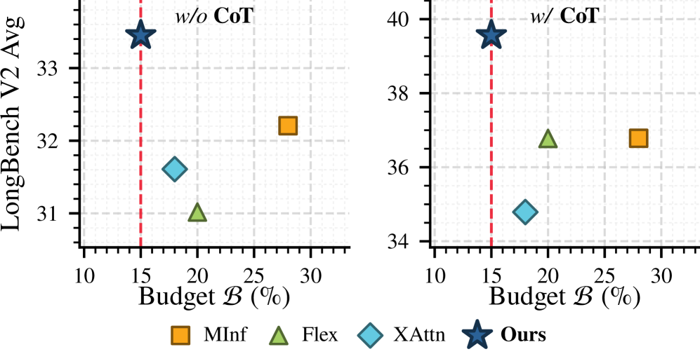
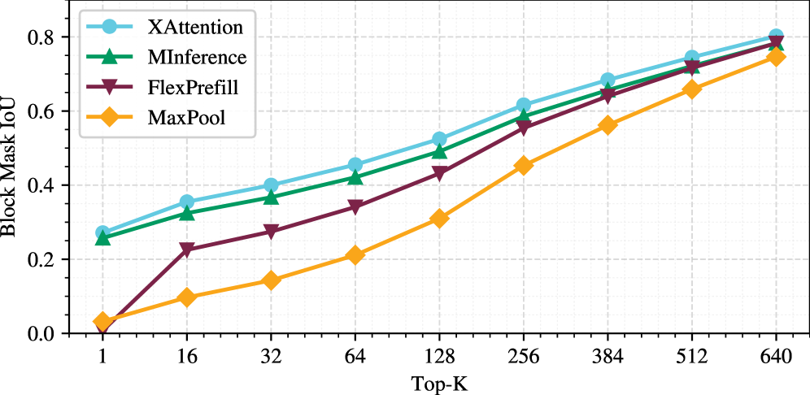
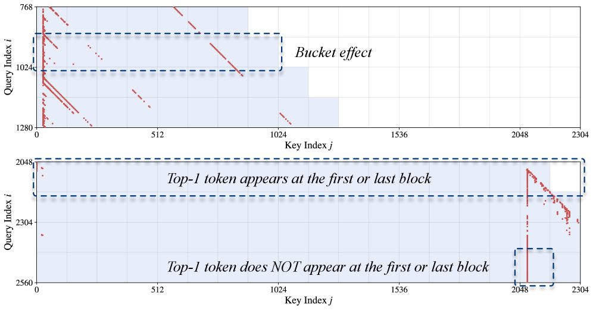
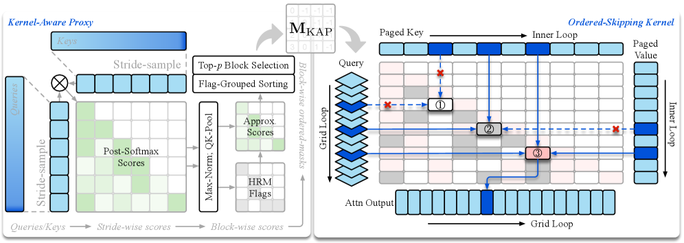
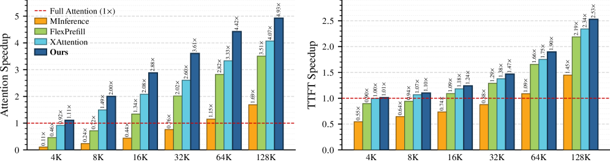
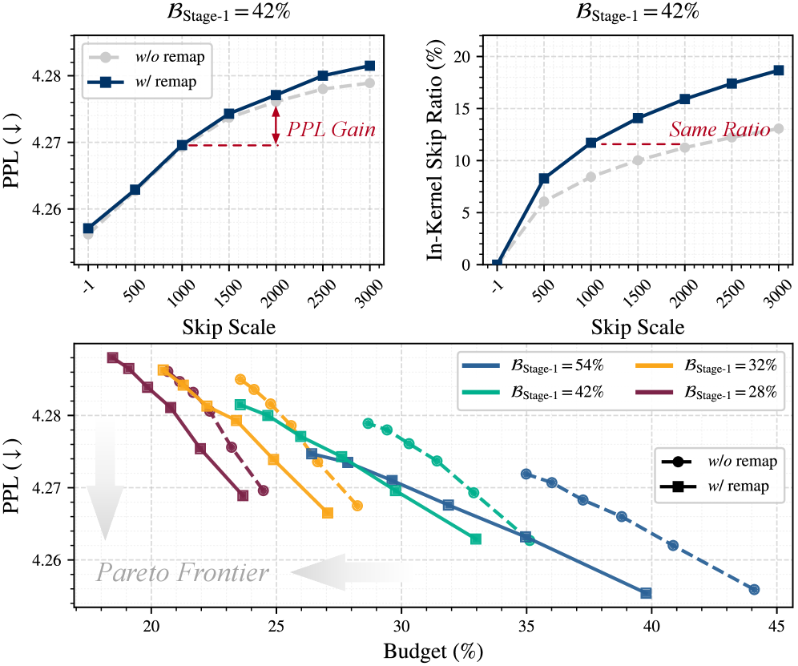
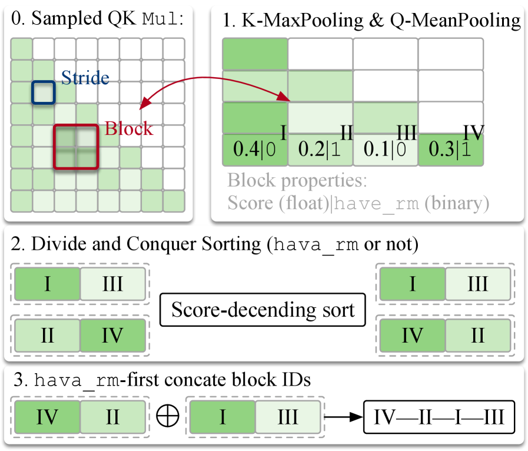
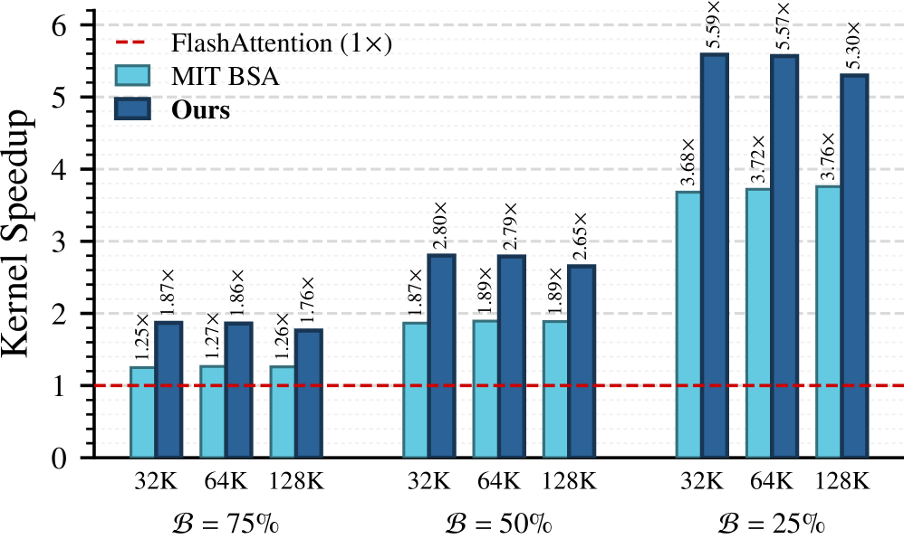
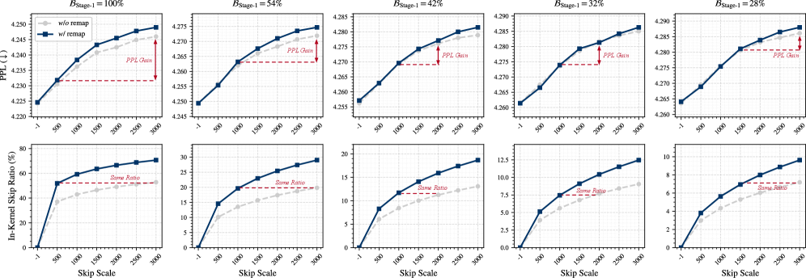

# CoSA：通过代理-内核协同设计的稀疏注意力加速长上下文推理

**作者：** Yufei Xue¹'², Lin Niu¹, Hong Liu¹, Siran Liu¹, Hanyong Shao¹, Wei Liu¹, Guanghua Yu¹, Jianchen Zhu¹, Jun Zhang²

**机构：** ¹腾讯（Tencent）

**发布日期：** 2026-07-28

**arXiv ID：** 2607.25291

---

Guanghua Yu 1, Jianchen Zhu 1, Jun Zhang 2 工作在腾讯实习期间完成。

###### 摘要

自注意力的二次计算代价使得长上下文推理成本极高，而基于代理的块稀疏注意力已成为一种实用的解决方案。现有方法通常依赖代理来预测二值稀疏掩码，并由内核消费该掩码执行稀疏注意力计算。这种方法在适度预算下是有效的。然而，随着预算收紧，估计的代理不可避免地会丢失一些显著的块，而内核只能机械地应用稀疏掩码，导致模型准确性明显下降。我们提出了 CoSA，一种基于代理-内核协同设计（Proxy-Kernel Co-Design）的两阶段免训练稀疏注意力（Sparse Attention），它将内核感知代理（Kernel-Aware Proxy, KAP）与有序跳过内核（Ordered-Skipping Kernel, OSK）相结合。在第一阶段，KAP 在适度预算下选择块并产生有序掩码，该掩码规定了内核内部循环中访问 KV 页的顺序。在第二阶段，OSK 应用该掩码，并根据在线 softmax 统计在更紧缩的预算下跳过更多块。在主流 LLM 骨干网络和长上下文基准测试中，CoSA 在更低预算下达到了更高的准确率。令人印象深刻的是，CoSA 在 128K 上下文长度下实现了 4.93 $\times$ 的注意力加速，并将端到端首 token 时间（Time-to-First-Token）减少了 2.53 $\times$，且性能退化可忽略不计。

## 1 引言

长上下文能力已成为现代大语言模型（LLM）的基础，这些能力越来越多地被检索增强生成（RAG）[^42] [^3] 和自主智能体系统（Agentic Systems）[^27] [^37] 等高级用例所需求。然而，标准自注意力固有地产生相对于序列长度二次增长的计算代价，导致长输入的推理延迟难以承受。

图 1：主流稀疏注意力方法在 LongBench-v2 上的性能与预算对比（Qwen3-8B）。

稀疏注意力通过选择性地仅计算重要的查询-键（Query-Key）块交互来利用注意力图的固有稀疏性。现有方法一般分为免训练和可训练两种方法。可训练稀疏注意力通过蒸馏 [^6] [^41] [^26] 学习要关注哪些块，或直接在预训练中引入稀疏计算。然而，考虑到多样的模型骨干网络，训练负担变得很成问题，使得基于训练的稀疏化部署成本高昂。

免训练方法则在推理时决定块的重要性。主流策略使用廉价的代理（Proxy）在线估计注意力重要性，并根据稀疏度预算产生二值稀疏掩码。然后稀疏注意力内核遵循该掩码执行稀疏注意力计算 [^10] [^12] [^4] [^31] [^28]。这类代理在适度预算下是可靠的。然而，随着预算收紧，它们越来越多地遗漏真正显著的块。还存在一种稀疏策略，使用精确的 Softmax 统计在内核内部跳过块 [^34] [^39]。尽管跳过策略与 oracle 对齐，但它仍然需要计算完整的查询-键交互。此外，它应用保守的跳过规则，使大部分潜在加速无法实现。

为了调和这种效率-保真度权衡，我们提出了 CoSA，一种基于代理-内核协同设计（Proxy-Kernel Co-Design）原则构建的两阶段免训练块稀疏注意力，用于长上下文推理。我们的设计从块稀疏注意力的固有属性和内核内跳过的局限性（第 3 节）出发，这些因素共同论证了应该联合设计代理和内核，而非孤立设计。它们之间的桥梁是一个单一的计算顺序掩码（Computation-Order Mask），它取代了传统的二值块掩码。具体而言，CoSA 将内核感知代理（KAP）与有序跳过内核（OSK）相结合。KAP 在适度预算下修剪冗余的密集查询-键（QK）交互，我们称之为第一阶段稀疏化。除了标记要计算哪些块之外，它还规定了在块稀疏内核循环中访问所选块的顺序。然后 OSK 通过轻量级页表重映射使用该计算顺序掩码。在计算顺序掩码之上，OSK 使用精确的内核内 logits 跳过更多块。这应用了第二阶段稀疏化，将稀疏预算推得更低。总体而言，代理通过规定执行顺序来塑造内核，而内核通过消费掩码来驱动稀疏性，从而塑造代理。这种相互塑造体现了代理-内核协同设计的原则。我们的贡献如下：

- 我们重新审视了块稀疏注意力的固有属性和内核内跳过的局限性，揭示了代理与后端之间的脱节是在保持高准确率的同时增加稀疏性的根本瓶颈。
- 我们设计了 KAP，一个发出计算顺序掩码的代理。它在适度预算下选择稀疏块，实现第一阶段稀疏选择，并规定它们在内核中的访问顺序。
- 我们设计了 OSK，一个优化的内核，通过基于计算顺序掩码物理跳过任意顺序的页来呼应 KAP。它对 softmax 统计执行内核内跳过，实现第二阶段稀疏计算。
- 我们在主流 LLM 骨干网络和基准测试上进行了大量实验，展示了在更低预算下的更高准确率。例如，CoSA 在 128K 上下文长度下实现了 4.93 $\times$ 的注意力加速和 2.53 $\times$ 的端到端预填充加速，且性能退化可忽略不计。

## 2 相关工作

### 2.1 稀疏注意力

稀疏注意力跳过不重要的查询-键块交互，现有方法主要在如何识别保留的块方面有所不同。MInference [^10] 从三个预定义模式在推理时估计最优块索引，FlexPrefill [^12] 将其扩展为查询感知变体。XAttention [^31] 通过更细粒度的反对角线评分改进了基于池化的代理。其他工作则探索动态预算分配 [^20]、token 级稀疏性 [^13] 或头异构性 [^28] [^15] [^16]。尽管这些方法有效，但所有这些方法都插入在标准稀疏注意力内核之前，而内核设计本身保持不变。

### 2.2 高性能注意力后端

除了算法级优化之外，另一条并行的工作线优化注意力内核本身。FlashAttention 系列 [^1] [^2] [^23] [^36] 对计算进行分块并融合在线 softmax（OSM）以减少到 GPU 全局内存的流量，在不改变结果的情况下实现大幅加速。在此基础上，Block-Sparse-Attention 内核 [^8] 支持流式传输和任意块掩码以实现高效预填充，FlashInfer [^33] 提供具有块稀疏和分页 KV 缓存格式的可定制引擎。BLASST [^34] 则利用 Softmax 统计在内核内部跳过可忽略的块，在现代 GPU 上决策开销接近零。PagedAttention [^11] 将 KV 缓存存储在非连续页中以消除服务期间的碎片化。尽管这些后端高效，但它们仅通过消费二值掩码或依赖保守的在线条件分支来实现块稀疏性，这反过来又约束了算法设计。

图 2：代理掩码与 oracle 的 IoU 对比（Qwen3-8B，128K 上下文长度）。

## 3 动机

### 3.1 密集注意力

FlashAttention [^2] 将分块策略与 OSM 技术 [^19] 结合起来计算标准注意力。对于块级 logits $\mathbf{S}_{ij}=\mathbf{Q}_{i}\mathbf{K}_{j}^{\top}$，内核为每个查询行维护局部和运行的行级最大值（rowmax）：

$$
\displaystyle\bm{m}^{\mathrm{loc}}_{ij}
$$

$$
\displaystyle=\operatorname{rowmax}(\mathbf{S}_{ij})\in\mathbb{R}^{b},
$$
$$
\displaystyle\bm{m}_{ij}
$$

$$
\displaystyle=\max\!\big(\bm{m}_{i,j-1},\,\bm{m}^{\mathrm{loc}}_{ij}\big)\in\mathbb{R}^{b},
$$

其中 $b$ 是逻辑块大小。内核内部循环中的块按顺序访问，使得 $\bm{m}_{ij}[r]=\max_{j^{\prime}\leq j}\bm{m}^{\mathrm{loc}}_{ij^{\prime}}[r]$。每个块的内部循环运行四个步骤：KV 加载、logits 计算、运行 rowmax 更新和输出重缩放。基于此，我们回顾两种代表性的稀疏注意力实现。

### 3.2 掩码驱动的块稀疏注意力

掩码驱动的块稀疏注意力使用二值块掩码 $\mathbf{M}$ 来决定是否计算或跳过块稀疏注意力（BSA）内核内的每个 QK 块。该掩码源自代理注意力分数 $\mathbf{S}_{\text{proxy}}\in\mathbb{R}^{\lceil\frac{N}{b}\rceil\times\lceil\frac{N}{b}\rceil}$，定义为

$$
\mathbf{M}[i,j]=\mathbf{1}\!\big[(i,j)\in\mathrm{TopK}_{\mathcal{B}}(\mathbf{S}_{\text{proxy}})\big]\in\{0,1\},
$$

其中 $N$ 是序列长度。$\mathbf{M}[i,j]=0$ 的块在内核之前被丢弃，因此上述所有四个步骤都被跳过。这样每个块节省最多，但承诺使用近似掩码。我们指出掩码驱动块稀疏注意力的以下两个属性。

###### 属性 1（预算相关的代理保真度）

内核前代理掩码（式 (3)）在适度预算下很好地跟踪真正重要的块，但在激进预算下会丢失真正显著的块。

代理的可信度仅限于其掩码能恢复真正重要的块的程度。为了量化这一点，我们将完整注意力的 oracle 掩码视为真值，并通过匹配预算下每个代理掩码（式 (3)）与 oracle 之间的交并比（IoU）来衡量保真度。图 2 报告了在大海捞针（NIAH）风格上下文下主流代理的 IoU 与预算的关系。所有变体在适度预算下跟踪 oracle，但随着预算收紧到激进稀疏性而退化。

###### 属性 2（OSM 的顺序不变性）

FlashAttention 将每个查询块的输出累积为对其 $J$ 个键/值块的分块 OSM，此结果与访问块的顺序无关。对于任何排列 $\rho_{i}$，

$$
\mathbf{O}_{i}=\mathcal{A}_{i}(1,2,\dots,J)=\mathcal{A}_{i}\big(\rho_{i}(1),\dots,\rho_{i}(J)\big),
$$

其中 $\mathcal{A}_{i}(\cdot)$ 表示第 $i$ 个查询块对候选键块的 OSM 计算。

这种顺序不变性允许以任意顺序访问候选块。此外，由于现代服务框架将 KV 缓存存储在非连续页中 [^11]，这种任意顺序遍历可以通过轻量级 KV 页重映射来实现。

### 3.3 内核内跳过 Softmax

与前一小节中的掩码驱动 BSA 不同，BLASST [^34] 开创性地在 FlashAttention-4 [^36] 内部跳过 Softmax logits 以执行稀疏计算。在逐个计算每个 QK 块的 $\mathbf{S}_{ij}$ 时，BLASST 实时决定是否跳过一个块，而不是依赖基于代理的稀疏掩码，条件为

$$
\displaystyle\mathrm{skip}(i,j)
$$

$$
\displaystyle\Longleftrightarrow\bigwedge_{r=1}^{b_{q}}\Big[\bm{m}^{\mathrm{loc}}_{ij}[r]-\bm{m}_{ij}[r]<\ln\frac{\Delta}{N}\Big]
$$

$$
\displaystyle\Longleftrightarrow\max_{r}\big(\bm{m}^{\mathrm{loc}}_{ij}[r]-\bm{m}_{ij}[r]\big)<\ln\frac{\Delta}{N},
$$

其中跳过规模（Skip Scale）$\Delta$ 根据上下文长度 $N$ 调整阈值。一旦局部最大值远低于运行最大值，该行就可忽略。在此条件下，只有当所有行在阈值 $\Delta/N$ 下一致同意时，块才被跳过。与可能丢失信息的代理估计不同，这个密集分数 $\mathbf{S}_{ij}$ 与 oracle 对齐，因此准确，但代价是每个块需要完整的 QK 乘法。

尽管式 (3.3) 的内核内跳过具有保真度，但它存在以下两个局限性。

###### 局限性 1（密集 $\mathbf{Q}_{i}\mathbf{K}_{j}^{\top}$ 作为代理）

由于内核内跳过基于真实 logits 做决策，因此必须为每个块形成 $\mathbf{S}_{ij}=\mathbf{Q}_{i}\mathbf{K}_{j}^{\top}$。因此 QK 乘法是不可避免的，跳过仅修剪值侧步骤。

因此内核内跳过的节省本质上是有界的。由于决策是基于真实 logits 做出的，因此在判断之前必须为每个块实现分数。因此，内核内跳过修剪了值侧工作，而在长上下文中占主导地位的二次查询-键代价保持不变。

###### 局限性 2（跳过保守性）

式 (3.3) 的跳过条件出于两个原因是保守的：

1. （运行最大值 $\neq$ 全局最大值）它针对运行最大值测试每个块，而运行最大值不一定等于全局最大值；
2. （桶效应）其逐行 AND（$\bigwedge$）让单个异常行否决了原本可忽略块的跳过。

图 3：两个代表性 Qwen3-8B 头的注意力图上的 rowmax 位置（红点）。

#### L2.1 运行最大值 $\neq$ 全局最大值

式 (3.3) 的规则针对运行最大值 $\bm{m}_{ij}$ 进行测试，该值仅由已访问的块 $j^{\prime}\leq j$ 更新，是真实全局 rowmax $\bm{m}^{\star}_{i}[r]=\max_{j^{\prime}}\bm{m}^{\mathrm{loc}}_{ij^{\prime}}[r]$ 的下界。由于 $\bm{m}_{ij}\leq\bm{m}^{\star}_{i}$，

$$
\bm{m}^{\mathrm{loc}}_{ij}[r]-\bm{m}_{ij}[r]\;\geq\;\bm{m}^{\mathrm{loc}}_{ij}[r]-\bm{m}^{\star}_{i}[r],
$$

因此该标准比在真实全局 rowmax 下更难满足。如图 3（底部）所示，rowmax 可以位于任何地方，不一定在第一个（sink）或最后一个（最近）块中。然而，大多数高性能后端仍然以固定的升序 [^21] [^38] [^40] 或降序 [^36] [^33] [^8] 顺序遍历 KV 块。这种预定义顺序阻碍了冗余块识别，从而产生次优稀疏性。

图 4：CoSA 概览。$\mathbf{M}_{\text{KAP}}$：KAP 掩码充当协同设计的代理和内核之间的桥梁。左：KAP 估计每块分数以及 HRM 标志。它们被合并到计算顺序掩码中，该掩码将 HRM 块放在前面。右：OSK 通过 KV 页重映射消费，产生三种每块模式：➀ 掩码跳过，➁ 内核内跳过，➂ 计算。

#### L2.2 桶效应

回顾式 (3.3) 的跳过门，$b_{q}$ 行上的 AND（$\bigwedge$）让单个最差行

$$
r^{\star}=\operatorname*{arg\,max}_{r}\big(\bm{m}^{\mathrm{loc}}_{ij}[r]-\bm{m}_{ij}[r]\big)
$$

决定决策。理想情况下，单个块 $(m,n)$ 包含每个查询行的全局 rowmax。首先访问该块将把运行最大值 $\bm{m}_{mn}$ 更新为全局最大值 $\bm{m}^{\star}_{m}$。这允许针对精确的全局最大值参考评估每个后续块，并在真正可忽略时跳过。然而，这些 rowmax 在实践中分散在各个块中，如图 3（顶部）所示。因此，要达到相同的 oracle 对齐状态，需要首先访问至少包含一个行级最大值的所有块。在此之前，仅更新 $b-1$ 行是不够的：剩余行保留低估的运行最大值，并可以通过 AND 门否决原本可忽略块的跳过。这种单行限制产生了桶效应。

总体而言，这些属性和局限性直接驱动了我们的设计。在适度预算下，代理是可信的（P1），并且已经过滤了部分昂贵的 QK 乘法（L1）。要达到激进预算，我们将其与精确的内核内跳过配对。同时，顺序不变性（P2）使我们能够重新排序块并缓解保守跳过（L2）。我们将其实例化为 CoSA，接下来进行描述。

## 4 CoSA

### 4.1 概述

在第 3 节的属性和局限性指导下，我们提出了 CoSA，一种基于代理-内核协同设计构建的两阶段稀疏注意力。在代理侧，为了对抗 L2，KAP 利用顺序不变性（P2）输出有序掩码 $\mathbf{M}_{\text{KAP}}$，将"拥有 rowmax"（HRM）块放在前面。在适度的第一阶段预算 $\mathcal{B}_{\text{Stage-1}}$ 下被 $\mathbf{M}_{\text{KAP}}$ 过滤的块被直接跳过。在内核侧，OSK 应用该掩码并按照式 (3.3) 进一步跳过值侧计算，表示为第二阶段稀疏计算。如图 4 所示，这在 OSK 中产生三种块类型：➀ 掩码跳过，➁ 内核内跳过，➂ 完全计算。附录 C 中的算法 A 总结了工作流程。

### 4.2 内核感知代理设计

KAP 在内核之前廉价地决定保留哪些块以及以什么顺序。我们直接围绕激进稀疏性失败（P1）和跳过保守性（L2）设计它。KAP 发出计算顺序掩码，在适度预算下优先访问 HRM 块。附录 C 在图 A 中提供了说明性示例。

#### 块排序

我们首先对查询和键进行步长下采样到 $\mathrm{DS}(\mathbf{Q})\in\mathbb{R}^{\frac{N}{s}\times D}$ 和 $\mathrm{DS}(\mathbf{K})\in\mathbb{R}^{\frac{N}{s}\times D}$，其中 $s$ 和 $D$ 分别是步长大小和隐藏维度。然后我们形成它们的近似分数，

$$
\hat{\mathbf{S}}=\text{Softmax}\left(\frac{\widetilde{\mathbf{Q}}\widetilde{\mathbf{K}}^{\top}}{\sqrt{d}}\right).
$$

然后我们对每个块的键进行 MaxPool，然后对每个采样的查询行进行最大值归一化

$$
\displaystyle\text{MaxPool: }\mathbf{P}[r,j]
$$

$$
\displaystyle=\max_{c\in\mathcal{K}_{j}}\hat{\mathbf{S}}[r,c],
$$
$$
\displaystyle\text{MaxNorm: }\bar{\mathbf{P}}[r,j]
$$

$$
\displaystyle=\frac{\mathbf{P}[r,j]}{\max_{j^{\prime}}\mathbf{P}[r,j^{\prime}]},
$$

其中 $\mathcal{K}_{j}$ 索引块 $j$ 的采样键，$\bar{\mathbf{P}}\in\mathbb{R}^{\frac{N}{s}\times\frac{N}{b}}$ 表示在键维度聚合的估计分数。MaxPool 保留块内的 rowmax，MaxNorm 将精确的估计分数转换为相对排名贡献，这是 L2 的直接对抗设计。在查询上，我们对采样的查询行 $\mathcal{Q}_{i}$ 求和，让块 $i$ 的每一行都对块分数做出贡献，同时产生估计重要性 $\mathbf{S}^{\text{KAP}}_{ij}$ 和 HRM 标志 $\mathbf{H}_{ij}$，

$$
\displaystyle\mathbf{S}^{\text{KAP}}_{ij}
$$

$$
\displaystyle=\textstyle\sum_{r\in\mathcal{Q}_{i}}\bar{\mathbf{P}}[r,j],
$$
$$
\displaystyle\mathbf{H}_{ij}
$$

$$
\displaystyle=\mathbf{1}\!\big[\textstyle\max_{r\in\mathcal{Q}_{i}}\bar{\mathbf{P}}[r,j]=1\big]\in\{0,1\},
$$

其中 $\mathbf{H}\in\mathbb{R}^{\frac{N}{b}\times\frac{N}{b}}$ 是 HRM 标志，$\mathbf{H}_{ij}$ 标记查询块 $i$ 在键块 $j$ 内获得其 rowmax。

#### 标志分组排序

固定查询块 $i$ 及其 $J=N/b$ 个候选键块、从式 (11) 得到的估计分数 $\mathbf{S}^{\text{KAP}}_{i}=(s_{ij})_{j=1}^{J}$ 和 HRM 标志 $\mathbf{H}_{i}=(h_{ij})_{j=1}^{J}$。我们通过标志分组排序将这些分数转换为计算顺序 $\rho_{i}$，该排序始终优先考虑 HRM 块：

$$
\rho_{i}=\operatorname*{argsort}^{\downarrow}_{j\in\mathcal{H}_{i}}s_{ij},\oplus\operatorname*{argsort}^{\downarrow}_{j\in\mathcal{R}_{i}}s_{ij},
$$

其中 $\operatorname*{argsort}^{\downarrow}_{\mathcal{X}}$ 表示按降序对 $\mathcal{X}$ 中的元素排序。$\mathcal{H}_{i}=\{j:h_{ij}=1\}$ 和 $\mathcal{R}_{i}=\{j:h_{ij}=0\}$ 表示 HRM 组和其余组的候选块。$\oplus$ 连接两个列表，HRM 组优先。我们通过遵循 [^31] [^12] 的 Top-$p$ 选择确定适度的第一阶段预算 $\mathcal{B}_{\text{Stage-1}}$，并记录每个块的排名，从而产生 KAP 掩码

$$
\mathbf{M}_{\text{KAP}}[i,k]=\begin{cases}\rho_{i}[k],&1\leq k\leq K_{i}\quad\text{（第 $k$ 个访问的块）},\\
-1,&K_{i}<k\leq J\quad\text{（填充）},\end{cases}
$$

其中 $K_{i}=\mathcal{B}_{\text{Stage-1}}\times J$ 是为第 $i$ 个查询块选择的块数。与产生二值掩码的传统代理 [^10] [^12] [^31] 相反，$\mathbf{M}_{\text{KAP}}$ 编码了哪些块保留以及以什么顺序访问它们。

### 4.3 有序跳过内核

OSK 是我们协同设计的内核侧部分，由 $\mathbf{M}_{\text{KAP}}$ 塑造，使代理的决策成为物理执行。它具有三种计算模式：➀ 掩码跳过，➁ 内核内跳过，➂ 计算，如图 4 所示。我们通过以下设计实现 OSK。

#### 物理跳过页

给定适度预算下的 $\mathbf{M}_{\text{KAP}}$（P1），OSK 部分跳过了仅内核内跳过永远无法节省的昂贵 QK 乘法（L1）。回顾 Block-Sparse-Attention 内核 [^8] 遍历每个块并通过逻辑掩码丢弃未选择的块，因此其内部循环即使在跳过的块上也继续支付控制流和同步成本。相反，OSK 直接跳转到下一个保留的页，从而消除了这些冗余同步。我们的跳转是对分页 KV 缓存的页重映射，其访问顺序由 $\mathbf{M}_{\text{KAP}}$ 决定。

#### 内核内逻辑跳过

在 $\mathbf{M}_{\text{KAP}}$ 驱动的跳过之上，OSK 进一步支持对第一阶段过滤保留的块进行式 (3.3) 的内核内跳过。它实现从真实在线 softmax 统计而非代理估计的第二阶段稀疏化。我们遵循 [^34] [^39] 实现这种基于阈值的跳过，并进一步将其粒度定制到每 128 行查询块。两个消费者 warp 组各自评估 64 个查询行，并将其部分谓词组合成单个块级投票，决策开销可忽略不计。

#### 任意顺序页访问

为了对抗保守的跳过规则（L2），OSK 按 KAP 规定的顺序访问页，该顺序将 HRM 块放在前面，使运行最大值早期上升，后续的内核内跳过变得既更安全又更激进。重新排序值累积使输出保持不变，这由 OSM 的顺序不变性（P2）保证，因此这种重新排序保持正确性。它通过廉价的 KV 页重映射实现：我们直接将 KAP 发出的激活块 ID 列表（即 $\mathbf{M}_{\text{KAP}}$）馈送给 OSK，该列表已经排序。由于重映射在页粒度操作，OSK 可以无缝集成到基于 PagedAttention [^11] 构建的主流服务框架中。

## 5 实验

<table><tbody><tr><th>方法</th><td colspan="6">上下文长度（准确率，$\uparrow$）</td><td>平均值（$\uparrow$）</td><td>$\mathcal{B}$（$\downarrow$）</td></tr><tr><th></th><td>4K</td><td>8K</td><td>16K</td><td>32K</td><td>64K</td><td>128K</td><td></td><td></td></tr><tr><th colspan="9">Qwen3-8B</th></tr><tr><th>Dense</th><td>95.46</td><td>94.20</td><td>93.95</td><td>92.57</td><td>83.72</td><td>75.30</td><td>89.20</td><td>100%</td></tr><tr><th>MInf</th><td>93.86</td><td>89.33</td><td>91.83</td><td>92.04</td><td>83.49</td><td>70.09</td><td>86.77</td><td>49%</td></tr><tr><th>Flex</th><td>94.62</td><td>93.63</td><td>91.54</td><td>92.41</td><td>82.46</td><td>71.68</td><td>87.72</td><td>28%</td></tr><tr><th>XAttn</th><td>93.65</td><td>91.67</td><td>91.69</td><td>90.99</td><td>77.45</td><td>70.12</td><td>85.93</td><td>24%</td></tr><tr><th>CoSA</th><td>95.25</td><td>94.25</td><td>93.34</td><td>92.34</td><td>82.88</td><td>73.84</td><td>88.65</td><td>22%</td></tr><tr><th colspan="9">Llama-3.1-8B-Instruct</th></tr><tr><th>Dense</th><td>96.10</td><td>93.85</td><td>93.29</td><td>90.62</td><td>86.13</td><td>73.84</td><td>88.97</td><td>100%</td></tr><tr><th>MInf</th><td>94.02</td><td>93.47</td><td>93.00</td><td>90.20</td><td>86.01</td><td>71.60</td><td>88.05</td><td>47%</td></tr><tr><th>Flex</th><td>94.90</td><td>94.01</td><td>93.07</td><td>90.43</td><td>83.89</td><td>71.58</td><td>87.98</td><td>29%</td></tr><tr><th>XAttn</th><td>96.23</td><td>94.12</td><td>93.35</td><td>90.75</td><td>82.56</td><td>70.40</td><td>87.90</td><td>33%</td></tr><tr><th>CoSA</th><td>95.73</td><td>93.59</td><td>93.02</td><td>90.82</td><td>85.49</td><td>71.82</td><td>88.41</td><td>22%</td></tr></tbody></table>

表 1：RULER 上的主要结果（%）。最佳和次佳结果分别用粗体和下划线标出。$\mathcal{B}$ 是序列长度上的加权预算。

### 5.1 设置

#### 基线和模型

我们将 CoSA 与强大的块稀疏注意力基线进行比较，包括 MInference [^10]、FlexPrefill [^12] 和 XAttention [^31]，以 FlashAttention-2 [^2] 作为完全注意力基线。我们将所有方法应用于两个代表性骨干网络：Llama-3.1-8B-Instruct [^7] 和 Qwen3-8B [^32]。对于 Qwen，我们采用推荐的采样参数，并根据每个任务需要启用思考模式，在必要时使用 YaRN [^22] 将上下文扩展到 128K tokens。

#### 基准测试

我们在广泛认可的合成和真实世界长上下文基准测试上评估 CoSA。RULER [^9] 提供 token 长度从 4K 到 128K 的合成任务，而 LongBench-v2 针对真实世界的深度理解和推理。在 LongBench-v2 上，我们报告直接模式（无思维链，w/o CoT）和思考模式（有 CoT，w/ CoT），探测稀疏预填充的推理鲁棒性。

#### 实现细节

由于二次注意力代价集中在预填充阶段，我们的评估范围与先前的稀疏预填充研究 [^10] [^12] [^31] 一致，仅稀疏化预填充阶段，解码阶段保持密集。我们将 KAP 评分和池化操作实现为融合内核以最小化代理开销。OSK 直接在分页 KV 缓存上操作，并支持按 KAP 规定的顺序访问页。所有准确率和速度测量均在 NVIDIA H20 节点上进行。

#### 超参数

对于第一阶段 Top-$p$ 选择，我们为 Qwen 固定 $p=0.95$，为 Llama 使用离线校准的 $p$ 表。长度自适应阈值 $\Delta/N$ 中的规模因子 $\Delta$ 在预算与准确率之间权衡。例如，我们为 CoSA 设置 $\Delta_{\text{Qwen}}=2000$。完整设置详见附录 D。

<table><tbody><tr><td>方法</td><td colspan="2">w/o CoT</td><td colspan="2">w/ CoT</td><td>平均值（$\uparrow$）</td><td>$\mathcal{B}$（$\downarrow$）</td></tr><tr><td></td><td>简单</td><td>困难</td><td>简单</td><td>困难</td><td></td><td></td></tr><tr><td colspan="7">Qwen3-8B</td></tr><tr><td>Dense</td><td>39.19</td><td>32.72</td><td>44.53</td><td>36.82</td><td>37.48</td><td>100%</td></tr><tr><td>MInf</td><td>36.98</td><td>29.26</td><td>43.23</td><td>32.80</td><td>34.49</td><td>28%</td></tr><tr><td>Flex</td><td>35.42</td><td>28.30</td><td>44.27</td><td>32.15</td><td>33.90</td><td>20%</td></tr><tr><td>XAttn</td><td>31.25</td><td>31.83</td><td>40.10</td><td>31.51</td><td>33.20</td><td>18%</td></tr><tr><td>CoSA</td><td>37.24</td><td>31.11</td><td>45.83</td><td>35.69</td><td>36.51</td><td>15%</td></tr><tr><td colspan="7">Llama-3.1-8B-Instruct</td></tr><tr><td>Dense</td><td>31.64</td><td>29.58</td><td>32.29</td><td>26.93</td><td>29.67</td><td>100%</td></tr><tr><td>MInf</td><td>30.21</td><td>30.87</td><td>30.21</td><td>31.19</td><td>30.72</td><td>41%</td></tr><tr><td>Flex</td><td>33.33</td><td>27.97</td><td>31.25</td><td>28.30</td><td>29.72</td><td>22%</td></tr><tr><td>XAttn</td><td>29.17</td><td>27.01</td><td>32.29</td><td>29.26</td><td>29.13</td><td>35%</td></tr><tr><td>CoSA</td><td>33.98</td><td>28.94</td><td>30.99</td><td>31.11</td><td>30.96</td><td>17%</td></tr></tbody></table>

表 2：LongBench-v2 在非思考模式（w/o CoT）和思考模式（w/ CoT）下的主要结果（%）。

#### RULER

表 1 报告了 Qwen3-8B 和 Llama-3.1-8B 在 4K 到 128K 上的 RULER 准确率。CoSA 在比较的稀疏基线中实现了最强的平均表现，同时使用了最低的预算。比平均值更能说明问题的是这一差距随上下文长度的演化。在短上下文下，每种方法都接近完全注意力，因此稀疏化几乎没有代价。然而，随着序列长度增加，基线方法丢弃的显著块越来越多，导致准确率大幅下降。在 Qwen3-8B 的 128K 上下文下,最强的基线已经落后了几个百分点，而 CoSA 仍然是最强的稀疏方法。完整的按长度结果和额外的工作点在附录 D 中提供。

#### LongBench-v2

表 2 在 LongBench-v2 的真实世界深度理解和推理任务上评估了 CoSA，这是比 RULER 的合成检索更具挑战性的设置。CoSA 在两个主干模型上都在所有稀疏方法中获得了最佳平均表现，同时运行在最低预算下，表明激进的稀疏化不必以推理质量为代价。CoSA 的优势在两种评估模式下都保持。无论模型是直接回答（w/o CoT）还是逐步推理（w/ CoT），CoSA 都保持为最强的稀疏方法，因此其稀疏预填充不会破坏推理模型所依赖的长 CoT。

图 5：在 4K 到 128K 的上下文长度范围内，相对于完全注意力基线的注意力加速（左）和首 token 时间（TTFT）加速（右）。

<table><tbody><tr><td>变体</td><td colspan="2">代理</td><td colspan="3">内核</td><td>平均 (<math><semantics><mo>↑</mo> <annotation>\uparrow</annotation></semantics></math>)</td><td><math><semantics><mi>ℬ</mi> <annotation>\mathcal{B}</annotation></semantics></math> (<math><semantics><mo>↓</mo> <annotation>\downarrow</annotation></semantics></math>)</td></tr><tr><td></td><td><math><semantics><msub><mi>𝐌</mi> <mtext>01</mtext></msub> <annotation>\mathbf{M}_{\text{01}}</annotation></semantics></math></td><td><math><semantics><msub><mi>𝐌</mi> <mtext>KAP</mtext></msub> <annotation>\mathbf{M}_{\text{KAP}}</annotation></semantics></math></td><td>MS</td><td>IKS</td><td>RMP</td><td></td><td></td></tr><tr><td colspan="8">Qwen3-8B</td></tr><tr><td>Base</td><td>✓</td><td></td><td>✓</td><td></td><td></td><td>32.71</td><td>22%</td></tr><tr><td>gray!3  + KAP</td><td></td><td>✓</td><td>✓</td><td></td><td></td><td>33.27 (+0.56)</td><td>20% (-2%)</td></tr><tr><td>gray!8  + IKS</td><td></td><td>✓</td><td>✓</td><td>✓</td><td></td><td>32.27 (-0.44)</td><td>16% (-6%)</td></tr><tr><td>gray!15  + RMP (Ours)</td><td></td><td>✓</td><td>✓</td><td>✓</td><td>✓</td><td>33.45 (+0.74)</td><td>15% (-7%)</td></tr><tr><td colspan="8">Llama-3.1-8B-Instruct</td></tr><tr><td>Base</td><td>✓</td><td></td><td>✓</td><td></td><td></td><td>27.83</td><td>35%</td></tr><tr><td>gray!3  + KAP</td><td></td><td>✓</td><td>✓</td><td></td><td></td><td>29.67 (+1.84)</td><td>39% (+4%)</td></tr><tr><td>gray!8  + IKS</td><td></td><td>✓</td><td>✓</td><td>✓</td><td></td><td>28.88 (+1.05)</td><td>24% (-11%)</td></tr><tr><td>gray!15  + RMP (Ours)</td><td></td><td>✓</td><td>✓</td><td>✓</td><td>✓</td><td>30.86 (+3.03)</td><td>17% (-18%)</td></tr></tbody></table>

表 3：LongBench-v2（w/o CoT）上的累积逐步消融研究。"Base" 是通过二值掩码 $\textbf{M}_{01}$ 实现的朴素掩码跳过（MS）。变体包括 KAP、内核内跳过（IKS）和 KV 页重映射（RMP）。

### 5.3 效率分析

#### 注意力加速

我们首先评估 CoSA 相对于竞争方法的注意力加速。我们在图 5（左）中报告了跨层多次运行的平均加速。两个趋势突出。首先，CoSA 在 $1.11\times$ 时已经显示出加速，是唯一能够加速 4K 长度上下文的方法。其次，随着序列加长和二次注意力成本占主导地位，优势稳步扩大。值得注意的是，CoSA 在 128K 时攀升至 $4.93\times$，并在每个评估长度上都保持领先。相比之下，最弱的基线在 64K 之前一直低于完全注意力，凸显了仅代理方法在短和中等长度下对选择开销的敏感程度。

#### 端到端加速

图 5（右）显示这些注意力收益延续到完整的预填充阶段。我们使用首 token 时间（TTFT）延迟评估这种端到端效率。在 4K 时，CoSA 没有引入退化。到 128K 时，它提供了 $2.53\times$ 的 TTFT 加速，同时再次领先所有基线。这些结果确认了 CoSA 启用的注意力节省的计算转化为实际预填充延迟的大幅降低。

### 5.4 分析

#### 逐步消融

为了隔离我们协同设计的贡献，表 3 报告了 LongBench-v2（w/o CoT）上的累积消融，从使用 XAttention 风格代理的 "Base" 开始。通过用我们的 KAP 替换此代理，在可比预算下两个主干的准确率都上升。这表明有序掩码恢复了普通二值代理倾向于丢弃的显著块。通过进一步开启内核内跳过，它增加了稀疏性，同时在 Qwen 上产生了小幅准确率下降。最后一步添加了 KV 页重映射，导致趋势反转。准确率不仅恢复，而且即使在最紧预算下也明显推高到 Base 之上。因此，优先访问 HRM 块使相同的内核内跳过既更安全又更激进。总体而言，每个组件都推进了准确率或预算。值得注意的是，重映射收紧了预算而没有准确率下降。这正是我们协同设计所构建的相互作用，其中代理侧排序和内核侧跳过只有在它们共同作用时才有回报。

#### 重映射的效果

图 6 分析了跳过规模 $\Delta$ 和 KV 页重映射的好处。使用 128 个随机 LongBench-v2 样本，我们测量困惑度（PPL）和内核内跳过率在第一阶段预算 $\mathcal{B}_{\text{Stage-1}}$、跳过规模 $\Delta$ 和两种重映射模式下的表现1。左上面板首先确立跳过规模是一个行为良好的旋钮。随着 $\Delta$ 缩小，PPL 平滑且单调地降低至无跳过点。这意味着 $\Delta$ 以可预测的方式在质量和稀疏性之间进行权衡，并且是安全可调的。右上面板然后隔离了重映射对稀疏性方面的作用。显然，我们在更激进的预算下实现了相似的 PPL 水平。这呼应了我们的协同设计：通过前置 HRM 块，更多剩余块低于跳过阈值而不会损害输出。总体而言，w/ remap 在匹配的跳过率下始终获得比 w/o 更低的 PPL。等价地，在可比 PPL 下在 $\Delta$ 的有用范围内获得更高的跳过率。跨 $\mathcal{B}_{\text{Stage-1}}$ 的完整结果在图 C 中给出。

#### 前沿搜索

底部面板在几个 $\mathcal{B}_{\text{Stage-1}}$ 设置下联合绘制 PPL 和整体预算。每种颜色固定一个第一阶段预算，而沿每条曲线的点扫过 $\Delta$。对于从 $54\%$ 到 $28\%$ 的每个第一阶段预算，重映射将轨迹转移到左下区域。因此，带重映射的 CoSA 形成了 PPL-预算帕累托前沿：在任何目标质量下它达到更低的预算，在任何目标预算下它达到更低的 PPL。在所有四个预算上的一致转移确认收益不依赖于单一第一阶段工作点。

图 6：KV 页重映射对 128 个 LongBench-v2 样本的 PPL 和稀疏性的影响。左上：PPL 随跳过规模 $\Delta$ 平滑变化。右上：重映射在可比 PPL 下实现更高的内核内跳过率。底部：跨第一阶段预算，重映射形成 PPL-预算帕累托前沿。

## 6 结论

我们提出了 CoSA，一种基于代理-内核协同设计的两阶段免训练块稀疏注意力，用于高效的长上下文推理。CoSA 不是将重要性代理和稀疏内核视为孤立的设计，而是通过单一计算顺序掩码将它们桥接起来。CoSA 的特点是 KAP 和 OSK。KAP 在适度预算下选择块并进一步规定访问它们的顺序。OSK 通过轻量级页重映射消费此顺序，并根据精确的在线 Softmax 统计在内核内跳过额外的块。联合设计降低了预算，同时仍然保留了孤立代理倾向于丢弃的真正显著块。在主流主干和长上下文基准上，CoSA 在更低预算下获得比现有稀疏方法更高的准确率。例如，它在 128K 上下文下将 TTFT 减少了 2.53 $\times$，准确率损失可忽略不计。作为未来工作，我们将把 CoSA 从预填充扩展到解码，这需要专门的代理和内核设计，因为其查询形状和计算模式不同。

## 参考文献

## 附录 A CoSA 附录概述

本附录分为三个部分。附录相关工作扩展了稀疏注意力算法和高性能后端的覆盖范围。额外的方法细节提供了具体的 KAP 排序示例和完整的代理-内核工作流。实验细节和额外结果记录了补充设置、工作点和完整的准确率-效率结果。

## 附录 B 相关工作

### B.1 免训练稀疏注意力

免训练稀疏预填充依赖于轻量级代理，在注意力内核运行之前预测块重要性。MInference [^10] 和 FlexPrefill [^12] 通过垂直斜线（VS）和块稀疏模式识别定位显著区域，而 XAttention [^31] 通过沿其反对角线对每个块评分来捕获两种模式。几项工作改进了代理本身：Stem [^20] 通过值感知选择和位置感知预算分配增强它，ProxyAttn [^28] 沿头维度降低其成本，FlashPrefill [^4] 对块分数进行阈值处理以适应 softmax 后 logit 的长尾分布。除了块级稀疏性，VecAttention [^13] 探索 token 级稀疏性以加速多模态预填充。互补的研究路线进一步将稀疏性扩展到长推理上下文下的解码阶段 [^25] [^29] [^18]。

### B.2 基于蒸馏的稀疏注意力

基于蒸馏的稀疏化保持主干冻结，并训练动态分配稀疏性的辅助模块。DuoAttention [^30] 和 SwiAttn [^41] 学习逐层路由器，在密集注意力和滑动窗口注意力（SWA）之间切换，而 Elastic Attention [^26] 训练任务感知路由器，为更难的任务授予更大的预算。RTTurbo [^43] 利用稀疏性中的头级异构性来加速预填充和解码，SSA [^24] 对齐中间隐藏特征而不是执行端到端蒸馏以实现更高效的适应。

### B.3 可训练稀疏注意力

除了训练后适应，另一条研究路线在预训练期间直接将稀疏性构建到模型中。NSA [^35] 和 MoBA [^17] 将 KV 块视为专家，仅在训练和推理阶段激活显著的块。DeepSeek-V3.2 将 NSA 细化为更细粒度的 token 级选择，称为 DeepSeek 稀疏注意力（DSA），DeepSeek-V4 进一步通过压缩稀疏注意力（CSA）和重度压缩注意力（HCA）的混合压缩注意力。HySparse [^5] 交错密集层和稀疏层并重用密集层的 KV 状态，而 MiniMax 稀疏注意力（MSA）在分组查询注意力（GQA）之上实现可训练的块稀疏注意力。

### B.4 高性能注意力后端

除了算法级优化，并行的研究路线优化注意力内核本身。FlashAttention 系列 [^1] [^2] [^23] [^36] 对计算进行分块并融合在线 softmax 以减少到 GPU 全局内存的流量，在不改变结果的情况下提供大幅加速。SageAttention-2 [^38] 通过带离群值平滑的近无损 INT4 量化加速注意力，而 RingAttention [^14] 跨多个设备分布长序列并重叠通信。MIT Block-Sparse-Attention [^8] 支持流式和任意块掩码以实现高效预填充。FlashInfer [^33] 提供了具有块稀疏和分页 KV 缓存格式的可自定义引擎，PagedAttention [^11] 将 KV 缓存存储在非连续页面中以消除服务期间的碎片。BLASST [^34] 重用在线 softmax 统计在内核内跳过可忽略的块，在现代 GPU 上具有接近零的决策开销。

<table><thead><tr><th>后端</th><th colspan="2">掩码跳过</th><th>IKS</th><th>P-RMP</th></tr></thead><tbody><tr><th></th><th>逻辑</th><th>物理</th><th></th><td></td></tr><tr><td>MIT-BSA <a href="#fn:8">8</a></td><td>✓</td><td></td><td></td><td></td></tr><tr><td>FlashPrefill <a href="#fn:4">4</a></td><td></td><td>✓</td><td></td><td></td></tr><tr><td>BLASST <a href="#fn:34">34</a></td><td></td><td></td><td>✓</td><td></td></tr><tr><td>SpargeAttn <a href="#fn:39">39</a></td><td></td><td>✓</td><td>✓</td><td></td></tr><tr><td>gray!15OSK (Ours)</td><td></td><td>✓</td><td>✓</td><td>✓</td></tr></tbody></table>

表 A：稀疏注意力后端的比较。

表 A 总结了代表性后端如何实现稀疏注意力。MIT Block-Sparse-Attention 执行逻辑掩码跳过，而 FlashPrefill 和 SpargeAttention 物理跳转到保留的块。BLASST 和 SpargeAttention 额外支持内核内跳过。在比较的后端中，OSK 是唯一结合物理页跳转、基于精确 logit 的内核内跳过（IKS）和任意顺序页访问（P-RMP）的后端。这种组合允许 OSK 消费 KAP 的计算顺序掩码而不是传统的二值掩码。

## 附录 C 额外的方法细节

### C.1 说明性 KAP 排序

图 A 为第 4.2 节的标志分组排序实例化了一个查询块。KAP 首先为每个候选键块分配重要性分数和 HRM 标志。然后它按分数独立排序 HRM 和非 HRM 组，将 HRM 组放在前面，并在第一阶段预算下保留前导条目。生成的序列直接写入 $\mathbf{M}_{\text{KAP}}$，使块选择和访问顺序都明确。

图 A：KAP 中的 HRM 优先分组排序。步长下采样的分数经过最大值归一化并池化为每块重要性 $s_{ij}$ 和 HRM 标志 $h_{ij}$。块按标志分组并在每组内按分数排序。将 HRM 组放在前面连接，给出 $\mathbf{M}_{\text{KAP}}$ 中的计算顺序。

### C.2 完整的代理-内核工作流

算法 A 整合了 CoSA 的两个阶段。第一阶段从代理分数和 HRM 标志构造 $\mathbf{M}_{\text{KAP}}$。第二阶段仅按规定顺序遍历保留的 KV 页，从精确 logit 更新在线 softmax 统计，并在满足内核内标准时跳过值侧计算。

算法 A CoSA 的完整代理-内核工作流

输入：$\mathbf{Q}\in\mathbb{R}^{N\times d}$，分页 $\mathbf{K},\mathbf{V}\in\mathbb{R}^{N\times d}$
参数：块大小 $b\times b$；步长 $s$；第一阶段 Top-$p$ 阈值；跳过规模 $\Delta$
输出：输出 $\mathbf{O}$

 // 内核前代理（KAP），见方程（11）和（14）

  $\widetilde{\mathbf{Q}},\widetilde{\mathbf{K}}\leftarrow\mathrm{Stride}(\mathbf{Q}),\mathrm{Stride}(\mathbf{K})$; $\hat{\mathbf{S}}\leftarrow\text{Softmax}\!\big(\mathrm{CausalMask}(\widetilde{\mathbf{Q}}\widetilde{\mathbf{K}}^{\top}/\sqrt{d})\big)$ $\triangleright$ 下采样和廉价分数

  $\mathbf{P}[r,j]\leftarrow\max_{c\in\mathcal{K}_{j}}\hat{\mathbf{S}}[r,c]$; $\bar{\mathbf{P}}[r,j]\leftarrow\mathbf{P}[r,j]/\max_{j^{\prime}}\mathbf{P}[r,j^{\prime}]$ $\triangleright$ 键维度 MaxPooling 然后最大值归一化

  $s_{ij}\leftarrow\textstyle\sum_{r\in\mathcal{Q}_{i}}\bar{\mathbf{P}}[r,j]$; $h_{ij}\leftarrow\mathbf{1}[\max_{r\in\mathcal{Q}_{i}}\bar{\mathbf{P}}[r,j]{=}1]$ $\triangleright$ 块分数和 HRM 标志

  $\rho_{i}\leftarrow$ HRM 优先分组排序候选 $j\leq i$；应用第一阶段 Top-$p$ 选择 $\triangleright$ 有序保留块 ID

 // 注意力循环

 for $i=1$ to $\lceil N/b\rceil$ do

   $m_{i}\leftarrow-\infty$, $l_{i}\leftarrow 0$, $\mathbf{O}_{i}\leftarrow\mathbf{0}$

  // 仅按 $\mathbf{M}_{\text{KAP}}$ 遍历选定的 KV 页

  for $k=1$ to $|\rho_{i}|$ do

    $j\leftarrow\rho_{i}[k]$; 通过重映射加载页 $\mathbf{K}_{j},\mathbf{V}_{j}$ $\triangleright$ 块 ID 重映射

    $\mathbf{S}_{ij}\leftarrow\mathbf{Q}_{i}\mathbf{K}_{j}^{\top}/\sqrt{d}$; $\bm{m}^{\mathrm{loc}}\leftarrow\operatorname{rowmax}(\mathbf{S}_{ij})$

    $\bm{m}_{i}^{\prime}\leftarrow\bm{m}_{i}$; $\bm{m}_{i}\leftarrow\max(\bm{m}_{i},\bm{m}^{\mathrm{loc}})$

   if $\Delta>0\ \text{and}\ \max_{r}\big(m^{\mathrm{loc}}[r]-m_{i}[r]\big)<\ln\frac{\Delta}{N}$ then

    continue $\triangleright$ 内核内跳过阈值处理

   end if

    $\widetilde{\mathbf{P}}_{ij}\leftarrow\text{exp}(\mathbf{S}_{ij}-\bm{m}_{i})$     $l_{i}\leftarrow\text{exp}({\bm{m}_{i}^{\prime}-\bm{m}_{i}})l_{i}+\operatorname{rowsum}(\widetilde{\mathbf{P}}_{ij})$     $\mathbf{O}_{i}\leftarrow\mathrm{diag}(e^{\bm{m}_{i}^{\prime}-\bm{m}_{i}})\mathbf{O}_{i}+\widetilde{\mathbf{P}}_{ij}\mathbf{V}_{j}$

  end for

   $\mathbf{O}_{i}\leftarrow\mathrm{diag}(l_{i})^{-1}\mathbf{O}_{i}$; 写 $\mathbf{O}_{i}$

 end for

 return $\mathbf{O}$

## 附录 D 实验细节和额外结果

### D.1 实验配置

#### CoSA 设置

我们使用 $b=128$ token 的逻辑查询、键和值块。物理 KV 缓存页大小 $b_{p}$ 由分页 KV 布局独立配置；当 $b_{p}$ 与 $b$ 不同时，逻辑键/值块通过一个或多个物理页解析。我们的 SM90 内核采用 warp 专用组织。两个消费者 warp 组共同处理一个 128 行查询块，每个消费者 warp 组负责 64 行查询。每个消费者 warp 组首先归约其本地逐行跳过谓词，之后 OSK 将两个部分结果组合成单一的块级跳过决策。这实现了方程（3.3）的每 128 行跳过语义。归约直接重用在线 softmax 维护的片上逐行最大值，不引入额外的分数计算或全局内存流量。

对于 Qwen3-8B，第一阶段选择使用 Top-$p$，$p=0.95$，主工作点在长度自适应阈值 $\Delta/N$ 中使用 $\Delta=2000$。对于 Llama-3.1-8B，第一阶段 $p$ 值按照 [^31] 根据上下文长度离线校准，我们设置 $\Delta=200$。设置 $\Delta=-1$ 禁用内核内跳过，并作为重映射分析中的纯第一阶段端点。

### D.2 准确率优先工作点

缩放因子 $\Delta$ 控制内核内跳过的准确率-预算权衡。除了正文中报告的主 CoSA 设置，我们评估了准确率优先变体 CoSA∘，对 Qwen 模型使用更小的 $\Delta=1000$，对 Llama 模型使用 $\Delta=200$。如表 B 所示，CoSA∘ 在适度更高的预算下提高了平均 RULER 准确率，补充了 CoSA 的低预算工作点。该表报告了两个主干的完整按长度准确率和实现预算。

<table><thead><tr><th>方法</th><th colspan="2">4K</th><th colspan="2">8K</th><th colspan="2">16K</th><th colspan="2">32K</th><th colspan="2">64K</th><th colspan="2">128K</th><th colspan="2">平均</th></tr><tr><th></th><th>准确率 (<math><semantics><mo>↑</mo> <annotation>\uparrow</annotation></semantics></math>)</th><th><math><semantics><mi>ℬ</mi> <annotation>\mathcal{B}</annotation></semantics></math> (<math><semantics><mo>↓</mo> <annotation>\downarrow</annotation></semantics></math>)</th><th>准确率 (<math><semantics><mo>↑</mo> <annotation>\uparrow</annotation></semantics></math>)</th><th><math><semantics><mi>ℬ</mi> <annotation>\mathcal{B}</annotation></semantics></math> (<math><semantics><mo>↓</mo> <annotation>\downarrow</annotation></semantics></math>)</th><th>准确率 (<math><semantics><mo>↑</mo> <annotation>\uparrow</annotation></semantics></math>)</th><th><math><semantics><mi>ℬ</mi> <annotation>\mathcal{B}</annotation></semantics></math> (<math><semantics><mo>↓</mo> <annotation>\downarrow</annotation></semantics></math>)</th><th>准确率 (<math><semantics><mo>↑</mo> <annotation>\uparrow</annotation></semantics></math>)</th><th><math><semantics><mi>ℬ</mi> <annotation>\mathcal{B}</annotation></semantics></math> (<math><semantics><mo>↓</mo> <annotation>\downarrow</annotation></semantics></math>)</th><th>准确率 (<math><semantics><mo>↑</mo> <annotation>\uparrow</annotation></semantics></math>)</th><th><math><semantics><mi>ℬ</mi> <annotation>\mathcal{B}</annotation></semantics></math> (<math><semantics><mo>↓</mo> <annotation>\downarrow</annotation></semantics></math>)</th><th>准确率 (<math><semantics><mo>↑</mo> <annotation>\uparrow</annotation></semantics></math>)</th><th><math><semantics><mi>ℬ</mi> <annotation>\mathcal{B}</annotation></semantics></math> (<math><semantics><mo>↓</mo> <annotation>\downarrow</annotation></semantics></math>)</th><th>准确率 (<math><semantics><mo>↑</mo> <annotation>\uparrow</annotation></semantics></math>)</th><th><math><semantics><mi>ℬ</mi> <annotation>\mathcal{B}</annotation></semantics></math> (<math><semantics><mo>↓</mo> <annotation>\downarrow</annotation></semantics></math>)</th></tr><tr><th colspan="15">Qwen3-8B</th></tr></thead><tbody><tr><th>Dense</th><td>95.46</td><td>100%</td><td>94.20</td><td>100%</td><td>93.95</td><td>100%</td><td>92.57</td><td>100%</td><td>83.72</td><td>100%</td><td>75.30</td><td>100%</td><td>89.20</td><td>100%</td></tr><tr><th>MInf</th><td>93.86</td><td>71%</td><td>89.33</td><td>55%</td><td>91.83</td><td>49%</td><td>92.04</td><td>49%</td><td>83.49</td><td>60%</td><td>70.09</td><td>43%</td><td>86.77</td><td>49%</td></tr><tr><th>Flex</th><td>94.62</td><td>49%</td><td>93.63</td><td>45%</td><td>91.54</td><td>41%</td><td>92.41</td><td>35%</td><td>82.46</td><td>29%</td><td>71.68</td><td>22%</td><td>87.72</td><td>28%</td></tr><tr><th>XAttn</th><td>93.65</td><td>53%</td><td>91.67</td><td>42%</td><td>91.69</td><td>34%</td><td>90.99</td><td>26%</td><td>77.45</td><td>24%</td><td>70.12</td><td>21%</td><td>85.93</td><td>24%</td></tr><tr><th>gray!15CoSA</th><td>95.25</td><td>36%</td><td>94.25</td><td>35%</td><td>93.34</td><td>30%</td><td>92.34</td><td>23%</td><td>82.88</td><td>21%</td><td>73.84</td><td>20%</td><td>88.65</td><td>22%</td></tr><tr><th>gray!15CoSA ∘</th><td>95.46</td><td>65%</td><td>94.41</td><td>38%</td><td>93.08</td><td>35%</td><td>92.68</td><td>26%</td><td>83.41</td><td>24%</td><td>73.96</td><td>26%</td><td>88.83</td><td>27%</td></tr><tr><th colspan="15">Llama-3.1-8B-Instruct</th></tr><tr><th>Dense</th><td>96.10</td><td>100%</td><td>93.85</td><td>100%</td><td>93.29</td><td>100%</td><td>90.62</td><td>100%</td><td>86.13</td><td>100%</td><td>73.84</td><td>100%</td><td>88.97</td><td>100%</td></tr><tr><th>MInf</th><td>94.02</td><td>75%</td><td>93.47</td><td>84%</td><td>93.00</td><td>84%</td><td>90.20</td><td>77%</td><td>86.01</td><td>55%</td><td>71.60</td><td>28%</td><td>88.05</td><td>47%</td></tr><tr><th>Flex</th><td>94.90</td><td>48%</td><td>94.01</td><td>43%</td><td>93.07</td><td>38%</td><td>90.43</td><td>32%</td><td>83.89</td><td>28%</td><td>71.58</td><td>26%</td><td>87.98</td><td>29%</td></tr><tr><th>XAttn</th><td>96.23</td><td>70%</td><td>94.12</td><td>60%</td><td>93.35</td><td>50%</td><td>90.75</td><td>40%</td><td>82.56</td><td>32%</td><td>70.40</td><td>27%</td><td>87.90</td><td>33%</td></tr><tr><th>gray!15CoSA</th><td>95.73</td><td>40%</td><td>93.59</td><td>31%</td><td>93.02</td><td>30%</td><td>90.82</td><td>21%</td><td>85.49</td><td>21%</td><td>71.82</td><td>21%</td><td>88.41</td><td>22%</td></tr><tr><th>gray!15CoSA ∘</th><td>95.93</td><td>48%</td><td>93.77</td><td>41%</td><td>93.34</td><td>42%</td><td>90.81</td><td>42%</td><td>85.62</td><td>36%</td><td>72.92</td><td>25%</td><td>88.73</td><td>32%</td></tr></tbody></table>

表 B：跨上下文长度的完整 RULER 结果。每个上下文长度报告 Qwen3-8B 和 Llama-3.1-8B-Instruct 的准确率和实现的计算预算。

### D.3 内核微基准测试

图 B 通过在匹配预算下将其物理页跳转与 Block-Sparse-Attention [^8] 的逻辑跳过进行比较，从代理中隔离 OSK 的执行优势。随着上下文长度增加和保留预算减少，优势增长，因为 OSK 消除了与掩码迭代相关的循环控制和同步工作。

图 B：在预算 $\mathcal{B}\in\{25\%,50\%,75\%\}$ 和上下文长度 $\{32\text{K},64\text{K},128\text{K}\}$ 下相对于 FlashAttention 2 的内核级加速。我们的有序跳过内核（索引驱动的物理跳转）与逻辑跳过的 MIT BSA [^8] 进行比较。
### D.4 跨第一阶段预算的完整重映射扫描

图 C 在 $\mathcal{B}_{\text{Stage-1}}\in\{100\%,54\%,42\%,32\%,28\%\}$ 范围内扩展了重映射分析。每列固定一个第一阶段预算：顶部面板绘制困惑度（PPL）与跳过规模（skip scale）$\Delta$ 的关系，底部面板报告相应的内核内跳过比例。在所有预算下，增大 $\Delta$ 会提高跳过比例，但也会增加 PPL，显示出质量与稀疏度之间的平滑权衡。在固定的 $\Delta$ 下，重映射始终比非重映射执行跳过更多块。更重要的是，重映射以更小的 $\Delta$ 达到匹配的跳过比例，因此 PPL 更低，如红色标注所示。例如，在 $\mathcal{B}_{\text{Stage-1}}=100\%$ 时，重映射在 $\Delta=500$ 时达到约 $52\%$ 的跳过比例，而非重映射执行需要大约 $\Delta=3000$ 才能达到类似比例，并产生更高的 PPL。尽管绝对内核内跳过比例随着第一阶段预算收紧而下降，但匹配比例的 PPL 优势在所有五种设置中均持续存在。

图 C：跨第一阶段预算和跳过规模的完整重映射扫描。每列固定 ℬ Stage-1 \\mathcal{B}\_{\\text{Stage-1}}。顶部行报告 PPL，底部行报告内核内跳过比例随 Δ \\Delta 的变化。重映射在固定 $\Delta$ 下实现更高的跳过比例，在匹配的跳过比例下实现更低的 PPL。红色标注突出显示匹配比例的 PPL 增益。

[^1]: FlashAttention: fast and memory-efficient exact attention with IO-awareness. In Advances in Neural Information Processing Systems (NeurIPS), Cited by: §B.4, §2.2.

[^2]: FlashAttention-2: faster attention with better parallelism and work partitioning. In International Conference on Learning Representations (ICLR), Cited by: §B.4, Figure B, §2.2, §3.1, §5.1.

[^3]: A-rag: scaling agentic retrieval-augmented generation via hierarchical retrieval interfaces. arXiv preprint arXiv:2602.03442. Cited by: §1.

[^4]: Flashprefill: instantaneous pattern discovery and thresholding for ultra-fast long-context prefilling. arXiv preprint arXiv:2603.06199. Cited by: §B.1, Table A, §1.

[^5]: HySparse: a hybrid sparse attention architecture with oracle token selection and kv cache sharing. arXiv preprint arXiv:2602.03560. Cited by: §B.3.

[^6]: Seerattention: learning intrinsic sparse attention in your llms. arXiv preprint arXiv:2410.13276. Cited by: §1.

[^7]: The llama 3 herd of models. arXiv preprint arXiv:2407.21783. Cited by: §5.1.

[^8]: Block Sparse Attention. GitHub. Note: https://github.com/mit-han-lab/Block-Sparse-Attention Cited by: §B.4, Table A, Figure B, §D.3, §2.2, §3.3, §4.3.

[^9]: RULER: what's the real context size of your long-context language models?. arXiv preprint arXiv:2404.06654. Cited by: §5.1.

[^10]: Minference 1.0: accelerating pre-filling for long-context llms via dynamic sparse attention. Advances in Neural Information Processing Systems 37, pp. 52481–52515. Cited by: §B.1, §1, §2.1, §4.2, §5.1, §5.1.

[^11]: Efficient memory management for large language model serving with pagedattention. In Proceedings of the 29th symposium on operating systems principles, pp. 611–626. Cited by: §B.4, §2.2, §3.2, §4.3.

[^12]: Flexprefill: a context-aware sparse attention mechanism for efficient long-sequence inference. arXiv preprint arXiv:2502.20766. Cited by: §B.1, §1, §2.1, §4.2, §4.2, §5.1, §5.1.

[^13]: VecAttention: vector-wise sparse attention for accelerating long context inference. In Proceedings of the IEEE/CVF Conference on Computer Vision and Pattern Recognition, pp. 41299–41310. Cited by: §B.1, §2.1.

[^14]: Ring attention with blockwise transformers for near-infinite context. corr abs/2310.01889 (2023). Cited by: §B.4.

[^15]: A unified sparse attention via multi-granularity compression. arXiv preprint arXiv:2512.14082. Cited by: §2.1.

[^16]: RRAttention: dynamic block sparse attention via per-head round-robin shifts for long-context inference. arXiv preprint arXiv:2602.05853. Cited by: §2.1.

[^17]: Moba: mixture of block attention for long-context llms. Advances in Neural Information Processing Systems 38, pp. 17790–17815. Cited by: §B.3.

[^18]: AsyncSpade: efficient test-time scaling with asynchronous sparse decoding. arXiv preprint arXiv:2510.07486. Cited by: §B.1.

[^19]: Online normalizer calculation for softmax. arXiv preprint arXiv:1805.02867. Cited by: §3.1.

[^20]: Stem: rethinking causal information flow in sparse attention. arXiv preprint arXiv:2603.06274. Cited by: §B.1, §2.1.

[^21]: TensorRT-LLM. GitHub. Note: https://github.com/NVIDIA/TensorRT-LLM Cited by: §3.3.

[^22]: Yarn: efficient context window extension of large language models. arxiv. arXiv preprint arXiv:2309.00071. Cited by: §5.1.

[^23]: Flashattention-3: fast and accurate attention with asynchrony and low-precision. Advances in Neural Information Processing Systems 37, pp. 68658–68685. Cited by: §B.4, §2.2.

[^24]: SSA: sparse sparse attention by aligning full and sparse attention outputs in feature space. arXiv preprint arXiv:2511.20102. Cited by: §B.2.

[^25]: Quest: query-aware sparsity for efficient long-context llm inference. arXiv preprint arXiv:2406.10774. Cited by: §B.1.

[^26]: Elastic attention: test-time adaptive sparsity ratios for efficient transformers. arXiv preprint arXiv:2601.17367. Cited by: §B.2, §1.

[^27]: Kimi k2: open agentic intelligence. arXiv preprint arXiv:2507.20534. Cited by: §1.

[^28]: ProxyAttn: guided sparse attention via representative heads. arXiv preprint arXiv:2509.24745. Cited by: §B.1, §1, §2.1.

[^29]: Tokenselect: efficient long-context inference and length extrapolation for llms via dynamic token-level kv cache selection. In Proceedings of the 2025 Conference on Empirical Methods in Natural Language Processing, pp. 21275–21292. Cited by: §B.1.

[^30]: Duoattention: efficient long-context llm inference with retrieval and streaming heads. arXiv preprint arXiv:2410.10819. Cited by: §B.2.

[^31]: Xattention: block sparse attention with antidiagonal scoring. arXiv preprint arXiv:2503.16428. Cited by: §B.1, §D.1, §1, §2.1, §4.2, §4.2, §5.1, §5.1.

[^32]: Qwen3 technical report. arXiv preprint arXiv:2505.09388. Cited by: §5.1.

[^33]: FlashInfer: efficient and customizable attention engine for llm inference serving. arXiv preprint arXiv:2501.01005. External Links: [Link](https://arxiv.org/abs/2501.01005) Cited by: §B.4, §2.2, §3.3.

[^34]: BLASST: dynamic blocked attention sparsity via softmax thresholding. arXiv preprint arXiv:2512.12087. Cited by: §B.4, Table A, §1, §2.2, §3.3, §4.3.

[^35]: Native sparse attention: hardware-aligned and natively trainable sparse attention. arXiv preprint arXiv:2502.11089. Cited by: §B.3.

[^36]: Flashattention-4: algorithm and kernel pipelining co-design for asymmetric hardware scaling. arXiv preprint arXiv:2603.05451. Cited by: §B.4, §2.2, §3.3, §3.3.

[^37]: Glm-5: from vibe coding to agentic engineering. arXiv preprint arXiv:2602.15763. Cited by: §1.

[^38]: Sageattention2: efficient attention with thorough outlier smoothing and per-thread int4 quantization. arXiv preprint arXiv:2411.10958. Cited by: §B.4, §3.3.

[^39]: Spargeattention: accurate and training-free sparse attention accelerating any model inference. arXiv preprint arXiv:2502.18137. Cited by: Table A, §1, §4.3.

[^40]: Sageattention2++: a more efficient implementation of sageattention2. arXiv preprint arXiv:2505.21136. Cited by: §3.3.

[^41]: Switch attention: towards dynamic and fine-grained hybrid transformers. arXiv preprint arXiv:2603.26380. Cited by: §B.2, §1.

[^42]: Retrieval augmented generation and understanding in vision: a survey and new outlook. arXiv preprint arXiv:2503.18016. Cited by: §1.

[^43]: Full attention strikes back: transferring full attention into sparse within hundred training steps. arXiv preprint arXiv:2605.16928. Cited by: §B.2.
