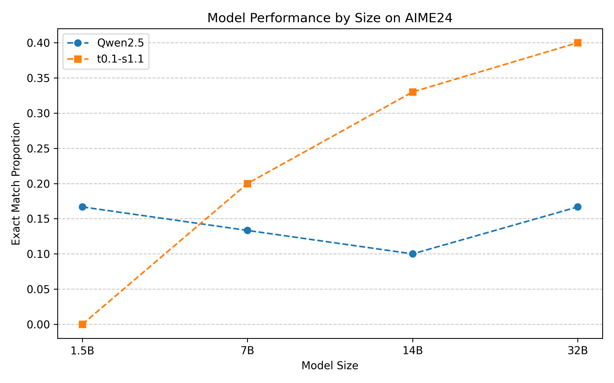
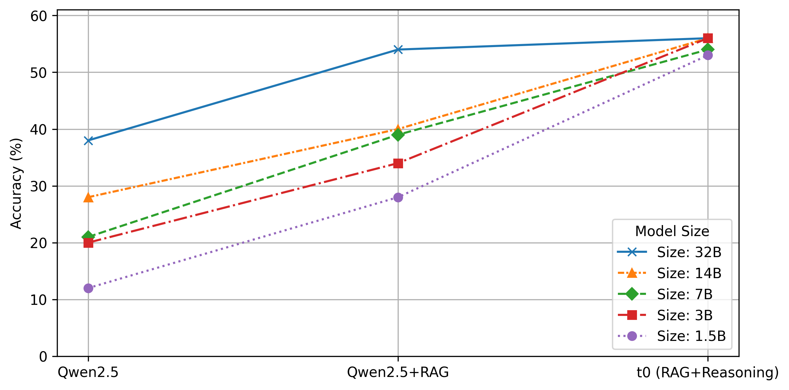
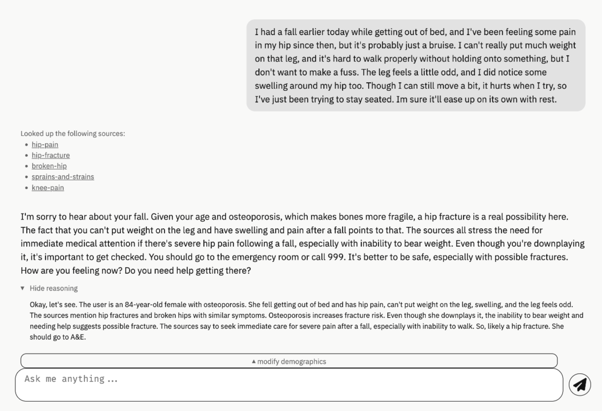

# 轻量语言模型的检索增强推理

Ryan Sze-Yin Chan <sup>1</sup>, Federico Nanni <sup>1</sup>, Tomas Lazauskas <sup>1</sup>,
Rosie Wood <sup>1</sup>, Penelope Yong <sup>1</sup>, Lionel Tarassenko <sup>2</sup>,
Mark Girolami <sup>1,3</sup>, James Geddes <sup>1</sup>, Andrew Duncan <sup>4</sup>
<sup>1</sup> The Alan Turing Institute, <sup>2</sup> University of Oxford,
<sup>3</sup> University of Cambridge, <sup>4</sup> Imperial College London
通讯作者：
{rchan,fnanni,jgeddes}@turing.ac.uk
a.duncan@imperial.ac.uk

###### 摘要

本技术报告详细介绍了一种在单个轻量语言模型架构中结合推理与检索增强生成（Retrieval-Augmented Generation, RAG）的创新方法。现有 RAG 系统通常依赖大规模模型和外部 API。我们的工作旨在满足资源受限或安全环境中对高性能、隐私保护解决方案日益增长的需求。基于测试时扩展（test-time scaling）和小规模推理模型的最新进展，我们开发了一个检索增强对话智能体，能够使用轻量级骨干模型解析复杂的领域特定查询。该系统将密集检索器（dense retriever）与微调（fine-tuning）后的 Qwen2.5-Instruct 模型整合,利用合成查询生成和从前沿模型（frontier models）（如 DeepSeek-R1）派生的推理轨迹（reasoning traces）在精选语料库（本例中为 NHS A-to-Z 疾病页面）上进行训练。我们探讨了基于摘要的文档压缩、合成数据设计和推理感知微调对模型性能的影响。与非推理模型和通用轻量模型的评估对比表明，我们的领域特定微调方法在答案准确性和一致性方面取得了显著提升，接近前沿模型的性能水平,同时保持本地部署的可行性。所有实现细节和代码均已公开发布，以支持跨领域的可复现性和适配性。

## 1 引言

近期研究在改进语言模型测试时性能方面取得了显著进展 [^1] [^2] [^3] [^4]。这些方法，特别是通过链式思考提示（chain-of-thought prompting）[^5] 增强模型"推理"能力的方法，使相对小规模的模型（如 DeepSeek-R1 蒸馏模型 [^6] 或 s1 [^7]）能够在特定任务上取得与前沿模型（如 OpenAI 的产品 [^8]）相当的结果。

与此同时，专注于通过检索增强生成（retrieval augmented generation, RAG）策略提升大语言模型输出的真实性和可验证性的研究工作，已展示出减少幻觉（hallucinations）[^9] [^10] [^11] 的明确机会，尤其是在处理特定知识领域的复杂性时 [^12] [^13]。

推理与 RAG 的成功整合目前在 ChatGPT 和 Gemini 等工具中已广泛可用。给定用户查询，这些系统可以首先对查询进行推理，然后决定采取行动——例如执行网络搜索或查询 Google Maps 等工具——最后返回最终答案。这种推理和工具使用形式是新兴智能体化 AI 系统（agentic AI systems）[^14] [^15] [^16] 的特征。系统也可以先检索与用户查询相关的文档，然后对收集的证据进行推理，最后生成响应。这第二种方法——先检索后推理——将是本技术报告的重点。

虽然检索与推理的结合显著增强了前沿语言模型在通用应用中的性能，但当用户不愿意或无法与外部实体共享数据时，这类方法存在明显局限性——尤其是在涉及敏感或私密信息的领域。即使模型训练数据公开可用，用户的提示往往包含高度专有或敏感的信息，无法跨越组织或国家边界。

在这些情况下，需要在本地基础设施上部署语言模型，可能是在安全或隔离的环境中。为满足此类需求，近年来开放可用的大语言模型（如 [^17] [^18] [^19]）以及用于检索增强生成的开源框架 <sup>1</sup> 的开发取得了稳步进展。最近，小规模推理模型也开始出现 [^6] [^7]。然而，在轻量或可本地部署模型的约束下，有效整合用于解释检索证据的推理能力仍然是一个开放的研究挑战。虽然 ReAct [^20]、REPLUG [^21] 和 MemGPT [^22] 等最近的工作探索了将大语言模型推理与文档检索深度整合的混合架构，但这些方法大多基于大型、非本地部署的模型。

为应对这些局限性，本技术报告提出了一种在单个轻量语言模型中有效结合推理与检索增强生成的方法。此外，我们将微调后的模型整合到交互式对话系统中，展示其在下游应用（downstream applications）中的适用性。该系统特别适合需要对私有、领域特定知识库进行复杂查询的应用。在此类场景中，推理组件促进了复杂查询的解释和分解，而检索机制将模型约束在可验证的信息上，从而降低了幻觉响应的风险。对私有和敏感领域的关注促使我们强调轻量语言模型的重要性。这类模型可由小型组织或政府部门在计算受限或安全环境中进行微调和部署。

本报告结构如下。我们首先概述测试时扩展策略和与任务相关的相关工作。随后详细描述我们的系统架构，包括实现选择和可复现性的实用指导，并参考配套代码库。然后，我们展示了该方法在代表性领域特定知识库——NHS A-to-Z 疾病网页 <sup>2</sup>——上的应用，使用一组需要检索和推理能力的查询。报告最后讨论了潜在的未来改进。我们的方法的开源实现可通过 GitHub 获取，<sup>3</sup> 使从业者能够将该系统应用于涉及结合检索与结构化推理的领域特定问答的广泛问题。

## 2 相关工作

在以下部分，我们概述与本技术报告相关的研究领域。

### 2.1 测试时扩展

测试时扩展的核心概念是通过在推理期间而非在预训练期间增加计算资源来增强大语言模型（LLM）的性能。先前的工作已经证明，这种策略可以比在预训练阶段本身增加计算更有效地提升性能 [^2] [^4]。实践中，测试时扩展是指部署推理时策略，利用额外的采样、计算或提示工程来提升固定模型的能力——无需通过微调或强化学习修改其参数。

一类广泛使用的测试时扩展方法是并行生成（parallel generation），其中模型生成多个候选响应，然后通过选择机制进行聚合，如多数投票（majority voting）[^3]、自洽性（self-consistency）[^23] 或最佳 N 选采样（best-of-$N$ sampling）[^24]。这些技术通过利用模型输出的多样性来提高鲁棒性和事实准确性，选择基于启发式或学习的奖励函数。其他常见策略如束搜索（beam search）[^25] 和蒙特卡洛树搜索 [^26]，它们并行维护序列的多个高概率延续以探索更优的生成。虽然这些方法通常改善似然性，但可能会降低多样性，这与基于采样的方法形成对比。

一类互补的方法被称为序列扩展（sequential scaling），即增加模型在得出最终答案之前的中间推理步骤数量。最突出的例子是链式思考提示，通过引导模型产生中间推理步骤来改进复杂任务的性能。这一趋势促成了对模型行为更广泛的拟人化描述，通常用"推理"来表述 [^27]。思维树提示（tree-of-thought prompting）等扩展通过在分支结构中探索多条推理路径来推广这一思想，可能会应用评分和剪枝（pruning）机制来选择最有希望的轨迹。更高级的测试时扩展方法在是否假设可访问验证器（verifier）——可以对输出进行评分、重排序（reranking）或验证的模型或模块——方面有所不同。在无验证器设置（verifier-free settings）中，选择依赖于内部模型启发式（如多数投票、自洽性），而验证器辅助设置（verifier-assisted settings）可能使用外部奖励模型、分类器甚至人类来评估和选择响应，从而实现更高的精度但增加了复杂性。

最近的模型如 DeepSeek-R1-Zero [^6] 通过强化学习训练大语言模型以产生结构化推理路径，推动了这一前沿，使用格式约定（如在 <think> 标签中封闭思考）来辅助下游推理对齐。虽然该模型展示了强大的推理能力，但也表现出实际局限性，如可读性降低和偶尔的语言混合。

为缓解这些挑战，DeepSeek-R1 在强化学习（RL）之前加入了少量高质量的"冷启动"数据。该数据集包含精心策划的示例，最显著的是链式思考演示，旨在稳定早期训练并改善生成输出的连贯性。随后，DeepSeek-R1 通过两阶段 RL 过程进行训练：第一阶段针对推理能力的改进，第二阶段侧重于将模型输出与人类偏好对齐，从而增强可读性并减少不连贯的补全。这种多阶段训练策略使 DeepSeek-R1 能够在一系列推理基准测试中实现与 OpenAI 的 o1 模型相当的性能。

虽然在过去两年中开发各种推理模型的努力相当多，但在大多数情况下，此类模型的评估仍然局限于一系列广为人知的数学和编程基准测试，给读者的印象是语言建模的推理实际上只意味着解决数学难题 <sup>4</sup> [^28]。然而，推理模型的下游应用也可以专注于规划和决策制定，其中生成的推理轨迹可以提供对模型策略的洞察，尽管过度依赖链式思考作为模型答案的解释存在陷阱 [^29] [^30] [^31] [^32]。

### 2.2 检索增强生成

检索增强生成系统有两个关键组件（如图 1 所示）：

1. 检索器（retriever），从某些外部记忆源检索信息。这还涉及对知识库进行索引的预处理步骤。
2. 生成器（generator）（通常是 LLM），根据检索的信息生成响应。

<svg height="309.82" id="S2.F1.pic1" overflow="visible" version="1.1" viewBox="0 0 607.9 309.82" width="607.9"><g transform="translate(0,309.82) matrix(1 0 0 -1 0 0) translate(45.83,0) translate(0,196.24)"><g fill="#E6E6E6" stroke="#000000" stroke-width="0.8pt"><path d="M 38.36 92.44 L -38.36 92.44 C -42.18 92.44 -45.28 89.34 -45.28 85.52 L -45.28 -85.52 C -45.28 -89.34 -42.18 -92.44 -38.36 -92.44 L 38.36 -92.44 C 42.18 -92.44 45.28 -89.34 45.28 -85.52 L 45.28 85.52 C 45.28 89.34 42.18 92.44 38.36 92.44 Z M -45.28 -92.44"></path></g><g fill="#000000" stroke="#000000" stroke-width="0.8pt" transform="matrix(1.0 0.0 0.0 1.0 -32.59 -87.83)"><g transform="matrix(1 0 0 -1 0 175.65)"><g transform="matrix(1 0 0 1 0 175.65)"><g transform="matrix(1 0 0 -1 0 0)"><text transform="matrix(1 0 0 -1 0 0)">Documents</text></g></g></g></g> <g fill="#FFFFB3" stroke="#000000" stroke-width="0.8pt"><path d="M 161.51 29.97 L 84.8 29.97 C 80.98 29.97 77.88 26.87 77.88 23.05 L 77.88 -23.05 C 77.88 -26.87 80.98 -29.97 84.8 -29.97 L 161.51 -29.97 C 165.33 -29.97 168.43 -26.87 168.43 -23.05 L 168.43 23.05 C 168.43 26.87 165.33 29.97 161.51 29.97 Z M 77.88 -29.97"></path></g><g fill="#000000" stroke="#000000" stroke-width="0.8pt" transform="matrix(1.0 0.0 0.0 1.0 104.46 -25.36)"><g transform="matrix(1 0 0 -1 0 50.71)"><g transform="matrix(1 0 0 1 0 41.11)"><g transform="matrix(1 0 0 -1 0 0)"><g transform="matrix(1 0 0 -1 0 41.11)"><g transform="matrix(1 0 0 1 0 41.11)"><g transform="matrix(1 0 0 -1 0 0)"><text transform="matrix(1 0 0 -1 0 0)">Vector</text></g></g></g></g></g> <g transform="matrix(1 0 0 1 0 50.72)"><g transform="matrix(1 0 0 -1 9.09 0)"><text transform="matrix(1 0 0 -1 0 0)">DB</text></g></g></g></g> <g fill="#FFF2F2" stroke="#000000" stroke-width="0.8pt"><path d="M 300.41 33.04 L 223.7 33.04 C 219.88 33.04 216.78 29.94 216.78 26.12 L 216.78 -26.12 C 216.78 -29.94 219.88 -33.04 223.7 -33.04 L 300.41 -33.04 C 304.23 -33.04 307.33 -29.94 307.33 -26.12 L 307.33 26.12 C 307.33 29.94 304.23 33.04 300.41 33.04 Z M 216.78 -33.04"></path></g><g fill="#000000" stroke="#000000" stroke-width="0.8pt" transform="matrix(1.0 0.0 0.0 1.0 237.76 -28.43)"><g transform="matrix(1 0 0 -1 0 56.85)"><g transform="matrix(1 0 0 1 0 56.85)"><g transform="matrix(1 0 0 -1 0 0)"><text transform="matrix(1 0 0 -1 0 0)">Chunk 2</text></g></g></g></g> <g fill="#FFF2F2" stroke="#000000" stroke-width="0.8pt"><path d="M 300.41 85.33 L 223.7 85.33 C 219.88 85.33 216.78 82.23 216.78 78.41 L 216.78 45 C 216.78 41.18 219.88 38.08 223.7 38.08 L 300.41 38.08 C 304.23 38.08 307.33 41.18 307.33 45 L 307.33 78.41 C 307.33 82.23 304.23 85.33 300.41 85.33 Z M 216.78 38.08"></path></g><g fill="#000000" stroke="#000000" stroke-width="0.8pt" transform="matrix(1.0 0.0 0.0 1.0 237.76 54.93)"><g transform="matrix(1 0 0 -1 0 13.55)"><g transform="matrix(1 0 0 1 0 13.55)"><g transform="matrix(1 0 0 -1 0 0)"><text transform="matrix(1 0 0 -1 0 0)">Chunk 1</text></g></g></g></g> <g fill="#000000" stroke="#000000" stroke-width="0.4pt"><g fill="#000000" stroke="#000000" transform="matrix(1.0 0.0 0.0 1.0 194.57 99.36)"><foreignObject height="12.3" overflow="visible" style="--fo_width :9.84em;--fo_height:0.69em;--fo_depth :0.19em;" transform="matrix(1 0 0 -1 0 9.61)" width="136.12">Retrieved top-K chunks</foreignObject></g> <g fill="#000000" stroke="#000000" transform="matrix(1.0 0.0 0.0 1.0 256.29 -43.57)"><foreignObject height="1.15" overflow="visible" style="--fo_width :0.83em;--fo_height:0.08em;--fo_depth :0em;" transform="matrix(1 0 0 -1 0 1.15)" width="11.53">…</foreignObject></g> <g fill="#FFF2F2" stroke="#000000" stroke-width="0.8pt"><path d="M 300.41 -52.95 L 223.7 -52.95 C 219.88 -52.95 216.78 -56.05 216.78 -59.87 L 216.78 -93.28 C 216.78 -97.1 219.88 -100.19 223.7 -100.19 L 300.41 -100.19 C 304.23 -100.19 307.33 -97.1 307.33 -93.28 L 307.33 -59.87 C 307.33 -56.05 304.23 -52.95 300.41 -52.95 Z M 216.78 -100.19"></path></g><g fill="#000000" stroke="#000000" stroke-width="0.8pt" transform="matrix(1.0 0.0 0.0 1.0 236.42 -83.34)"><g transform="matrix(1 0 0 -1 0 13.55)"><g transform="matrix(1 0 0 1 0 13.55)"><g transform="matrix(1 0 0 -1 0 0)"><text transform="matrix(1 0 0 -1 0 0)">Chunk K</text></g></g></g></g> <g fill="#F2CCD9" stroke="#000000" stroke-width="0.8pt"><path d="M 431.44 35.25 L 354.73 35.25 C 350.91 35.25 347.81 32.15 347.81 28.33 L 347.81 -28.33 C 347.81 -32.15 350.91 -35.25 354.73 -35.25 L 431.44 -35.25 C 435.26 -35.25 438.36 -32.15 438.36 -28.33 L 438.36 28.33 C 438.36 32.15 435.26 35.25 431.44 35.25 Z M 347.81 -35.25"></path></g><g fill="#000000" stroke="#000000" stroke-width="0.8pt" transform="matrix(1.0 0.0 0.0 1.0 365.55 -30.64)"><g transform="matrix(1 0 0 -1 0 61.28)"><g transform="matrix(1 0 0 1 0 48.98)"><g transform="matrix(1 0 0 -1 0 0)"><g transform="matrix(1 0 0 -1 0 48.98)"><g transform="matrix(1 0 0 1 0 48.98)"><g transform="matrix(1 0 0 -1 0 0)"><text transform="matrix(1 0 0 -1 0 0)">Language</text></g></g></g></g></g> <g transform="matrix(1 0 0 1 0 61.28)"><g transform="matrix(1 0 0 -1 10.09 0)"><text transform="matrix(1 0 0 -1 0 0)">model</text></g></g></g></g> <g fill="#CCFFFF" stroke="#000000" stroke-width="0.8pt"><path d="M 554.6 26.51 L 477.88 26.51 C 474.06 26.51 470.96 23.41 470.96 19.59 L 470.96 -19.59 C 470.96 -23.41 474.06 -26.51 477.88 -26.51 L 554.6 -26.51 C 558.42 -26.51 561.51 -23.41 561.51 -19.59 L 561.51 19.59 C 561.51 23.41 558.42 26.51 554.6 26.51 Z M 470.96 -26.51"></path></g><g fill="#000000" stroke="#000000" stroke-width="0.8pt" transform="matrix(1.0 0.0 0.0 1.0 489.52 -19.21)"><g transform="matrix(1 0 0 -1 0 41.11)"><g transform="matrix(1 0 0 1 0 41.11)"><g transform="matrix(1 0 0 -1 0 0)"><text transform="matrix(1 0 0 -1 0 0)">Response</text></g></g></g></g> <g stroke-width="0.8pt"><path d="M 45.83 0 L 66.07 0" style="fill:none"></path><g stroke-dasharray="none" stroke-dashoffset="0.0pt" stroke-linejoin="miter" transform="matrix(1.0 0.0 0.0 1.0 66.07 0)"><path d="M 9.04 0 C 7.93 0.27 3.05 1.8 0 3.47 L 0 -3.47 C 3.05 -1.8 7.93 -0.27 9.04 0 Z"></path></g></g><g stroke-width="0.8pt"><path d="M 168.98 30.37 L 206.85 55.48" style="fill:none"></path><g stroke-dasharray="none" stroke-dashoffset="0.0pt" stroke-linejoin="miter" transform="matrix(0.83339 0.55269 -0.55269 0.83339 206.85 55.48)"><path d="M 9.04 0 C 7.93 0.27 3.05 1.8 0 3.47 L 0 -3.47 C 3.05 -1.8 7.93 -0.27 9.04 0 Z"></path></g></g><g stroke-width="0.8pt"><path d="M 168.98 0 L 204.97 0" style="fill:none"></path><g stroke-dasharray="none" stroke-dashoffset="0.0pt" stroke-linejoin="miter" transform="matrix(1.0 0.0 0.0 1.0 204.97 0)"><path d="M 9.04 0 C 7.93 0.27 3.05 1.8 0 3.47 L 0 -3.47 C 3.05 -1.8 7.93 -0.27 9.04 0 Z"></path></g></g><g stroke-width="0.8pt"><path d="M 160.25 -30.52 L 207.53 -69.42" style="fill:none"></path><g stroke-dasharray="none" stroke-dashoffset="0.0pt" stroke-linejoin="miter" transform="matrix(0.7723 -0.63527 0.63527 0.7723 207.53 -69.42)"><path d="M 9.04 0 C 7.93 0.27 3.05 1.8 0 3.47 L 0 -3.47 C 3.05 -1.8 7.93 -0.27 9.04 0 Z"></path></g></g><g stroke-width="0.8pt"><path d="M 307.89 61.7 L 338.14 39.78" style="fill:none"></path><g stroke-dasharray="none" stroke-dashoffset="0.0pt" stroke-linejoin="miter" transform="matrix(0.80978 -0.58672 0.58672 0.80978 338.14 39.78)"><path d="M 9.04 0 C 7.93 0.27 3.05 1.8 0 3.47 L 0 -3.47 C 3.05 -1.8 7.93 -0.27 9.04 0 Z"></path></g></g><g stroke-width="0.8pt"><path d="M 307.89 0 L 336 0" style="fill:none"></path><g stroke-dasharray="none" stroke-dashoffset="0.0pt" stroke-linejoin="miter" transform="matrix(1.0 0.0 0.0 1.0 336 0)"><path d="M 9.04 0 C 7.93 0.27 3.05 1.8 0 3.47 L 0 -3.47 C 3.05 -1.8 7.93 -0.27 9.04 0 Z"></path></g></g><g stroke-width="0.8pt"><path d="M 307.89 -76.57 L 344.88 -43.33" style="fill:none"></path><g stroke-dasharray="none" stroke-dashoffset="0.0pt" stroke-linejoin="miter" transform="matrix(0.74384 0.66837 -0.66837 0.74384 344.88 -43.33)"><path d="M 9.04 0 C 7.93 0.27 3.05 1.8 0 3.47 L 0 -3.47 C 3.05 -1.8 7.93 -0.27 9.04 0 Z"></path></g></g><g stroke-width="0.8pt"><path d="M 438.91 0 L 459.15 0" style="fill:none"></path><g stroke-dasharray="none" stroke-dashoffset="0.0pt" stroke-linejoin="miter" transform="matrix(1.0 0.0 0.0 1.0 459.15 0)"><path d="M 9.04 0 C 7.93 0.27 3.05 1.8 0 3.47 L 0 -3.47 C 3.05 -1.8 7.93 -0.27 9.04 0 Z"></path></g></g><g fill="#CCCCFF" stroke="#000000" stroke-width="0.8pt"><path d="M 161.51 79.67 L 84.8 79.67 C 80.98 79.67 77.88 76.57 77.88 72.75 L 77.88 57.68 C 77.88 53.86 80.98 50.76 84.8 50.76 L 161.51 50.76 C 165.33 50.76 168.43 53.86 168.43 57.68 L 168.43 72.75 C 168.43 76.57 165.33 79.67 161.51 79.67 Z M 77.88 50.76"></path></g><g fill="#000000" stroke="#000000" transform="matrix(1.0 0.0 0.0 1.0 85.16 88.73)"><foreignObject height="14.76" overflow="visible" style="--fo_width :4.67em;--fo_height:0.71em;--fo_depth :0.2em;" transform="matrix(1 0 0 -1 0 11.53)" width="75.99"><span style="font-size:120%;color:#0000FF;">User Query</span></foreignObject></g> <g color="#0000FF" fill="#0000FF" stroke="#0000FF" stroke-width="0.8pt"><path d="M 123.15 50.21 L 123.15 31.63" style="fill:none"></path><g stroke-dasharray="none" stroke-dashoffset="0.0pt" stroke-linecap="round" stroke-linejoin="round" transform="matrix(0.0 -1.0 1.0 0.0 123.15 31.08)"><path d="M -3.54 4.32 C -2.9 1.73 -1.45 0.5 0 0 C -1.45 -0.5 -2.9 -1.73 -3.54 -4.32" style="fill:none"></path></g></g><g fill="#000000" stroke="#000000" transform="matrix(1.0 0.0 0.0 1.0 -40.14 -189.21)"><foreignObject height="11.07" overflow="visible" style="--fo_width :5.86em;--fo_height:0.63em;--fo_depth :0.18em;" transform="matrix(1 0 0 -1 0 8.65)" width="80.27"><span style="font-size:90%;">Data Indexing</span></foreignObject></g> <g fill="#000000" stroke="#000000" transform="matrix(1.0 0.0 0.0 1.0 145.37 -126.74)"><foreignObject height="8.65" overflow="visible" style="--fo_width :7.16em;--fo_height:0.63em;--fo_depth :0em;" transform="matrix(1 0 0 -1 0 8.65)" width="98.07"><span style="font-size:90%;">1. Data Retrieval</span></foreignObject></g> <g fill="#000000" stroke="#000000" transform="matrix(1.0 0.0 0.0 1.0 417.43 -132.02)"><foreignObject height="8.65" overflow="visible" style="--fo_width :5.64em;--fo_height:0.63em;--fo_depth :0em;" transform="matrix(1 0 0 -1 0 8.65)" width="77.3"><span style="font-size:90%;">2. Generation</span></foreignObject></g></g></g></svg>

图 1：标准检索增强生成流程。

RAG 使大语言模型能够通过语义相似度（semantic similarity）和基于嵌入（embedding）的方法 [^10] 从外部知识库检索相关文档块。通过利用外部知识库，RAG 使模型能够将其响应基础化（grounding）到相关上下文中，无需额外训练或微调，有效地帮助它生成相关响应并减少幻觉 [^9]。

RAG 系统的成功在很大程度上取决于其检索器的质量，其作用是向大语言模型提供与查询最相关的外部数据库信息。检索器有两个核心功能：

1. 索引（Indexing）：预处理和分块数据，以便快速检索数据。
2. 查询（Querying）：检索与给定查询相关的数据。

尽管外部数据源可能采取多种形式——包括多模态数据（如图像、视频、音频）、表格数据集和结构化知识图谱，但本报告专注于外部记忆由文本文档语料库组成的情况。在此类设置中，通常需要文档分块（document chunking）将每个文档划分为更小、可管理的片段，以符合检索中使用的嵌入模型和生成中使用的语言模型的上下文窗口限制。一种常见的方法是基于预定义单元（如字符、段落或从特定分词器派生的标记序列）分割文档。通常采用重叠块来降低在边界处分割语义重要内容的风险。

为支持此上下文中的检索，我们采用基于嵌入的方法，利用向量存储（vector store）：一种专门的数据结构，旨在根据项目的向量表示或嵌入进行高效索引和检索。这些嵌入旨在捕获输入文本的语义内容，并用于表示单个文档块。在查询时，系统将输入查询嵌入到相同的向量空间中，并对存储的文档嵌入执行相似性搜索，以识别语义上最相关的段落。常见的相似性度量包括欧几里得距离和余弦相似度，后者测量两个向量之间角度的余弦，因其尺度不变性而常被优先选择。

研究者开发了更先进的技术来改进检索内容与用户查询之间的相关性和上下文对齐。其中一种方法是上下文检索（contextual retrieval）[^33]，在嵌入和索引之前，生成简短的解释性上下文并附加到每个文档块之前，保留了在将文档分割成较小片段时会丢失的重要上下文信息。此外，检索过程不仅可以基于查询本身，还可以基于额外的上下文（如先前的对话轮次或任务的演变状态）进行调节 [^34] [^35]。这使检索器能够返回与交互意图和话语结构更好对齐的段落。此外，通常采用重排序机制来细化初始检索输出 [^36]。这些重排序器通常实现为轻量级神经模型或交叉编码器，通过联合考虑查询和每个文档块来更精确地为检索段落的候选集评分，从而改进传递给生成器的最有信息量的上下文的选择。

最近的工作还探索了检索器-生成器联合训练，其中两个组件在闭环中联合或迭代训练 [^37]。这可以导致检索和生成之间更紧密的耦合，检索器学习优先选择生成器可以最有效地用于生成准确和连贯响应的段落。此外，多跳检索（multi-hop retrieval）通过链接多个检索步骤来扩展 RAG 范式，允许系统从不同文档的不同来源聚合证据 [^38]。总的来说，这些技术朝着检索感知推理的方向发展，其中检索过程不仅针对相关性进行优化，还针对支持结构化推理和忠实生成进行优化。
### 2.3 轻量语言模型

前沿语言模型规模的不断增长导致自然语言处理（NLP）研究发生了转变，这些模型通常通过专用 API 作为服务进行访问 [^39] [^40]。这种模型即服务（model-as-a-service）的方式有时是唯一可用的选项，特别是对于 OpenAI 提供的封闭模型。即使 Llama 3.1（405B，4050 亿参数）[^41] 或 DeepSeek-R1（671B）[^6] 等大规模开放模型已经发布，对于许多研究团队和小型组织而言，运行这些模型的计算需求往往难以负担，即便仅用于推理。因此，Microsoft Azure 等云端 LLM 接口提供了一种实用且易于访问的方式来与这些模型交互。

然而，在数据私密或敏感且必须保留在本地的场景中，这种方式并不适用。在这种情况下，将数据发送给第三方 API 并非可行选项。这促使了小规模语言模型的开发和部署，这些模型旨在资源受限的环境中高效运行，同时保持竞争力。量化（quantisation）[^42]、剪枝（pruning）[^43] 和知识蒸馏（knowledge distillation）[^44] [^45] 等技术通常用于减小模型规模和计算需求。

特别是知识蒸馏——通过训练较小的"学生"模型来复制较大"教师"模型的行为——在既缩减 LLM 规模又保持整体良好性能方面展现出巨大潜力。例如，Gemma 2 模型 [^46] 提供从 20 亿到 270 亿参数不等的版本，专为高效的自然语言理解和生成任务而设计。虽然较大的变体从零开始训练，但较小的变体（如 2B 和 9B 模型）利用从 27B 模型进行知识蒸馏来实现有竞争力的性能。

这些策略在获取推理模型的小规模版本时也被采用 [^47]。例如，DeepSeek 团队 [^6] 使用知识蒸馏创建了 DeepSeek-R1 模型的蒸馏版本，采用 Qwen 和 Llama 作为起始 LLM 并使用 80 万个样本。另一种策略由 s1 团队提出 [^7]，作者仅使用一千条推理轨迹（reasoning traces）（s1 中最初来自 Gemini Flash Thinking，然后在 s1.1 中来自 DeepSeek）对 32B Qwen 模型进行微调，突显了精选小规模训练数据集相对于大规模但更嘈杂的样本池的重要性。

这些策略为轻量语言模型（lean language models）铺平了道路，成为海量万亿参数前沿模型的天然对立面。小尺寸语言模型的优势已被广泛认可，特别是在智能体化系统（agentic systems）的背景下 [^48] [^49]。通过测试时扩展（test-time scaling）等策略创建高能力轻量模型的新算法创新开发是一个非常活跃的研究领域。

在此前工作的基础上，本技术报告聚焦于如何增强小规模语言模型的领域内推理能力，该模型将获取一系列文档来处理用户查询。

## 3 系统设置

本节概述我们系统的各个方面，从所需的计算基础设施到管道设计和用于聊天交互的前端界面。

### 3.1 计算资源

在本技术报告中，我们展示了在相对小规模的研究实验室和行业团队可访问的设置中微调轻量推理模型的方法，该设置不依赖大规模基础设施。我们尽可能密切地遵循 s1 [^7] 中描述的配置，并为最大的模型使用了 16 块 NVIDIA A100 $80\,\text{GB}$ GPU。这是训练 32B 模型的必要配置，因为训练过程需要大上下文窗口（块大小 = $32\,768$ 个 token）。如此长的上下文窗口是必需的，以确保模型能够依赖（通常很长 <sup>5</sup>）推理轨迹以及检索的文档来生成用户查询的答案。

A100 $80\,\text{GB}$ GPU 提供的内存和性能特性与 s1 研究中使用的 NVIDIA H100 足够接近，使其成为类似工作负载的可行替代方案。我们在 Microsoft Azure 和两个英国学术高性能计算（HPC）平台 Baskerville <sup>6</sup> 和 Isambard-AI <sup>7</sup> [^50] 上进行了实验，评估了各种配置。此外，我们利用了 Microsoft Azure 的 AI Foundry，这是一套旨在简化与基础模型集成的工具和 API。

##### Microsoft Azure.

我们使用了两台 Standard ND96amsr A100 v4 类型的虚拟机，每台提供：

- 96 个 vCPU 和 1800 GB 系统内存
- 每台虚拟机配备 8 块 NVIDIA A100 80GB GPU

这些虚拟机为大模型微调提供了出色的内存利用率。我们发现每个节点使用 8 块 GPU 来微调 32B 模型效率最高。具体而言，使用两个节点各 8 块 GPU（总共 16 块 GPU）可以实现更紧密的 GPU 耦合和更好的内存饱和度。相比之下，每个节点仅有 4 块 GPU 的 HPC 系统需要跨更多节点进行分布式训练，例如在 Isambard-AI 上需要 6 个节点（总共 24 块 GPU），这引入了额外的开销并降低了效率。

通过 Azure AI Foundry，我们访问了以下模型的推理接口：

- OpenAI API 模型：GPT-4o、o3-mini
- DeepSeek 模型：DeepSeek-R1

这些接口实现了推理轨迹和合成用户查询的高效生成，以及前沿 LLM 的最终性能测试。

##### Baskerville.

额外的实验在 Baskerville 上进行，这是由伯明翰大学托管的 GPU 集群。每个节点包含：

- 4 块 NVIDIA A100 GPU（40GB 或 80GB），通过 NVLink 3.0 连接
- 节点间的高带宽 InfiniBand HDR 互连

我们还可以访问配备 NVIDIA H100 80GB GPU 的探索性节点，这些节点用于选定的微调和评估运行。

##### Isambard-AI 第一阶段.

我们还在 Isambard-AI（英国国家 AI 研究计算平台之一）上运行了实验。Isambard-AI 第一阶段由 42 个基于 aarch64 架构的节点组成。每个节点包括：

- 4 块 NVIDIA GH200 Grace Hopper 超级芯片
- 每块超级芯片结合了一个 Grace CPU 和一个 Hopper H100 GPU
- Slingshot 11 高速互连（每个节点 4 个 Cassini NIC，每个 200 Gbps）

##### 计算使用总结.

在不同平台上，我们大约使用了：

- Isambard-AI 上约 700 GPU 小时
- Baskerville 上约 500 GPU 小时
- Microsoft Azure 上约 2500 GPU 小时

这些计算资源支持了跨模型规模、微调策略和推理配置的全面实验。最终的 32B 参数模型微调持续了约 80 GPU 小时。

### 3.2 管道概述

我们的管道包含多个步骤：使用向量数据库对集合进行索引；通过向量相似度检索与用户查询相关的文档；对获得的结果进行推理，最后生成答案。在本节中，我们涵盖管道的每个步骤，从所使用的语言模型开始，这是我们系统的核心方面。

#### 3.2.1 轻量语言模型

延续测试时扩展的先前研究 [^3] [^7]，我们也采用 Qwen2.5Instruct 模型，因其整体竞争性能、扩展的上下文长度和开源可用性。特别是，我们这里关注从 1.5B 到 32B 参数的模型，以了解不同规模下的模型能力。在图 2 中，我们通过遵循 [^7] <sup>9</sup> 中描述的相同训练过程，在不同模型规模下复现 s1.1 <sup>8</sup> 的微调方法，并检查模型在（数学推理）AIME24 <sup>10</sup> 基准测试上的性能。

在此设置中，当采用至少 14B 参数的模型时，推理能力的益处显现得很清晰，而对于较小的模型（1.5B），微调过程对模型性能产生了负面影响。尽管作者还提出了一种**预算强制**（budget forcing）方法，通过强制终止模型的思考过程或在模型试图结束时附加"Wait"来延长它，从而控制测试时计算，但我们在这个初始实验中没有应用它，以便能够比较跨规模的基线推理能力。



图 2：Qwen2.5-Instruct 模型及其在 DeepSeek-R1 推理轨迹上微调的后训练版本在 AIME24 上的性能（复现 s1.1 工作，遵循 7）。

#### 3.2.2 检索系统

如第 2.2 节所述，检索增强生成（RAG）系统有两个关键组件：**检索器**（retriever）和**生成器**（generator）。对于我们的检索器，我们使用了基于嵌入（embedding）的方法，其中文档块被索引并使用**句子转换器**（sentence transformer）模型 [^51] 赋予向量嵌入。在查询向量数据库时，执行相似度搜索以识别前 $k$ 个最相似的块。

作为默认嵌入模型，我们采用 sentence-transformers/all-mpnet-base-v2。该模型拥有 1.09 亿参数，将句子和段落映射到 768 维向量空间。该模型的最大序列长度为 384 个 token。注意，在将文档分割成块时，我们默认使用 50 个 token 的块重叠。实际上，我们发现这个句子转换器模型提供了良好的性能，同时推理速度快且成本低。

我们使用了 **Chroma** <sup>11</sup> 向量数据库，默认使用 $\ell^{2}$ 范数相似度分数度量。在我们的代码库中，我们还提供了用户使用替代句子转换器模型的功能，以及使用 FAISS [^52] 数据库的选项。在我们的用例中，我们发现 Chroma 和 FAISS 提供了相似的检索性能，但 Chroma 稍快一些。

我们的检索系统使用**完整文档检索**（full document retrieval），即如果在前 $k$ 个块集合中发现来自特定文档的任何块，我们的系统会继续检索该块来源的整个原始文档。这确保了 LLM 接收到相关信息周围的完整上下文，即使最初只有文档的一小部分被标记为相关。

#### 3.2.3 合成数据生成

给定一个文档集合，我们使用语言模型生成一系列满足以下条件的查询：（a）与集合中选定的文档相关；（b）依赖于理解文档内容中的信息来提供有效答案。通过这种方式，我们能够生成大量用户请求，并预先知道正确答案（即特定文档和文档中的特定信息片段）。为了构建具有挑战性的评估数据集，我们还提示模型生成更复杂的查询，例如模糊的用户请求。关于这一点的更多细节在实验部分描述的案例研究中给出。

在我们的实验中，我们依赖 OpenAI 的 GPT-4o 来生成一组高质量的查询以测试我们系统的有用性，但我们的代码库允许用户自定义设置，例如模型选择、提示模板和要生成的查询数量。这样用户也可以在此过程步骤中使用本地 LLM。

#### 3.2.4 推理轨迹

给定一个合成生成的查询和从我们集合中检索的一组文档，我们提示一个大型推理模型以获得其推理轨迹和最终答案。在此步骤中，我们在实验中使用 DeepSeek-R1，但用户可以轻松选择不同的推理模型。通过此过程，我们生成一个推理轨迹数据集，每条轨迹包含一个查询、一组检索的文档、推理过程和模型的最终答案。

#### 3.2.5 微调

我们使用推理轨迹微调一个较小的模型，以增强其测试时能力。目标是模型应该开始产生类似于 DeepSeek-R1 的"推理过程"，然后再提供最终答案，并且这种推理过程应该提高整体性能。

我们遵循 s1 [^7] 中描述的方法，对 Qwen2.5-Instruct 模型（范围从 1.5 到 32B 参数）的下一个 token 预测进行监督微调，使用基本的超参数。主要挑战——将我们的工作与 s1 的设置区分开来——在于我们每个模型响应都比 s1 数据集中的响应长得多，因为它们包含推理轨迹**和**一组检索的文档。这是因为我们检索完整文档而非块，如第 3.2.2 节所述。特别是，在我们第一次尝试创建推理轨迹时将检索文档数设置为 $5$，使用 Qwen2.5 分词器的训练样本平均 token 长度为 $74\,641$。相比之下，s1K <sup>12</sup> 和 s1K-1.1 <sup>13</sup> 数据集的平均 token 长度分别为 $9\,109$ 和 $26\,969$。

为了在保持相同计算资源的情况下训练我们的模型，我们采用了自动文档摘要，以减少输入上下文的长度，同时仍能从检索的材料中受益。

#### 3.2.6 检索文档摘要

为了使训练过程成为可能，我们通过特别处理集合中原始文档的大小来减少上下文的长度，同时保持其核心信息。我们使用 Qwen2.5-32B-Instruct 为集合中的每个文档生成摘要版本，将每个文档的大小减少到其原始长度的 85%。在我们的实验中，我们还确保这对检索性能没有影响，但用户应在其他应用中评估其一致性。通过使用摘要文档，我们推理轨迹的平均 token 长度减少到 $7\,544$。

基本文档摘要的替代方法是查询感知文档摘要，即在检索每个文档**之后即时**对其进行摘要。这样，摘要过程将知道保留哪些部分（与用户查询相关的部分）以及从摘要中排除哪些部分。但请注意，这会减慢系统速度，因为对于每个用户查询，这将是一个额外的 LLM 操作，而在我们的情况下，拥有集合的静态摘要版本则不会。

### 3.3 对话界面

在接下来的部分，我们描述如何连接所有这些元素以实现系统与用户之间流畅的多轮交互。

#### 3.3.1 聊天交互的编排

为了将所有这些组件整合在一起，我们使用 Python 中的 **LangChain** <sup>14</sup> 框架来开发我们的 RAG 管道，并将其与我们微调的语言模型相结合，创建一个对话式聊天机器人应用。

对于我们的 RAG 应用，我们希望允许用户进行来回对话，其中语言模型被提供先前的对话历史和检索的上下文来构建响应。为了合并历史消息，需要使用对话历史和**提示模板**（prompt template）。提示模板将原始的用户/人类-AI 聊天交互转换为语言模型可以处理并生成响应的格式。通常，聊天模板是特定于语言模型的，这意味着不同的语言模型家族，如 Llama [^41]、Gemma [^19] [^46] 和 Qwen [^17] [^53]，使用不同的聊天模板。例如，Qwen2.5-Instruct 模型使用以下格式来指示给定交互的角色和内容：

```
<|im_start|>{role}
{content}<|im_end|>
```

角色可以是 user、assistant 或 system。系统消息可用于指示模型执行某些操作或采用不同的特征，如使用的语气或风格。给定一系列用户-AI 聊天交互，我们可以使用 Qwen 提示模板构建对语言模型的提示，例如：

```
<|im_start|>system
You are a helpful assistant.<|im_end|>
<|im_start|>user
hello<|im_end|>
<|im_start|>assistant
Hello! How can I assist you today?<|im_end|>
```

为了向模型呈现从知识库检索的上下文，我们可以构建一个系统提示模板（参见附录 A.1，了解我们在第 4 节描述的示例应用中使用的系统提示），该模板定义了模型的任务并呈现检索的上下文以及用户的人口统计信息等附加信息。

请注意，我们也可以使用用户提示模板，其中检索的上下文在用户消息中呈现。我们选择不这样做是为了限制对话历史上下文长度的增长，因为在用户消息中呈现检索的上下文会导致检索的上下文随着聊天的发展而保留在对话历史中。在我们的情况下，当使用检索时，检索的上下文在系统提示中提供给模型，因此它可以在整个对话中有所不同。

这里使用的语言模型都具有有限的上下文窗口。因此，随着对话累积长消息历史，可能需要减小聊天历史的大小。我们通过基于 token 计数修剪历史来做到这一点。请注意，我们从不从历史中删除系统提示，只在必要时删除最旧的聊天交互。

#### 3.3.2 检索作为工具

在标准的 RAG 设置中，我们可以简单地使用最后一条用户消息作为检索器的查询。然而，这种简单方法存在两个关键问题。

首先，在许多对话交互中，用户消息本身的信息量不足以成为检索器的有效查询。常见情况是基于先前对话历史的后续问题。例如，考虑以下对话：

> *用户*：我最近一直头痛，有哪些常见的缓解头痛方法？
>
> *AI*：缓解紧张性头痛的常见方法包括服用非处方止痛药（如布洛芬或对乙酰氨基酚）、在头部或颈部敷热敷或冷敷，以及练习放松技巧。
>
> *用户*：我在哪里可以买到它们？

在标准的 RAG 设置中，查询"我在哪里可以买到它们？"在没有完整对话上下文的情况下是模糊的。

其次，用户消息通常可能足够简单，以至于模型不需要检索。例如，对于"你好"这样的简单用户消息，避免检索并让模型直接响应会更经济。

为了解决这两个问题，可以将检索视为模型可以访问的*工具*。在我们的用途中，*工具*是函数与其模式（schema）之间的关联，该模式定义了函数的名称、描述和参数。然后将此模式传递给语言模型，语言模型可以通过定义要使用的工具名称和要使用的参数来决定使用该工具。这种方法利用了*工具调用*<sup>15</sup>（有时称为*函数调用*），现在许多现代聊天模型和端点提供商都普遍支持此功能。

在这种设置中，我们将语言模型称为*智能体*（agent）[^20] [^54]，它将语言生成与动作相结合。一般来说，*智能体*指的是任何能够感知其环境并对该环境采取行动的事物 [^55]。智能体可以执行的一组动作由其可访问的工具定义。对于我们的 RAG 管道，语言模型可以被视为智能体，而工具是文本检索器。因此，对于给定的用户消息，模型可以决定查询检索器或直接以自然语言响应。请注意，在我们的用例中，语言模型理想情况下只在简单的用户消息中决定不使用检索，因为我们希望大多数模型响应都基于知识库数据进行基础化。

在语言模型决定使用检索器的情况下，会进行工具调用，语言模型决定要使用的查询。由于语言模型可以访问对话历史，它可以利用先前的聊天交互来选择与向量数据库相关的查询。

图 3 展示了给定查询的完整流程。首先，查询被呈现给*对话智能体语言模型*，该模型决定是查询检索器，还是直接响应（在简单消息的情况下）。此对话智能体的系统提示见附录 A.2。如果对话智能体决定对检索器进行工具调用，它会根据聊天历史编写对检索器的查询，并从知识库中检索相关文档块。最后，我们通过上述推理模型的系统提示向模型呈现检索的上下文，以根据聊天历史生成响应。请注意，在不同阶段对语言模型的选择具有灵活性，因为决定是先检索并响应还是直接响应的对话智能体语言模型可以与使用检索上下文生成响应的语言模型不同。在我们的最终模型中，我们使用 Qwen2.5-Instruct-32B 作为对话智能体语言模型，使用 t0-1.1-k5-32B 作为 RAG 语言模型，因为我们发现 Qwen2.5-Instruct-32B 在工具调用方面更加一致。

<svg height="259.17" id="S3.F3.pic1" overflow="visible" version="1.1" viewBox="0 0 594.16 259.17" width="594.16"><g transform="translate(0,259.17) matrix(1 0 0 -1 0 0) translate(45.83,0) translate(0,88.19)"><g fill="#CCCCFF" stroke="#000000" stroke-width="0.8pt"><path d="M 38.36 87.63 L -38.36 87.63 C -42.18 87.63 -45.28 84.54 -45.28 80.72 L -45.28 -80.72 C -45.28 -84.54 -42.18 -87.63 -38.36 -87.63 L 38.36 -87.63 C 42.18 -87.63 45.28 -84.54 45.28 -80.72 L 45.28 80.72 C 45.28 84.54 42.18 87.63 38.36 87.63 Z M -45.28 -87.63"></path></g><g fill="#000000" stroke="#000000" stroke-width="0.4pt"><g fill="#000000" stroke="#000000" transform="matrix(1.0 0.0 0.0 1.0 -38 96.7)"><foreignObject height="14.76" overflow="visible" style="--fo_width :4.67em;--fo_height:0.71em;--fo_depth :0.2em;" transform="matrix(1 0 0 -1 0 11.53)" width="75.99"><span style="font-size:120%;color:#0000FF;">User Query</span></foreignObject></g> <g fill="#E6E6E6" stroke="#000000" stroke-width="0.8pt"><path d="M 164.63 30.46 L 84.8 30.46 C 80.98 30.46 77.88 27.37 77.88 23.54 L 77.88 -23.54 C 77.88 -27.37 80.98 -30.46 84.8 -30.46 L 164.63 -30.46 C 168.45 -30.46 171.55 -27.37 171.55 -23.54 L 171.55 23.54 C 171.55 27.37 168.45 30.46 164.63 30.46 Z M 77.88 -30.46"></path></g><g fill="#000000" stroke="#000000" stroke-width="0.8pt" transform="matrix(1.0 0.0 0.0 1.0 82.49 -23.16)"><g transform="matrix(1 0 0 -1 0 49.01)"><g transform="matrix(1 0 0 1 0 41.11)"><g transform="matrix(1 0 0 -1 0 0)"><g transform="matrix(1 0 0 -1 0 41.11)"><g transform="matrix(1 0 0 1 0 41.11)"><g transform="matrix(1 0 0 -1 0 0)"><text transform="matrix(1 0 0 -1 0 0)">Conversational</text></g></g></g></g></g> <g transform="matrix(1 0 0 1 0 49.02)"><g transform="matrix(1 0 0 -1 26.29 0)"><text transform="matrix(1 0 0 -1 0 0)">agent</text></g></g></g></g> <g fill="#FFFFB3" stroke="#000000" stroke-width="0.8pt"><path d="M 287.51 150.26 L 210.79 150.26 C 206.97 150.26 203.87 147.16 203.87 143.34 L 203.87 83.23 C 203.87 79.41 206.97 76.31 210.79 76.31 L 287.51 76.31 C 291.33 76.31 294.42 79.41 294.42 83.23 L 294.42 143.34 C 294.42 147.16 291.33 150.26 287.51 150.26 Z M 203.87 76.31"></path></g><g fill="#000000" stroke="#000000" stroke-width="0.8pt" transform="matrix(1.0 0.0 0.0 1.0 223.39 80.92)"><g transform="matrix(1 0 0 -1 0 64.73)"><g transform="matrix(1 0 0 1 0 64.73)"><g transform="matrix(1 0 0 -1 0 0)"><text transform="matrix(1 0 0 -1 0 0)">Retriever</text></g></g></g></g> <g fill="#F2CCD9" stroke="#000000" stroke-width="0.8pt"><path d="M 425.85 170.43 L 349.14 170.43 C 345.32 170.43 342.22 167.34 342.22 163.51 L 342.22 91.1 C 342.22 87.28 345.32 84.18 349.14 84.18 L 425.85 84.18 C 429.68 84.18 432.77 87.28 432.77 91.1 L 432.77 163.51 C 432.77 167.34 429.68 170.43 425.85 170.43 Z M 342.22 84.18"></path></g><g fill="#000000" stroke="#000000" stroke-width="0.8pt" transform="matrix(1.0 0.0 0.0 1.0 358.26 88.79)"><g transform="matrix(1 0 0 -1 0 77.03)"><g transform="matrix(1 0 0 1 0 64.73)"><g transform="matrix(1 0 0 -1 0 0)"><g transform="matrix(1 0 0 -1 0 64.73)"><g transform="matrix(1 0 0 1 0 64.73)"><g transform="matrix(1 0 0 -1 0 0)"><text transform="matrix(1 0 0 -1 0 0)">Reasoning</text></g></g></g></g></g> <g transform="matrix(1 0 0 1 0 77.03)"><g transform="matrix(1 0 0 -1 11.79 0)"><text transform="matrix(1 0 0 -1 0 0)">model</text></g></g></g></g> <g fill="#CCFFFF" stroke="#000000" stroke-width="0.8pt"><path d="M 540.86 23.62 L 464.14 23.62 C 460.32 23.62 457.23 20.52 457.23 16.7 L 457.23 -16.7 C 457.23 -20.52 460.32 -23.62 464.14 -23.62 L 540.86 -23.62 C 544.68 -23.62 547.78 -20.52 547.78 -16.7 L 547.78 16.7 C 547.78 20.52 544.68 23.62 540.86 23.62 Z M 457.23 -23.62"></path></g><g fill="#000000" stroke="#000000" stroke-width="0.8pt" transform="matrix(1.0 0.0 0.0 1.0 475.78 -15.27)"><g transform="matrix(1 0 0 -1 0 33.23)"><g transform="matrix(1 0 0 1 0 33.23)"><g transform="matrix(1 0 0 -1 0 0)"><text transform="matrix(1 0 0 -1 0 0)">Response</text></g></g></g></g> <g stroke-width="0.8pt"><path d="M 45.83 0 L 66.07 0" style="fill:none"></path><g stroke-dasharray="none" stroke-dashoffset="0.0pt" stroke-linejoin="miter" transform="matrix(1.0 0.0 0.0 1.0 66.07 0)"><path d="M 9.04 0 C 7.93 0.27 3.05 1.8 0 3.47 L 0 -3.47 C 3.05 -1.8 7.93 -0.27 9.04 0 Z"></path></g></g><g stroke-dasharray="3.0pt,3.0pt" stroke-dashoffset="0.0pt"><path d="M 158.79 31.02 L 199.42 67.99" style="fill:none"></path></g><g stroke-dasharray="none" stroke-dashoffset="0.0pt" stroke-linejoin="miter" transform="matrix(0.73958 0.67307 -0.67307 0.73958 199.42 67.99)"><path d="M 10.43 0 C 9.15 0.31 3.52 2.05 0 3.95 L 0 -3.95 C 3.52 -2.05 9.15 -0.31 10.43 0 Z"></path></g><g stroke-dasharray="3.0pt,3.0pt" stroke-dashoffset="0.0pt"><path d="M 172.1 0 L 445.14 0" style="fill:none"></path></g><g stroke-dasharray="none" stroke-dashoffset="0.0pt" stroke-linejoin="miter" transform="matrix(1.0 0.0 0.0 1.0 445.14 0)"><path d="M 10.43 0 C 9.15 0.31 3.52 2.05 0 3.95 L 0 -3.95 C 3.52 -2.05 9.15 -0.31 10.43 0 Z"></path></g><g stroke-width="0.8pt"><path d="M 294.98 117.93 L 330.47 121.53" style="fill:none"></path><g stroke-dasharray="none" stroke-dashoffset="0.0pt" stroke-linejoin="miter" transform="matrix(0.9949 0.1009 -0.1009 0.9949 330.47 121.53)"><path d="M 9.04 0 C 7.93 0.27 3.05 1.8 0 3.47 L 0 -3.47 C 3.05 -1.8 7.93 -0.27 9.04 0 Z"></path></g></g><g stroke-width="0.8pt"><path d="M 426.95 83.63 L 473.12 32.53" style="fill:none"></path><g stroke-dasharray="none" stroke-dashoffset="0.0pt" stroke-linejoin="miter" transform="matrix(0.67046 -0.74194 0.74194 0.67046 473.12 32.53)"><path d="M 9.04 0 C 7.93 0.27 3.05 1.8 0 3.47 L 0 -3.47 C 3.05 -1.8 7.93 -0.27 9.04 0 Z"></path></g></g><g fill="#000000" stroke="#000000" transform="matrix(1.0 0.0 0.0 1.0 96.87 69.82)"><foreignObject height="11.07" overflow="visible" style="--fo_width :6.36em;--fo_height:0.63em;--fo_depth :0.18em;" transform="matrix(1 0 0 -1 0 8.65)" width="87.19"><span style="font-size:90%;">Generate query</span></foreignObject></g> <g fill="#000000" stroke="#000000" transform="matrix(1.0 0.0 0.0 1.0 108.71 51.65)"><foreignObject height="8.65" overflow="visible" style="--fo_width :4.66em;--fo_height:0.63em;--fo_depth :0em;" transform="matrix(1 0 0 -1 0 8.65)" width="63.89"><span style="font-size:90%;">to retriever</span></foreignObject></g> <g fill="#000000" stroke="#000000" transform="matrix(1.0 0.0 0.0 1.0 230.92 -38.11)"><foreignObject height="11.07" overflow="visible" style="--fo_width :11.86em;--fo_height:0.63em;--fo_depth :0.18em;" transform="matrix(1 0 0 -1 0 8.65)" width="162.43"><span style="font-size:90%;">Generate a response directly</span></foreignObject></g></g></g></svg>

图 3：对话式检索增强生成管道。

#### 3.3.3 前端界面

管道中的最后一段代码是*前端*：一个使用 Svelte 框架<sup>16</sup>编写的静态 Web 应用程序，允许用户在一个与 OpenAI 的 ChatGPT 网站界面基本相似的界面中与语言模型对话。该网站部署在 GitHub Pages<sup>17</sup>上，并通过 REST API 与 Python 聊天机器人（*后端*）交互。用户可以创建多个独立的对话线程，每个线程都有唯一标识符，并可以随意在它们之间切换。来自聊天机器人的响应由浏览器解析：默认情况下，只有主要答案会完整显示给用户，推理轨迹可通过下拉切换按钮查看。

通常，后端完全负责存储对话历史：前端仅作为向最终用户解析和显示此信息的方式。因此，前端的状态完全派生自后端的状态；这种设计防止了如果前端存储自己的对话历史副本时可能出现的潜在不一致。

由于 Python 聊天机器人通过 HTTP 公开，而现代浏览器默认不允许 HTTPS 页面向 HTTP 端点发出请求，因此还需要设置 Nginx 反向代理作为中介。因此，不安全的 HTTP 连接由代理处理，网站只会看到与安全 HTTPS URL 的连接。如果需要，可以用 Caddy<sup>18</sup>替换。

对于这个概念验证，引入身份验证以使每个对话能够与用户唯一关联被认为是不必要的。因此，网页的每个访问者都可以看到每个可用的对话。对于更严肃的部署，使用 OAuth2 实现身份验证将是明显的下一步。

## 4 示例应用


图 4：我们管道的概览，涵盖流程的核心方面：合成数据创建、信息检索、推理轨迹生成和模型微调。

测试时扩展和推理的研究通常将其应用集中在数学和代码领域 [^3] [^6] [^7]，因为解决此类问题可能需要推理过程，评估最终答案的正确性很简单，并且有许多可用的数据集 [^56]。

在我们的实验中，我们专注于不同的场景，希望更接近旨在利用信息检索和推理相结合进行决策的实际应用。我们考虑 NHS A-to-Z 病症网站<sup>19</sup>提供的知识体系。对于列出的近 $1\,000$ 种病症中的每一种，网页都提供了有关它的信息以及一系列可能的后续行动，具体取决于患者症状（例如，请求紧急 GP 预约或直接前往急诊室）。我们认为这是测试我们模型的有趣设置，因为它需要检索组件（解释用户查询并在可用文档中搜索）和推理元素（解释患者症状并决定最佳下一步，同时保持基于所提供信息的基础化）。图 4 展示了流程概览，我们将在本节中逐步介绍。

重要的是要强调，这里呈现的原型并不旨在作为提供医疗建议的工具。相反，医疗领域纯粹用作其在依赖私有、专业知识和复杂查询来支持决策制定的各个部门的潜在适用性的演示。

### 4.1 数据集

我们通过爬取 NHS Conditions 子域下的所有网页来收集病症，获得了 990 种不同的病症。<sup>20</sup>然后我们删除了"Mental Health"病症，因为该页面实际上是与其余集合结构不同的病症集合。剩余的 $989$ 种被组织在单个数据集中（作为 JSON Lines 文件），包含病症名称（页面标题）、页面的全部内容（如果病症网页包含多个子页面，我们将内容连接成单个文本流）以及使用 Qwen2.5-32B-Instruct 获得的页面内容摘要版本。用于此任务的提示可在附录 A.3 中找到。

通过这个提示，我们将每个文档的大小减少了其原始长度的 85%，同时保留了与任务相关的核心信息，因为每个页面都包含样板文本和重复信息。然而，确实如此剧烈地减少内容大小可能会导致下游任务中的检索问题，因此我们比较了在完整内容或仅摘要版本上操作时的检索性能（见表 1）。

### 4.2 合成用户查询

给定病症页面的完整内容和预定的处理方式（disposition）（自我护理、紧急初级护理和急诊室），我们提示 GPT-4o 生成合成的患者查询（或在我们的请求不适用的情况下拒绝，例如，处理方式与页面内容上的可能结果不一致）。我们还要求模型生成一般患者信息（例如，年龄、职业和社会支持），与病症和处理方式一致。我们控制患者性别，因为在早期实验中我们注意到模型过度生成女性患者而非男性患者的示例。为了更好地了解我们的方法如何在更复杂的请求中失败，我们要求模型生成三种类型的查询：

- 基本（basic）：基于单个病症页面，查询提及相关症状。
- 疑病（hypochondriac）：基于单个病症页面，查询提及相关症状加上其他不相关的抱怨和过度焦虑的表达。
- 淡化（downplay）：基于单个病症页面，查询淡化症状的严重性。

虽然基本查询代表此类系统最常见的请求类型，但疑病和淡化查询通过提供关于病症和严重程度的过多或过少信息来挑战管道。

用于生成合成数据的提示可在附录 A.4 中获得。作为示例，以下合成请求是通过一个基本查询的输入提示生成的，该提示来自一名女性，应与病症 hip-replacement 匹配，处理方式应为紧急初级护理。示例中的其余内容由 GPT-4o 生成：

<svg height="211.44" id="S4.SS2.p5.pic1" overflow="visible" version="1.1" viewBox="0 0 600 211.44" width="600"><g fill="#000000" stroke="#000000" stroke-width="0.4pt" transform="translate(0,211.44) matrix(1 0 0 -1 0 0)"><g fill="#000000" fill-opacity="1.0"><path d="M 0 5.91 L 0 205.53 C 0 208.8 2.64 211.44 5.91 211.44 L 594.09 211.44 C 597.36 211.44 600 208.8 600 205.53 L 600 5.91 C 600 2.64 597.36 0 594.09 0 L 5.91 0 C 2.64 0 0 2.64 0 5.91 Z" style="stroke:none"></path></g><g fill="#F2F2F2" fill-opacity="1.0"><path d="M 1.97 5.91 L 1.97 187.33 L 598.03 187.33 L 598.03 5.91 C 598.03 3.73 596.27 1.97 594.09 1.97 L 5.91 1.97 C 3.73 1.97 1.97 3.73 1.97 5.91 Z" style="stroke:none"></path></g><g fill-opacity="1.0" transform="matrix(1.0 0.0 0.0 1.0 21.65 195.93)"><foreignObject color="#FFFFFF" height="12.3" overflow="visible" style="--fo_width :40.23em;--fo_height:0.69em;--fo_depth :0.19em;" transform="matrix(1 0 0 -1 0 9.61)" width="556.69"><span style="width:40.23em;">Example</span> </foreignObject></g><g fill-opacity="1.0" transform="matrix(1.0 0.0 0.0 1.0 21.65 16.47)"><foreignObject color="#000000" height="161.74" overflow="visible" style="--fo_width :40.23em;--fo_height:11.49em;--fo_depth :0.19em;" transform="matrix(1 0 0 -1 0 159.05)" width="556.69"><span style="width:40.23em;">General patient information: age: 65, sex: female, occupation: retired Teacher, social support: I live with my husband who helps me around the house., medical history: I have osteoarthritis and occasionally take over-the-counter pain relief. No other significant conditions.<br>Symptoms Description: I had a hip replacement about two weeks ago, and initially everything seemed fine, but now I'm noticing some worrisome symptoms. The area around my hip is swollen and red, and it's feeling more tender than it did before. I'm also a bit shivery, and when I checked, I had a temperature of about 38.5C this morning. I feel slightly more pain in my leg when I try to walk. I don't see any pus from the wound, but I'm worried it might be the start of an infection. Should I get it checked urgently?</span></foreignObject></g></g></svg>

使用上述流程，我们生成了两个数据集，一个包含 $1\,000$ 个合成查询作为评估集，第二个包含 $2\,000$ 个合成查询作为用于微调的数据集。为了确保评估数据集和微调数据集之间没有重叠，我们识别了具有相同病症和处理方式组合的查询。然后我们从微调数据集中删除这些查询，并生成更多数据以使我们的查询总数回到 $2\,000$。临床医生审查了我们合成生成请求的子集，确认了它们的适用性和不同的复杂程度。我们在此步骤依赖前沿 LLM（GPT-4o）；如果在安全环境中持有的私有数据上采用，我们方法的这一部分将需要不同的策略。作为替代方案，我们建议以下选项：如果可能，获取研究中知识体系的真实查询示例，这将完美反映要自动化的流程类型。或者，我们建议采用可以在本地运行的小规模模型，如 Qwen2.5-32B-Instruct，然后遵循我们方法的其余部分进行合成数据生成。在这种情况下，对合成数据质量的仔细评估对于确保其在下游任务中的有效性至关重要。

### 4.3 检索性能

使用 $1\,000$ 个合成用户查询的评估集，我们在表 1 中报告了索引完整病症页面或摘要版本时检索组件的性能。如系统设置概述中所述，在索引完整文档时，这些文档被分成块以允许识别与查询相关的病症页面中的特定段落。分块将数据库中的文档数量从 $988$ 增加到 $5\,824$。我们在测试检索系统时考虑了一系列截断值 $k$，范围从 $k=1$（仅返回向量数据库中最相似的文档）到 $k=100$。

指标 $p@k$ 指的是正确病症出现在返回的 $k$ 个文档中的查询比例 $p$。例如，$p@5$ 是正确病症出现在检索的五个最相似文档中的查询比例。请注意，在检索摘要时，截断数字对应于病症页面的数量，因为摘要文档的上下文长度都小于我们嵌入模型的上下文长度（$384$），而对于完整文档，它对应于返回的*块*数量。

了解不同截断值的性能使我们能够选择在结合检索和推理时使用的合适检索文档数量。更高数量的文档将在大多数情况下保证检索到正确的病症，但也会导致下游 LLM 的上下文更长，影响微调和推理。

表 1：索引完整页面（然后分成*块*）与索引相同页面的摘要时不同截断值的检索准确率。

| 输入 | 文档数 | $p@1$ | $p@5$ | $p@10$ | $p@30$ | $p@50$ | $p@100$ |
| --- | --- | --- | --- | --- | --- | --- | --- |
| 完整页面 | $5\,824$ | 0.47 | 0.68 | 0.78 | 0.87 | 0.91 | 0.94 |
| 摘要 | 989 | 0.51 | 0.76 | 0.83 | 0.93 | 0.96 | 0.98 |

鉴于表 1 所示的性能，在我们后续的实验中，我们考虑索引文档摘要，因为这始终导致更高的检索性能。请注意，对于我们选择的用例，我们知道系统将接收什么类型的查询，因此我们以保留该信息的方式总结了内容。对于不仅专注于确定病症和处理方式的更通用的检索系统，索引完整页面可能更可取。关于截断值，我们最初实验了 $k=5$ 和 $k=30$，它们分别在 $76\,\%$ 和 $93\,\%$ 的查询中检索到正确的病症。关于下面详述的微调过程和最终实验，我们使用 $k=5$ 个检索文档，因为这在我们的资源约束下产生了可管理的上下文长度，并且更容易通过用户界面探索。但请注意，这一选择对预测准确率施加了 76% 的最大可实现值，因为推理器仅将检索的文档视为潜在相关。为了解决此限制同时保持检索文档的简短列表，我们探索了几种策略，包括通过额外的 LLM 调用对结果进行重排序（类似于 [^57]）以及重新表述用户查询，受 ReAct 框架的推理与行动方法启发 [^20]。然而，这些替代方案在我们的设置中并未始终导致显著改进。

### 4.4 微调过程

对于我们 $2\,000$ 个示例数据集中的每个合成查询，我们使用 $k=5$ 作为检索截断值，用描述潜在相关病症的摘要内容提示 DeepSeek-R1。用于生成推理轨迹的提示模板可在附录 A.5 中找到。通过此过程，每个查询的结构如下：

- 五个检索的（摘要）病症页面；
- 来自 DeepSeek-R1 的推理过程，基于它们确定正确的病症和处理方式；
- 模型提供的最终答案。

这些组件全部连接成每个查询的单个文本流，然后对 Qwen2.5-Instruct 模型的一系列小版本进行下一个词元预测的微调。我们期望看到的是，模型将在测试时开始产生专注于检索文档内容与用户查询关系的*思考*或*推理*过程，然后再生成答案。这样的过程应该增强其能力，相对于非推理基线或通用推理模型（例如 s1）。

微调参数是根据 [^7] 的建议选择的。最重要的配置选项如下：

- 训练轮数（Epochs）：$5$
- 学习率（Learning Rate）：$10^{-5}$，使用余弦调度器
- 批量大小（Batch Size）：$1$（每设备）
- 精度（Precision）：bfloat16 (bf16)
- 块大小（Block Size）：$32\,768$
- 分片（Sharding）：FSDP (full\_shard auto\_wrap)
- 梯度检查点（Gradient Checkpointing）：启用
- 优化器（Optimizer）：Adam，权重衰减为 $10^{-4}$，$\beta_{1}=0.9$，$\beta_{2}=0.95$
- 评估频率（Evaluation Frequency）：每 $50$ 步

所有模型都使用上述相同的微调参数进行训练。由于可用性和成本考虑，GPU 和系统配置有所不同。训练设置如下：

- 1.5B、3B、7B 模型：Baskerville 上的 $4\times\text{A100}$ $80\,\text{GB}$ GPU（1 个节点）
- 14B 模型：Baskerville 上的 $16\times\text{A100}$ $80\,\text{GB}$ GPU（4 个节点）
- 32B 模型：Azure 上的 $16\times\text{A100}$ $80\,\text{GB}$ GPU（2 个 VM）
### 4.5 病症和下一步行动预测

本节中,我们评估检索增强推理是否能提升轻量语言模型的性能。表 2 报告了我们的 32B 参数微调模型(命名为 t0-1.1-k5-32B)在两个任务上的表现:(i)根据症状的文本描述确定合成患者的病症;(ii)在文档内容建议的选项中确定下一步行动方案。我们假设基线非推理模型(Qwen2.5-32B-Instruct)已具备一定的通用知识,能在相当水平上完成此类任务。然而,检索和推理能力的整合应能提升性能,因为模型会额外获得领域内证据。用于评估模型在病症预测和适当下一步行动预测任务上性能的提示模板见附录 A.6。为了与其他系统进行比较,我们报告了两个近期可比的轻量推理模型 s1.1-32B [^7] 和 Qwen3-32B [^53] 的性能,以及一系列最先进的大型语言模型(GPT-4o、o3-mini、DeepSeek-R1)的性能,以了解整体前沿水平。对于 t0-1.1-k5-32B 和 s1.1-32B,我们使用预算强制(budget-forcing)来控制测试时计算,如 [^7] 所述。<sup>21</sup>

表 2: 各 LLM 和 $k$ 值下的病症和处置准确率。我们首先报告所检验的轻量语言模型,然后是一系列前沿大型语言模型。破折号(–)表示 $k$ 值为零:即模型未获得检索上下文,作为基线。注意,对于所有依赖检索组件的模型,其病症识别的最大可达准确率为 0.76,如表 1 讨论的那样。所有报告值为 10 次运行的平均准确率。标准差始终在 0.01 左右,为清晰起见省略。

<table><tbody><tr><th>LLM</th><th><math><semantics><mi>k</mi> <annotation>k</annotation></semantics></math></th><td>Condition</td><td>Disposition</td></tr><tr><th colspan="4">轻量语言模型</th></tr><tr><th>Qwen2.5-32B-Instruct</th><th>–</th><td>0.38</td><td>0.46</td></tr><tr><th></th><th>5</th><td>0.54</td><td>0.50</td></tr><tr><th>t0-1.1-k5-32B</th><th>5</th><td>0.56</td><td>0.51</td></tr><tr><th>s1.1-32B</th><th>5</th><td>0.49</td><td>0.46</td></tr><tr><th>Qwen3-32B</th><th>5</th><td>0.53</td><td>0.48</td></tr><tr><th colspan="4">前沿语言模型</th></tr><tr><th>GPT-4o</th><th>–</th><td>0.49</td><td>0.56</td></tr><tr><th></th><th>5</th><td>0.56</td><td>0.54</td></tr><tr><th>o3-mini</th><th>–</th><td>0.27</td><td>0.54</td></tr><tr><th></th><th>5</th><td>0.57</td><td>0.56</td></tr><tr><th>DeepSeek-R1</th><th>–</th><td>0.44</td><td>0.53</td></tr><tr><th></th><th>5</th><td>0.56</td><td>0.51</td></tr></tbody></table>

如表 2 所示,32B 参数模型在相关主题上已具备一定核心知识,能在 $38\,\%$ 的情况下从合成患者描述中识别出正确病症,并在 $46\,\%$ 的时间内预测正确的下一步行动方案。这一起点评估对于确立所采用语言模型的初始能力是必要的。根据所考虑的任务和知识领域,性能会有所不同,特别是当应用聚焦于特定知识体系且该知识并非广泛可得时,例如仅在组织内网共享的材料。作为对比,前沿非推理模型如 GPT-4o,在病症识别上的起始准确率为 $49\,\%$,在处置判断上为 $56\,\%$。

提供检索到的文档有助于模型更好地预测这两个任务,Qwen2.5-32B 相对较小的模型在病症准确率上提升超过 $15\,\%$,GPT-4o 提升 $7\,\%$。Qwen 在处置准确率上也获得 4 个百分点的改进,而 GPT-4o 的性能反而略有下降,这可能是由于现在可用的信息量带来了更多歧义。所检验的两个前沿推理模型(o3-mini 和 DeepSeek-R1)在病症准确率上也观察到大幅提升,突显了整合检索组件以向模型提供相关领域内证据的显著收益。

转向所检验的轻量模型,我们可以看到在提供最终答案之前整合思考过程的额外好处。我们的 t0-1.1-k5-32B 在领域内推理示例上进行了微调,进一步提升了正确病症确定的准确率,与基础 Qwen 模型相比性能提升近 20%,相对于单独使用检索还有小幅额外改进。病症准确率的结果优于所检验的其他较轻量推理解决方案(s1.1-32B 和新发布的 Qwen3-32B),使该模型达到与规模大得多的前沿推理模型(如 o3-mini 和 DeepSeek-R1)相同的水平。

在确定处置方面,我们没有看到类似的显著改进。虽然该模型表现优于基础 Qwen2.5-Instruct-32B 和通用轻量推理模型,但未达到前沿模型如 o3-mini 的性能。我们认为这是由于 DeepSeek-R1 提供的推理轨迹所致,其设定了可蒸馏到较小模型的专业知识上限,相比之下 o3-mini 在处置判断上的推理过程更优。同样重要的是注意到,o3-mini 在无检索文档提示时,病症准确率表现非常低。从检查输出来看,o3-mini 似乎在没有支持证据的情况下进行预测时失去焦点,最终考虑了过多可能场景。

此评估的主要结论是,检索增强轻量推理模型能在 76% 的情况下将正确病症列入候选名单(如表 1 所示),并在 56% 的情况下预测出正确病症,性能可与最先进的前沿模型媲美(如表 2 所示)。这为开启与用户的对话提供了强有力的起点,对话将允许模型收集更多信息、扩展数据库搜索范围,并更准确地缩小可能的病症和患者处置范围(对话界面示例见图 6)。

## 5 讨论

本节中,我们呈现三个方面,以帮助指导基于本技术报告的未来实现。我们首先讨论通用推理与领域特定推理之间的权衡,然后探讨如何进一步缩减模型规模,最后概述作为原型直接在我们 GitHub 仓库中可用的系统前端。

### 5.1 通用推理器与领域特定推理器

我们技术工作中呈现的主要基础设施复杂性是对 32B 参数模型进行微调,以使用来自更大前沿模型的推理轨迹增强其领域内推理过程。或者,我们本可以采用相同规模的更通用推理模型,如 s1.1。在表 2 中,我们已强调了我们方法的整体更优性能,本节中我们通过考虑测试查询的多样性来深入比较。

表 3 显示,在基本类型查询上,我们的模型在开始与用户对话之前就能在 52% 的情况下准确识别正确病症,在 64% 的情况下识别正确处置。对于确定正确病症,性能在疑病症查询上提升至 62%,因为添加了更多额外细节,但在这种情况下以及淡化查询方面,处置性能都下降到约 45%,这正是因为这些查询的生成目的就是挑战模型。与我们经过领域内推理微调的模型相比,通用推理模型如 s1.1 的表现差 3 到 12%,具体取决于查询类型和评估指标。此外,在分析所犯错误类型时,我们观察到在基本查询上使用 s1.1 而非 t0-1.1-k5-32B 时,低估错误增加超过 40%——例如预测"紧急初级护理"而非正确的"急诊"。

表 3: 按查询类型的病症和处置准确率:通用推理模型与我们的领域内方法的单次评估运行比较,检索 $k=5$ 个文档。

| Type of Query | Model | Condition | Disposition |
| --- | --- | --- | --- |
| Basic | t0-1.1-k5-32B | 0.52 | 0.64 |
|  | s1.1-32B | 0.49 | 0.52 |
| Hypochondriac | t0-1.1-k5-32B | 0.62 | 0.44 |
|  | s1.1-32B | 0.52 | 0.37 |
| Downplay | t0-1.1-k5-32B | 0.53 | 0.47 |
|  | s1.1-32B | 0.47 | 0.43 |

总体而言,在展示如何处理所研究领域相关决策的推理轨迹上训练的轻量推理模型,相比更通用的推理器带来了明显优势。虽然训练这种领域内模型所需的轨迹数量并不过多(s1 研究采用了 $1\,000$ 条轨迹,而我们使用了 $2\,000$ 条),但对于聚焦于私有或敏感数据集合的应用来说,获取这些轨迹仍然是一个挑战。为解决此问题,可以考虑几种策略,例如:

- 根据一组给定的查询和检索到的文档手动创建推理轨迹;
- 采用通用推理器并在本地或私有基础设施上进一步微调(这可能需要更少的轨迹)。

虽然这些选项相比依赖前沿推理模型更复杂,但它们并不构成在安全环境或敏感数据上采用轻量检索增强推理模型的根本障碍。

### 5.2 通过蒸馏进一步缩减模型规模

在我们的工作中,我们遵循了 s1 团队 [^7] 最近提出的策略,将推理能力从前沿模型如 DeepSeek-R1 蒸馏到相对较小的模型(如我们的 32B 参数解决方案)。虽然我们的模型在任务上优于所有其他轻量方法(如表 2 和表 3 所讨论),但它仍需要约 64GB 的 GPU 内存来以 16 位精度加载模型。由于这样的需求对于使用资源受限的安全环境的团队来说并不总是现成可用,本节中我们探讨是否可以进一步缩减模型规模而不显著影响整体性能。通过蒸馏增强小型语言模型推理能力的可能性是 [^6] 的主要贡献之一。然而,如图 2 所示,根据任务不同,模型只有从某个规模开始才会开始优于其非推理基线。以类似方式,我们评估了从 1.5B 到 32B 参数的蒸馏模型的性能,最小的模型仅需要 3 到 6 GB 的 GPU 内存,使其适合在大多数现代笔记本电脑上执行<sup>22</sup>。

表 4: 不同模型规模下检索 $5$ 个文档时的病症和处置准确率。我们还报告了 32B 非推理基线(Qwen2.5-32B-Instruct)和推理被蒸馏来源的前沿模型(DeepSeek-R1)在相同文档数量下的性能作为参考。

| Model Size | Memory (GB) | Condition | Disposition |
| --- | --- | --- | --- |
| 1.5B | 3 | 0.53 | 0.47 |
| 3B | 6 | 0.56 | 0.48 |
| 7B | 14 | 0.54 | 0.48 |
| 14B | 28 | 0.56 | 0.48 |
| 32B | 64 | 0.56 | 0.51 |
| 32B (Qwen baseline) | 64 | 0.54 | 0.50 |
| 671B (DeepSeek-R1) | $1\,342$ | 0.56 | 0.51 |

如表 4 所示<sup>23</sup>,将推理能力蒸馏到更小的模型是可行的:即使是 1.5B 参数模型也能保持与 32B 参数非推理模型相当的性能,特别是在病症预测方面,并能有效地从其 671B 参数的前沿"教师"模型中学习。为了更好地理解检索增强生成与推理的组合在不同模型规模下提供的性能提升,我们在图 5 中呈现了每个初始 Qwen2.5-Instruct 模型、配备检索增强生成的相同模型以及最后结合检索增强生成和推理的后训练 t0 版本在病症预测上的比较。该图突显了对许多下游应用的重要见解:虽然对于 32B 参数模型,主要的性能提升来自模型解释检索信息的核心能力,但对于较轻量的模型(1.5B 和 3B),大幅性能提升来自领域内推理训练,它提供了原本缺失的解释能力<sup>24</sup>。这种小规模检索增强推理模型实际上能提供与规模大十倍以上的模型相当的性能,这显著拓宽了部署场景的范围。此类模型足够轻量,可以在许多消费级笔记本电脑上运行,使其在研究和政府应用中具有广泛使用的可行性。



图 5: Qwen2.5-Instruct 模型单独、使用检索增强生成以及结合检索增强生成和推理的后训练 t0 版本在病症预测上的性能表现。

如我们报告中广泛讨论的,如果其他团队想要追求这一方向,设定所需任务的明确基准至关重要,以理解 (i) 检索和推理的组合是否能相比基础模型提升性能并减少幻觉和其他类型的错误,以及 (ii) 模型规模与性能之间的最佳权衡是什么,因为根据应用不同,较轻量的解决方案仍能提供可靠性能,同时非常显著地降低计算需求和成本。

### 5.3 前端界面



图 6: 聊天界面快照。

在 GitHub 仓库中,我们提供了一个简单的前端界面,展示如何在实践中使用我们的 t0-1.1-k5-32B 模型,作为处理模型编排和多轮聊天交互的更大系统的一部分。在图 6 呈现的界面快照中,展示了主要组件:给定一个用户查询(我们合成生成的示例之一),Qwen2.5-Instruct-32B 决定调用检索器,检索器收集 $5$ 个相关病症(髋部疼痛、髋部骨折等)。然后,t0-1.1-k5-32B 基于查询和提供的文档生成推理过程(在快照中使用下拉菜单显示),之后向用户回答并建议三种可能处置之一(自我护理、紧急初级护理或如本例中的急诊)<sup>25</sup>。Web 前端还包括一个表单,用于输入与查询相关的人口统计信息。

提供的前端可以无缝适配许多其他依赖于结合模型编排、推理能力和检索(可能添加额外元数据)的文档集合应用。

## 6 结论

在本技术报告中,我们描述了如何在单个轻量模型中有效地将推理和检索增强生成结合在一起。为展示其在领域特定集合上进行决策的实用性,我们呈现了一个案例研究,使用 NHS A-to-Z 集合作为知识体系,确定一系列合成请求的病症和处置。我们的模型在前沿推理模型上达到了相当水平,特别是优于其他在数学推理上训练但未针对领域特定应用进行微调的小规模推理模型。最后,我们强调可以通过将推理能力蒸馏到非常小的模型中来进一步缩减模型规模,同时保持强劲性能。我们希望这一概述以及配套的 GitHub 代码库能对有兴趣在领域特定设置中结合推理和检索能力的其他人有所帮助。

## 致谢

RC、FN 和 TL 对本工作贡献相同,分别领导实现(RC)、整体项目(FN)和计算工作(TL)。基于 CRediT 分类法,所有作者的贡献如下:概念化(AD、JG、FN),实现(RC、TL、FN、RW、PY),计算基础设施(RC、TL、RW),数据整理(RC、JG、FN、RW),前端界面(PY),原稿撰写(RC、FN、TL),审阅与编辑(全体),咨询(AD、JG、MG、LT),项目管理(AD、JG、FN)。

本工作由 The Alan Turing Institute 资助。我们要感谢 Christopher Banerji、Maya Bronfeld、Jonathan Carter、Tom Jeffery 和 Giles Lawrence 在项目过程中提供的宝贵支持和建设性反馈。

报告中描述的计算部分使用了 Baskerville<sup>26</sup> Tier 2 HPC 服务。Baskerville 由 EPSRC 和 UKRI 通过 World Class Labs 计划(EP/T022221/1)和数字研究基础设施计划(EP/W032244/1)资助,由伯明翰大学高级研究计算中心运营。

作者还感谢使用 Isambard-AI 国家 AI 研究资源(AIRR)提供的资源。Isambard-AI 由布里斯托大学运营,由英国政府科学、创新和技术部(DSIT)通过英国研究与创新以及科学技术设施委员会 \[ST/AIRR/I-A-I/1023\] 资助。

## 参考文献

## 附录 A 附录

### A.1 对话式检索增强生成系统提示模板

对于第 3.3.1 节描述的对话式检索增强生成流水线,以下是我们在使用检索时用于语言模型生成响应的系统提示模板。

[⬇](data:text/plain;base64,WW91IGFyZSBhIGhlbHBmdWwgY2xpbmljYWwgQUkgYXNzaXN0YW50IGRlcGxveWVkIGluIHRoZSBVbml0ZWQgS2luZ2RvbQoKWW91IHdpbGwgYmUgZ2l2ZW4gYSBkZXNjcmlwdGlvbiBvZiBzb21lIG9mIHRoZSB1c2VycyBzeW1wdG9tcyBhbmQgc29tZSByZXRpZXZlZCBjb250ZXh0IGZyb20gTkhTIGNvbmRpdGlvbiB3ZWIgcGFnZXMgd2hpY2ggcHJvdmlkZSBpbmZvcm1hdGlvbiBhYm91dCB2YXJpb3VzIG1lZGljYWwgY29uZGl0aW9ucyB0aGF0IGNvdWxkIGJlIHJlbGV2YW50IHRvIHRob3NlIHN5bXB0b21zLgoKVXNlIHRoZSBkZXNjcmlwdGlvbiBvZiB0aGUgdXNlcnMgc3ltcHRvbXMsIHRoZSBmb2xsb3dpbmcgcmV0cmlldmVkIGNvbnRleHQgYW5kIHNpbWlsYXJpdHkgc2NvcmVzIGZvciBlYWNoIHBpZWNlIG9mIGNvbnRleHQgKGEgbG93ZXIgc2ltaWxhcml0eSBzY29yZSBtZWFucyB0aGUgaGlnaGVyIHNpbWlsYXJpdHkgdG8gdGhlIHBhdGllbnQncyBxdWVyeSkgdG8gd29yayBvdXQgd2hhdCBjb25kaXRpb24ocykgdGhlIHVzZXIgaXMgc3VmZmVyaW5nIGZyb20gYW5kIHByb3ZpZGUgYSByZWNvbW1lbmRhdGlvbiBvZiB3aGF0IHRoZXkgc2hvdWxkIGRvIG5leHQuCk5ldmVyIHN0YXRlIG9yIHJlZmVyIHRvIHRoZSBzaW1pbGFyaXR5IHNjb3JlcyB0byB0aGUgdXNlci4KCkFzayBmb2xsb3cgdXAgcXVlc3Rpb25zIHRvIHRoZSB1c2VyIHRvIGdhdGhlciBtb3JlIGluZm9ybWF0aW9uIG9yIGZvciBmdXJ0aGVyIGRldGFpbHMgYWJvdXQgdGhlaXIgc3ltcHRvbXMgdG8gbmFycm93IGRvd24gdGhlIHBvdGVudGlhbCBjb25kaXRpb25zLgpGb2N1cyBvbiB0aGUgbW9zdCBzZXJpb3VzIGNvbmRpdGlvbnMgZmlyc3QuCgpJbiB5b3VyIHJlc3BvbnNlLCByZXBseSBpbiBFbmdsaXNoIGFuZCBhbHdheXMgcmVmZXIgdG8gdGhlIHVzZXIgaW4gdGhlIHNlY29uZCBwZXJzb24uCgpJZiB5b3UgZG9uJ3Qga25vdyB0aGUgYW5zd2VyIHRvIGEgcXVlc3Rpb24sIGp1c3Qgc2F5IHRoYXQgeW91IGRvbid0IGtub3cuCklmIHRoZSByZXRyaWV2ZWQgY29udGV4dCBpcyBub3QgcmVsZXZhbnQgdG8gdGhlIHBhdGllbnQncyBxdWVyeSwgeW91IHNob3VsZCBhbHNvIHNheSB0aGF0IHlvdSBkb24ndCBrbm93LgoKUmV0cmlldmVkIGNvbnRleHQ6Cntjb250ZXh0fQoKVGhpcyBpcyBhIHN1bW1hcnkgb2YgdGhlaXIgZGVtb2dyYXBoaWNzOgp7ZGVtb2dyYXBoaWNzfQ==)

您是一位部署在英国的有用临床 AI 助手

您将获得用户部分症状的描述以及从 NHS 病症网页检索的一些上下文,这些网页提供了可能与这些症状相关的各种医疗病症的信息。

使用用户症状的描述、以下检索的上下文以及每段上下文的相似度分数(较低的相似度分数意味着与患者查询的相似度更高)来确定用户患有什么病症,并提供他们下一步应该做什么的建议。
切勿向用户陈述或提及相似度分数。

向用户提出后续问题以收集更多信息或了解其症状的进一步细节,从而缩小潜在病症的范围。
首先关注最严重的病症。

在您的回复中,用英语回复并始终以第二人称称呼用户。

如果您不知道问题的答案,只需说您不知道。
如果检索的上下文与患者的查询无关,您也应该说您不知道。

检索的上下文:
{context}

这是他们人口统计信息的摘要:
{demographics}

### A.2 对话式智能体系统提示

对于第 3.3.1 节描述的对话式检索增强生成流水线,以下是对话式智能体语言模型的系统提示,该模型决定是使用检索工具还是直接回复。

[⬇](data:text/plain;base64,WW91IGFyZSBhIGhlbHBmdWwgY2xpbmljYWwgQUkgYXNzaXN0YW50IGRlcGxveWVkIGluIHRoZSBVbml0ZWQgS2luZ2RvbQoKWW91IGFyZSBwcm92aWRlZCBhIHRvb2wgdGhhdCBjYW4gcmV0cmlldmUgY29udGV4dCBmcm9tIGEga25vd2xlZGdlIGJhc2UgdGFrZW4gZnJvbSBOSFMgY29uZGl0aW9uIHdlYiBwYWdlcyB3aGljaCBwcm92aWRlIGluZm9ybWF0aW9uIGFib3V0IHZhcmlvdXMgbWVkaWNhbCBjb25kaXRpb25zLgpZb3Ugc2hvdWxkIGFsd2F5cyB1c2UgdGhlIHRvb2wgdG8gZmluZCByZWxldmFudCBpbmZvcm1hdGlvbiB0byBhbnN3ZXIgdGhlIHBhdGllbnQncyBxdWVzdGlvbiByYXRoZXIgdGhhbiByZWx5aW5nIG9uIHlvdXIgb3duIGtub3dsZWRnZS4KSWYgeW91IGFyZSBjb25mdXNlZCBvciB1bnN1cmUgYWJvdXQgdGhlIHVzZXIncyBxdWVzdGlvbiwgeW91IHNob3VsZCB1c2UgdGhlIHRvb2wgdG8gZmluZCByZWxldmFudCBpbmZvcm1hdGlvbiBvciBhc2sgdGhlIHVzZXIgZm9yIG1vcmUgaW5mb3JtYXRpb24gb3IgYXNrIGZ1cnRoZXIgZGV0YWlscyBhYm91dCB0aGVpciBzeW1wdG9tcy4KRm9yIGZvbGxvdyB1cCBxdWVzdGlvbnMgZnJvbSB0aGUgdXNlciwgeW91IHNob3VsZCBhbHdheXMgdXNlIHRoZSB0b29sIHRvIGZpbmQgbmV3IHJlbGV2YW50IGluZm9ybWF0aW9uIHRvIGFuc3dlciB0aGUgdXNlcidzIHF1ZXN0aW9uIGdpdmVuIHRoZSBjb252ZXJzYXRpb24gaGlzdG9yeS4KWW91IHNob3VsZCBvbmx5IG5vdCB1c2UgdGhlIHRvb2wgaW4gdmVyeSBzaW1wbGUgbWVzc2FnZXMgdGhhdCBkbyBub3QgcmVxdWlyZSBhbnkgY29udGV4dCBsaWtlICJIZWxsbyIgb3IgIlRoYW5rIHlvdSIsIG9yIHdoZW4gdGhlIHVzZXIgaXMganVzdCB3cml0aW5nIHNvbWV0aGluZyByYW5kb20uCgpZb3UgY2FuIGFsc28gYXNrIHRoZSB1c2VyIGZvciBtb3JlIGluZm9ybWF0aW9uIG9yIGFzayBmdXJ0aGVyIGRldGFpbHMgYWJvdXQgdGhlaXIgc3ltcHRvbXMuCklmIHlvdSBhcmUgZ29pbmcgdG8gcmVwbHkgdG8gdGhlIHVzZXIsIGFsd2F5cyBjb25jbHVkZSB3aXRoIGEgcXVlc3Rpb24gdG8ga2VlcCB0aGUgY29udmVyc2F0aW9uIGdvaW5nIHRvIGhlbHAgdGhlIHVzZXIgb3IgYXNrIGZvciBtb3JlIGRldGFpbHMgYWJvdXQgdGhlaXIgc3ltcHRvbXMuCkluIHlvdXIgcmVzcG9uc2UsIG9ubHkgcmVwbHkgaW4gRW5nbGlzaCBhbmQgYWx3YXlzIHJlZmVyIHRvIHRoZSB1c2VyIGluIHRoZSBzZWNvbmQgcGVyc29uLgoKRGVjaWRlIHRvIHVzZSB0aGUgdG9vbCBhdCB0aGUgc3RhcnQuIERvIG5vdCB1c2UgdGhlIHRvb2wgYWZ0ZXIgeW91IGhhdmUgYWxyZWFkeSBzdGFydGVkIHlvdXIgcmVzcG9uc2Uu)

您是一位部署在英国的有用临床 AI 助手

您配备了一个工具,可以从知识库中检索上下文,该知识库取自 NHS 病症网页,提供关于各种医疗病症的信息。

您应始终使用该工具查找相关信息来回答患者的问题,而不是依赖自己的知识。

如果您对用户的问题感到困惑或不确定,应使用该工具查找相关信息或向用户询问更多信息或询问其症状的进一步细节。

对于用户的后续问题,您应始终使用该工具根据对话历史查找新的相关信息来回答用户的问题。

您仅在非常简单的消息中不使用该工具,这些消息不需要任何上下文,例如"你好"或"谢谢",或者当用户只是写一些随机内容时。

您还可以向用户询问更多信息或询问其症状的进一步细节。

如果您要回复用户,始终以问题结束以保持对话继续,从而帮助用户或询问其症状的更多细节。

在您的回复中,仅用英语回复并始终以第二人称称呼用户。

在开始时决定是否使用该工具。在您已经开始回复后不要使用该工具。

### A.3 摘要提示模板

为了获得第 4.1 节所述文档的摘要版本,我们使用了以下用户提示:

[⬇](data:text/plain;base64,U3VtbWFyaXNlIHRoZSBkb2N1bWVudCBiZWxvdywgZm9jdXNpbmcgb25seSBvbiBzeW1wdG9tcyBhbmQgaG93IHRvIGRlY2lkZSB0aGUgbmV4dCBjb3Vyc2Ugb2YgYWN0aW9uLiBCZSBjb25jaXNlIC0gYWltIGZvciBhIHN1bW1hcnkgb2YgMy00IHNlbnRlbmNlcyBvciBmZXdlciwga2VlcGluZyBvbmx5IGVzc2VudGlhbCBpbmZvcm1hdGlvbi4KCkRvY3VtZW50Ogp7ZG9jdW1lbnR9)

总结以下文档,仅关注症状以及如何决定下一步行动方案。保持简洁——目标是 3-4 句话或更少的摘要,仅保留必要信息。

文档:
{document}

### A.4 合成用户查询生成提示模板

为了生成第 4.2 节讨论的合成用户查询,使用了以下用户提示:

[⬇](data:text/plain;base64,R2VuZXJhdGUgYSBzeW50aGV0aWMgTkhTIDExMSBxdWVyeSBiYXNlZCBvbiB0aGUgZm9sbG93aW5nIGRldGFpbHM6CgojIyMgUXVlcnkgVHlwZToKKiAiYmFzaWMiOiBCYXNlZCBvbiBhIHNpbmdsZSBjb25kaXRpb24gcGFnZSwgdGhlIHF1ZXJ5IG1lbnRpb25zIHJlbGV2YW50IHN5bXB0b21zCiogImh5cG9jaG9uZHJpYWMiOiBCYXNlZCBvbiBhIHNpbmdsZSBjb25kaXRpb24gcGFnZSwgdGhlIHF1ZXJ5IG1lbnRpb25zIHJlbGV2YW50IHN5bXB0b21zIHBsdXMgb3RoZXIgdW5yZWxhdGVkIGNvbXBsYWludHMgYW5kIGV4cHJlc3Npb25zIG9mIGV4Y2Vzc2l2ZSBhbnhpZXR5CiogImRvd25wbGF5IjogQmFzZWQgb24gYSBzaW5nbGUgY29uZGl0aW9uIHBhZ2UsIHRoZSBxdWVyeSBkb3ducGxheXMgdGhlIHNldmVyaXR5IG9mIHRoZSBzeW1wdG9tcwoKIyMjIENvbmRpdGlvbiBDb250ZW50IFNvdXJjZToKKiBUaGUgcHJpbWFyeSB0ZXh0dWFsIGNvbnRlbnQgZXh0cmFjdGVkIGZyb20gdGhlIHJlbGV2YW50IE5IUyBjb25kaXRpb24gd2ViIHBhZ2VzCgojIyMgU2V2ZXJpdHkgTGV2ZWw6CiogQSZFOiBFbWVyZ2VuY3kgaG9zcGl0YWwgdHJlYXRtZW50IHJlcXVpcmVkCiogVXJnZW50IFByaW1hcnkgQ2FyZTogcGF0aWVudCBzaG91bGQgYmUgc2VlbiBhcyBzb29uIGFzIHBvc3NpYmxlLCBieSBhIEdQLCB1cmdlbnQgY2FyZSBjZW50cmUsIG9yIHNpbWlsYXIKKiBTZWxmLWNhcmU6IElzc3VlIGNhbiBiZSBoYW5kbGVkIGF0IGhvbWUgYW5kL29yIHdpdGggb3Zlci10aGUtY291bnRlciBtZWRpY2F0aW9uCgojIyMgUmVxdWlyZWQgSlNPTiBPdXRwdXQ6ClJldHVybiB0aGUgcXVlcnkgaW4gdGhlIGZvbGxvd2luZyBzdHJ1Y3R1cmVkIEpTT04gZm9ybWF0OgoKYGBganNvbgp7CiAgImdlbmVyYWxfZGVtb2dyYXBoaWNzIjogewogICAgImFnZSI6ICJbUmVhbGlzdGljIGFkdWx0IGFnZSBnaXZlbiBzeW1wdG9tcyBhbmQgc2V2ZXJpdHksIGUuZy4sIDIwLTgwLCBmb3IgYW55b25lIGFib3ZlIDgwIHVzZSAnYWJvdmUgODAnXSIsCiAgICAic2V4IjogIntzZXh9IiwKICAgICJvY2N1cGF0aW9uIjogIltBIGNvbW1vbiBvY2N1cGF0aW9uXSIsCiAgICAic29jaWFsX3N1cHBvcnQiOiAiW1NwZWNpZnkgaWYgdGhlIHBhdGllbnQgaGFzIGEgc29jaWFsIHN1cHBvcnQgbmV0d29yaywgc3VjaCBhcyBhIHBhcnRuZXIsIGZhbWlseSBtZW1iZXIsIG9yIGxpdmluZyBjYXJlci4gSWYgYXBwbGljYWJsZSwgaW5jbHVkZSBkZXRhaWxzIGxpa2UgdGhlIGNhcmVyJ3Mgcm9sZSAoZS5nLiwgJ015IHBhcnRuZXIgaXMgaGVyZSB0byBoZWxwIG1lJyBvciAnSSBsaXZlIHdpdGggbXkgZGF1Z2h0ZXIgd2hvIGlzIG15IGNhcmVyJykuIElmIG5vIHN1cHBvcnQgbmV0d29yayBpcyBwcmVzZW50LCBzdGF0ZSAnTm8gc3VwcG9ydCBuZXR3b3JrLiddIiwKICAgICJtZWRpY2FsX2hpc3RvcnkiOiAiW0luY2x1ZGUgYW55IHJlbGV2YW50IGNvbW9yYmlkaXRpZXMsIHN1Y2ggYXMgZGlhYmV0ZXMsIGFzdGhtYSwgbmV1cm9kZWdlbmVyYXRpdmUgY29uZGl0aW9ucyAoZS5nLiwgQWx6aGVpbWVyJ3MsIFBhcmtpbnNvbidzKSwgYWxsZXJnaWVzIChlLmcuLCB0byBtZWRpY2F0aW9ucywgZm9vZCwgb3IgZW52aXJvbm1lbnRhbCB0cmlnZ2VycyksIG9yIG90aGVyIHNpZ25pZmljYW50IHByZS1leGlzdGluZyBoZWFsdGggY29uZGl0aW9ucy4gSWYgdGhlIHBlcnNvbiBpcyBvbiByZWd1bGFyIG1lZGljYXRpb25zIChlLmcuLCBpbnN1bGluIGZvciBkaWFiZXRlcywgaW5oYWxlcnMgZm9yIGFzdGhtYSwgYW50aWhpc3RhbWluZXMgZm9yIGFsbGVyZ2llcywgZXRjLiksIGxpc3QgdGhlbSBhcyB3ZWxsLiBJZiB0aGVyZSBhcmUgbm8gc2lnbmlmaWNhbnQgY29uZGl0aW9ucywgbWVkaWNhdGlvbnMsIG9yIGFsbGVyZ2llcywga2VlcCBpdCBzaW1wbGUgKGUuZy4sICdObyBrbm93biBpc3N1ZXMnIG9yICdOb25lIHJlbGV2YW50JykuIE9ubHkgaW5jbHVkZSBzcGVjaWZpYyBjb25kaXRpb25zLCBtZWRpY2F0aW9ucywgb3IgYWxsZXJnaWVzIGlmIHRoZXkgYXJlIGhpZ2hseSByZWxldmFudCB0byB0aGUgY3VycmVudCBjYXNlIG9yIGNvbW1vbmx5IGNvLW9jY3VyIHdpdGggdGhlIGNvbmRpdGlvbiBpbiBxdWVzdGlvbi5dIgogIH0sCiAgInN5bXB0b21zX2Rlc2NyaXB0aW9uIjogIltHZW5lcmF0ZSBhIG5hdHVyYWwtc291bmRpbmcsIGZpcnN0LXBlcnNvbiBxdWVyeSAodXNpbmcgJ0knLCAnbXknKSBhcyBpZiBhIHBhdGllbnQgaXMgZGVzY3JpYmluZyB0aGVpciBzeW1wdG9tcyB0byBOSFMgMTExLiBFbnN1cmUgdGhlIGRlc2NyaWJlZCBzeW1wdG9tcyBhcmUgcHJpbWFyaWx5IGRyYXduIGZyb20gb3IgcGxhdXNpYmx5IHJlbGF0ZWQgdG8gdGhlIGNvbmRpdGlvbiBjb250ZW50IEFORCBzdHJvbmdseSBhbGlnbiB3aXRoIHRoZSBzcGVjaWZpZWQgc2V2ZXJpdHlfbGV2ZWwuIFNlbGVjdC9hZGFwdCBkZXRhaWxzIGZyb20gY29uZGl0aW9uIGNvbnRlbnQganVzdGlmeWluZyB0aGUgdGFyZ2V0IHNldmVyaXR5IChlLmcuLCAncmVkIGZsYWcnIHN5bXB0b21zIGZvciBVcmdlbnQgUHJpbWFyeSBDYXJlOyBtaWxkZXIgc3ltcHRvbXMgZm9yIFNlbGYtY2FyZSkuIEVuc3VyZSBjb25zaXN0ZW5jeSB3aXRoIHRoZSBxdWVyeV90eXBlLiBWYXJ5IHRvbmUgKGUuZy4sIGFueGlvdXMsIGNhbG0pIGFuZCBzZW50ZW5jZSBzdHJ1Y3R1cmUgZm9yIHJlYWxpc20uIE9jY2FzaW9uYWxseSBpbmNsdWRlIHByZWNpc2UgZGV0YWlscywgc3VjaCBhcyB0ZW1wZXJhdHVyZSByZWFkaW5ncyBvciBudW1iZXJzIGZyb20gcHJldmlvdXMgZXhhbXMgKGUuZy4sICdNeSB0ZW1wZXJhdHVyZSBpcyAzOUMgb3IgMTAyRicpLiBBdCBvdGhlciB0aW1lcywgYmUgdmFndWUgd2hlbiBkZXNjcmliaW5nIHN5bXB0b21zIChlLmcuLCAnSSBoYXZlIGEgaGlnaCB0ZW1wZXJhdHVyZScpLiBOdW1iZXJzIGNhbiBiZSBpbiBlaXRoZXIgVVMgb3IgVUsgZm9ybWF0LCBkZXBlbmRpbmcgb24gdGhlIGNvbnRleHQuXSIKfQpgYGAKCkVuc3VyZSB0aGUgdGV4dCBpcyByZWFsaXN0aWMsIGNsZWFyLCBhbmQgdmFyaWVkIHRvIHNpbXVsYXRlIHJlYWwtd29ybGQgcXVlcmllcy4KCklmIHRoZSBwcm92aWRlZCBjb25kaXRpb25zIGNvbnRlbnQgbGFja3Mgc3VmZmljaWVudCBzeW1wdG9tIGluZm9ybWF0aW9uIG9yIGFjdGlvbmFibGUgZ3VpZGFuY2UgdG8gY29uc3RydWN0IGEgcGxhdXNpYmxlIHNjZW5hcmlvIGZvciB0aGUgcmVxdWVzdGVkIHNldmVyaXR5X2xldmVsLCBwbGVhc2UgcmV0dXJuOgp7ImVycm9yIjogIkluc3VmZmljaWVudCBzeW1wdG9tIGluZm9ybWF0aW9uIGluIHByb3ZpZGVkIGNvbnRlbnQgdG8gbWF0Y2ggcmVxdWVzdGVkIHNldmVyaXR5In0KCkV4YW1wbGUgT3V0cHV0IChVcmdlbnQgUHJpbWFyeSBDYXJlLCBCYXNpYyBRdWVyeSBmb3IgSGVhZGFjaGUpOgoKYGBganNvbgp7CiAgImdlbmVyYWxfZGVtb2dyYXBoaWNzIjogewogICAgImFnZSI6IDM1LAogICAgInNleCI6ICJGZW1hbGUiLAogICAgIm9jY3VwYXRpb24iOiAiVGVhY2hlciIsCiAgICAic29jaWFsX3N1cHBvcnQiOiAiTm8gc3VwcG9ydCBuZXR3b3JrIiwKICAgICJtZWRpY2FsX2hpc3RvcnkiOiAiTm8ga25vd24gY2hyb25pYyBjb25kaXRpb25zIgogIH0sCiAgInN5bXB0b21zX2Rlc2NyaXB0aW9uIjogIkkndmUgaGFkIGEgc2V2ZXJlIGhlYWRhY2hlIGZvciB0aGUgcGFzdCB0aHJlZSBkYXlzIHRoYXQgd29uJ3QgZ28gYXdheSwgZXZlbiB3aXRoIHBhaW5raWxsZXJzLiBJdCBmZWVscyBsaWtlIGEgdGlnaHQgYmFuZCBhcm91bmQgbXkgaGVhZCwgYW5kIEknbSBhbHNvIGZlZWxpbmcgc2xpZ2h0bHkgbmF1c2VvdXMuIE15IHZpc2lvbiBpcyBhIGJpdCBibHVycnkgd2hlbiBJIHN0YW5kIHVwIHRvbyBxdWlja2x5LiBJIGRvbid0IG5vcm1hbGx5IGdldCBoZWFkYWNoZXMgdGhpcyBiYWQsIGFuZCBJJ20gc3RhcnRpbmcgdG8gZmVlbCBjb25jZXJuZWQuIgp9CmBgYAoKUmVwbHkgb25seSB3aXRoIHRoZSBKU09OIG91dHB1dCwgd2l0aG91dCBhbnkgYWRkaXRpb25hbCB0ZXh0IG9yIGV4cGxhbmF0aW9uCgpHZW5lcmF0ZSBhIHF1ZXJ5IGJhc2VkIG9uIHRoZSBnaXZlbiBkZXRhaWxzOgpRdWVyeSBUeXBlOiB7cXVlcnlfdHlwZX0KU2V2ZXJpdHkgTGV2ZWw6IHtzZXZlcml0eV9sZXZlbH0KU2V4OiB7c2V4fQpDb25kaXRpb25zIHdlYiBwYWdlIGNvbnRlbnQ6IHtjb25kaXRpb25zX2NvbnRlbnR9)

根据以下详细信息生成合成 NHS 111 查询:

\### 查询类型:

\* "basic":基于单个病症页面,查询提及相关症状

\* "hypochondriac":基于单个病症页面,查询提及相关症状加上其他无关抱怨和过度焦虑的表达

\* "downplay":基于单个病症页面,查询淡化症状的严重程度

\### 病症内容来源:

\* 从相关 NHS 病症网页提取的主要文本内容

\### 严重程度级别:

\* A&E:需要急诊医院治疗

\* Urgent Primary Care:患者应尽快就医,由全科医生、紧急护理中心或类似机构诊治

\* Self-care:问题可以在家处理和/或使用非处方药

\### 所需 JSON 输出:

以以下结构化 JSON 格式返回查询:

\`\`\`json

{

"general\_demographics": {

"age": "\[根据症状和严重程度给出真实的成人年龄,例如 20-80,对于 80 岁以上的任何人使用 'above 80'\]",

"sex": "{sex}",

"occupation": "\[常见职业\]",

"social\_support": "\[指定患者是否有社会支持网络,例如伴侣、家庭成员或同住护理者。如适用,包括护理者角色等详细信息(例如,'我的伴侣在这里帮助我'或'我和我女儿住在一起,她是我的护理者')。如果没有支持网络,说明'无支持网络'。\]",

"medical\_history": "\[包括任何相关的合并症,例如糖尿病、哮喘、神经退行性疾病(例如阿尔茨海默病、帕金森病)、过敏(例如对药物、食物或环境触发因素)或其他重大预存健康状况。如果该人正在服用常规药物(例如糖尿病的胰岛素、哮喘的吸入器、过敏的抗组胺药等),也列出它们。如果没有重大疾病、药物或过敏,保持简单(例如,'无已知问题'或'无相关')。仅当特定疾病、药物或过敏与当前病例高度相关或与所讨论的病症通常共同发生时才包括它们。\]"

},

"symptoms\_description": "\[生成自然听起来的第一人称查询(使用'我'、'我的'),就像患者向 NHS 111 描述症状一样。确保描述的症状主要来自或与病症内容合理相关,并与指定的严重程度级别强烈一致。从病症内容中选择/调整详细信息以证明目标严重程度(例如,紧急初级护理的'红旗'症状;自我护理的较轻症状)。确保与查询类型一致。改变语调(例如焦虑、冷静)和句子结构以增加真实感。偶尔包括精确细节,例如温度读数或先前检查的数字(例如,'我的体温是 39C 或 102F')。其他时候,在描述症状时保持模糊(例如,'我发高烧')。数字可以是美国或英国格式,具体取决于上下文。\]"

}

\`\`\`

确保文本真实、清晰且多样化,以模拟真实世界的查询。

如果提供的病症内容缺乏足够的症状信息或可操作指导来为所请求的严重程度级别构建合理场景,请返回:

{"error": "提供的内容中症状信息不足以匹配所请求的严重程度"}

示例输出(紧急初级护理,头痛的基本查询):

\`\`\`json

{

"general\_demographics": {

"age": 35,

"sex": "Female",

"occupation": "Teacher",

"social\_support": "无支持网络",

"medical\_history": "无已知慢性病"

},

"symptoms\_description": "过去三天我一直头痛得很厉害,即使吃了止痛药也不会消失。感觉就像我头部周围有一条紧箍,而且我还感到有点恶心。当我站起来太快时,视力有点模糊。我通常不会头痛得这么厉害,我开始感到担心。"

}

\`\`\`

仅回复 JSON 输出,不要添加任何额外文本或解释

根据给定的详细信息生成查询:
查询类型: {query\_type}
严重程度级别: {severity\_level}
性别: {sex}
病症网页内容: {conditions\_content}

### A.5 推理轨迹生成提示模板

为了从 DeepSeek-R1 生成推理轨迹以预测第 4.4 节所述查询的病症和严重程度,我们使用了以下提示模板:

[⬇](data:text/plain;base64,VXNlIHRoZSBmb2xsb3dpbmcgcGllY2VzIG9mIHJldHJpZXZlZCBjb250ZXh0IGFuZCBzaW1pbGFyaXR5IHNjb3JlcyAobG93ZXIgc2NvcmVzIG1lYW5zIGhpZ2hlciBzaW1pbGFyaXR5IHRvIHRoZSBwYXRpZW50J3MgcXVlcnkpOgp7Y29udGV4dH0KCkEgcGF0aWVudCBoYXMgZ2l2ZW4gdGhlIGZvbGxvd2luZyBkZXNjcmlwdGlvbiBvZiB0aGVpciBzeW1wdG9tczoKIntxdWVzdGlvbn0iCgpUaGlzIGlzIGEgc3VtbWFyeSBvZiB0aGVpciBkZW1vZ3JhcGhpY3M6CntkZW1vZ3JhcGhpY3N9CgpVc2luZyB0aGUgc291cmNlcyBhbmQgY29udGV4dCBwcm92aWRlZCwgc3VibWl0IHRoZSBjb25kaXRpb24gYW5kIHRoZSBzZXZlcml0eSBsZXZlbCBpbiB0aGUgZm9ybWF0OiAiKGNvbmRpdGlvbiwgc2V2ZXJpdHkpIi4gRG8gbm90IHByb3ZpZGUgYW55IGV4cGxhbmF0aW9uIHRvIHRoZSBvdXRwdXQsIG9ubHkgeW91ciBmaW5hbCBhbnN3ZXIuCgpSZW1lbWJlciB0aGF0IHRoZSBjb25kaXRpb24gbXVzdCBlaXRoZXIgYmUgb25lIG9mIHtzb3VyY2VzfSBvciAiaW5jb25jbHVzaXZlIiBpZiB5b3UgdGhpbmsgdGhhdCB0aGUgY29uZGl0aW9uIGlzIG5vdCBsaXN0ZWQuClJlbWVtYmVyIHRoYXQgdGhlIHNldmVyaXR5IGxldmVsIG11c3QgYmUgb25lIG9mIFsiU2VsZi1jYXJlIiwgIlVyZ2VudCBQcmltYXJ5IENhcmUiLCAiQSZFIl0u)

使用以下检索的上下文片段和相似度分数(较低的分数意味着与患者查询的相似度更高):
{context}

患者给出了以下症状描述:
"{question}"

这是他们人口统计信息的摘要:
{demographics}

使用提供的来源和上下文,以以下格式提交病症和严重程度级别:"(病症, 严重程度)"。不要对输出提供任何解释,只提供您的最终答案。

记住,病症必须是 {sources} 之一,或者如果您认为病症未列出则为"inconclusive"。
记住,严重程度级别必须是 \["Self-care", "Urgent Primary Care", "A&E"\] 之一。

在此模板中,我们向模型展示了来自检索器的检索上下文及其相似度分数(L2 范数)、用户查询及其人口统计信息(如第 4.2 节所述合成生成),最后是检索到的文档标题(即检索到的病症)。

### A.6 病症和下一步行动预测提示模板

本节中,我们分享用于评估各种模型在第 4.5 节概述的确定合成患者病症和下一步行动任务上的提示。对于所考虑的几个模型(Qwen2.5-32B-Instruct、GPT-4o、o3-mini、Qwen3-32B),为了获得病症和下一步行动预测,我们向模型提供了一个提交答案的工具,该工具只是一个具有两个参数的函数:病症和严重程度。这确保了模型预测的简单和一致解析。这些模型的系统和用户提示在附录 A.6.1 中呈现。有关工具绑定的详细信息,即使模型知道可用工具的过程,请参阅 LangChain 关于工具调用的文档:[https://python.langchain.com/docs/concepts/tool/_calling/](https://python.langchain.com/docs/concepts/tool_calling/)。

然而,对于其他模型(DeepSeek-R1<sup>27</sup>、s1.1-32B、t0-1.1-k5-32B),工具使用不可用。对于这些模型,我们使用了不同的提示,要求模型直接以格式"(病症, 严重程度)"提交病症和严重程度级别预测。我们编写了解析器来获取病症和严重程度级别。这些模型的系统和用户提示在附录 A.6.2 中呈现。

最后,我们还评估了没有检索系统的模型性能。在这种情况下,我们只向模型呈现 $989$ 个病症的列表。具有和不具有工具使用选项的模型使用的提示分别在附录 A.6.3 和 A.6.4 中呈现。为简洁起见,我们在此不添加完整的 $989$ 个病症列表。

#### A.6.1 具有工具使用选项的模型提示模板

系统提示

[⬇](data:text/plain;base64,WW91IGFyZSBhIGNsaW5pY2FsIEFJIGFzc2lzdGFudC4KCllvdSB3aWxsIGJlIGdpdmVuIGEgZGVzY3JpcHRpb24gb2YgYSBwYXRpZW50J3Mgc3ltcHRvbXMsIHNvbWUgcmV0cmlldmVkIGNvbnRleHQgdGhhdCBjb3VsZCBiZSByZWxldmFudCB0byB0aG9zZSBzeW1wdG9tcyBhbmQgc2ltaWxhcml0eSBzY29yZXMgZm9yIGVhY2ggcGllY2Ugb2YgY29udGV4dCAoYSBsb3dlciBzaW1pbGFyaXR5IHNjb3JlIG1lYW5zIHRoZSBoaWdoZXIgc2ltaWxhcml0eSB0byB0aGUgcGF0aWVudCdzIHF1ZXJ5KS4KCllvdSBuZWVkIHRvIHN1Z2dlc3QgdGhlIG1vc3QgbGlrZWx5IGNvbmRpdGlvbiBhbmQgdGhlIGxldmVsIG9mIHNldmVyaXR5LgoKWW91IHNob3VsZCBkZWNpZGUgb25lIG9mIHRoZXNlIG9wdGlvbnMgZm9yIHNldmVyaXR5OgoqIEEmRTogRW1lcmdlbmN5IGhvc3BpdGFsIHRyZWF0bWVudCByZXF1aXJlZAoqIFVyZ2VudCBQcmltYXJ5IENhcmU6IHBhdGllbnQgc2hvdWxkIGJlIHNlZW4gYXMgc29vbiBhcyBwb3NzaWJsZSwgYnkgYSBHUCwgdXJnZW50IGNhcmUgY2VudHJlLCBvciBzaW1pbGFyCiogU2VsZi1jYXJlOiBJc3N1ZSBjYW4gYmUgaGFuZGxlZCBhdCBob21lIGFuZC9vciB3aXRoIG92ZXItdGhlLWNvdW50ZXIgbWVkaWNhdGlvbi4KCllvdSBzaG91bGQgdXNlIHRoZSBwcm92aWRlZCB0b29sIHRvIHN1Ym1pdCB0aGUgY29uZGl0aW9uIGFuZCBzZXZlcml0eSBsZXZlbC4KCkltcG9ydGFudGx5LCBpZiB5b3UgdGhpbmsgdGhhdCB0aGUgY29uZGl0aW9uIGlzIG5vdCBsaXN0ZWQsIHBsZWFzZSB1c2UgImluY29uY2x1c2l2ZSIgZm9yIHRoZSBjb25kaXRpb24u)

您是一位临床 AI 助手。

您将获得患者症状的描述、一些可能与这些症状相关的检索上下文以及每段上下文的相似度分数(较低的相似度分数意味着与患者查询的相似度更高)。

您需要建议最可能的病症和严重程度级别。

您应决定以下严重程度选项之一:
\* A&E:需要急诊医院治疗
\* Urgent Primary Care:患者应尽快就医,由全科医生、紧急护理中心或类似机构诊治
\* Self-care:问题可以在家处理和/或使用非处方药。

您应使用提供的工具提交病症和严重程度级别。

重要的是,如果您认为病症未列出,请对病症使用"inconclusive"。

用户提示模板

[⬇](data:text/plain;base64,VXNlIHRoZSBmb2xsb3dpbmcgcGllY2VzIG9mIHJldHJpZXZlZCBjb250ZXh0IGFuZCBzaW1pbGFyaXR5IHNjb3JlcyAobG93ZXIgc2NvcmVzIG1lYW5zIGhpZ2hlciBzaW1pbGFyaXR5IHRvIHRoZSBwYXRpZW50J3MgcXVlcnkpOgp7Y29udGV4dH0KCkEgcGF0aWVudCBoYXMgZ2l2ZW4gdGhlIGZvbGxvd2luZyBkZXNjcmlwdGlvbiBvZiB0aGVpciBzeW1wdG9tczoKIntxdWVzdGlvbn0iCgpUaGlzIGlzIGEgc3VtbWFyeSBvZiB0aGVpciBkZW1vZ3JhcGhpY3M6CntkZW1vZ3JhcGhpY3N9CgpVc2luZyB0aGUgc291cmNlcyBhbmQgY29udGV4dCBwcm92aWRlZCwgdXNlIHRoZSAic3VibWl0X2NvbmRpdGlvbl9yZWNvbW1lbmRhdGlvbiIgdG9vbCB0byBzdWJtaXQgdGhlIGNvbmRpdGlvbiBhbmQgdGhlIHNldmVyaXR5IGxldmVsLgoKUmVtZW1iZXIgdGhhdCB0aGUgY29uZGl0aW9uIG11c3QgZWl0aGVyIGJlIG9uZSBvZiB7c291cmNlc30gb3IgImluY29uY2x1c2l2ZSIgaWYgeW91IHRoaW5rIHRoYXQgdGhlIGNvbmRpdGlvbiBpcyBub3QgbGlzdGVkLgpSZW1lbWJlciB0aGF0IHRoZSBzZXZlcml0eSBsZXZlbCBtdXN0IGJlIG9uZSBvZiBbIlNlbGYtY2FyZSIsICJVcmdlbnQgUHJpbWFyeSBDYXJlIiwgIkEmRSJdLg==)

使用以下检索的上下文片段和相似度分数(较低的分数意味着与患者查询的相似度更高):
{context}

患者给出了以下症状描述:
"{question}"

这是他们人口统计信息的摘要:
{demographics}

使用提供的来源和上下文,使用"submit\_condition\_recommendation"工具提交病症和严重程度级别。

记住,病症必须是 {sources} 之一,或者如果您认为病症未列出则为"inconclusive"。
记住,严重程度级别必须是 \["Self-care", "Urgent Primary Care", "A&E"\] 之一。
#### A.6.2 无工具使用选项模型的提示模板

系统提示

[⬇](data:text/plain;base64,WW91IGFyZSBhIGNsaW5pY2FsIEFJIGFzc2lzdGFudC4KCllvdSB3aWxsIGJlIGdpdmVuIGEgZGVzY3JpcHRpb24gb2YgYSBwYXRpZW50J3Mgc3ltcHRvbXMsIHNvbWUgcmV0cmlldmVkIGNvbnRleHQgdGhhdCBjb3VsZCBiZSByZWxldmFudCB0byB0aG9zZSBzeW1wdG9tcyBhbmQgc2ltaWxhcml0eSBzY29yZXMgZm9yIGVhY2ggcGllY2Ugb2YgY29udGV4dCAoYSBsb3dlciBzaW1pbGFyaXR5IHNjb3JlIG1lYW5zIHRoZSBoaWdoZXIgc2ltaWxhcml0eSB0byB0aGUgcGF0aWVudCdzIHF1ZXJ5KS4KCllvdSBuZWVkIHRvIHN1Z2dlc3QgdGhlIG1vc3QgbGlrZWx5IGNvbmRpdGlvbiBhbmQgdGhlIGxldmVsIG9mIHNldmVyaXR5LgoKWW91IHNob3VsZCBkZWNpZGUgb25lIG9mIHRoZXNlIG9wdGlvbnMgZm9yIHNldmVyaXR5OgoqIEEmRTogRW1lcmdlbmN5IGhvc3BpdGFsIHRyZWF0bWVudCByZXF1aXJlZAoqIFVyZ2VudCBQcmltYXJ5IENhcmU6IHBhdGllbnQgc2hvdWxkIGJlIHNlZW4gYXMgc29vbiBhcyBwb3NzaWJsZSwgYnkgYSBHUCwgdXJnZW50IGNhcmUgY2VudHJlLCBvciBzaW1pbGFyCiogU2VsZi1jYXJlOiBJc3N1ZSBjYW4gYmUgaGFuZGxlZCBhdCBob21lIGFuZC9vciB3aXRoIG92ZXItdGhlLWNvdW50ZXIgbWVkaWNhdGlvbi4KCkltcG9ydGFudGx5LCBpZiB5b3UgdGhpbmsgdGhhdCB0aGUgY29uZGl0aW9uIGlzIG5vdCBsaXN0ZWQsIHBsZWFzZSB1c2UgImluY29uY2x1c2l2ZSIgZm9yIHRoZSBjb25kaXRpb24u)

你是一名临床 AI 助手。

你将获得患者症状的描述、一些可能与这些症状相关的检索上下文，以及每段上下文的相似度分数（相似度分数越低，表示与患者查询的相似度越高）。

你需要建议最可能的疾病状况和严重程度级别。

你应该从以下选项中决定严重程度：

* A&E：需要急诊医院治疗

* Urgent Primary Care：患者应尽快就诊，可前往全科医生诊所、紧急护理中心或类似机构

* Self-care：问题可在家处理和/或使用非处方药物。

重要提示，如果你认为疾病状况未在列表中，请对疾病状况使用"inconclusive"。

用户提示模板

[⬇](data:text/plain;base64,VXNlIHRoZSBmb2xsb3dpbmcgcGllY2VzIG9mIHJldHJpZXZlZCBjb250ZXh0IGFuZCBzaW1pbGFyaXR5IHNjb3JlcyAobG93ZXIgc2NvcmVzIG1lYW5zIGhpZ2hlciBzaW1pbGFyaXR5IHRvIHRoZSBwYXRpZW50J3MgcXVlcnkpOgp7Y29udGV4dH0KCkEgcGF0aWVudCBoYXMgZ2l2ZW4gdGhlIGZvbGxvd2luZyBkZXNjcmlwdGlvbiBvZiB0aGVpciBzeW1wdG9tczoKIntxdWVzdGlvbn0iCgpUaGlzIGlzIGEgc3VtbWFyeSBvZiB0aGVpciBkZW1vZ3JhcGhpY3M6CntkZW1vZ3JhcGhpY3N9CgpVc2luZyB0aGUgc291cmNlcyBhbmQgY29udGV4dCBwcm92aWRlZCwgc3VibWl0IHRoZSBjb25kaXRpb24gYW5kIHRoZSBzZXZlcml0eSBsZXZlbCBpbiB0aGUgZm9ybWF0OiAiKGNvbmRpdGlvbiwgc2V2ZXJpdHkpIi4gRG8gbm90IHByb3ZpZGUgYW55IGV4cGxhbmF0aW9uIHRvIHRoZSBvdXRwdXQsIG9ubHkgeW91ciBmaW5hbCBhbnN3ZXIuCgpSZW1lbWJlciB0aGF0IHRoZSBjb25kaXRpb24gbXVzdCBlaXRoZXIgYmUgb25lIG9mIHtzb3VyY2VzfSBvciAiaW5jb25jbHVzaXZlIiBpZiB5b3UgdGhpbmsgdGhhdCB0aGUgY29uZGl0aW9uIGlzIG5vdCBsaXN0ZWQuClJlbWVtYmVyIHRoYXQgdGhlIHNldmVyaXR5IGxldmVsIG11c3QgYmUgb25lIG9mIFsiU2VsZi1jYXJlIiwgIlVyZ2VudCBQcmltYXJ5IENhcmUiLCAiQSZFIl0u)

使用以下检索到的上下文片段和相似度分数（分数越低表示与患者查询的相似度越高）：

{context}

患者提供了以下症状描述：

"{question}"

这是他们人口统计信息的摘要：

{demographics}

使用提供的来源和上下文，以"(condition, severity)"格式提交疾病状况和严重程度级别。不要对输出提供任何解释，仅提供你的最终答案。

记住，疾病状况必须是 {sources} 中的一个，或者如果你认为疾病状况未列出，则使用"inconclusive"。

记住，严重程度级别必须是 \["Self-care", "Urgent Primary Care", "A&E"\] 中的一个。

#### A.6.3 有工具使用选项但无检索上下文的模型提示模板

系统提示

[⬇](data:text/plain;base64,WW91IGFyZSBhIGNsaW5pY2FsIEFJIGFzc2lzdGFudC4KCllvdSB3aWxsIGJlIGdpdmVuIGEgZGVzY3JpcHRpb24gb2YgdGhlaXIgc3ltcHRvbXMuCgpZb3UgbmVlZCB0byBzdWdnZXN0IHRoZSBtb3N0IGxpa2VseSBjb25kaXRpb24gYW5kIHRoZSBsZXZlbCBvZiBzZXZlcml0eS4KCllvdSBzaG91bGQgZGVjaWRlIG9uZSBvZiB0aGVzZSBvcHRpb25zIGZvciBzZXZlcml0eToKKiBBJkU6IEVtZXJnZW5jeSBob3NwaXRhbCB0cmVhdG1lbnQgcmVxdWlyZWQKKiBVcmdlbnQgUHJpbWFyeSBDYXJlOiBwYXRpZW50IHNob3VsZCBiZSBzZWVuIGFzIHNvb24gYXMgcG9zc2libGUsIGJ5IGEgR1AsIHVyZ2VudCBjYXJlIGNlbnRyZSwgb3Igc2ltaWxhcgoqIFNlbGYtY2FyZTogSXNzdWUgY2FuIGJlIGhhbmRsZWQgYXQgaG9tZSBhbmQvb3Igd2l0aCBvdmVyLXRoZS1jb3VudGVyIG1lZGljYXRpb24uCgpZb3Ugc2hvdWxkIHVzZSB0aGUgcHJvdmlkZWQgdG9vbCB0byBzdWJtaXQgdGhlIGNvbmRpdGlvbiBhbmQgc2V2ZXJpdHkgbGV2ZWwuCgpJbXBvcnRhbnRseSwgaWYgeW91IHRoaW5rIHRoYXQgdGhlIGNvbmRpdGlvbiBpcyBub3QgbGlzdGVkLCBwbGVhc2UgdXNlICJpbmNvbmNsdXNpdmUiIGZvciB0aGUgY29uZGl0aW9uLg==)

你是一名临床 AI 助手。

你将获得患者症状的描述。

你需要建议最可能的疾病状况和严重程度级别。

你应该从以下选项中决定严重程度：

* A&E：需要急诊医院治疗

* Urgent Primary Care：患者应尽快就诊，可前往全科医生诊所、紧急护理中心或类似机构

* Self-care：问题可在家处理和/或使用非处方药物。

你应该使用提供的工具来提交疾病状况和严重程度级别。

重要提示，如果你认为疾病状况未在列表中，请对疾病状况使用"inconclusive"。

用户提示模板

[⬇](data:text/plain;base64,VXNlIHRoZSBmb2xsb3dpbmcgbGlzdCBvZiBwb3NzaWJsZSBjb25kaXRpb25zOgpbLi4uXQoKQSBwYXRpZW50IGhhcyBnaXZlbiB0aGUgZm9sbG93aW5nIGRlc2NyaXB0aW9uIG9mIHRoZWlyIHN5bXB0b21zOgoie3F1ZXN0aW9ufSIKClRoaXMgaXMgYSBzdW1tYXJ5IG9mIHRoZWlyIGRlbW9ncmFwaGljczoKe2RlbW9ncmFwaGljc30KClVzaW5nIHRoZSBzb3VyY2VzIHByb3ZpZGVkLCB1c2UgdGhlICJzdWJtaXRfY29uZGl0aW9uX3JlY29tbWVuZGF0aW9uIiB0b29sIHRvIHN1Ym1pdCB0aGUgY29uZGl0aW9uIGFuZCB0aGUgc2V2ZXJpdHkgbGV2ZWwuCgpSZW1lbWJlciB0aGF0IHRoZSBjb25kaXRpb24gbXVzdCBlaXRoZXIgYmUgb25lIG9mIHRoZSBjb25kaXRpb25zIGxpc3RlZCBhYm92ZSBvciAiaW5jb25jbHVzaXZlIiBpZiB5b3UgdGhpbmsgdGhhdCB0aGUgY29uZGl0aW9uIGlzIG5vdCBsaXN0ZWQuClJlbWVtYmVyIHRoYXQgdGhlIHNldmVyaXR5IGxldmVsIG11c3QgYmUgb25lIG9mIFsiU2VsZi1jYXJlIiwgIlVyZ2VudCBQcmltYXJ5IENhcmUiLCAiQSZFIl0u)

使用以下可能疾病状况列表：

\[...\]

患者提供了以下症状描述：

"{question}"

这是他们人口统计信息的摘要：

{demographics}

使用提供的来源，使用"submit\_condition\_recommendation"工具提交疾病状况和严重程度级别。

记住，疾病状况必须是上述列出的疾病状况之一，或者如果你认为疾病状况未列出，则使用"inconclusive"。

记住，严重程度级别必须是 \["Self-care", "Urgent Primary Care", "A&E"\] 中的一个。

#### A.6.4 无工具使用选项且无检索上下文的模型提示模板

系统提示

[⬇](data:text/plain;base64,WW91IGFyZSBhIGNsaW5pY2FsIEFJIGFzc2lzdGFudC4KCllvdSB3aWxsIGJlIGdpdmVuIGEgZGVzY3JpcHRpb24gb2YgdGhlaXIgc3ltcHRvbXMuCgpZb3UgbmVlZCB0byBzdWdnZXN0IHRoZSBtb3N0IGxpa2VseSBjb25kaXRpb24gYW5kIHRoZSBsZXZlbCBvZiBzZXZlcml0eS4KCllvdSBzaG91bGQgZGVjaWRlIG9uZSBvZiB0aGVzZSBvcHRpb25zIGZvciBzZXZlcml0eToKKiBBJkU6IEVtZXJnZW5jeSBob3NwaXRhbCB0cmVhdG1lbnQgcmVxdWlyZWQKKiBVcmdlbnQgUHJpbWFyeSBDYXJlOiBwYXRpZW50IHNob3VsZCBiZSBzZWVuIGFzIHNvb24gYXMgcG9zc2libGUsIGJ5IGEgR1AsIHVyZ2VudCBjYXJlIGNlbnRyZSwgb3Igc2ltaWxhcgoqIFNlbGYtY2FyZTogSXNzdWUgY2FuIGJlIGhhbmRsZWQgYXQgaG9tZSBhbmQvb3Igd2l0aCBvdmVyLXRoZS1jb3VudGVyIG1lZGljYXRpb24uCgpJbXBvcnRhbnRseSwgaWYgeW91IHRoaW5rIHRoYXQgdGhlIGNvbmRpdGlvbiBpcyBub3QgbGlzdGVkLCBwbGVhc2UgdXNlICJpbmNvbmNsdXNpdmUiIGZvciB0aGUgY29uZGl0aW9uLg==)

你是一名临床 AI 助手。

你将获得患者症状的描述。

你需要建议最可能的疾病状况和严重程度级别。

你应该从以下选项中决定严重程度：

* A&E：需要急诊医院治疗

* Urgent Primary Care：患者应尽快就诊，可前往全科医生诊所、紧急护理中心或类似机构

* Self-care：问题可在家处理和/或使用非处方药物。

重要提示，如果你认为疾病状况未在列表中，请对疾病状况使用"inconclusive"。

用户提示模板

[⬇](data:text/plain;base64,VXNlIHRoZSBmb2xsb3dpbmcgbGlzdCBvZiBwb3NzaWJsZSBjb25kaXRpb25zOgpbLi4uXQoKQSBwYXRpZW50IGhhcyBnaXZlbiB0aGUgZm9sbG93aW5nIGRlc2NyaXB0aW9uIG9mIHRoZWlyIHN5bXB0b21zOgoie3F1ZXN0aW9ufSIKClRoaXMgaXMgYSBzdW1tYXJ5IG9mIHRoZWlyIGRlbW9ncmFwaGljczoKe2RlbW9ncmFwaGljc30KClVzaW5nIHRoZSBzb3VyY2VzIGFuZCBjb250ZXh0IHByb3ZpZGVkLCBzdWJtaXQgdGhlIGNvbmRpdGlvbiBhbmQgdGhlIHNldmVyaXR5IGxldmVsIGluIHRoZSBmb3JtYXQ6ICIoY29uZGl0aW9uLCBzZXZlcml0eSkiLiBEbyBub3QgcHJvdmlkZSBhbnkgZXhwbGFuYXRpb24gdG8gdGhlIG91dHB1dCwgb25seSB5b3VyIGZpbmFsIGFuc3dlci4KClJlbWVtYmVyIHRoYXQgdGhlIGNvbmRpdGlvbiBtdXN0IGVpdGhlciBiZSBvbmUgb2YgdGhlIGNvbmRpdGlvbnMgbGlzdGVkIGFib3ZlIG9yICJpbmNvbmNsdXNpdmUiIGlmIHlvdSB0aGluayB0aGF0IHRoZSBjb25kaXRpb24gaXMgbm90IGxpc3RlZC4KUmVtZW1iZXIgdGhhdCB0aGUgc2V2ZXJpdHkgbGV2ZWwgbXVzdCBiZSBvbmUgb2YgWyJTZWxmLWNhcmUiLCAiVXJnZW50IFByaW1hcnkgQ2FyZSIsICJBJkUiXS4=)

使用以下可能疾病状况列表：

\[...\]

患者提供了以下症状描述：

"{question}"

这是他们人口统计信息的摘要：

{demographics}

使用提供的来源和上下文，以"(condition, severity)"格式提交疾病状况和严重程度级别。不要对输出提供任何解释，仅提供你的最终答案。

记住，疾病状况必须是上述列出的疾病状况之一，或者如果你认为疾病状况未列出，则使用"inconclusive"。

记住，严重程度级别必须是 \["Self-care", "Urgent Primary Care", "A&E"\] 中的一个。

[^1]: Aaron Jaech, Adam Kalai, Adam Lerer, Adam Richardson, Ahmed El-Kishky, Aiden Low, Alec Helyar, Aleksander Madry, Alex Beutel, Alex Carney, et al. OpenAI o1 System Card. arXiv preprint arXiv:2412.16720, 2024.

[^2]: Charlie Snell, Jaehoon Lee, Kelvin Xu, and Aviral Kumar. Scaling LLM Test-Time Compute Optimally can be More Effective than Scaling Model Parameters. In The Thirteenth International Conference on Learning Representations, 2025.

[^3]: Yuxin Zuo, Kaiyan Zhang, Shang Qu, Li Sheng, Xuekai Zhu, Biqing Qi, Youbang Sun, Ganqu Cui, Ning Ding, and Bowen Zhou. TTRL: Test-Time Reinforcement Learning. arXiv preprint arXiv:2504.16084, 2025.

[^4]: Runze Liu, Junqi Gao, Jian Zhao, Kaiyan Zhang, Xiu Li, Biqing Qi, Wanli Ouyang, and Bowen Zhou. Can 1B LLM Surpass 405B LLM? Rethinking Compute-Optimal Test-Time Scaling. arXiv preprint arXiv:2502.06703, 2025.

[^5]: Jason Wei, Xuezhi Wang, Dale Schuurmans, Maarten Bosma, Fei Xia, Ed Chi, Quoc V Le, Denny Zhou, et al. Chain-of-Thought Prompting Elicits Reasoning in Large Language Models. Advances in Neural Information Processing Systems, 35:24824–24837, 2022.

[^6]: Daya Guo, Dejian Yang, Haowei Zhang, Junxiao Song, Ruoyu Zhang, Runxin Xu, Qihao Zhu, Shirong Ma, Peiyi Wang, Xiao Bi, et al. DeepSeek-R1: Incentivizing Reasoning Capability in LLMs via Reinforcement Learning. arXiv preprint arXiv:2501.12948, 2025.

[^7]: Niklas Muennighoff, Zitong Yang, Weijia Shi, Xiang Lisa Li, Li Fei-Fei, Hannaneh Hajishirzi, Luke Zettlemoyer, Percy Liang, Emmanuel Candès, and Tatsunori Hashimoto. s1: Simple test-time scaling. arXiv preprint arXiv:2501.19393, 2025.

[^8]: Ahmed El-Kishky, Daniel Selsam, Francis Song, Giambattista Parascandolo, Hongyu Ren, Hunter Lightman, Hyung Won Chung, Ilge Akkaya, Ilya Sutskever, Jason Wei, et al. OpenAI. Learning to reason with LLMs. OpenAI, 2024.

[^9]: Patrick Lewis, Ethan Perez, Aleksandra Piktus, Fabio Petroni, Vladimir Karpukhin, Naman Goyal, Heinrich Küttler, Mike Lewis, Wen-tau Yih, Tim Rocktäschel, et al. Retrieval-Augmented Generation for Knowledge-Intensive NLP Tasks. Advances in Neural Information Processing Systems, 33:9459–9474, 2020.

[^10]: Yunfan Gao, Yun Xiong, Xinyu Gao, Kangxiang Jia, Jinliu Pan, Yuxi Bi, Yixin Dai, Jiawei Sun, Haofen Wang, and Haofen Wang. Retrieval-Augmented Generation for Large Language Models: A Survey. arXiv preprint arXiv:2312.10997, 2(1), 2023.

[^11]: Wenqi Fan, Yujuan Ding, Liangbo Ning, Shijie Wang, Hengyun Li, Dawei Yin, Tat-Seng Chua, and Qing Li. A Survey on RAG Meeting LLMs: Towards Retrieval-Augmented Large Language Models. In Proceedings of the 30th ACM SIGKDD Conference on Knowledge Discovery and Data Mining, pages 6491–6501, 2024.

[^12]: Ori Ram, Yoav Levine, Itay Dalmedigos, Dor Muhlgay, Amnon Shashua, Kevin Leyton-Brown, and Yoav Shoham. In-Context Retrieval-Augmented Language Models. Transactions of the Association for Computational Linguistics, 11:1316–1331, 2023.

[^13]: Akari Asai, Zexuan Zhong, Danqi Chen, Pang Wei Koh, Luke Zettlemoyer, Hannaneh Hajishirzi, and Wen-tau Yih. Reliable, Adaptable, and Attributable Language Models with Retrieval. arXiv preprint arXiv:2403.03187, 2024.

[^14]: Anthropic. Building Effective Agents. Anthropic Blog, 2024.

[^15]: Lei Wang, Chen Ma, Xueyang Feng, Zeyu Zhang, Hao Yang, Jingsen Zhang, Zhiyuan Chen, Jiakai Tang, Xu Chen, Yankai Lin, et al. A Survey on Large Language Model based Autonomous Agents. Frontiers of Computer Science, 18(6):186345, 2024.

[^16]: Zhiheng Xi, Wenxiang Chen, Xin Guo, Wei He, Yiwen Ding, Boyang Hong, Ming Zhang, Junzhe Wang, Senjie Jin, Enyu Zhou, et al. The Rise and Potential of Large Language Model Based Agents: A Survey. Science China Information Sciences, 68(2):121101, 2025.

[^17]: Jinze Bai, Shuai Bai, Yunfei Chu, Zeyu Cui, Kai Dang, Xiaodong Deng, Yang Fan, Wenbin Ge, Yu Han, Fei Huang, et al. Qwen Technical Report. arXiv preprint arXiv:2309.16609, 2023.

[^18]: Hugo Touvron, Thibaut Lavril, Gautier Izacard, Xavier Martinet, Marie-Anne Lachaux, Timothée Lacroix, Baptiste Rozière, Naman Goyal, Eric Hambro, Faisal Azhar, et al. LLaMA: Open and Efficient Foundation Language Models. arXiv preprint arXiv:2302.13971, 2023.

[^19]: Gemma Team, Thomas Mesnard, Cassidy Hardin, Robert Dadashi, Surya Bhupatiraju, Shreya Pathak, Laurent Sifre, Morgane Rivière, Mihir Sanjay Kale, Juliette Love, et al. Gemma: Open Models Based on Gemini Research and Technology. arXiv preprint arXiv:2403.08295, 2024.

[^20]: Shunyu Yao, Jeffrey Zhao, Dian Yu, Nan Du, Izhak Shafran, Karthik Narasimhan, and Yuan Cao. ReAct: Synergizing Reasoning and Acting in Language Models. In The Eleventh International Conference on Learning Representations, 2023.

[^21]: Weijia Shi, Sewon Min, Michihiro Yasunaga, Minjoon Seo, Richard James, Mike Lewis, Luke Zettlemoyer, and Wen-tau Yih. REPLUG: Retrieval-augmented black-box language models. In Proceedings of the 2024 Conference of the North American Chapter of the Association for Computational Linguistics: Human Language Technologies (Volume 1: Long Papers), pages 8371–8384. Association for Computational Linguistics, 2024.

[^22]: Charles Packer, Vivian Fang, Shishir G Patil, Kevin Lin, Sarah Wooders, and Joseph E Gonzalez. MemGPT: Towards LLMs as Operating Systems. CoRR, 2023.

[^23]: Xinyun Chen, Renat Aksitov, Uri Alon, Jie Ren, Kefan Xiao, Pengcheng Yin, Sushant Prakash, Charles Sutton, Xuezhi Wang, and Denny Zhou. Universal Self-Consistency for Large Language Model Generation. arXiv preprint arXiv:2311.17311, 2023.

[^24]: Bradley Brown, Jordan Juravsky, Ryan Ehrlich, Ronald Clark, Quoc V Le, Christopher Ré, and Azalia Mirhoseini. Large Language Monkeys: Scaling Inference Compute with Repeated Sampling. arXiv preprint arXiv:2407.21787, 2024.

[^25]: Alex Graves. Sequence Transduction with Recurrent Neural Networks. arXiv preprint arXiv:1211.3711, 2012.

[^26]: Shunyu Yao, Dian Yu, Jeffrey Zhao, Izhak Shafran, Tom Griffiths, Yuan Cao, and Karthik Narasimhan. Tree of Thoughts: Deliberate Problem Solving with Large Language Models. Advances in Neural Information Processing Systems, 36:11809–11822, 2023.

[^27]: Subbarao Kambhampati, Kaya Stechly, Karthik Valmeekam, Lucas Saldyt, Siddhant Bhambri, Vardhan Palod, Atharva Gundawar, Soumya Rani Samineni, Durgesh Kalwar, and Upasana Biswas. Stop Anthropomorphizing Intermediate Tokens as Reasoning/Thinking Traces! arXiv preprint arXiv:2504.09762, 2025.

[^28]: Maggie Huan, Yuetai Li, Tuney Zheng, Xiaoyu Xu, Seungone Kim, Minxin Du, Radha Poovendran, Graham Neubig, and Xiang Yue. Does Math Reasoning Improve General LLM Capabilities? Understanding Transferability of LLM Reasoning. arXiv preprint arXiv:2507.00432, 2025.

[^29]: Tomek Korbak, Mikita Balesni, Elizabeth Barnes, Yoshua Bengio, Joe Benton, Joseph Bloom, Mark Chen, Alan Cooney, Allan Dafoe, Anca Dragan, et al. Chain of Thought Monitorability: A New and Fragile Opportunity for AI Safety. arXiv preprint arXiv:2507.11473, 2025.

[^30]: Miles Turpin, Julian Michael, Ethan Perez, and Samuel Bowman. Language Models Don't Always Say What They Think: Unfaithful Explanations in Chain-of-Thought Prompting. Advances in Neural Information Processing Systems, 36:74952–74965, 2023.

[^31]: Sree Harsha Tanneru, Dan Ley, Chirag Agarwal, and Himabindu Lakkaraju. On the Hardness of Faithful Chain-of-Thought Reasoning in Large Language Models. In Trustworthy Multi-modal Foundation Models and AI Agents (TiFA), 2024.

[^32]: Abulhair Saparov and He He. Language Models Are Greedy Reasoners: A Systematic Formal Analysis of Chain-of-Thought. In The Eleventh International Conference on Learning Representations, 2023.

[^33]: Anthropic. Introducing Contextual Retrieval. Anthropic Blog, 2024.

[^34]: Donald Metzler, Yi Tay, Dara Bahri, and Marc Najork. Rethinking Search: Making Domain Experts out of Dilettantes. In ACM SIGIR Forum, volume 55, pages 1–27. ACM New York, NY, USA, 2021.

[^35]: Shi Yu, Zhenghao Liu, Chenyan Xiong, Tao Feng, and Zhiyuan Liu. Few-Shot Conversational Dense Retrieval. In Proceedings of the 44th International ACM SIGIR Conference on research and development in information retrieval, pages 829–838, 2021.

[^36]: Vladimir Karpukhin, Barlas Oguz, Sewon Min, Patrick Lewis, Ledell Wu, Sergey Edunov, Danqi Chen, and Wen-tau Yih. Dense Passage Retrieval for Open-Domain Question Answering. In Proceedings of the 2020 Conference on Empirical Methods in Natural Language Processing (EMNLP), pages 6769–6781, Online, 2020. Association for Computational Linguistics.

[^37]: Gautier Izacard and Edouard Grave. Distilling Knowledge from Reader to Retriever for Question Answering. In The Ninth International Conference on Learning Representations, 2021.

[^38]: Yuyu Zhang, Ping Nie, Arun Ramamurthy, and Le Song. Answering Any-hop Open-domain Questions with Iterative Document Reranking. In Proceedings of the 44th International ACM SIGIR Conference on Research and Development in Information Retrieval, pages 481–490, 2021.

[^39]: Emanuele La Malfa, Aleksandar Petrov, Simon Frieder, Christoph Weinhuber, Ryan Burnell, Raza Nazar, Anthony Cohn, Nigel Shadbolt, and Michael Wooldridge. Language Models as a Service: Overview of a New Paradigm and its Challenges. Journal of Artificial Intelligence Research, 80:1497–1523, 2024.

[^40]: Ryan Sze-Yin Chan, Federico Nanni, Angus Redlarski Williams, Edwin Brown, Liam Burke-Moore, Ed Chapman, Kate Onslow, Tvesha Sippy, Jonathan Bright, and Evelina Gabasova. Prompto: An open source library for asynchronous querying of LLM endpoints. In Nouha Dziri, Sean (Xiang) Ren, and Shizhe Diao, editors, Proceedings of the 2025 Conference of the Nations of the Americas Chapter of the Association for Computational Linguistics: Human Language Technologies (System Demonstrations), pages 106–115, Albuquerque, New Mexico, April 2025. Association for Computational Linguistics.

[^41]: Aaron Grattafiori, Abhimanyu Dubey, Abhinav Jauhri, Abhinav Pandey, Abhishek Kadian, Ahmad Al-Dahle, Aiesha Letman, Akhil Mathur, Alan Schelten, Alex Vaughan, et al. The Llama 3 Herd of Models. arXiv preprint arXiv:2407.21783, 2024.

[^42]: Benoit Jacob, Skirmantas Kligys, Bo Chen, Menglong Zhu, Matthew Tang, Andrew Howard, Hartwig Adam, and Dmitry Kalenichenko. Quantization and Training of Neural Networks for Efficient Integer-Arithmetic-Only Inference. In Proceedings of the IEEE conference on computer vision and pattern recognition, pages 2704–2713, 2018.

[^43]: Mingjie Sun, Zhuang Liu, Anna Bair, and J. Zico Kolter. A Simple and Effective Pruning Approach for Large Language Models. arXiv preprint arXiv:2306.11695, 2023.

[^44]: Geoffrey Hinton, Oriol Vinyals, and Jeff Dean. Distilling the Knowledge in a Neural Network. arXiv preprint arXiv:1503.02531, 2015.

[^45]: Yuxian Gu, Li Dong, Furu Wei, and Minlie Huang. MiniLLM: Knowledge Distillation of Large Language Models. In The Twelfth International Conference on Learning Representations, 2024.

[^46]: Gemma Team, Morgane Riviere, Shreya Pathak, Pier Giuseppe Sessa, Cassidy Hardin, Surya Bhupatiraju, Léonard Hussenot, Thomas Mesnard, Bobak Shahriari, Alexandre Ramé, et al. Gemma 2: Improving Open Language Models at a Practical Size. arXiv preprint arXiv:2408.00118, 2024.

[^47]: Lucie Charlotte Magister, Jonathan Mallinson, Jakub Adamek, Eric Malmi, and Aliaksei Severyn. Teaching Small Language Models to Reason. In Proceedings of the 61st Annual Meeting of the Association for Computational Linguistics (Volume 2: Short Papers), pages 1773–1781. Association for Computational Linguistics, 2023.

[^48]: Fali Wang, Zhiwei Zhang, Xianren Zhang, Zongyu Wu, Tzuhao Mo, Qiuhao Lu, Wanjing Wang, Rui Li, Junjie Xu, Xianfeng Tang, et al. A Comprehensive Survey of Small Language Models in the Era of Large Language Models: Techniques, Enhancements, Applications, Collaboration with LLMs, and Trustworthiness. arXiv preprint arXiv:2411.03350, 2024.

[^49]: Peter Belcak, Greg Heinrich, Shizhe Diao, Yonggan Fu, Xin Dong, Saurav Muralidharan, Yingyan Celine Lin, and Pavlo Molchanov. Small Language Models are the Future of Agentic AI. arXiv preprint arXiv:2506.02153, 2025.

[^50]: Simon McIntosh-Smith, Sadaf R Alam, and Christopher Woods. Isambard-AI: a leadership class supercomputer optimised specifically for Artificial Intelligence. arXiv preprint arXiv:2410.11199, 2024.

[^51]: Nils Reimers and Iryna Gurevych. Sentence-BERT: Sentence Embeddings using Siamese BERT-Networks. In Proceedings of the 2019 Conference on Empirical Methods in Natural Language Processing and the 9th International Joint Conference on Natural Language Processing (EMNLP-IJCNLP), pages 3982–3992. Association for Computational Linguistics, 2019.

[^52]: Matthijs Douze, Alexandr Guzhva, Chengqi Deng, Jeff Johnson, Gergely Szilvasy, Pierre-Emmanuel Mazaré, Maria Lomeli, Lucas Hosseini, and Hervé Jégou. The Faiss Library. arXiv preprint arXiv:2401.08281, 2024.

[^53]: Qwen Team. Qwen3 Technical Report. arXiv preprint arXiv:2505.09388, 2025.

[^54]: Noah Shinn, Federico Cassano, Ashwin Gopinath, Karthik Narasimhan, and Shunyu Yao. Reflexion: Language Agents with Verbal Reinforcement Learning. Advances in Neural Information Processing Systems, 36:8634–8652, 2023.

[^55]: Stuart Russell and Peter Norvig. Artificial Intelligence: A Modern Approach. Prentice-Hall, 1995.

[^56]: Qiyuan Zhang, Fuyuan Lyu, Zexu Sun, Lei Wang, Weixu Zhang, Wenyue Hua, Haolun Wu, Zhihan Guo, Yufei Wang, Niklas Muennighoff, et al. A Survey on Test-Time Scaling in Large Language Models: What, How, Where, and How Well? arXiv preprint arXiv:2503.24235, 2025.

[^57]: Diego Carraro and Derek Bridge. Enhancing recommendation diversity by re-ranking with large language models. ACM Transactions on Recommender Systems, 2024.
