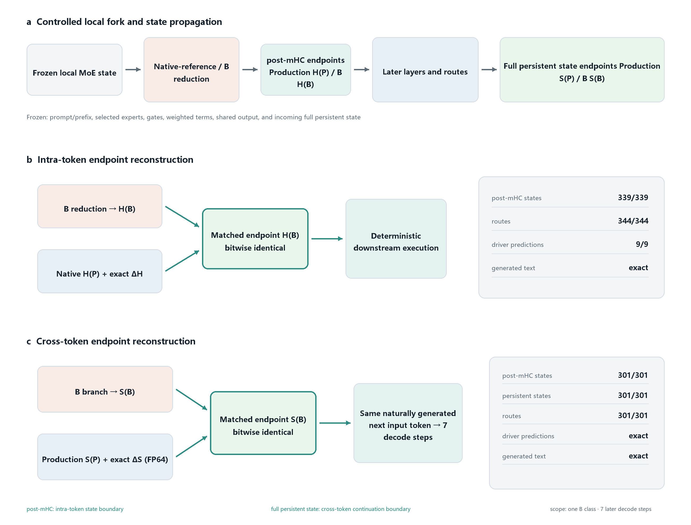
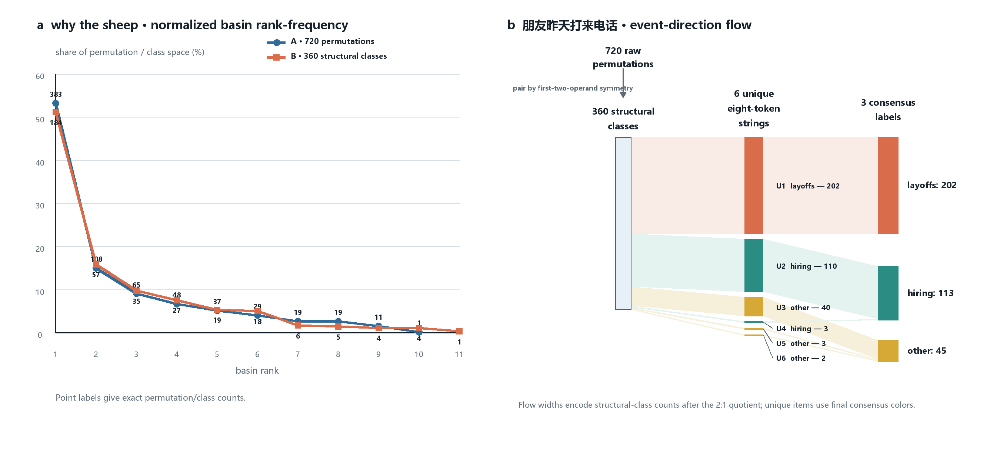

# 从专家归约到行为分歧：追踪稀疏 MoE 推理中的数值状态

\[ BoldFont=texgyrepagella-bold.otf, ItalicFont=texgyrepagella-italic.otf, BoldItalicFont=texgyrepagella-bolditalic.otf \] \[ BoldFont=texgyreheros-bold.otf, ItalicFont=texgyreheros-italic.otf, BoldItalicFont=texgyreheros-bolditalic.otf \] FandolSong-Regular.otf\[BoldFont=FandolSong-Bold.otf\] FandolHei-Regular.otf\[BoldFont=FandolHei-Bold.otf\] FandolFang-Regular.otf

Tianyang Zhu
Independent Researcher
zty749@gmail.com

## 摘要

数学上等价的专家归约顺序可以产生可观察到的不同稀疏混合专家（Sparse MoE）执行结果。我们通过冻结局部 MoE 状态并仅改变聚合语义，在原生 DeepSeek-V4-Flash **（DeepSeek 团队的大型语言模型）**中分离出这一效应。我们设计了四种方案，将操作数表示与累加器精度分离。在第 5 层的一个分叉点，720 个 A 模式顺序产生 10 个延续流域**（basin：数值状态空间中映射到相同延续文本的区域）**；720 个 B 模式顺序形成 360 个精确结构类和 11 个流域。在一个中文提示下，B 类产生了 202 个裁员延续、113 个招聘延续和 45 个其他延续。在最大 $L_{\infty}$ B 分支选择下，一项 50 个提示的探索性广度研究发现，在 8、16 和 32 个 token 时，累积文本分离分别出现在 12、24 和 36 个提示中。在所有持久轨迹中，P32、A 和 B 每种方案改变了所有 192 个原生参考路由轨迹；C 保持了路由、token 序列和文本。一项单独的 192 轨迹 C 检查在按位级别匹配了原生 MoE、mHC 后状态、下一路由器和语言模型状态。对于一个受控的 B 分支，精确的 mHC 后端点重建再现了测量的下游轨迹。一项互补的解码边界干预使用精确的 FP64 **（64 位浮点）**加法增量从生产环境重建了该分支的完整注意力持久状态**（attention-persistent state，即完整持久状态 full persistent state）**。在自然生成的下一个输入保持不变的情况下，301 个下游 mHC 后状态、301 个完整持久状态检查点和 301 个路由在七个解码步骤中完全一致，预测和文本也是如此。这些对照实验将 mHC 后状态识别为 token 内状态边界，将完整持久状态识别为跨 token 延续边界。相同的发射 token 不一定意味着相同的自回归执行状态：分歧可以在 token 边界存活并在稍后变得可见。专家操作数转换、累加器精度和归约顺序应构成稀疏混合专家运行时和硬件后端的数值兼容性契约，而不是可互换的内核细节。这些结果建立了受控条件下的因果可能性，而非实际部署中的发生率。C 方案的顺序不变性仅限于本文评估的六项状态和调度方案。

**关键词**：稀疏混合专家；浮点归约；数值可重现性；确定性推理；运行时一致性；持久状态一致性

## 1 引言

稀疏混合专家模型通过将每个 token 路由到一小部分专家来降低推理成本。对于选定的专家集合，路由输出是专家贡献的加权和。数学表达式对排列顺序不变，但其浮点实现并非如此：即使操作数和门控**（gate）**相同，不同的归约顺序也可能产生不同的有限精度状态。

在静态前馈网络中，微小的数值差异可能在行为上无关紧要。动态 MoE 解码器增加了两个离散决策边界。扰动的隐藏状态被后续的路由器**（router）**消费，当得分边距被跨越时，路由器的 top-k 选择可能改变。由此产生的专家子图随后输入自回归贪婪解码，在贪婪解码中，微小的 logit 差异可以改变下一个 token 以及所有后续状态。因此，专家聚合的归约顺序不一定是低层实现细节：它可以成为模型执行语义的隐藏部分。

自回归执行还包含一个与路由和 token 选择都不同的持久状态**（persistent state）**边界。即使两次执行产生相同的贪婪 token，在前向传播中较早产生的数值差异也可以写入逐层的注意力状态并存活到后续解码步骤。下一个 token 随后从相同的 token 嵌入开始，但消费不同的持久执行状态。这创建了一种延迟输出分歧机制：内部轨迹可以在几个解码步骤中保持不同，直到它们的 logit 差异跨越 argmax 边界。

因此，实现相同模型图和权重但在专家操作数转换、累加器精度或归约拓扑上存在差异的后端不必在行为上兼容。因此，稀疏混合专家后端的资格认证不仅应测试最终 token 的一致性，还应测试内部状态边界处的持久状态、层状态和路由一致性。

本文解决三个研究问题：

- **RQ1** — 归约语义与行为流域。不同的同模式归约顺序如何产生数值、路由和延续分叉**（bifurcation）**？事件方向、视界依赖的广度和确定性重放为这个问题提供了互补证据。
- **RQ2** — 精度契约与兼容性。操作数表示和累加器精度如何分别影响原生兼容性和顺序敏感性？
- **RQ3** — 状态边界的充分性与运行时一致性。哪些内部状态边界足以重现受控的分歧轨迹？特别是，mHC 后端点在解码前向内是否充分，完整持久状态端点在下一个输入 token 保持不变时是否足以跨后续 token 边界重现分支？

我们做出三个相应的贡献：

1. 我们提供了一种跟踪-冻结-分叉干预**（trace-freeze-fork intervention）**，它仅改变专家聚合语义，并将由此产生的 mHC 后状态空间映射到延续文本流域。一个代表性的持久轨迹单独观察了后续的路由边界；事件方向、广度视界和精确重放表征了分支的行为结构。
2. 我们使用 P32/C/A/B 消融和同模式规范参考将操作数表示与累加器精度分离。C 在评估的状态和调度中是稳定的，同时保持原生参考行为。
3. 我们验证了一个受控分支的两个状态边界。精确的 mHC 后端点重建再现了测量的下游 token 内轨迹，而解码边界完整持久状态的精确重建在相同的自然生成的下一个输入 token 下，跨后续解码步骤重现了测量的延续。这些对照实验激发了一个跨越持久状态、层状态、路由和算子级执行的分层运行时一致性过程。

范围是刻意受限的。实验确立了扰动可以产生路由和语义分叉。它们没有测量真实的 GPU、NPU 或分布式运行时自然实现每个排列的频率。它们也没有提供冻结路由的中介对照、精确的量化操作数求和参考或端到端性能测量。

## 2 背景、相关工作和方法论

### 2.1 运行时、模型和解码协议

所有实验均采用 Colibri 项目 [^15] 中的原生 DeepSeek 推理路径，不使用 Transformers 重新实现。本文使用的模型名称是 DeepSeek-V4-Flash [^12]。提示以原始 UTF-8 文本传递，解码采用贪婪方式。

我们使用 DeepSeek-V4-Flash 与原生 Colibri 运行时**（runtime）**，因为它提供了实现级别的控制和对专家聚合、层状态、路由和持久解码状态的直接检测。该研究源于对该运行时中 mHC **（流形约束超连接，manifold-constrained hyper-connections）**传播的检测。检查点的一个有用特性是每个 token 激活六个路由专家**（routed expert）**，使所有 6! = 720 个跨专家归约顺序可通过穷举枚举处理。

该项目主要支持 DSpark **（推测解码系统）**执行路径 [^14]。由于标准检查点在本研究中通过非 DSpark 路径评估，因此需要命令行标志 –no-dspark 作为显式模式切换。它选择非 DSpark 执行；它不表示不同的模型名称。这一区别很重要，因为 DeepSeek-V4-Flash 标识检查点/模型，而 DSpark 和非 DSpark 标识运行时执行路径。

所有运行使用一个原生 Windows CPU 主机。运行时从本地存储流式传输路由专家权重，并在 CPU 上执行评估路径。完整的硬件、内存、编译器、构建标志、亲和性和显式线程重放细节在附录 A.2 中报告。

研究使用两组提示。深度案例是"why the sheep"、"朋友昨天打来电话"和"Morning light filled the room"。广度组包含 25 个英文和 25 个中文提示，仅用作探索性检查，以确认现象不局限于一个提示。

持久轨迹生成八个 token。对于每个提示和请求种子，为每个 MoE 层独立选择一个确定性的层静态排列，然后在该请求中重用。四种聚合方案共享相同的提示、请求种子、实验种子和逐层调度。因此，3 个提示 $\times$ 64 个请求种子定义了 192 个配对的提示-调度条件，每个条件在四种方案下评估：

$$
3\ \text{prompts}\times 64\ \text{schedules per prompt}\times 4\ \text{schemes}=768\ \text{trajectories}.
$$

这里的轨迹**（trajectory）**是指一个方案条件化的端到端八 token 贪婪延续及其路由和文本记录，而不是一个独立排列或一个 token。所有 768 个候选行都成功完成并报告了八个生成的 token。三个生产参考基线（每个提示一个）是比较运行，不包括在 768 中；计算它们得出 771 次原生运行用于持久协议。

### 2.2 背景和执行语义

#### 2.2.1 稀疏 MoE 执行

测试的检查点将每个 token 路由到六个路由专家，并包含一个共享专家**（shared expert）**。对于选定的专家 i，设 $E_{i}(x)$ 表示其专家输出，$g_{i}$ 表示其路由器门控。路由贡献为

$$
v_{i}=g_{i}E_{i}(x).
$$

路由贡献被归约为路由 MoE 输出，之后合并共享专家输出。由此产生的 MoE 输出传递给块的其余部分，因此是隐藏状态轨迹的一部分，而不是终端统计量。

#### 2.2.2 mHC 传播、持久状态和决策边界

在一次解码前向传播中，mHC 状态将 MoE 扰动的影响传递到后续层。在注意力边界处，由此产生的逐层状态还更新持久执行状态，该状态被后续解码步骤重用。这区分了三种边界类型：

1. 潜在状态**（latent state）**边界：当前前向传播中的 mHC 后状态。
2. 持久状态边界：跨解码步骤保留的注意力状态。
3. 决策边界：路由器 top-k 选择和语言模型头 argmax。

扰动可以跨越前两个边界而不跨越 token 决策边界。因此，相同的发射 token 不意味着相同的持久执行状态。路由差异也不自动成为 token 或语义差异。

#### 2.2.3 原生参考聚合路径

受控探针使舍入点显式化。捕获的门控加权项表示为 FP32 **（32 位浮点）**软件值 $v_{i}$；它们的 BF16 **（Brain Floating Point 16，一种 16 位浮点格式）**舍入表示为 $\widehat{v}_{i}=R_{\mathrm{BF16}}(v_{i})$。门控乘法发生在此受控项舍入步骤之前。路由归约在 FP32 容器中累加，在每次加法后进行方案特定的舍入。

共享专家前向路径返回 BF16 舍入的输出，该输出仅在路由和之后添加。所有四种受控方案以相同的固定顺序合并相同的共享操作数，最终的合并输出使用运行时的 BF16 舍入操作转换。因此，方案仅改变下面指定的路由项和路由累加器语义。

运行时在软件中实现 R_BF16。对于有限的 FP32 值，它添加位级偏置 0x7fff + lsb_retained 并清除低 16 位尾数位，即舍入到最近值，平局向偶数舍入**（round-to-nearest, ties-to-even）**；此转换不依赖于主机浮点舍入模式。NaN 和无穷大跳过有限值偏置并清除其低 16 位。FP32 累加在编译的原生路径中使用逐分量 C float 加法。跨专家递归包含独立加法，因此没有跨项融合乘加；门控乘法已在捕获项之前发生。测试构建使用 -O3 -march=x86-64-v3 且不使用 -ffast-math。FTZ/DAZ 未显式配置或记录，次正规数发生率未被检测。因此，下面的结构 B 证明仅限于观察到的有限、非 NaN/非无穷大操作数和所述软件 BF16 舍入规则。

#### 2.2.4 测量层次

我们报告五层等价性：

1. 层状态：在检测的 post-attention 和 post-mHC 状态。
2. 持久状态：解码边界处的完整持久状态。
3. 离散行为：路由器选择和贪婪 token ID。
4. 语义行为：延续文本和事件方向。

不同的内部路由可以保持相同的 argmax token 或稍后重新收敛。流域比例在实验排列或种子度量下测量；它们不是正常的模型后验概率，也不估计真实运行时发生率。

### 2.3 相关工作

最近的大型语言模型推理研究表明，即使在名义上确定性的解码下，数值上不同的执行环境也可能产生不同的输出。Yuan 等人将批次大小、GPU 数量和版本以及数值精度识别为推理非确定性的来源 [^1]。Chodavarapu 和 Xu 表明，KV 缓存和无缓存自回归路径可能分歧，因为它们实现了不同的低精度累加路径 [^2]。该结果激发了对跨 token 状态的关注。我们的受控实验提出了一个互补问题：在局部隔离的专家归约分叉后，分支延续是否可以仅通过恢复完整持久状态端点来重建，同时保持后续执行不变？我们使用直接端点重建，而不是仅从缓存开/缓存关行为差异推断持久性。在软件系统层面，CRADLE 比较多个框架后端并定位传播的不一致性 [^8]，而 NNSmith 使用针对参考后端的差分测试来发现深度学习编译器错误 [^9]。这些工作激发了跨环境审计，但没有在保持局部 MoE 状态固定的情况下隔离跨专家排列。

对于 MoE 模型，MoQE 研究专家鲁棒性与低比特量化之间的相互作用 [^3]，而值和结构对齐明确针对量化引起的 top-k 路由变化 [^4]。这些文献确立了小的数值扰动可以与稀疏路由相互作用。分布式 MoE 系统还将专家调度和组合作为一流的运行时操作：DeepSpeed-MoE 开发了优化的推理和专家并行执行 [^10]，DeepEP 提供低精度的 all-to-all 调度/组合内核 [^11]。我们的干预提出了一个更窄的互补问题：在选定的专家、门控、专家输出、共享输出和前缀状态固定的情况下，有多少行为可以单独归因于排列等价的跨专家归约语义？

一个独立的数值计算文献通过固定累加器、超累加器和确定性并行归约开发可重现或精确的求和 [^5] [^6] [^7]。我们不提出精确求和算法。相反，P32/C/A/B 暴露了哪个操作数和累加器契约与原生参考匹配，B 商在分支枚举之前消除了可证明的第一对对称性。因此，贡献是从归约语义到 MoE 状态、测量的后续路由和贪婪延续的受控链接，而不是新的通用归约原语。

评估的检查点和状态边界遵循 DeepSeek-V4 技术报告 [^12] 和 Xie 等人引入的 mHC 架构 [^13]。DSpark 是推测解码系统 [^14]，而不是模型变体；实验通过 Colibri 的原生非 DSpark 执行路径 [^15] 使用检查点。这些来源定义了模型和软件上下文，而本工作研究一个运行时跨专家组合的数值语义。

### 2.4 实验协议

#### 2.4.1 单层跟踪-冻结-分叉协议

在选定的 MoE 位置，提示前缀、token 位置、分叉层、选定的专家 ID、门控值、六个加权专家项、共享专家输出和完整持久状态保持固定。只有该 MoE 聚合处的排列或聚合方案改变。分叉后，下游 mHC 传播、注意力、路由和贪婪解码正常演化。此协议用于"why the sheep"研究、中文事件方向研究以及 A/B 排列和等价类研究。

对于排列 $\pi$，路由聚合评估为

$$
\displaystyle a_{0}
$$

$$
\displaystyle=+0,
$$
$$
\displaystyle a_{j+1}
$$

$$
\displaystyle=\operatorname{Accumulate}\!\left(a_{j},v_{\pi_{j}}\right).
$$

#### 2.4.2 mHC 后状态替换对照

为了测试单层归约干预的下游效应是否完全由其 mHC 后端点捕获，我们使用一个已编目的"why the sheep"方案 B 类（类 135）在第 5 层。在分叉点，未修改的原生参考（生产）mHC 后状态 $H_{P}$ 和选定的 B mHC 后状态 $H_{B}$ 都在正常 BF16 往返后捕获，端点扰动定义为

$$
\Delta H=H_{B}-H_{P}.
$$

在第二个进程中，归约探测和分叉被禁用。运行时遵循原生参考路径并在相同的层和解码位置，在 FFN hc_post 及其 BF16 往返后，执行一次字面 FP32 H_P += $\Delta H$。加法前，运行时要求原生参考状态按位匹配捕获的 $H_{P}$；加法后，它要求重建的状态按位匹配 $H_{B}$。它不将 $H_{B}$ 复制到结果上。

仅解码分叉发生在消费第一个发射 token（token 477，位置 3）时，而不是在该 token 从提示预填充状态发射之前。我们生成九个驱动 token，以便前八个发射 token 各自由解码前向处理。从注入边界开始，我们比较每个 mHC 后状态（339 个 16,384 FP32 值的向量）。我们还比较八个解码前向中的所有 344 个路由器选择、生成的 token ID 和生成的文本。八个处理的解码输入产生 8 $\times$ 43 = 344 个路由检查点。因为注入跟随第一个前向的第 5 层 mHC 后端点，mHC 后比较包括该端点和第 6-42 层加七个完整前向：38 + 7 $\times$ 43 = 339 个检查点。因此，这是一个单层分支的端点状态替换对照，而不是声称操作数级 B 归约等价于任意隐藏状态噪声，或持久 B 调度可以折叠为一个扰动。

端点门控轨迹不包括其第一个解码前向中第 5 层分叉之前的层。因此，我们在相同位置运行单独的双进程分叉前对照：一个进程重放 B 分支，另一个使用禁用探测的原生参考执行。跟踪模式在两个执行到达干预边界之前记录第 0-4 层的 mHC 后状态，并比较它们的元数据、FP32 字节、最大绝对差和 SHA-256 指纹。

Figure 1: 一个 B 类的两个互补端点对照。精确 mHC 后重建匹配分支端点和下游轨迹，建立了 token 内状态边界。在后续解码边界处，完整持久状态的精确 FP64 加法重建匹配分支端点；在相同的独立生成的下一个输入 token 下，301/301 下游 mHC 后状态、301/301 完整持久状态检查点和 301/301 路由在七个后续解码步骤中一致，驱动预测和生成文本也是如此。对照改变端点，而非后续执行。

#### 2.4.3 解码边界持久状态替换对照

为了测试受控的归约路径差异如何跨 token 边界存活，我们对同一 B 类 135 执行第二次端点重建。干预放置在位置 3 完成所有 43 层后的解码边界处。

完整持久状态是注意力子系统为后续解码步骤保留的所有浮点运行时状态。在评估的运行时中，它包括窗口 KV、活动压缩 KV、压缩器状态和索引器状态，按层顺序在相同逻辑布局下序列化。排除分配填充和指针。位置 3 端点包含 5,883,008 个 FP32 值。设 $S_{P}$ 和 $S_{B}$ 表示生产和 B 分支端点。我们定义

$$
\Delta S=S_{B}-S_{P}.
$$

第三个进程遵循生产路径直到位置 3 并将 $\Delta S$ 添加到其完整持久状态。尽管两个端点都是 FP32，但在 FP32 中减去它们可能丢弃在后续加法后恢复目标所需的低位：字面 FP32 增量仅按位重建 10/43 个层状态。因此，我们从 FP32 端点在 FP64 中计算 $\Delta S$，在 FP64 中加法，并将重建的端点转换回其运行时 FP32 表示。这按位恢复所有 43 个层状态。运行时要求加法前状态匹配 $S_{P}$，加法后状态匹配 $S_{B}$；它不将 $S_{B}$ 复制到活动状态。

FP64 增量仅是精确的干预表示。它不是紧凑的检查点格式，其成功并不意味着分支端点包含的信息少于直接存储的端点。给定 $S_{P}$，精确增量在信息上足以指定 $S_{B}$；对照测试端点充分性，而非压缩。

注入发生在位置 3 完成后，因此它不能改变该前向或其已完成的预测。分支和生产必须首先独立选择相同的下一个驱动 token；没有 token 被强制。从位置 4 开始，执行七个后续解码输入，同时比较每个记录的 mHC 后检查点、完整持久状态检查点、路由器选择、预测的 token ID 和生成的文本。结果涉及完整持久状态，而非仅最近的窗口 KV 行。七个注入后解码输入产生 7 $\times$ 43 = 301 个层检查点用于每个 mHC 后、完整持久状态和路由比较。

#### 2.4.4 长形式事件方向扩展

对于中文提示"朋友昨天打来电话"，我们通过从结构类中确定性分层随机抽样选择十个方案 B 分支，使用记录的选择种子并从每个临时事件方向抽取五个分支。没有使用定性内容标准在合格分支中选择。采样的分叉在第 5 层，每个分支从原始八 token 轨迹扩展到 64 个生成 token。用于样本选择的基于规则的编码将 202 个类分配给裁员，110 个分配给招聘，48 个分配给其他延续。人类共识后来将三个其他类更正为招聘，得出 202 个裁员、113 个招聘和 45 个其他类。样本本身是确定性分层样本，而非事件率估计。

标注单位是六个唯一的精确八 token 延续，而非 360 个结构类。在标注前折叠精确重复字符串，并通过记录的分支到项目表通过精确文本映射将结果标签随后扩展到类。盲表要求招聘、裁员或其他，其中其他包括不确定或不完整的延续，未明确建立任一劳动力方向。它省略分支 ID、分支频率、类多重性和临时标签。不一致将使共识字段保持空白等待裁决；未发生。工件保留两个完成的标注列但没有标注者身份或语言背景元数据；因此我们不声称它独立验证这些属性。

#### 2.4.5 持久层静态协议

对于每个提示和请求种子，为每个 MoE 层独立选择确定性排列并在该请求的所有 token 位置重用。四种方案共享提示、请求种子、实验种子和逐层调度。配对控制逐层排列调度，而非轨迹分歧后的下游专家操作数。分歧后，隐藏状态、选定专家、门控和加权项不共享。如第 2.1 节所定义，协议有 192 个配对提示-调度条件和 768 个方案条件化的八 token 轨迹。三个提示级原生参考基线是附加的并被排除。

#### 2.4.6 同模式规范参考协议

规范参考为每个聚合方案和三个深度提示中的每一个固定恒等排列。它将改变聚合方案引起的偏移与模式内顺序敏感性分离。因此，规范实验包含 3 个提示 $\times$ 4 个方案 = 12 个八 token 轨迹。

| 协议 | 状态范围 | 干预范围 | 调度或分支 | 长度 |
| --- | --- | --- | --- | --- |
| 单层排列 | 一个固定的 token/层状态 | 一个 MoE 聚合 | 所有 A 排列 / B 结构类 | 8 tokens |
| mHC 后替换 | 一个固定的 B 类端点 | 一个加法 mHC 后扰动 | B 类 135 对比原生参考 + 精确端点增量 | 8 个处理的解码 token；9 个驱动输出 |
| 持久状态替换 | 完整的位置 3 解码边界跨 43 层 | 精确 FP64 加法完整状态重建 | B 类 135 对比原生参考 + 精确端点增量 | 7 个后续解码输入；9 个驱动输出 |
| 事件方向扩展 | 一个固定的中文分叉 | 一个 MoE 聚合 | 10 个选定的 B 类 | 64 tokens |
| 持久干预 | 完整请求 | 每个 MoE 层 | 64 个种子/提示；192 个配对提示-调度 $\times$ 4 方案 | 8 tokens |
| 规范参考 | 完整请求 | 每个 MoE 层 | 恒等顺序 | 8 tokens |

#### 2.4.7 提示和分叉选择状态

深度提示和第 5 层分叉是探索性发现案例；它们不存在前瞻性预注册或留出选择记录。第 5 层在单层和广度脚本中统一硬编码，并未针对每个提示单独优化。FORK_TOKEN=-1 表示在运行时选择第一个合格的仅解码事件，而非预先选择 token ID。原生日志报告"why the sheep"的分叉 token ID 477 和"朋友昨天打来电话"的 303。持久和规范实验没有局部分叉，因为它们在每个 MoE 层应用其调度。

| 提示集 | 来源和状态 | 单层分叉 | 持久/规范使用 |
| --- | --- | --- | --- |
| "why the sheep" | 探索性深度案例 | 第 5 层；记录的分叉 token 477 | 已包括；无局部分叉 |
| "朋友昨天打来电话" | 目录 ID 41；探索性深度/事件案例 | 第 5 层；记录的分叉 token 303 | 已包括；无局部分叉 |
| "Morning light filled the room" | 目录 ID 4；探索性深度案例 | 未使用 | 已包括；无局部分叉 |
| 50 提示广度集 | 固定 prompt_breadth_50.tsv；探索性 | 第 5 层；第一个合格的仅解码事件；注入最大 $L_{\infty}$ B 分支 | 未使用 |

广度文件在运行前作为批处理输入固定，包含 25 个英文和 25 个中文提示：40 个普通自然提示和 10 个专门构建的敏感性候选。脚本验证此组成，使用实验种子 20260722，不执行自适应提示替换，并在每个捕获状态枚举 360 个 B 结构类，然后注入最大 $L_{\infty}$ 分支。双语子集未按 token 计数匹配，因此语言计数是描述性的而非受控的跨语言比较。

### 2.5 四种聚合方案

设 $v_{i}$ = $g_{i}$ $E_{i}(x)$，设 $\widehat{v}_{i}=R_{\mathrm{BF16}}(v_{i})$，设 $R_{\mathrm{FP32}}$ 表示受控探针使用的 FP32 容器更新。对于排列 $\pi$，四种方案为：

| 方案 | 专家操作数 | 跨专家累加器 | 用途 |
| --- | --- | --- | --- |
| P32 | FP32 项 | FP32 | 反事实更高操作数精度对照 |
| C | BF16 舍入项，精确提升到 FP32 | FP32 | 具有保护累加的类原生操作数 |
| A | FP32 项 | 每次加法后 BF16 舍入 | 累加器精度对照 |
| B | BF16 舍入项 | 每项和加法后 BF16 舍入 | BF16 原生聚合对照 |

更明确地说，使用零初始累加器：

$$
\displaystyle\mathrm{P32}:\quad a_{0}
$$

$$
\displaystyle=+0_{\mathrm{FP32}},
$$
$$
\displaystyle a_{j+1}
$$

$$
\displaystyle=R_{\mathrm{FP32}}\!\left(a_{j}+v_{\pi_{j}}\right),
$$
$$
\displaystyle\mathrm{C}:\quad a_{0}
$$

$$
\displaystyle=+0_{\mathrm{FP32}},
$$
$$
\displaystyle a_{j+1}
$$

$$
\displaystyle=R_{\mathrm{FP32}}\!\left(a_{j}+\mathrm{FP32}(\widehat{v}_{\pi_{j}})\right),
$$
$$
\displaystyle\mathrm{A}:\quad a_{0}
$$

$$
\displaystyle=+0_{\mathrm{BF16}},
$$
$$
\displaystyle a_{j+1}
$$

$$
\displaystyle=R_{\mathrm{BF16}}\!\left(\mathrm{FP32}(a_{j})+v_{\pi_{j}}\right),
$$
$$
\displaystyle\mathrm{B}:\quad a_{0}
$$

$$
\displaystyle=+0_{\mathrm{BF16}},
$$
$$
\displaystyle a_{j+1}
$$

$$
\displaystyle=R_{\mathrm{BF16}}\!\left(\mathrm{FP32}(a_{j})+\mathrm{FP32}(\widehat{v}_{\pi_{j}})\right).
$$

P32 和 C 之间的区别至关重要。C 不保留原始 FP32 专家项；它首先将每个项舍入到 BF16，然后在 FP32 中精确表示该 BF16 值用于累加。方案 C 不作为新的精确求和算法引入。它指定了 BF16 操作数/FP32 累加器执行契约，该契约在所有评估状态上匹配原生参考路径。

设 s 表示原生前向路径返回的共享专家输出；s 已经是 BF16 舍入的并在 FP32 软件容器中精确表示。每个方案在路由归约后应用相同的共享专家合并：

$$
y_{m}=R_{\mathrm{BF16}}\!\left(a_{6}^{m}+\mathrm{FP32}(s)\right),\qquad m\in\{\mathrm{P32},\mathrm{C},\mathrm{A},\mathrm{B}\}.
$$

B 实现在此合并前冗余地对 s 应用 $R_{\mathrm{BF16}}$。因为 s 已经是 BF16 舍入的，该操作按位幂等且不改变共享操作数。方程指定受控探针契约而非通用硬件浮点语义。

### 2.6 单层排列和等价类

单层干预枚举 A 的所有 720 个排列。对于 B，720 个原始排列包含结构对称性。如果 BF16 舍入项是 $x_{1},\ldots,x_{6}$ 且 $x\oplus y$ 表示 BF16 舍入加法，则

$$
0\oplus x_{i}=x_{i}.
$$

$$
x_{i}\oplus x_{j}=x_{j}\oplus x_{i}.
$$

因此，交换前两个操作数使第二步累加器按位保持不变，之后后缀相同。在测试的有限操作数、固定 BF16 舍入、逐分量加法、零初始化以及无 NaN/Inf 或特殊有符号零分类下，B 因此有 720 / 2 = 360 个精确结构等价类。实验分别报告原始排列计数、结构类计数和观察到的唯一 MoE 输出。类加权和原始排列加权的流域比例一致，因为每个类恰好包含两个原始排列且未观察到额外碰撞。

### 2.7 原生参考和同模式规范参考

我们使用两个参考来回答不同的问题。原生参考 Y_ref 测试重放是否保持未修改参考路径的行为。同模式规范参考 Y_(m,$\pi_{0}$) 为每个聚合方案 m 固定恒等排列 $\pi_{0}$。模式内顺序敏感性测量为

$$
D_{\mathrm{order}}(m,\pi)=D\!\left(Y_{m,\pi},Y_{m,\pi_{0}}\right).
$$

这将改变聚合方案引起的偏移与在该方案内改变顺序引起的偏移分离。

### 2.8 可重现性和制品范围

制品包括脚本、原始结果索引、派生支持表、标注记录和基于哈希的重放清单；附录 A 提供完整索引。

运行时记录包括提示词 ID、模式、种子、层调度、路由跟踪、token ID 和哈希、生成文本、退出码和日志路径。重放清单还固定了显式线程配置，并记录运行时、检查点、分词器、编译器、主机和亲和性元数据。原始日志、完整张量、路由跟踪和模型文件保留在面向论文的支持集之外。

有序 token ID 是延续相等性的权威依据。生成文本被解析为标记分隔的多行记录：早期的单行提取器截断了嵌入的换行符，低估了扩展广度文本分离。修正后的 Python 分析还通过稳定的提示词 ID 连接分阶段运行，这样重复的后续视野行不会被计为新事件。广度协议禁用了直接的下一路由器比较，因此报告为 mHC 后和文本分离，而非路由分歧。

## 3 结果

### 3.1 原生参考重放正确性

原生参考重放检查覆盖 13 个提示词。每次重放都保留了参考路由轨迹、贪婪 token 序列和生成文本，c\_moe\_max\_abs = 0。这确立了后续差异不是由损坏的提示词或重放工具引起的。因此，在解释任何聚合扰动之前，都会检查未修改的原生参考。

### 3.2 单一归约干预创建状态到文本的流域

在"why the sheep"单层实验中，方案 A 枚举了 720 个原始排列并产生 10 个不同的延续文本。方案 B 通过 360 个精确结构类覆盖 720 个原始排列，并产生 11 个不同的文本。每个评估的分支都产生与原生参考不同的 mHC 后状态：720/720 个 A 排列和 360/360 个 B 结构类，具有相同数量的不同 mHC 后状态。这些扫描中禁用了直接的下一路由器比较，因此该实验不为每个分支分配路由分歧标签。尽管如此，大型数值分支空间压缩为小得多的文本流域集。

| 方案 | 原始排列 | 精确结构类 | 不同的 MoE 输出 | 不同的 mHC 后状态 | 不同的文本 |
| --- | --- | --- | --- | --- | --- |
| A | 720 | 720 | 720 | 720 | 10 |
| B | 720 | 360 | 360 | 360 | 11 |

形式化地，对于分支集 Π\_m 和文本映射 f: Π\_m $\rightarrow$ T，文本 t 的流域是 B\_t = f⁻¹(t)，其报告的体积是相关排列或类测度下的 —B\_t—。在这次扫描中，它具体是 mHC 后状态到文本的流域压缩：许多不同的内部状态映射到相同的延续。下面的持久实验单独测量完整路由轨迹。流域体积不是后验概率、几何体积或部署频率估计。

#### 3.2.1 代表性持久调度数值到文本传播跟踪

本小节报告一个单独的持久层静态实验，而非第 3.2.2 节中使用的第 5 层单层分叉。为了直接展示传播链，我们重新运行了一个已编目的持久条件："why the sheep"，方案 B，请求种子 0。原生参考和候选使用相同的提示词和检查点。方案 B 归约语义在确定性层静态调度下的每个 MoE 层都处于活动状态，该调度已在持久表中表示；这不是事后调度搜索。在最后一个提示词位置（位置 2），跟踪捕获第 2 层 MoE 和 mHC 输出、第 3 层路由器分数和选定的专家，以及第一个 LM logits。然后路由和 token 记录继续遍历所有八个生成的 token。

| 阶段 | 原生参考 | B，种子 0 | 观察到的差异 |
| --- | --- | --- | --- |
| 第 2 层 MoE 输出 | 捕获的 FP32 向量 | 捕获的 FP32 向量 | 不按位相等；最大 $L_{\infty}$ = 0.0375366211 |
| 第 2 层 mHC 后状态 | 捕获的 FP32 向量 | 捕获的 FP32 向量 | 不按位相等；最大 $L_{\infty}$ = 0.0307998657 |
| 第 3 层路由器 | top-6 {44, 93, 172, 174, 202, 225}；rank-6/7 边距 0.00335884094 | top-6 {44, 93, 143, 172, 174, 202}；rank-6/7 边距 0.000484466553 | 分数最大 $L_{\infty}$ = 0.01445961；选定的专家集改变一项：143 进入，225 离开 |
| 首位置 LM logits | argmax token 477；rank-1/2 边距 0.382600784 | argmax token 477；rank-1/2 边距 0.446601868 | 最大 $L_{\infty}$ = 0.626680374，但第一个贪婪 token 不变 |
| 第一个改变的生成 token | 序数 5：token 11885 | 序数 5：token 5477 | 前四个生成的 token ID 一致；第五个不同 |
| 八个 token 的延续 | "are not in the fold. The sheep" | "are not in the pen. The sheep" | 不同的贪婪延续 |

这个代表性跟踪展示了传播序列的开始和可见结束：数值 MoE 差异 $\rightarrow$ mHC 后差异 $\rightarrow$ 后续路由差异 $\rightarrow$ 延迟的 token/文本差异。第 3.2.3 节中的持久状态重建提供了对先前未观察到的跨 token 链接的互补干预：潜在分歧 $\rightarrow$ 解码边界持久状态分歧 $\rightarrow$ 持续的潜在/路由分歧。这些边界必须单独报告：第 3 层路由在第一个 LM argmax 之前改变，而贪婪序列直到生成 token 序数 5 才分离。该跟踪没有确立路由是唯一的因果中介，因为没有执行冻结路由对照。

#### 3.2.2 精确 mHC 后端点替代重现测试的下游轨迹

对于"why the sheep"B 类 135，探针运行内部捕获的原生参考状态与禁用探针的原生参考运行在第 5 层位置 3 按位匹配。存储的端点差异 $\Delta H$ 的字面 FP32 加法（其最大绝对分量为 0.001953125）按位重建了 B 的 mHC 后端点；在所有 16,384 个值中，最大重建误差为零。

在单独的分叉前对照中，B 重放和禁用探针的原生参考重放在所有五个前面的 mHC 后检查点（第 0-4 层，使用基于零的层索引）按位相同。每个检查点包含 16,384 个 FP32 值，所有五个最大绝对差异均为零，且配对的 SHA-256 指纹一致。这测量而非假设两次执行在该解码前向中从相同的早期层轨迹进入第 5 层分叉。

在该边界之后，B 归约运行和原生参考加 $\Delta H$ 运行对于覆盖第一次解码前向其余部分和七次完整后续解码前向的所有 339 个记录的 mHC 后向量保持按位相同。所有 344 个比较的路由器选择、所有九个驱动 token ID 和生成文本也完全一致。九个输出仅用于处理八个发出的 token；第九个是处理第八个 token 后产生的预测。

| 对照段 | 比较的执行 | 测量覆盖范围 | 结果 |
| --- | --- | --- | --- |
| 分叉前轨迹 | B 重放对比禁用探针的原生参考 | 位置 3，第 0-4 层 mHC 后 | 5/5 个向量按位相同；最大 $L_{\infty}$ = 0 |
| 干预端点 | 捕获的 B 端点对比原生 $H_{P}$ + $\Delta H$ | 位置 3，第 5 层 mHC 后 | 16,384/16,384 个 FP32 值按位相同；重建误差 = 0 |
| 边界后潜在轨迹 | B 分支对比原生参考 + $\Delta H$ | 第 5 层端点、第 6-42 层和七次完整的后续前向 | 339/339 个 mHC 后向量按位相同；每个最大 $L_{\infty}$ = 0 |
| 路由和可见输出 | 在完整测量视野上的相同配对 | 344 个路由检查点、九个记录的驱动预测和生成文本 | 完全一致 |

这验证了对一个固定单层分支的预期状态等价声明：一旦在相同前缀和匹配的完整持久状态下到达相同的 mHC 后端点，在评估视野上测量的确定性下游执行是相同的。它没有建立在 token 477 之前的提示词最后状态注入的等价性，对于解析传播的预舍入 MoE 增量的等价性，或对于引入后续新扰动的持久 B 干预的等价性。

#### 3.2.3 精确解码边界持久状态重建重现分支延续

在位置 3 之后的解码边界，B 类和生产完整持久端点在 5,883,008 个 FP32 值中有 131,444 个不同。所有非零差异发生在下游 37 层第 6-42 层；第 0-5 层保持按位相同，最大绝对分量差异为 1.0。这种拓扑与第 5 层分叉发生在该层的注意力状态已经提交之后是一致的。

$\Delta S$ 的字面 FP32 编码仅按位重建 10/43 个层记录。相比之下，FP64 编码的差异按位重建所有 43 个层记录。注入的运行时在加法前后独立验证精确的生产和分支端点；捕获的 B 端点未被复制到活动状态。

分支和生产运行在此边界预测相同的下一个驱动 token，无需强制。从该共享 token 开始，B 运行和生产加 $\Delta S$ 运行对于七个解码输入上的所有 301 个记录的 mHC 后状态和所有 301 个后续完整持久状态检查点按位相同。所有 301 个比较的路由器选择、所有九个记录的驱动预测和生成文本也一致。这九个预测包括一个提示词预填充预测、注入前完成的位置 3 预测，以及注入后前向产生的七个预测。只有最后七个落在干预的因果视野内；所有九个作为整体运行一致性检查报告。未修改的生产延续与分支延续不同，确认重建的轨迹不仅仅是原生参考轨迹。

对于该分支和测量的视野，重建的完整持久状态端点在评估的解码边界处与 B 端点延续等价，以独立匹配的下一个 token 和确定性执行环境为条件。这确立了端点充分性，而非计算历史的唯一性：原则上，不同的先前计算可以到达相同的端点。它没有显示 $\Delta S$ 可以改变注入前完成的预测，FP32 增量通常是可逆的，或仅窗口 KV 视图是足够的。

### 3.3 相反事件方向的延续

对于"朋友昨天打来电话"，B 全分支输出包含 360 个结构类。从盲六项表单收集的两个标注列在所有六个唯一延续上达成一致（6/6；Cohen's kappa = 1.0）。鉴于项目计数很小，kappa 作为描述性报告而非强统计证据。然后，六个共识标签通过精确文本映射扩展到 360 个类，将 202 个分配给裁员，113 个分配给招聘，45 个分配给其他。这些映射的类行是流域体积核算，而非 360 个独立标注单元。没有分歧需要裁决。相对于临时规则，分支 95、119 和 244 从其他移动到招聘。类计数不是模型概率或实际硬件频率。

为了测试方向是否在短前缀之后持续，我们在各自的方向层内随机抽样了五个裁员类和五个招聘类，使用选择种子 20260723。因此，这十个分支不是在检查其长篇故事后选择的。分支干预保持在第 5 层的 B 模式，具有原始提示词和分叉设置；仅生成限制从 8 增加到 64 个 token。

| 分支 | 方向 | 中文延续 | 英文翻译 |
| --- | --- | --- | --- |
| 270 | 裁员 | ，说他们公司要裁员，他可能被裁掉，心里很烦。我劝他，现在经济不景气，很多公司都在裁员，你被裁了，正好可以休息一段时间，再找新的工作。他听了我的话，心情好多了。 | …, saying that his company was going to lay people off and that he might lose his job. He was very upset. I advised him that the economy was weak and many companies were laying people off; if it happened, he could take a break and then find another job. He felt much better after hearing this. |
| 243 | 招聘 | ，说他们公司要招人，问我要不要去。我还在考虑，毕竟现在的工作也还行，但那边给的待遇确实不错。"哦？什么公司？""一家做人工智能的初创公司，老板是海归，技术挺厉害的。" | …, saying that his company was hiring and asking whether I wanted to join. I was still considering it because my current job was fine, although the compensation there was attractive. "What company?" "An AI startup; the founder returned from overseas and is technically very strong." |

所有十个随机抽样的分支都产生了 64 个 token 的延续。五个裁员样本中的每一个都保留了明确的劳动力收缩语言，五个招聘样本中的每一个都保留了明确的劳动力扩张语言。所有十个延续在文本上都是不同的；除了共享的招聘或裁员方向之外，每个都遵循不同的叙事发展，具有分支特定的对话、情境细节和情感框架。附录 B.1 报告了所有十个完整的流式延续；上面的两个双语行说明了随机抽样集，而非额外的标注单元。

这些分支在不确定的提示词下展现了事件极性分叉：相同的实体和时间框架接收相反的劳动力方向延续。六项标注和 10 轨迹扩展支持在受控 B 类测度下的相反事件方向解释；它们不是大样本语义评估。

图 2：面板 a 比较了"why the sheep"分叉的归一化延续流域秩频率分布；点标签保留精确的 A 排列和 B 结构类计数。在面板 b 中，中文提示词实验首先通过前两个操作数对称商将 720 个原始 B 排列减少到 360 个结构类。冲积图宽度仅从 360 类测度开始，并继续通过六个唯一的八 token 字符串到最终共识的裁员、招聘和其他体积。唯一项按其共识标签着色，使 110 + 3 = 113 个招聘类显式化。

### 3.4 长篇分支的确定性重放

为了排除运行到运行的非确定性作为长篇叙事变化的解释，我们使用相同的提示词、分叉层、等价类、归约调度、模型检查点和运行时配置重放了十个分层随机方案 B 分支两次。所有 20 个原生运行成功完成并生成 64 个 token。十个重放对中的每一个都产生了相同的 token ID 序列和匹配的 SHA-256 摘要。因此，长篇延续中观察到的差异是分支条件的且可重现的，而非不受控解码随机性的后果。比较使用有序 token ID 和其规范逗号连接序列的 SHA-256 哈希，这比文本相等性更严格。附录 B.2 给出重放摘要；附录 A 标识完整的配对和环境元数据。

这确立了测试的 64 token 视野和十个固定分支条件的精确可重放性。它不证明所有 360 个分支必然可重现，更改的硬件、线程计数或编译器保留按位输出，分支 ID 在模型版本间保持有效，所有更长生成长度保持永久确定性，或重放已建立跨平台确定性。精确的声明是十个代表性分支的精确可重放性，每个运行两次，在相同的原生运行时执行环境中。

事件方向制品包含基于规则的临时标签、两个完成的标注列和十个扩展代表。发布的表验证了六个唯一项的标签完整性和一致性，但不保留标注者身份或语言背景元数据。较大的裁员流域应仅被解释为受控排列测度下的较大流域。它不是语料库频率、后验概率或部署行为预测。重放审计同样限于测试的 64 token 轨迹的精确可重复性。

## 6 结论

对稀疏 MoE 专家归约顺序的受控更改可以选择不同的确定性执行轨迹。在测试的 DeepSeek-V4-Flash 原生运行时中，单层 mHC 后状态压缩为更小的延续文本流域集，而持久实验表现出路由和文本轨迹分歧。B 模式事件方向扩展在一个不确定的提示词下产生不同的招聘和裁员延续。配对重放审计显示，这些长篇差异在相同的原生执行环境下对十个分层随机分支是可重现的。方案 C 进一步在评估的数值、路由和文本级别匹配原生参考路径，支持 BF16 操作数语义与 FP32 累加作为范围稳定化契约。

对于评估的分支，传播链可以从受控归约通过 mHC 后状态、后续路由和完整持久状态进行跟踪，然后作为延迟 token 差异变得可见。在 mHC 后和持久状态边界的精确重建重现了测量的下游轨迹。因此，mHC 后状态是有用的 token 内一致性边界，而完整持久状态提供了跨 token 运行时诊断的实用第一线边界。

这些结果促使将数值一致性视为状态转换契约的层次结构，而非仅仅输出级测试。实用的后端资格可以从解码边界持久状态指纹开始，并通过层状态、路由和算子级算术逐步定位分歧。所提议的程序仍然受制于匹配状态和确定性执行，并且在此未进行跨后端验证。

对于运行时和硬件设计者，实际含义是明确指定跨专家操作数表示、累加器精度和合并排序，并针对数值、路由和 token 级参考行为验证后端迁移。

分阶段广度扩展进一步显示，即使在短延续保持相同之后，累积文本分离也可以随生成视野大幅增加。这些发现是执行环境特定的，不建立通用的跨平台确定性或实际部署频率。

## 附录 A 制品和可重现性清单

本附录标识审计每个报告计数所需的面向论文的制品。命令从仓库根目录运行，带有显式的 –model-path；原始日志和模型文件保留在仓库之外。完整的命令行和收集注意事项在 docs/experiments/v4-paper-reproducibility.md 中给出。### A.1 协议索引

| 协议 | 提示词或选择输入 | 种子或调度表 | Python 入口点 | 面向论文的输出 |
| --- | --- | --- | --- | --- |
| 原生重放 | 13 个固定重放提示词 | 原生顺序 | 运行时重放审计 | Section 3.1 计数 |
| 单层 A/B 分叉 | why the sheep，第 5 层 | A：720 种排列；B：360 种结构类别 | tools/run\_v4\_branch\_sweep.py | basin\_counts.tsv |
| mHC 后替换 | why the sheep，B 类别 135，第 5 层 | 5 个预分叉层检查点；8 个处理后的解码输入 | tools/run\_v4\_mhc\_equivalence.py | mhc\_equivalence\_summary.tsv, mhc\_prefork\_equivalence.tsv, mhc\_equivalence.tsv |
| 持久状态替换 | why the sheep，B 类别 135，位置 3 边界 | 7 个后续解码输入 | tools/run\_v4\_kv\_equivalence.py | kv\_equivalence\_summary.tsv, kv\_equivalence\_layers.tsv, kv\_equivalence.tsv |
| 事件方向 | 朋友昨天打来电话，第 5 层 | 10 个选定的 B 类别；每个类别两次 64-token 运行 | tools/run\_v4\_event\_direction\_replay.py | event\_direction\_counts.tsv, replay\_branches.tsv, replay\_pairs.tsv |
| 广度 | prompt\_breadth\_50.tsv | 分阶段 8/16/32-token 范围 | tools/run\_v4\_prompt\_breadth.py, tools/recompute\_v4\_breadth\_text\_stats.py | breadth\_summary.tsv |
| 持久 | 三个深度提示词 | 种子 20260722；每个提示词 64 个成对的层静态调度表 | tools/run\_v4\_persistent\_random.py | persistent\_ablation.tsv |
| 同模式规范 | 三个深度提示词 | 每个方案的恒等顺序 | tools/run\_v4\_canonical\_reference.py | canonical\_reference.tsv |
| C 中间 | 三个深度提示词 | 种子 20260722；每个提示词 64 个 C 调度表 | tools/run\_v4\_intermediate\_check.py | c\_intermediate\_summary.tsv, propagation\_trace.tsv |

最后一列中的所有面向论文的文件名均相对于 docs/experiments/v4-paper-support/。支持 README 定义了它们的列并将每个表映射到相应的结果部分。主要模式记录协议标识符和分母、分歧或按位相等计数、适用的 $L_{\infty}$ 摘要，以及 token 序列或 mHC 状态的不可变 SHA-256 值。完整的 token 序列、张量、路由跟踪、长延续、原生日志和模型分片被有意排除。

### A.2 环境与身份

| 组件 | 评估配置 |
| --- | --- |
| CPU | AMD Ryzen AI MAX+ 395，16 核 / 32 硬件线程 |
| 已安装 GPU | AMD Radeon 8060S；未被评估的运行时路径使用 |
| 系统内存 | 128 GiB |
| 运行时内存选项 | –ram 32；规划器预算，而非操作系统强制的 RSS 限制 |
| 操作系统 | Windows 11 x64，NT 10.0.26200 |
| 工具链 | MSYS2 UCRT64 GCC 16.1，目标 x86\_64-w64-mingw32 |
| 编译标志 | \-O3 -march=x86-64-v3 -fopenmp；无快速数学标志 |
| 评估执行 | 原生 Windows CPU 运行时；权重和计算流保留在 CPU 上 |

通用采集运行继承了操作系统调度器且未固定线程。仅确定性 64-token 重放固定了 OMP\_NUM\_THREADS=32、OMP\_DYNAMIC=FALSE 和 PIPE\_WORKERS=8；这些设置不得推断用于其他协议。replay\_environment.tsv 记录了该重放配置以及 CPU/OS 身份、亲和性策略、运行时提交和二进制 SHA-256、检查点修订版本和清单 SHA-256，以及分词器文件 SHA-256 值。这些哈希值在不重新分发检查点或分词器的情况下识别测试环境。原始输出可以放置在任何外部目录中；它们的位置不是实验语义的一部分。

### A.3 审计边界

paper-support 目录足以验证已发布的聚合声明，但其本身不足以重新运行原生推理。完整的重新运行还需要检查点、编译的运行时、提示词和分支输入，以及外部输出目录。广度审计将更正后的多行重新分析文件视为权威，并通过稳定的提示词 ID 去重后期阶段事件。Python 声明审计脚本在提交前检查支持表和可用的根结果。

### A.4 完整的面向论文文件索引

采集和验证入口点：

- tools/run\_v4\_branch\_prompt.py
- tools/run\_v4\_branch\_sweep.py
- tools/run\_v4\_prompt\_breadth.py
- tools/recompute\_v4\_breadth\_text\_stats.py
- tools/run\_v4\_persistent\_random.py
- tools/run\_v4\_canonical\_reference.py
- tools/run\_v4\_intermediate\_check.py
- tools/run\_v4\_mhc\_equivalence.py
- tools/run\_v4\_kv\_equivalence.py
- tools/run\_v4\_event\_direction\_confirmation.py
- tools/run\_v4\_event\_direction\_replay.py
- tools/apply\_v4\_event\_direction\_annotations.py
- tools/score\_v4\_event\_direction\_annotation.py
- tools/audit\_v4\_paper\_claims.py
- tools/build\_v4\_paper\_pdf.py

论文使用的标注、提示词和原始结果索引：

- prompt\_breadth\_50.tsv
- v4\_event\_direction\_annotation.tsv
- v4\_event\_direction\_annotation\_unique\_blind.csv
- v4\_event\_direction\_annotation\_unique\_map.csv
- v4\_event\_direction\_random5\_64.tsv
- v4\_prompt\_breadth\_50\_B\_recomputed.tsv
- v4\_prompt\_breadth\_50\_B\_no\_text\_diff\_16\_recomputed.tsv
- v4\_prompt\_breadth\_50\_B\_no\_text\_diff\_32\_recomputed.tsv

派生的支持表，全部位于 docs/experiments/v4-paper-support/ 下：

- basin\_counts.tsv
- basin\_rank\_frequency.tsv
- breadth\_summary.tsv
- c\_intermediate\_summary.tsv
- canonical\_reference.tsv
- event\_direction\_counts.tsv
- event\_direction\_unique\_continuations.tsv
- human\_annotation\_agreement.tsv
- human\_annotation\_confusion.tsv
- mhc\_equivalence.tsv
- mhc\_prefork\_equivalence.tsv
- mhc\_equivalence\_summary.tsv
- kv\_equivalence.tsv
- kv\_equivalence\_layers.tsv
- kv\_equivalence\_summary.tsv
- persistent\_ablation.tsv
- propagation\_trace.tsv
- replay\_branches.tsv
- replay\_environment.tsv
- replay\_pairs.tsv
- README.md

协议文档：

- docs/experiments/v4-paper-reproducibility.md
- docs/experiments/v4-breadth-16-32-verification.md

## 附录 B 扩展结果表

### B.1 完整的 64-token 事件方向延续

正文展示了一个双语裁员示例和一个双语招聘示例。完整的十个分层随机分支延续如下。每行是一次完成的 64-token 生成；方向标签是从其精确的 8-token 前缀映射的人工共识。

| 分支 | 方向 | 完整流式延续 |
| --- | --- | --- |
| 230 | 裁员 | ，说他们公司要裁员，他担心自己会被裁掉。我问他，你觉得自己会被裁掉吗？他说，我工作能力很强，应该不会被裁掉。我说，那你担心什么？他说，我担心万一被裁掉怎么办。我说，万一被裁掉，那就再找一份工作 |
| 241 | 裁员 | ，说他们公司要裁员，他担心自己会被裁掉，所以想让我帮他出出主意。我问他："你平时工作表现怎么样？"他说："还可以吧，就是有时候会迟到早退。"我说："那你觉得公司会留一个经常迟到早退的员工吗？"他沉默了一会儿， |
| 156 | 裁员 | ，说他们公司要裁员，他担心自己会被裁掉。我问他，你担心什么？他说，我担心自己找不到工作。我说，你担心找不到工作，那你就去找工作啊。他说，我担心找不到工作，所以我不敢去找工作。我说，你不敢去找工作，那你就等着 |
| 343 | 裁员 | ，说他们公司要裁员，他担心自己会被裁掉。我问他，你觉得自己会被裁掉吗？他说，我觉得自己很危险。我问他，为什么？他说，我们公司是做传统媒体的，现在新媒体冲击很大，公司业绩不好，肯定要裁人。我问他，那你有没有想过 |
| 270 | 裁员 | ，说他们公司要裁员，他可能被裁掉，心里很烦。我劝他，现在经济不景气，很多公司都在裁员，你被裁了，正好可以休息一段时间，再找新的工作。他听了我的话，心情好多了。 |
| 243 | 招聘 | ，说他们公司要招人，问我要不要去。我还在考虑，毕竟现在的工作也还行，但那边给的待遇确实不错。" "哦？什么公司？" "一家做人工智能的初创公司，老板是海归，技术挺厉害的。" |
| 35 | 招聘 | ，说他们公司要招人，问我要不要过去。我还在考虑，毕竟现在的工作也还不错。" 林雪儿道："那你自己考虑吧，反正你做什么决定，我都支持你。" 两人聊着天，不知不觉就到了林雪儿家楼下 |
| 135 | 招聘 | ，说他们公司要招人，问我要不要过去。我还在考虑，毕竟现在的工作也还不错。" "哦，那你自己考虑吧。" 两人有一搭没一搭的聊着，不知不觉就到了下班时间。 林雪收拾 |
| 277 | 招聘 | ，说他们公司要招人，问我要不要去。我考虑了一下，觉得还是去试试看。毕竟，现在的工作虽然稳定，但发展空间有限。" "嗯，有想法是好的。不过，你也要考虑清楚，不要轻易放弃现在的工作。" |
| 322 | 招聘 | ，说他们公司要招人，问我要不要过去。我还在考虑，毕竟现在的工作也还不错。" "那挺好的，多一个选择总是好的。" 两人聊着，不知不觉就到了小区门口。 林知意停下脚步，看着 |

### B.2 确定性重放摘要

| 数量 | 结果 |
| --- | --- |
| 选定的分支 | 10 |
| 每个分支的运行次数 | 2 |
| 成功执行 | 20/20 |
| 生成长度 | 每次运行 64 token |
| 精确有序 token ID 一致 | 10/10 分支对 |
| Token 序列 SHA-256 一致 | 10/10 分支对 |
| 重放元数据一致 | 10/10 分支对 |

| 分支 | 预期流域 | 运行次数 | Token/运行 | Token ID 精确 | SHA-256 精确 | 元数据一致 | 两次退出均为零 |
| --- | --- | --- | --- | --- | --- | --- | --- |
| 35 | hiring | 2 | 64 | yes | yes | yes | yes |
| 135 | hiring | 2 | 64 | yes | yes | yes | yes |
| 156 | layoffs | 2 | 64 | yes | yes | yes | yes |
| 230 | layoffs | 2 | 64 | yes | yes | yes | yes |
| 241 | layoffs | 2 | 64 | yes | yes | yes | yes |
| 243 | hiring | 2 | 64 | yes | yes | yes | yes |
| 270 | layoffs | 2 | 64 | yes | yes | yes | yes |
| 277 | hiring | 2 | 64 | yes | yes | yes | yes |
| 322 | hiring | 2 | 64 | yes | yes | yes | yes |
| 343 | layoffs | 2 | 64 | yes | yes | yes | yes |

replay\_pairs.tsv 给出了每个分支的结果和不可变标识符；replay\_environment.tsv 给出了通用的显式线程环境。这些结果仅为该环境下的十个随机采样分支建立了可重复性，而非针对所有 360 个类别或跨后端。

### B.3 广度阶段统计

| 范围 | 阶段开始时的风险数 | 新分离数 | 累计分离数 | 保存文件文本差异 | 重复先前事件 |
| --- | --- | --- | --- | --- | --- |
| 8 tokens | 50 | 12 | 12/50 | 12 | 0 |
| 16 tokens | 38 | 12 | 24/50 | 12 | 0 |
| 32 tokens | 26 | 12 | 36/50 | 17 | 5 |

在 8 个 token 时，12 个分离的提示词包括 6/25 个英文和 6/25 个中文提示词，或者 9/40 个普通和 3/10 个特殊构造的提示词。16 和 32-token 阶段仅延续幸存者，因此这些阶段不是独立的 50 个提示词队列。32-token 保存文件中的 5 行已在 16 tokens 时分离，因此被排除在新事件计数之外。初始的单行解析器低估了多行生成；标记分隔的重新计算在 16 tokens 时恢复了 12 个而非 7 个分离，在 32 tokens 时恢复了 17 个而非 3 个保存文件差异。所有经审计的日志均报告了请求的生成 token 计数。

### B.4 持久和规范每个提示词细节

| 提示词 | 方案 | 原生路由分歧 | 原生 token 序列分歧 | 唯一延续 |
| --- | --- | --- | --- | --- |
| "why the sheep" | P32 | 64/64 | 59/64 | 4 |
| "why the sheep" | C | 0/64 | 0/64 | 1 |
| "why the sheep" | A | 64/64 | 58/64 | 8 |
| "why the sheep" | B | 64/64 | 61/64 | 10 |
| "朋友昨天打来电话" | P32 | 64/64 | 39/64 | 8 |
| "朋友昨天打来电话" | C | 0/64 | 0/64 | 1 |
| "朋友昨天打来电话" | A | 64/64 | 60/64 | 10 |
| "朋友昨天打来电话" | B | 64/64 | 54/64 | 8 |
| "Morning light filled the room" | P32 | 64/64 | 63/64 | 9 |
| "Morning light filled the room" | C | 0/64 | 0/64 | 1 |
| "Morning light filled the room" | A | 64/64 | 60/64 | 10 |
| "Morning light filled the room" | B | 64/64 | 57/64 | 9 |

| 方案 | 规范 vs. 原生 token 序列 | 规范 vs. 原生路由 | 随机 vs. 规范 token 序列 | 随机 vs. 规范路由 |
| --- | --- | --- | --- | --- |
| P32 | 2/3 | 3/3 | 115/192 | 192/192 |
| C | 0/3 | 0/3 | 0/192 | 0/192 |
| A | 3/3 | 3/3 | 123/192 | 192/192 |
| B | 3/3 | 3/3 | 114/192 | 192/192 |

### B.5 完整的 C 中间摘要

| 提示词 | 调度表数 | 缺失记录 | MoE 最大 $L_{\infty}$ | mHC 后最大 $L_{\infty}$ | 路由器最大 $L_{\infty}$ | LM 最大 $L_{\infty}$ | 所有捕获值按位相同 |
| --- | --- | --- | --- | --- | --- | --- | --- |
| "why the sheep" | 64 | 0 | 0 | 0 | 0 | 0 | yes |
| "朋友昨天打来电话" | 64 | 0 | 0 | 0 | 0 | 0 | yes |
| "Morning light filled the room" | 64 | 0 | 0 | 0 | 0 | 0 | yes |

[^1]: Jiayi Yuan, Hao Li, Xinheng Ding, Wenya Xie, Yu-Jhe Li, Wentian Zhao, Kun Wan, Jing Shi, Xia Hu, and Zirui Liu. "Understanding and Mitigating Numerical Sources of Nondeterminism in LLM Inference." arXiv:2506.09501v2, 2025. [https://arxiv.org/abs/2506.09501](https://arxiv.org/abs/2506.09501).

[^2]: Ranjith Chodavarapu and Lei Xu. "The Illusion of Equivalence: Systematic FP16 Divergence in KV-Cached Autoregressive Inference." arXiv:2604.15409v1, 2026. [https://arxiv.org/abs/2604.15409](https://arxiv.org/abs/2604.15409).

[^3]: Young Jin Kim, Raffy Fahim, and Hany Hassan Awadalla. "Mixture of Quantized Experts (MoQE): Complementary Effect of Low-bit Quantization and Robustness." arXiv:2310.02410v1, 2023. [https://arxiv.org/abs/2310.02410](https://arxiv.org/abs/2310.02410).

[^4]: Hancheol Park, Geonho Lee, Tairen Piao, and Tae-Ho Kim. "Value-and-Structure Alignment for Routing-Consistent Quantization of Mixture-of-Experts Models." arXiv:2606.05688v1, 2026. [https://arxiv.org/abs/2606.05688](https://arxiv.org/abs/2606.05688).

[^5]: James Demmel, Willow Ahrens, and Hong Diep Nguyen. "Efficient Reproducible Floating Point Summation and BLAS." Technical Report UCB/EECS-2016-121, University of California, Berkeley, 2016. [https://www2.eecs.berkeley.edu/Pubs/TechRpts/2016/EECS-2016-121.html](https://www2.eecs.berkeley.edu/Pubs/TechRpts/2016/EECS-2016-121.html).

[^6]: Radford M. Neal. "Fast Exact Summation Using Small and Large Superaccumulators." arXiv:1505.05571v1, 2015. [https://arxiv.org/abs/1505.05571](https://arxiv.org/abs/1505.05571).

[^7]: Caroline Collange, David Defour, Stef Graillat, and Roman Iakymchuk. "Numerical Reproducibility for the Parallel Reduction on Multi- and Many-Core Architectures." Parallel Computing 49 (2015): 83–97. [https://doi.org/10.1016/j.parco.2015.09.001](https://doi.org/10.1016/j.parco.2015.09.001).

[^8]: Hung Viet Pham, Thibaud Lutellier, Weizhen Qi, and Lin Tan. "CRADLE: Cross-Backend Validation to Detect and Localize Bugs in Deep Learning Libraries." Proceedings of the 41st International Conference on Software Engineering, 2019, pp. 1027–1038. [https://doi.org/10.1109/ICSE.2019.00107](https://doi.org/10.1109/ICSE.2019.00107).

[^9]: Jiawei Liu, Jinkun Lin, Fabian Ruffy, Cheng Tan, Jinyang Li, Aurojit Panda, and Lingming Zhang. "NNSmith: Generating Diverse and Valid Test Cases for Deep Learning Compilers." Proceedings of ASPLOS 2023, 2023. [https://doi.org/10.1145/3575693.3575707](https://doi.org/10.1145/3575693.3575707).

[^10]: Samyam Rajbhandari, Conglong Li, Zhewei Yao, Minjia Zhang, Reza Yazdani Aminabadi, Ammar Ahmad Awan, Jeff Rasley, and Yuxiong He. "DeepSpeed-MoE: Advancing Mixture-of-Experts Inference and Training to Power Next-Generation AI Scale." Proceedings of Machine Learning Research 162 (ICML 2022): 18332–18346. [https://proceedings.mlr.press/v162/rajbhandari22a.html](https://proceedings.mlr.press/v162/rajbhandari22a.html).

[^11]: Chenggang Zhao, Shangyan Zhou, Liyue Zhang, Chengqi Deng, Zhean Xu, Yuxuan Liu, Kuai Yu, Jiashi Li, and Liang Zhao. "DeepEP: An Efficient Expert-Parallel Communication Library." Software repository, 2025. [https://github.com/deepseek-ai/DeepEP](https://github.com/deepseek-ai/DeepEP).

[^12]: DeepSeek-AI et al. "DeepSeek-V4: Towards Highly Efficient Million-Token Context Intelligence." arXiv:2606.19348v1, 2026. [https://arxiv.org/abs/2606.19348](https://arxiv.org/abs/2606.19348).

[^13]: Zhenda Xie, Yixuan Wei, Huanqi Cao, Chenggang Zhao, Chengqi Deng, Jiashi Li, Damai Dai, Huazuo Gao, Jiang Chang, Liang Zhao, Shangyan Zhou, Zhean Xu, Zhengyan Zhang, Wangding Zeng, Shengding Hu, Yuqing Wang, Jingyang Yuan, Lean Wang, and Wenfeng Liang. "mHC: Manifold-Constrained Hyper-Connections." arXiv:2512.24880v2, 2026. [https://arxiv.org/abs/2512.24880](https://arxiv.org/abs/2512.24880).

[^14]: Xin Cheng et al. "DSpark: Confidence-Scheduled Speculative Decoding with Semi-Autoregressive Generation." arXiv:2607.05147v1, 2026. [https://arxiv.org/abs/2607.05147](https://arxiv.org/abs/2607.05147).

[^15]: Whale Agent Lab. "Colibri: Native Inference Runtime." Software repository, 2026. [https://github.com/whale-agent-lab/colibri](https://github.com/whale-agent-lab/colibri).
