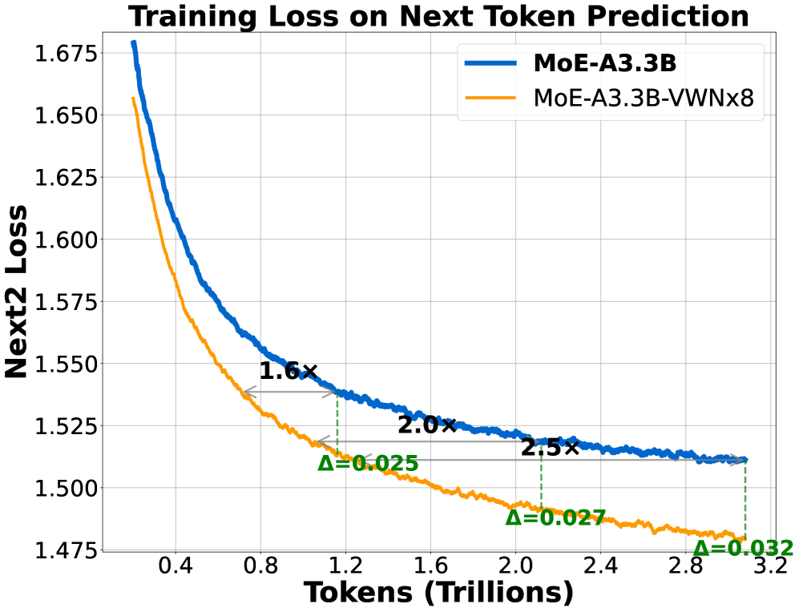
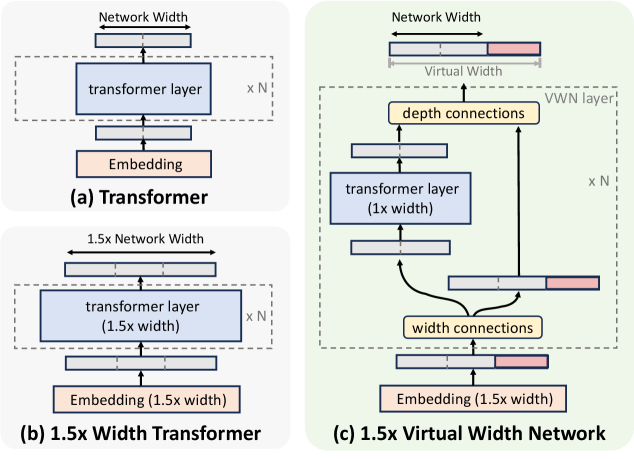
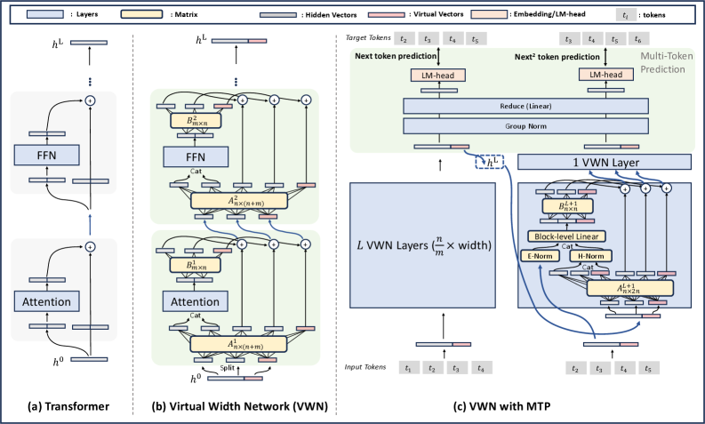
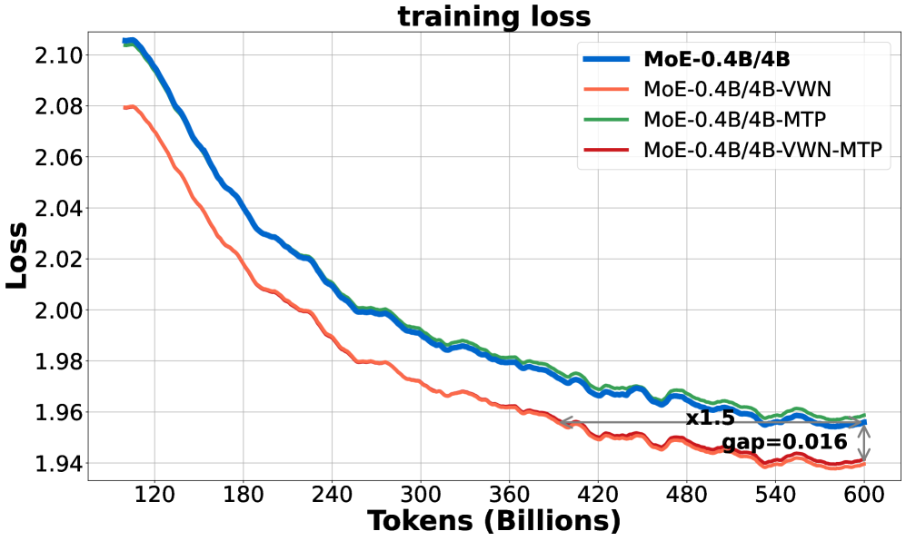
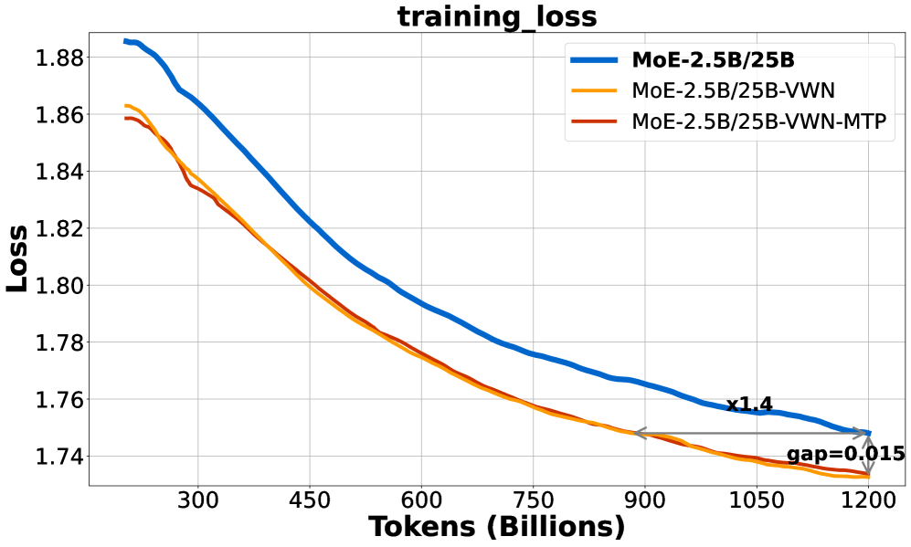
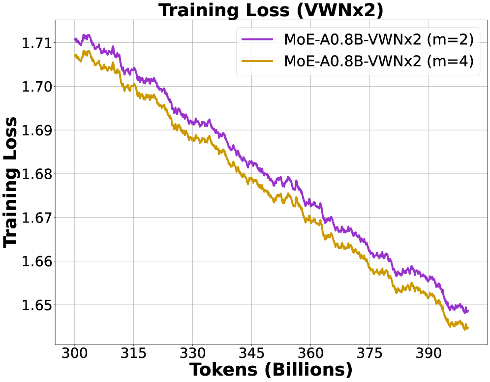
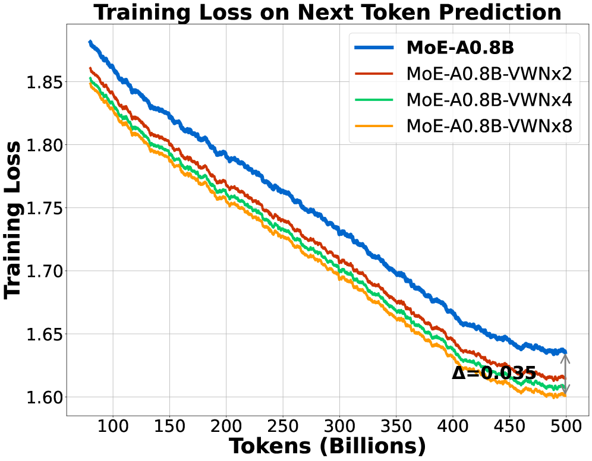
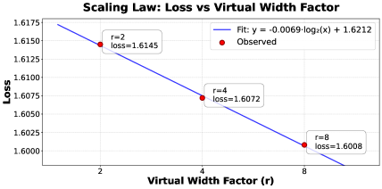
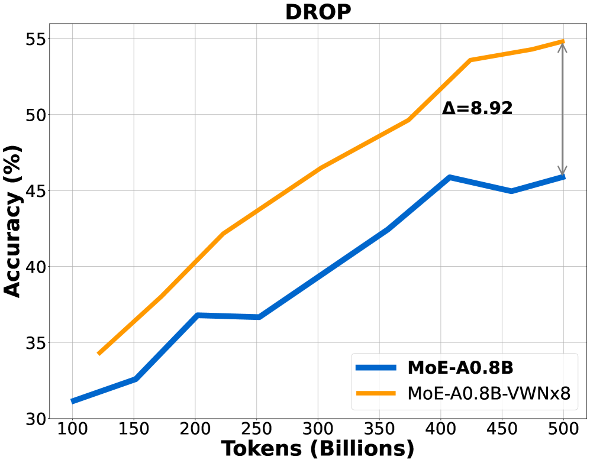

---
title: "虚拟宽度网络"
sourceTitle: "Virtual Width Networks"
sourceUrl: "https://arxiv.org/abs/2511.11238"
sourceAuthor: "ByteDance Seed Team"
sourcePublishedAt: "2025-11-17"
translationMethod: "AI-assisted professional translation (refined mode)"
language: "zh-CN"
sourceFigureCount: 9
pipelineRunId: "20260803-vwn"
pipelineSource: "translate/20260803-vwn/works-ready/virtual-width-networks-translation.md"
---# 虚拟宽度网络

1\]ByteDance Seed 完整作者名单见贡献部分。

###### 摘要

我们提出了虚拟宽度网络（Virtual Width Networks, VWN），这一框架在不产生二次方成本的前提下，提供了更宽表征带来的优势。VWN 将表征宽度与骨干网络宽度解耦，在扩展嵌入空间的同时，保持骨干网络计算量几乎不变。在我们的大规模实验中，8× 的扩展使下一 token 预测的优化加速超过 2 倍，下 2-token 预测加速超过 3 倍。随着训练的进行，这一优势不断扩大——损失差距持续增长，收敛加速比也在提升，表明 VWN 不仅 token 高效，而且其效果随规模增长而增强。此外，我们发现虚拟宽度因子与损失降低之间存在近似对数线性的缩放关系，为探索虚拟宽度缩放这一大模型效率的新维度提供了初步的经验依据和动力。

Defa Zhu at



图 1：在 3.3B 激活参数的混合专家模型上使用虚拟宽度网络（VWN）的大规模实验结果。我们将基线模型 MoE-A3.3B 与配置了虚拟宽度因子 $r=8$ 的 MoE-A3.3B-VWNx8 进行对比。左图和中图：下一 token 和下 2-token 预测的训练损失与已见 token 数的关系。VWN 达到与基线相同的损失所需 token 数分别减少 2.5 倍和 3.5 倍。右图：一组开源基准测试的平均准确率（见表 3），分数按内部定义的任务权重汇总。在该权重方案下，1 个点的差异对应显著的性能差距。

## 1 引言



图 2：标准 Transformer 与虚拟宽度网络（VWN）的对比。(a) 标准 Transformer 对嵌入和骨干网络使用相同的宽度。(b) 朴素的宽度缩放按比例扩展两者，导致参数和计算的二次方增长。(c) VWN 将嵌入宽度与骨干网络宽度解耦。通过广义超连接（Generalized Hyper-Connections），超宽嵌入（例如 1.5 × \\times）与标准宽度的骨干网络耦合，以最小的计算开销增加表征能力。

根据缩放定律 \[kaplan2020scaling, hoffmann2022training\]，扩大模型参数量或训练语料规模能够提升模型能力。特别是，增加模型宽度（隐藏维度）通过在每个向量中封装更多信息来表示更丰富、更复杂的函数，从而大幅提升性能。然而，直接增加隐藏维度会导致参数和计算的二次方增长，在资源受限环境下带来挑战。

为应对此挑战，研究者提出了条件计算策略，在扩展模型容量的同时控制计算成本增长。一个突出例子是混合专家模型（Mixture-of-Experts, MoE）架构 \[shazeer2017sparsely, lepikhin2020gshard, fedus2022switch\]，它为每个输入 token 动态激活专门的子网络。通过在计算时仅选择性使用部分参数，MoE 模型显著提升了吞吐量，能够高效扩展到超大规模，而不会成比例增加每 token 的计算成本。

然而，传统 MoE 架构仅扩展前馈网络（Feed-Forward Network, FFN）的内部维度，骨干网络隐藏维度保持固定。模型表征能力仍受隐藏维度瓶颈限制，与真正的宽隐藏层模型存在性能差距。虽然直接增加隐藏维度可以缩小差距，但会导致参数和计算的二次方增长。这促使我们思考：能否在避免二次方成本爆炸的同时，获得更宽表征的优势？

在这项工作中，我们通过提出虚拟宽度网络（Virtual Width Networks, VWN）来应对这一挑战，这是一个通用框架，能够在保持 Transformer 骨干网络隐藏维度固定的同时，扩展 token 嵌入宽度。我们的核心洞察是，可以通过扩展嵌入而非加宽隐藏层来实现更宽的表征，后者是二次方计算成本的主要来源。从这个角度看，采用超连接（Hyper-Connections）\[zhu2024hyper\] 或 AltUp \[baykal2023alternating\] 等方法的模型可以被视为更广泛的 VWN 家族中的简化实例。通过增强 VWN 的设计，我们进一步提升了其表征能力，并揭示了虚拟宽度的有利缩放特性——具体而言，在固定骨干网络的情况下，损失与虚拟宽度因子之间存在缩放关系，这为社区提供了一个扩展大模型的新维度。

建立了 VWN 的概念动机和优势后，我们现在描述其内部机制。虚拟宽度网络的输入是加宽的 token 嵌入，我们称之为**超宽嵌入**（Over-Width Embedding）。在 VWN 内部，中间表征相应地称为**超宽隐藏状态**（Over-Width Hidden States）。为处理这些状态，我们用广义超连接（Generalized Hyper-Connections, GHC）替换标准残差连接——这是一个更通用的表述，统一了超连接（Hyper-Connections, HC）\[zhu2024hyper\] 和分数连接（Frac-Connections, FC）\[zhu2025frac\] 的思想。GHC 引入了灵活的轻量级机制：首先将超宽隐藏状态压缩到骨干网络宽度，送入注意力或前馈模块计算，然后将输出扩展回超宽宽度，更新下一层的超宽隐藏状态。最后，降维算子（如线性投影）将最后的超宽隐藏状态映射回原始隐藏宽度，通过反嵌入层生成输出 logits。

为了更好地利用加宽的表征，我们将 VWN 与多 token 预测（Multi-Token Prediction, MTP）结合，同时优化标准的下一 token 目标和辅助的 $n$ -gram 损失。直观上，更密集的 MTP 监督会锻炼扩展的虚拟空间，而 VWN 带来的额外表征自由度改善了短程组合建模，产生协同效应。

我们使用内部 MoE 模型在多个场景下评估 VWN，报告相对于匹配的非 VWN 基线的训练动态和 token 效率，并评估下游泛化能力。主要结果显示，将嵌入宽度扩展 8× 的 VWN 达到基线的下一 token 损失所需 token 数减少 2.5 倍，达到下 2-token 损失所需 token 数减少 3.5 倍，且随训练进行，效率优势不断增加，如图 1 所示。

##### 贡献。

我们的主要贡献总结如下：

- **虚拟宽度网络（VWN）**。我们提出了 VWN，它将嵌入宽度与骨干网络宽度解耦，通过广义超连接（Generalized Hyper-Connections, GHC）以最小的额外计算实现 $r\times$ 虚拟加宽。通过系统的缩放实验，我们进一步揭示了虚拟宽度因子 $r$ 与损失之间的对数线性缩放定律，阐明了虚拟加宽如何影响模型性能。
- **广义超连接（GHC）**。我们将 GHC 形式化为一个统一的表述，涵盖了先前的变体（例如超连接和分数连接），并在虚拟隐藏状态和骨干网络隐藏状态之间提供灵活的路由和混合。
- **与多 token 预测（MTP）的协同**。我们证明了 VWN 与 MTP 具有协同作用，在下游准确率上产生一致的改进。

## 2 相关工作

**扩展模型容量**。Transformer 模型通过增加模型宽度、深度和数据规模展示了强大的性能提升 \[kaplan2020scaling, hoffmann2022training\]。然而，增加隐藏维度通常导致参数和计算的二次方增长，在资源受限的环境下带来挑战。已有几种方法被提出来将模型容量与计算解耦。例如，混合专家模型（MoE）\[shazeer2017sparsely, lepikhin2020gshard, fedus2022switch\] 有条件地激活子网络以高效地扩展模型规模。我们的方法在避免通常与加宽隐藏维度相关的二次方计算成本的同时，增加了有效容量。这是通过将嵌入宽度与骨干网络隐藏尺寸解耦来实现的。

**超连接和分数连接**。超连接（Hyper-Connections, HC）\[zhu2024hyper\] 和 AltUp \[baykal2023alternating\] 通过跨层的低成本组合链接扩展隐藏维度，从而增强模型表达能力。然而，在大型隐藏空间中，HC 往往对扩展表征利用不足，因为每个扩展仅使用少数标量权重更新，难以充分利用额外的容量。分数连接（Frac-Connections, FC）\[zhu2025frac\] 采取相反的方法：它不扩大隐藏尺寸，而是将现有隐藏维度划分为多个较小的段，从而在不增加模型宽度的情况下实现类 HC 的连接性。我们提出的广义超连接（GHC）整合了两者的优势——既扩展隐藏维度，又将其进一步细分为结构化的子状态。这种设计提供了对容量使用的细粒度控制，并能更高效地利用扩展的表征空间。此外，它引入了额外的灵活性：隐藏维度的扩展比不必是整数倍，这种分数扩展已在实验中被验证是有效的（见第 5.1 节）。

**嵌入扩展**。最近的研究强调了词汇缩放在大语言模型中的重要性 \[tao2024scaling\]，表明扩展输入词汇——特别是通过分层 $n$ -gram token 嵌入——可以系统性地提升模型表达能力和训练效率，且计算开销可忽略不计 \[huang2025over\]。超分词 Transformer 框架（Over-Tokenized Transformer）\[huang2025over\] 引入了超编码（Over-Encoding, OE）通过多 gram 分词扩展输入表征，以及超解码（Over-Decoding, OD）通过多 token 预测目标增强输出监督。值得注意的是，多 token 预测（Multi-Token Prediction, MTP）\[gloeckle2024better\] 被视为 OD 在实际训练中的有效实例。

## 3 方法



图 3：虚拟宽度网络（VWN）概述。(a) 标准 Transformer 在输入嵌入、每层的中间隐藏向量和最终层输出之间保持一致的宽度。(b) VWN 通过超宽嵌入扩展嵌入维度，同时使用轻量级的广义超连接（GHC）维持层维度。这些维度通过小矩阵 𝐀 l \\mathbf{A}^{l} 和 𝐁 \\mathbf{B}^{l}（ 表示层编号）灵活交互。(c) 我们启用多 token 监督（多 token 预测），从而实现更丰富的 token 表征。

### 3.1 重新思考模型宽度

在一个具有 $L$ 层和模型宽度 $D$ 的标准 Transformer 模型中，初始 token 表征 $\mathbf{h}^{0}\in\mathbb{R}^{D}$ 通过嵌入查找获得。该表征随后通过 transformer 层进行处理，每层由一个注意力块和一个前馈网络（FeedForward Network, FFN）块组成。具体而言，在第 $l$ 层，中间隐藏向量 $\mathbf{h}^{l}\in\mathbb{R}^{D}$ 从 $\mathbf{h}^{l-1}$ 计算得出。最终层输出 token 表征 $\mathbf{h}^{L}\in\mathbb{R}^{D}$，然后通过线性头将其投影到 $|\mathcal{V}|$ 维的词汇空间。Transformer 的计算复杂度为 $\mathcal{O}(D^{2})$，这表明扩展模型宽度 $D$ 会导致计算成本的二次方增长。

然而，嵌入查找操作仅占总体计算成本的一小部分。利用这一洞察，我们将嵌入维度与隐藏层维度解耦，使得嵌入维度可以显著扩展，同时为中间层计算保持原始隐藏维度。因此，这种方法在几乎保持原始计算成本的同时，显著增强了 token 嵌入的表征能力。

### 3.2 超宽嵌入

为了增加嵌入维度，我们提出了超宽嵌入（Over-Width Embedding）技术。给定固定的隐藏尺寸 $D$，我们将输入的嵌入维度扩大到更宽的维度 $D^{\prime}$，从而在不增加大量计算开销的情况下获得更丰富的 token 嵌入。

形式上，设 $\mathbf{h}^{l}\in\mathbb{R}^{D}$ 表示第 $l$ 层的隐藏状态。我们将该隐藏向量均匀划分为 $m$ 个不相交的段：

$$
\mathbf{h}^{l}=\begin{pmatrix}{\mathbf{h}^{l}}_{1}^{\intercal}&{\mathbf{h}^{l}}_{2}^{\intercal}&\dots&{\mathbf{h}^{l}}_{m}^{\intercal}\end{pmatrix}^{\intercal},\quad\text{where }{\mathbf{h}^{l}}_{k}\in\mathbb{R}^{D/m},\;k=1,2,\dots,m.
$$

接下来，我们定义扩展的嵌入向量 $\mathbf{e}\in\mathbb{R}^{D^{\prime}}$，其中 $D^{\prime}=\frac{n}{m}D$，$n>m$ 为整数：

$$
\mathbf{e}=\begin{pmatrix}\mathbf{e}_{1}^{\intercal}&\mathbf{e}_{2}^{\intercal}&\dots&\mathbf{e}_{n}^{\intercal}\end{pmatrix}^{\intercal},\quad\text{where }\mathbf{e}_{k}\in\mathbb{R}^{D^{\prime}/n}\text{ with }D^{\prime}=\frac{n}{m}D.
$$

最后，在输入层，我们设置 $\mathbf{h}^{\prime 0}=\mathbf{e}$，从而使用更宽的 token 嵌入。

当扩展比 $\tfrac{n}{m}$ 较大时，可以选择使用单个线性投影将原始 $1\times$ 嵌入映射到更宽的维度：

$$
\mathbf{E}_{\text{wide}}=\mathbf{W}_{\text{expand}}\,\mathbf{E}_{\text{base}},
$$

这类似于对非常宽的嵌入表应用低秩分解。此外，还可以采用输入增强策略 \[huang2025over\]，在每个输入中注入比单个孤立 token 嵌入更多的信息，以进一步丰富加宽后的表征。

对于反嵌入，模型需要在反嵌入层之前将最后的超宽隐藏状态映射回原始隐藏宽度 $D$。我们引入降维算子 $\mathbf{W}_{\text{reduce}}\in\mathbb{R}^{D\times D^{\prime}}$，执行从超宽维度 $D^{\prime}$ 到原始宽度 $D$ 的线性投影：

$$
\mathbf{h}^{L}_{\text{reduce}}=\mathbf{W}_{\text{reduce}}\,\mathbf{h}^{\prime L}.
$$

为稳定训练，在降维算子之前应用归一化，如图 3 (c) 所示。当扩展比 $r=\tfrac{n}{m}$ 较大时，超宽维度 $D^{\prime}$ 可能变得非常大（例如，对 4096 维隐藏尺寸进行 8× 扩展会产生 32K 维表征）。我们不直接在所有 $D^{\prime}$ 维度上归一化，而是采用**组归一化**（Group Normalization）\[wu2018group\]，组大小等于原始隐藏尺寸 $D$。

### 3.3 广义超连接

我们提出了广义超连接（Generalized Hyper-Connections, GHC），这是一种有效利用更宽 token 嵌入的新方法，同时在中间层计算期间维持原始隐藏维度。具体而言，在每一层 $l$，GHC 引入一个轻量级变换矩阵 $\mathcal{GHC}^{l}$，该矩阵编码原始隐藏表征的段与扩展 token 嵌入之间的加权关系。形式上，该矩阵定义如下：

$$
\displaystyle\mathcal{GHC}^{l}
$$

$$
\displaystyle=\left(\begin{array}[]{cc}\mathbf{0}&\mathbf{B}^{l}\\[3.0pt]
\lx@intercol\hfil\mathbf{A}^{l}\hfil\lx@intercol\end{array}\right)=\left(\begin{array}[]{cc}\mathbf{0}&\mathbf{B}^{l}\\[3.0pt]
\overset{\circ}{\mathbf{A}}{}^{l}&\hat{\mathbf{A}}^{l}\end{array}\right)=\begin{pmatrix}0&\cdots&0&\beta^{l}_{1,1}&\cdots&\beta^{l}_{1,n}\\[2.84526pt]
\vdots&\ddots&\vdots&\vdots&\ddots&\vdots\\[2.84526pt]
0&\cdots&0&\beta^{l}_{m,1}&\cdots&\beta^{l}_{m,n}\\[2.84526pt]
\alpha^{l}_{1,1}&\cdots&\alpha^{l}_{1,m}&\alpha^{l}_{1,m+1}&\cdots&\alpha^{l}_{1,m+n}\\[2.84526pt]
\vdots&\ddots&\vdots&\vdots&\ddots&\vdots\\[2.84526pt]
\alpha^{l}_{n,1}&\cdots&\alpha^{l}_{n,m}&\alpha^{l}_{n,m+1}&\cdots&\alpha^{l}_{n,m+n}\end{pmatrix}\in\mathbb{R}^{2m\times(m+n)}.
$$

考虑第 $l$ 层网络层 $\mathcal{T}^{l}$，它集成了 transformer 中的自注意力层或前馈网络。GHC 的输出表示为 $\mathbf{H^{\prime}}^{l}=\texttt{Reshape}(\mathbf{h^{\prime}}^{l},(n,D^{\prime}/n))$，代表超宽隐藏状态（Over-Width Hidden States），可以表示为：

$$
\displaystyle\mathbf{H}^{\prime l}
$$

$$
\displaystyle=\mathcal{GHC}^{l}(\mathcal{T}^{l},\mathbf{H}^{\prime l-1})
$$

$$
\displaystyle={\mathbf{B}^{l}}^{\intercal}\mathcal{T}^{l}\big({\overset{\circ}{\mathbf{A}}{}^{l\intercal}}\mathbf{H}^{\prime l-1}\big)+{\hat{\mathbf{A}}^{l\intercal}}\mathbf{H}^{\prime l-1}.
$$

##### 动态广义超连接（DGHC）。

为了进一步增强前向过程中的适应性，我们引入 GHC 方法的动态扩展，称为动态 GHC（Dynamic GHC, DGHC），其中变换矩阵根据输入表征 $\mathbf{H}^{\prime}$ 自适应调节：

$$
\mathcal{GHC}(\mathbf{H}^{\prime})=\begin{pmatrix}\mathbf{0}_{m\times m}&\mathcal{B}(\mathbf{H}^{\prime})\\
\overset{\circ}{\mathcal{A}}(\mathbf{H}^{\prime})&\hat{\mathcal{A}}(\mathbf{H}^{\prime})\end{pmatrix}.
$$

在实践中，我们采用来自 zhu2024hyper、zhu2025frac 的混合策略，该策略整合了静态和动态参数，同时进行轻微调整以更好地适应我们的 VWN 框架。动态参数通过轻量级线性投影网络生成。为了确保训练稳定性，首先对输入特征进行归一化。随后，应用与 tanh 激活函数耦合的线性变换。然后，输出通过一个小的可学习矩阵缩放，并与相应的静态矩阵组合：

$$
\displaystyle\overline{\mathbf{H}^{\prime}}
$$

$$
\displaystyle=\texttt{norm}(\mathbf{H}^{\prime}),
$$
$$
\displaystyle\mathcal{B}(\mathbf{H}^{\prime})
$$

$$
\displaystyle=\mathbf{S}_{\beta}\circ\texttt{tanh}\left(\frac{\overline{\mathbf{H}^{\prime}}\mathbf{W}_{\beta}}{\tau}\right)^{\top}+\mathbf{B},
$$
$$
\displaystyle\mathcal{A}(\mathbf{H}^{\prime})
$$

$$
\displaystyle=\mathbf{S}_{\alpha}\circ\texttt{tanh}\left(\frac{\overline{\mathbf{H}^{\prime}}\mathbf{W}_{\alpha}}{\tau}\right)+\mathbf{A}.
$$

其中 $\tau=\sqrt{D/m}$，$\mathbf{S}_{\beta}\in\mathbb{R}^{m\times n}$ 和 $\mathbf{S}_{\alpha}\in\mathbb{R}^{n\times(m+n)}$ 是可学习的缩放矩阵，初始化为 $\mathbf{1}$（形状分别与 $\mathbf{B}$ 和 $\mathbf{A}$ 相同）。设 $d_{b}:=D^{\prime}/n=D/m$ 表示每块的宽度，将 $\mathbf{H}^{\prime}$ 视为 $n\times d_{b}$ 矩阵。投影权重 $\mathbf{W}_{\beta}\in\mathbb{R}^{d_{b}\times m}$ 和 $\mathbf{W}_{\alpha}\in\mathbb{R}^{d_{b}\times(m+n)}$ 是生成动态系数的可学习参数。根据这些形状，$\overline{\mathbf{H}^{\prime}}\mathbf{W}_{\beta}\in\mathbb{R}^{n\times m}$ 和 $\overline{\mathbf{H}^{\prime}}\mathbf{W}_{\alpha}\in\mathbb{R}^{n\times(m+n)}$；公式 (13) 中的转置使前者变为 $m\times n$ 以匹配 $\mathbf{B}\in\mathbb{R}^{m\times n}$，而公式 (14) 已经与 $\mathbf{A}\in\mathbb{R}^{n\times(m+n)}$ 对齐。

##### 初始化和实现。

公式 (13) 和 (14) 中的动态参数 $\mathbf{W}_{\beta}$ 和 $\mathbf{W}_{\alpha}$ 初始化为 0，而静态矩阵按以下方式初始化。值得注意的是，我们没有对初始化进行任何专门的调整，因此仍有改进学习效率的空间。

静态矩阵 $\mathbf{B}\in\mathbb{R}^{m\times n}$ 以循环模式初始化：

$$
\mathbf{B}[i,j]=\begin{cases}1,&\text{if }i=j\bmod m,\\
0,&\text{otherwise},\end{cases}\quad\text{for }i\in\{0,\ldots,m-1\},\,j\in\{0,\ldots,n-1\}.
$$

静态矩阵 $\mathbf{A}\in\mathbb{R}^{n\times n}$ 初始化为块矩阵：

$$
\mathbf{A}=\begin{cases}\begin{pmatrix}\mathbf{I}_{m\times m}&\mathbf{I}_{m\times m}&\mathbf{0}_{m\times r}\end{pmatrix},&\text{if }n=m,\\[10.0pt]
\begin{pmatrix}\mathbf{I}_{m\times m}&\mathbf{I}_{m\times m}&\mathbf{0}_{m\times r}\\
\mathbf{0}_{r\times m}&\mathbf{0}_{r\times m}&\mathbf{I}_{r\times r}\end{pmatrix},&\text{if }n>m,\end{cases}\quad\text{where }r=n-m.
$$

静态成分 $\mathbf{B}$ 和 $\mathbf{A}$ 不使用权重衰减，而动态成分使用。实现细节见附录 9，算法在算法 1 中呈现。

算法 1 虚拟宽度网络（VWN）前向传播

超宽 token 嵌入 $\mathbf{e}\in\mathbb{R}^{D^{\prime}}$

分数率 $m$，扩展宽度 $n$，骨干网络维度 $D$

网络层 $\{\mathcal{T}^{1},\ldots,\mathcal{T}^{L}\}$ 和路由矩阵 $\{\mathbf{A}^{l},\mathbf{B}^{l}\}_{l=1}^{L}$

压缩矩阵 $\mathbf{R}\in\mathbb{R}^{n\times m}$

最终输出 $\mathbf{y}$

初始化：

 $\mathbf{H^{\prime}}^{0}\leftarrow\texttt{Reshape}(\mathbf{e},(n,D^{\prime}/n))^{\intercal}\in\mathbb{R}^{D^{\prime}/n\times n}$

for $l=1$ to $L$ do

   $\mathbf{X}^{l}\leftarrow{\overset{\circ}{\mathbf{A}}{}^{l}}^{\intercal}\mathbf{H^{\prime}}^{l-1}$

   $\mathbf{z}^{l}\leftarrow\mathcal{T}^{l}(\texttt{Reshape}(\mathbf{X}^{l},(D,)))$ $\triangleright$ 输入到 Transformer 块中的 FFN 或注意力层

   $\mathbf{Z}^{l}\leftarrow\texttt{Reshape}(\mathbf{z}^{l},(m,D/m))^{\intercal}$    $\mathbf{H^{\prime}}^{l}\leftarrow{\mathbf{B}^{l}}{}^{\intercal}\mathbf{Z}^{l}+{\hat{\mathbf{A}}^{l}}{}^{\intercal}\mathbf{H^{\prime}}^{l-1}$

end for

 $\mathbf{h}^{L}\leftarrow\texttt{Linear}(\texttt{GroupNorm}(\mathbf{H^{\prime}}^{L}))$ $\mathbf{y}\leftarrow\texttt{Unembedding}(\texttt{Norm}(\mathbf{h}^{L}))$

return $\mathbf{y}$

### 3.4 多 token 预测

对于输出层，先前的研究 \[huang2025over\] 已经证明，多 token 预测（Multi-Token Prediction, MTP）可以作为 $k$ -gram 解码的近似。基于这一洞察，我们利用 MTP 通过在骨干模型之上引入额外的 VWN 层来提供细粒度的监督信号，从而构建增强的预测头。具体而言，遵循 deepseekai2025deepseekv3technicalreport，我们将下一个 token 的嵌入与前一个 token 的最后层嵌入连接，应用线性投影生成 logits，如图 3 (c) 的上半部分所示。

然而，像 deepseekai2025deepseekv3technicalreport 中那样采用混合隐藏状态和嵌入的单个密集线性（即 $2D\!\to\!D$ 投影）在 VWN 下变得过于昂贵，因为宽度扩展了 $r$ 倍。朴素的密集混合将扩展到 $2rD\!\to\!rD$；对于 $r{=}8$，参数和 FLOPs 都大幅增长，难以承受。为了解决这个问题，我们使用块级线性进行混合。我们将 $rD$ 维向量划分为 $n=r\times m$ 个大小为 $D/m$ 的段，并对每个段应用相同的小线性，形状为 $(2D/m)\!\to\!(D/m)$。换句话说，我们在每个段内局部融合隐藏状态和嵌入特征，在所有块之间共享线性投影器。这在保持更宽 VWN 表征优势的同时，使混合成本与 $r{=}1$ 的情况相当。

### 3.5 成本分析

##### 计算成本。

VWN 的理论计算开销相对较低。我们关注主要的计算成本。归一化操作（例如 RMSNorm）每个 token 需要 $4\frac{n}{m}D$ FLOPs。计算动态参数 $\mathbf{A}$ 和 $\mathbf{B}$ 每个 token 需要 $2\frac{(2m+n)n}{m}D$ FLOPs。宽度连接产生 $2\frac{(m+n)n}{m}D$ FLOPs 的成本，深度连接需要 $2nD$ FLOPs。在 $m=2$ 和 $n=3$ 的适度设置下，归一化、动态参数计算和宽度连接步骤总计 $42D$ FLOPs，而深度连接需要 $6D$ FLOPs。这些计算成本对于基于 GPU 的训练/推理系统而言是很小的，特别是考虑到与激活内存访问相关的 I/O 开销，后者成为 VWN 的瓶颈。为了最小化 I/O，归一化、动态参数计算和宽度连接操作被融合到单个 GPU 核函数中。此外，宽度连接可以与 transformer 层中的后续层归一化融合。当 $m$ 较小时，由于超宽隐藏状态，VWN 大约增加 $\tfrac{n}{m}-1$ 倍的层归一化和残差加法成本。在这种设置下，这种开销可以忽略不计，尽管对于较大的 $m$，其影响随配置而变化。

##### 内存成本。

在模型训练期间，必须存储中间激活以用于反向传播。VWN 引入了额外的内存开销以保存 VWN 输入激活。然而，这可以通过廉价的重计算来缓解。在典型的训练框架如 Megatron-LM 中，采用选择性激活重计算 \[korthikanti2023reducing\]，普通 transformer 层中的每个 token 需要 $34D$ 字节用于激活存储。VWN 主要增加了保存 $\mathbf{A}$ 和 $\mathbf{B}$ 输入的成本，需要 $2\times 2\times(\frac{n}{m}+1)D$ 字节，因为每个数字使用 2 字节（16 位浮点数）表示，并且每个 transformer 层有两个宽度和深度连接。虽然注意力和 FFN 输入通常被保存用于权重梯度计算，但它们可以从宽度连接中高效地重计算。通过保存宽度连接中 $\mathbf{A}$ 的输入和深度连接中 $\mathbf{B}$ 的输入，后续的宽度连接输入可以以低成本重计算。使用因子 $\eta$ 表示保存的宽度连接输入的比率，VWN 对 transformer 层的额外激活内存消耗为 $4\eta\frac{n}{m}D$ 字节。在 $m=2$、$n=3$ 和 $\eta=0.5$（保存注意力的宽度连接输入并为 FFN 重计算）的适度设置下，增加的内存消耗为 $3D$ 字节，约为普通 transformer 层内存占用的 8.8%。在模型推理期间，额外的内存开销仅来自额外的参数，与其他内存消耗相比可以忽略不计。

## 4 连接性视角

我们通过连接性的视角重新解读虚拟宽度网络（VWN），将其视为沿深度轴的注意力机制。将层的堆叠视为"深度序列"，其中每个层索引类似于一个 token 位置，隐藏状态充当"垂直 KV 缓存"。在这种视角下，常见的连接模式映射到先前层上的类注意力窗口：(1) 没有残差的普通前馈堆叠对应于大小为 1 的滑动窗口（每层仅处理其当前输入并遗忘前一个）；(2) 残差连接 \[he2016deep\] 实现大小为 2 的窗口（当前输入加上紧邻的前一个）；(3) 密集连接 \[ma2023denseformer, huang2017densely, xiao2025muddformer\] 将窗口大小扩展到包括所有先前的层，允许每层重用所有先前的表征。带有广义超连接（GHC）的 VWN 介于两者之间：它实现了一种学习的、固定成本的、类似线性注意力的机制来扩展可访问的深度上下文。

形式上，设第 $l$ 层的加宽状态为槽矩阵 $\mathbf{H}^{\prime\,l}\in\mathbb{R}^{(D/m)\times n}$，其中有 $n$ 个大小为 $D/m$ 的槽，设 $r\coloneqq n/m$ 为以 $D$ 单位测量的宽度扩展。明确骨干网络映射的 GHC 递归式在公式 (10) 中：$\mathbf{H}^{\prime l}={\mathbf{B}^{l}}^{\intercal}\mathcal{T}^{l}\big({\overset{\circ}{\mathbf{A}}{}^{l\intercal}}\mathbf{H}^{\prime l-1}\big)+{\hat{\mathbf{A}}^{l\intercal}}\mathbf{H}^{\prime l-1},$ 其中 $\big(\hat{\mathbf{A}}^{\,l}\big)^{\intercal}$ 传输/衰减存储在槽中的信息（学习的携带/遗忘算子），$\big(\mathbf{B}^{\,l}\big)^{\intercal}$ 将当前层的骨干网络摘要写入选定的槽。展开公式 (10) 明确得到

$$
\displaystyle\mathbf{H}^{\prime\,l}
$$

$$
\displaystyle=\sum_{t=0}^{l-1}\left(\prod_{i=0}^{t-1}\big(\hat{\mathbf{A}}^{l-i}\big)^{\intercal}\right)\big(\mathbf{B}^{l-t}\big)^{\intercal}\mathcal{T}^{l-t}\big(\big(\overset{\circ}{\mathbf{A}}^{l-t}\big)^{\intercal},\mathbf{H}^{\prime(l-t-1)}\big)+\left(\prod_{i=0}^{l-1}\big(\hat{\mathbf{A}}^{\,l-i}\big)^{\intercal}\right)\mathbf{H}^{\prime 0}
$$

约定空积等于单位矩阵。公式 (17) 表明 $\mathbf{H}^{\prime\,l}$ 线性聚合来自早期层的骨干网络变换特征，通过"携带算子" $\hat{\mathbf{A}}$ 传播，并在每步通过 $\mathbf{B}$ 写入——捕捉了线性注意力在压缩深度缓存上的精神。

##### 选择 m。

存储深度信息的内存预算——以 $D$ 单位测量——为 $r{=}n/m$。GHC 在每层保真度和记忆层数之间分配这一预算：

- 当 $m{=}1$ 时，模型以完整的 $D$ 维保真度存储最多 $r$ 层（更少的层，每层更高的带宽）。
- 当 $m{>}1$ 时，模型存储最多 $n{=}rm$ 层，每层压缩到 $D/m$ 维（更多的层，每层更低的带宽）。

因此，$m$ 控制每层压缩，$n$ 控制名义深度窗口，$r$ 固定总内存预算。然后，学习的、依赖输入的路由通过衰减而非硬截断提供名义窗口之外的软扩展。直观上，更大的 $m$ 以较低的每层保真度为代价扩展有效记忆层数。对于更宽的模型，增加的表征能力提供了足够的带宽来容纳更大的 $m$。类似地，更深的网络受益于更大的 $m$，因为使每层能够访问更长范围、更浅层的信息可以缓解优化困难并改善梯度流。

##### 硬与软深度窗口。

- **硬路由**。如果 $\hat{\mathbf{A}}^{\,l}$ 和 $\mathbf{B}^{\,l}$ 接近置换/二进制门，则更新的行为类似于深度上的固定大小滑动窗口。当 $m{=}1$ 时，有 $r{=}n$ 个维度为 $D$ 的槽，因此模型可以以完整保真度保留最后 $r$ 层。当 $m{>}1$ 时，有 $n{=}rm$ 个大小为 $D/m$ 的槽；每层的 $D$ 维状态被压缩到 $D/m$ 并写入一个槽，以压缩形式给出大小为 $n$ 的硬窗口。
- **软路由**。使用实值的、可能依赖输入的 $\hat{\mathbf{A}}^{\,l}$ 和 $\mathbf{B}^{\,l}$（动态 GHC），信息被部分保留并在步骤间混合。当 $\big(\hat{\mathbf{A}}^{\,l}\big)^{\intercal}$ 的谱半径低于 1 时，公式 (17) 暗示来自前面层的贡献呈指数衰减。有效深度感受野可以超过名义硬窗口（$m{=}1$ 时 $>r$ 或 $m{>}1$ 时 $>n$），尽管信息逐渐衰减和混合。

##### 具体配置。

考虑 $(m,n){=}(8,64)$，因此 $r{=}8$。模型维护 $n{=}64$ 个宽度为 $D/8$ 的槽。在硬路由下，当前层可以利用最近的 $64$ 层，每层以原始维度的 $1/8$ 表示。在软路由下，早于 $64$ 层的贡献可能随衰减而持续，有效扩大"深度感受野"。

##### 关于注意力类比的范围。

我们与注意力的类比主要借用了沿深度的 KV 缓存视角。这并不意味着层间连接是通过相似度分数或成对相关性构建的，如标准自注意力中那样。GHC 使用学习的（静态或输入条件的）路由矩阵以固定成本在层间携带、压缩和写入信息，而不是计算点积分数或在层索引上进行 softmax。

## 5 实验
### 5.1 VWN 1.5×



图 4：VWN 与 MTP 在 0.4B/4B MoE 模型上的性能表现。左图：训练损失与已见 token 数（十亿）的关系。VWN 降低了下一 token 预测损失，而 MTP 略微提升了 NTP 损失；将 VWN 与 MTP 结合（VWN+MTP）在增强变体中实现了最低的最终损失，但当包含 MTP 时，相比基线指标仍有小幅差距（≈0.016）。右图：平均下游准确率（%）与 token 数的关系。VWN 和 MTP 均相比基线提升了下游准确率，二者结合在整个训练过程中提供了最大增益。模型：MoE-0.4B/4B（基线）、MoE-0.4B/4B-VWN、MoE-0.4B/4B-MTP 和 MoE-0.4B/4B-VWN-MTP。

为了检验 VWN 在分数虚拟宽度扩展下的有效性，我们使用 $1.5\times$ 配置作为代表性案例。我们在大规模语言模型预训练中联合评估 VWN 和多 token 预测（Multi-Token Prediction, MTP），并在集合 A 上测量下游性能，该集合定义为表 2 所列基准测试的平均得分。在 $1.5\times$ 设置中，降维算子（用于聚合虚拟分区）之前的组归一化（Group Normalization）被省略。

作为主要评估，我们在多个规模的内部混合专家模型（Mixture-of-Experts, MoE）上进行了全面实验，包括 MoE 0.4B/4B 和 MoE 2.5B/30B，所有模型均在大规模内部数据集上训练。每个 VWN 变体采用 $(m,n)=(2,3)$ 配置，相对于骨干网络隐藏尺寸实现 $1.5\times$ 虚拟宽度扩展，从而在计算成本几乎不变的情况下将扩展的嵌入空间与固定宽度骨干网络解耦。这种设置能够在不同模型规模和真实生产条件下对 VWN 和 MTP 的通用性进行受控评估。



图 5：VWN 与 MTP 在 2.5B/25B MoE 模型上的性能表现。左图：训练损失与已见 token 数（十亿）的关系。VWN 相比基线降低了下一 token 预测损失，在此规模上，在 VWN 之上添加 MTP 不会损害损失，VWN+MTP 达到最低的最终损失，在训练结束时与基线的差距为 0.015。右图：平均下游准确率（%）与 token 数的关系。VWN 和 VWN+MTP 均优于基线，VWN+MTP 在整个训练过程中提供最高准确率。模型：MoE-2.5B/25B（基线）、MoE-2.5B/25B-VWN 和 MoE-2.5B/25B-VWN-MTP。

**0.4B/4B 模型**。我们研究了 VWN 和 MTP 对 0.4B/4B MoE 模型的影响（图 4）。在训练目标上（左图），VWN 相比基线持续降低下一 token 预测（NTP）损失，而 MTP 略微增加了 NTP 损失。组合方案 VWN+MTP 在增强变体中达到最低损失，但当包含 MTP 时，相比基线指标仍有 0.016 的差距。在集合 A 的下游评估中，单独使用 MTP 与基线相当，而 VWN+MTP 在整个训练过程中提供最高的平均准确率增益。

**2.5B/25B 模型**。图 5 展示了 2.5B/25B MoE 变体的结果。在训练目标上（左图），VWN 相比基线降低了下一 token 损失，在此规模上，在 VWN 之上添加 MTP 不会降低优化性能——VWN 和 VWN+MTP 均达到类似的低最终损失，各自比基线低约 0.015。在下游评估中（右图），两个变体均优于基线，VWN+MTP 在训练过程中持续产生最佳平均准确率。

### 5.2 大虚拟宽度

我们在更强的内部基线之上研究虚拟宽度缩放。所有模型默认包含多 token 预测（MTP）头，联合优化标准下一 token 和 MTP 目标。我们首先在 0.8B 激活参数的 MoE（MoE-A0.8B）上进行消融研究，以解耦增加 $m$（在固定 $r$ 下更细的隐藏分区）和增加 $r$（在固定 $m$ 下更大的虚拟宽度）之间的影响。然后我们扩展到 3.3B 激活参数的 MoE（MoE-A3.3B），并评估配置 $(m,n)=(8,64)$，对应 $r=8$，该配置在保持骨干网络宽度的同时实现嵌入空间的 $8\times$ 虚拟宽度扩展。我们报告训练动态和相对于匹配的非 VWN 基线的 token 效率。下游性能在集合 B 上评估，该集合定义为表 3 中基准测试的平均得分。



图 6：在不同虚拟宽度因子 r 下对分数率 m 的消融研究（MoE-A0.8B）。每个面板绘制了 VWN×2（左）、VWN×4（中）和 VWN×8（右）的下一 token 训练损失与已见 token 数（十亿）的关系。当 $r=2$ 时，将 $m$ 从 2 增加到 4 会产生适度但可见的改善。当 $r=4$ 或 $r=8$ 时，在测试值之间变化只会导致微小差异，这表明在此模型规模下，超过 $m\approx 4$ 后，更细隐藏分区的效果基本饱和。

图 6 展示了在 MoE-A0.8B 上，在不同虚拟宽度因子 $r$ 下对分数率 $m$ 的消融研究。每个图显示下一 token 训练损失与已见 token 数（十亿）的关系。从左到右：$r=2$、$4$ 和 $8$。当 $r=2$ 时，将 $m$ 从 2 增加到 4 略微改善了收敛，产生明显但适度的差距。当 $r=4$ 时，$m=8$ 和 $m=16$ 的变体几乎重叠，表明对分数率的敏感性可忽略不计。当 $r=8$ 时，$m=4$ 和 $m=8$ 曲线同样接近，$m=8$ 的优势微小。总体而言，一旦 $m>4$，$m$ 的效果就会减弱，这表明在此规模下，超过 4 的分区粒度提供的益处有限。与第 4 节的讨论一致，我们假设在固定 $r$ 下，更大的模型往往需要更高的 $m$ 来维持足够的虚拟容量，而较小的模型在相对较低的 $m$ 值下就会饱和。

#### 5.2.1 虚拟宽度因子的缩放定律



图 7：VWN 在 MoE-A0.8B 上的 token 效率（固定分数率 $m=8$）。我们通过设置 $r\in\{2,4,8\}$ 和 $n=r\cdot m=\{16,32,64\}$ 来改变虚拟宽度因子。左/中图：下一 token 和下 2-token 预测的训练损失与已见 token 数的关系。右图：集合 B 上的平均准确率与 token 数的关系。VWN 持续提升样本效率；在 500B token 时，VWN $\times$ 8 相比非 VWN 基线产生 $\Delta=0.035$（下一 token 损失）、$\Delta=0.058$（下 2-token 损失）和 +4.16 点准确率增益（见表 1），通过利用超宽嵌入和 GHC 而不增加骨干网络宽度。

我们在 MoE-A0.8B 上评估 VWN，固定分数率 $m=8$，同时改变虚拟宽度因子 $r\in\{2,4,8\}$（$n=r\cdot m$），以分析缩放 $r$ 如何影响损失和准确率（图 7）。在 500B token 训练周期内，VWN 随着 $r$ 增大产生一致的单调增益。表 1 总结了相对于非 VWN 基线的改进：在 500B token 时，VWN $\times$ 2、VWN $\times$ 4 和 VWN $\times$ 8 分别将下一 token 损失降低 $\Delta=0.020$、0.028 和 0.035，将下 2-token 损失降低 0.030、0.045 和 0.058，并分别将下游准确率提高 +3.2、+3.5 和 +4.16 点。VWN $\times$ 8 $>$ VWN $\times$ 4 $>$ VWN $\times$ 2 $>$ 基线的排序在整个训练过程中保持一致，表明在固定 $m$ 下扩大超宽嵌入系统性地增强了模型容量。代表性基准测试的结果如图 9 所示。该集合由使用内部任务权重组合的公开可用基准测试组成，其中 1 点增益反映了显著的性能差异。

观察到的损失降低与虚拟宽度因子 $r$ 呈对数线性关系（图 8）。拟合系数为 $-0.0069$，表明虚拟宽度每增加一倍，损失约降低 0.0069。虽然效应大小适度，但它表明了归因于虚拟宽度扩展的系统性效率增益。我们假设更具表达力的骨干网络和更有效利用虚拟宽度隐藏表征的改进机制可以进一步放大 VWN 观察到的效率增益。



图 8：虚拟宽度因子 r 与损失之间关系的缩放定律分析。观察数据（红点）用对数线性函数 $y=-0.0069\cdot\log_{2}(x)+1.6212$ 拟合，决定系数 $R^{2}=0.9986$。

#### 5.2.2 大规模模型上的 VWN

如图 1 所示，我们进一步在 3.3B 激活参数的 MoE（MoE-A3.3B）上评估虚拟宽度缩放，使用配置 $(m,n)=(8,64)$，其中隐藏维度被划分为 $m=8$ 个分区，实现 $8\times$ 虚拟宽度扩展。为了灵活控制训练长度，学习率在整个训练过程中保持恒定。

VWN 显著加速了优化。在 MoE-A3.3B 上，它以 2.5× 更少的 token 达到基线的下一 token 损失，以 3.5× 更少的 token 达到下 2-token 损失。同时，相对于基线的下一 token 损失差距从早期阶段的 $\Delta=0.025$ 增加到 3T token 时的约 $\Delta=0.032$，下 2-token 损失差距从 $\Delta=0.049$ 增长到 $\Delta=0.056$。这些趋势表明 VWN 的优势随着训练进行而放大——其相对效率不仅早期出现，而且随时间增强。多 token 目标上的更大增益进一步突显了虚拟宽度与 MTP 监督之间的强协同作用：超宽嵌入为短程组合目标提供了更丰富的表征自由度，而广义超连接（GHC）在不扩展中间层宽度的情况下在虚拟宽度空间和骨干网络之间传递梯度。在集合 B 的下游评估中，VWN 实现的峰值平均准确率比基线高 +2.16 点，证实性能差距持续存在并随着训练延长而继续扩大。

## 6 结论

我们引入了虚拟宽度网络（Virtual Width Networks, VWN）作为一种实用机制，将表征宽度与通常与宽度扩展相关的二次方计算成本解耦。在适度的 1.5× 扩展下，我们观察到一致的改进。当扩展到 8× 虚拟宽度时，优化显著加速：相对于基线宽度，下一 token 预测损失收敛速度快 2× 以上，多 token 预测损失收敛速度快 3× 以上。除了这些离散点之外，VWN 的性能表现出清晰的缩放行为。我们观察到虚拟宽度因子 $r$ 与损失降低之间存在近似对数线性关系，$r$ 每增加一倍对应平均损失降低约 0.0069。虽然增益幅度适度，但它表明虚拟宽度可以作为一个新的、可预测的维度来缩放模型效率，补充现有文献中的深度、宽度和数据缩放定律。VWN 与标准 Transformer 堆栈和训练方法干净集成，为研究容量/计算权衡以及探索受控宽度扩展如何高效提升质量提供了具体的参考点。话虽如此，将这些算法增益转化为生产效率取决于系统现实。尽管质量/计算权衡很有前景，但 VWN 面临实际约束：随着隐藏宽度增长，通信和内存访问开销变得不可忽略，当代硬件对非常宽的激活和跨设备路由并不特别友好。目前，对极宽配置的工程支持仍然有限，这限制了可部署性。在实践中，1.5×–4× 范围内的虚拟宽度扩展在当今的技术栈上更可行，而更大的扩展可能需要软件、内存布局和互连策略的协同设计才能充分实现其潜力。

## 7 贡献者

**贡献者名单**
Baisheng Li
Banggu Wu
Bole Ma
Bowen Xiao
Chaoyi Zhang
Cheng Li
Chengyi Wang
Chengyin Xu
Chi Zhang <sup>∗</sup>
Chong Hu
Daoguang Zan
Defa Zhu
Dongyu Xu
Du Li
Faming Wu
Fan Xia
Ge Zhang
Guang Shi
Haobin Chen
Hongyu Zhu
Hongzhi Huang
Huan Zhou
Huanzhang Dou
Jianhui Duan
Jianqiao Lu
Jianyu Jiang
Jiayi Xu <sup>∗</sup>
Jiecao Chen
Jin Chen
Jin Ma
Jing Su
Jingji Chen
Jun Wang
Jun Yuan
Juncai Liu
Jundong Zhou
Kai Hua
Kai Shen
Kai Xiang
Kaiyuan Chen
Kang Liu
Ke Shen
Liang Xiang
Lin Yan
Lishu Luo
Mengyao Zhang
Ming Ding
Mofan Zhang
Nianning Liang
Peng Li
Penghao Huang
Pengpeng Mu
Qi Huang <sup>∗</sup>
Qianli Ma <sup>∗</sup>
Qiyang Min
Qiying Yu
Renming Pang
Ru Zhang
Shen Yan
Shen Yan
Shixiong Zhao
Shuaishuai Cao
Shuang Wu
Siyan Chen
Siyu Li
Siyuan Qiao <sup>∗</sup>
Tao Sun
Tian Xin
Tiantian Fan
Ting Huang
Ting-Han Fan
Wei Jia
Wenqiang Zhang
Wenxuan Liu
Xiangzhong Wu
Xiaochen Zuo
Xiaoying Jia
Ximing Yang
Xin Liu
Xin Yu
Xingyan Bin
Xintong Hao
Xiongcai Luo
Xujing Li
Xun Zhou
Yanghua Peng
Yangrui Chen
Yi Lin
Yichong Leng
Yinghao Li
Yingshuan Song
Yiyuan Ma
Yong Shan
Yongan Xiang
Yonghui Wu
Yongtao Zhang
Yongzhen Yao
Yu Bao
Yuehang Yang
Yufeng Yuan <sup>∗</sup>
Yunshui Li
Yuqiao Xian
Yutao Zeng <sup>∗</sup>
Yuxuan Wang
Zehua Hong
Zehua Wang
Zengzhi Wang
Zeyu Yang
Zhengqiang Yin
Zhenyi Lu <sup>∗</sup>
Zhexi Zhang
Zhi Chen
Zhi Zhang
Zhiqi Lin
Zihao Huang
Zilin Xu
Ziyun Wei
Zuo Wang

作者按字母顺序排列。星号（*）表示团队的前成员。

## 8 MoE-A0.8B 模型的详细下游结果



图 9：VWN 在 MoE-A0.8B 跨下游基准测试的性能表现。我们比较了非 VWN 基线与 VWN $\times$ 8（$r=8$; $n=r\cdot m=64$）。VWN 在整个训练过程中持续优于基线；在 500B token 时，它在准确率上分别产生 +8.92（DROP）、+2.44（HumanEval）、+4.20（MATH）、+3.95（MMLU）、+5.25（MMLU-Pro）和 +7.45（TriviaQA）点的提升。

如图 9 所示，该图绘制了跨基准测试的 token 效率曲线，VWN $\times$ 8 在所有任务上都提供了学习曲线的统一左移，表明更好的样本效率。在知识和推理密集型基准测试（DROP、MATH）上的改进最大，这表明扩展的超宽嵌入改善了组合推理和检索，而不增加核心计算。HumanEval 表现出较小的增益，这与其有限的测试规模一致。优势在训练后期仍然存在，没有观察到退化，表明 VWN 继续被利用而不是早期饱和。值得注意的是，VWN 在上下文相对较长的任务上取得了特别强的增益，例如 DROP 和 TriviaQA，在这些任务中，建模扩展依赖关系和多句证据聚合从扩大的嵌入空间中获益最多。总体而言，VWN 持续将其 token 级效率增益迁移到多样化的下游领域，在不增加骨干网络宽度的情况下增强泛化能力。

## 9 广义超连接的实现

**算法 2** 广义超连接的伪代码（PyTorch 风格）。

```python
# h: 隐藏向量 (BxLxD)
class GHyperConnection(nn.Module):
    def __init__(self, dim, m, n_in=3, n_out=2):
        super().__init__()
        self.m, self.n_in, self.n_out = m, n_in, n_out
        self.factor = 1.0 / math.sqrt(dim // self.m)

        # 初始化静态 beta：循环模式
        static_beta_tensor = torch.zeros(self.m, n_in)
        for j in range(n_in):
            static_beta_tensor[j % self.m, j] = 1.0
        self.static_beta = nn.Parameter(static_beta_tensor.T.contiguous())

        # 初始化静态 alpha：块矩阵
        init_alpha = torch.cat([torch.eye(self.m), torch.eye(self.m),
                                torch.zeros((self.m, self.n_in - self.m))], dim=1)
        if self.n_in > self.m:
            part2 = torch.cat([torch.zeros((self.n_in - self.m, self.m * 2)),
                               torch.eye(self.n_in - self.m)], dim=1)
            init_alpha = torch.cat([init_alpha, part2], dim=0)
        self.static_alpha = nn.Parameter(init_alpha.contiguous())

        # 动态参数
        self.dynamic_alpha_fn = nn.Parameter(torch.zeros((dim // self.m, self.m + self.n_in)))
        self.dynamic_alpha_scale = nn.Parameter(torch.ones_like(self.static_alpha))
        self.dynamic_beta_fn = nn.Parameter(torch.zeros((dim // self.m, self.m)))
        self.dynamic_beta_scale = nn.Parameter(torch.ones_like(self.static_beta))
        self.layer_norm = RMSNorm(hidden_size=dim // self.m)

    def _base_width_connection(self, h, dynamic_fn, dynamic_scale, static_scale):
        h_shape = h.shape
        N, NMM = static_scale.shape
        M = (NMM - N) // 2
        h_reshape = h.reshape((h_shape[:-1].numel(),) + (N, h_shape[-1] // N))
        norm_h = self.layer_norm(h_reshape)
        alpha_beta = (safe_tanh(norm_h @ dynamic_fn.T.to(dtype=norm_h.dtype) * self.factor)
                      * dynamic_scale[None,...] + static_scale[None,...])
        alpha, beta = torch.split(alpha_beta, (M + N, M), dim=-1)
        mix_h = (h_reshape.transpose(1, 2) @ alpha.to(dtype=h_reshape.dtype)).transpose(1, 2)
        return mix_h.reshape(h_shape[:-1] + mix_h.shape[1:]), beta

    def width_connection(self, h):
        dynamic_fn = torch.concat([self.dynamic_alpha_fn.T, self.dynamic_beta_fn.T], dim=0)
        dynamic_scale = torch.concat([self.dynamic_alpha_scale, self.dynamic_beta_scale],
                                      dim=-1).contiguous()
        static_scale = torch.concat([self.static_alpha, self.static_beta], dim=-1)
        return self._base_width_connection(h, dynamic_fn.to(dtype=h.dtype),
                                            dynamic_scale.to(dtype=h.dtype),
                                            static_scale.to(dtype=h.dtype))

    def depth_connection(self, mix_h, h_o, beta):
        h_o_shape = h_o.shape
        h_o = h_o.reshape(h_o_shape[:-1] + (self.m, h_o_shape[-1] // self.m))
        h_i = beta.view(h_o.shape[:2] + beta.shape[1:]).to(dtype=h_o.dtype) @ h_o
        h = h_i + mix_h[..., self.m:,:]
        h_shape = h.shape
        return h.reshape(h_shape[:-2] + (h_shape[-2] * h_shape[-1],)).contiguous()
```

**算法 3** 带有广义超连接的 Transformer 伪代码（PyTorch 风格）。

```python
# h: 隐藏向量 (BxLxD)
# atten_ghyper_connection, ffn_ghyper_connection: 广义超连接模块
# attn_norm, ffn_norm: 归一化模块

# 注意力块
mix_h, beta = atten_ghyper_connection.width_connection(h)
mix_h_shape = mix_h.shape
h = mix_h[...,:self.rate,:].reshape(mix_h_shape[:-2] + (mix_h_shape[-2] // 2 * mix_h_shape[-1], ))
h = attn_norm(h)
h = self_attention(h)
h = atten_ghyper_connection.depth_connection(mix_h, dropout(h), beta)

# FFN 块
mix_h, beta = ffn_ghyper_connection.width_connection(h)
mix_h_shape = mix_h.shape
h = mix_h[...,:self.rate,:].reshape(mix_h_shape[:-2] + (mix_h_shape[-2] // 2 * mix_h_shape[-1], ))
h = ffn_norm(h)
h = ffn(h)
h = ffn_ghyper_connection.depth_connection(mix_h, dropout(h), beta)
```

## 10 下游基准测试

**表 2：下游基准测试集合 A**

**下游基准测试集合**：ARC_Challenge [allenai:arc]、BBH [suzgun2022challenging]、DROP [dua2019drop]、WinoGrande [sakaguchi2021winogrande]、Hellaswag [zellers2019hellaswag]、MMLU [hendryckstest2021]、MMLU-Pro [wang2024mmlu]、C-Eval [huang2023ceval]、TriviaQA [JoshiTriviaQA2017]、Ape210K [zhao2020ape210k]、GSM8K [cobbe2021gsm8k]、MATH [hendrycksmath2021]、MBPP [austinmbpp2021]、HumanEval [chen2021codex]、AGIEval [zhong2023agieval]、GPQA [rein2024gpqa]

**表 3：下游基准测试集合 B**

**下游基准测试集合**：MMLU [hendryckstest2021]、MMLU-Pro [wang2024mmlu]、C-Eval [huang2023ceval]、AGIEval [zhong2023agieval]、BBH [suzgun2022challenging]、DROP [dua2019drop]、KOR-Bench-Easy [ma2024kor]、MATH [hendrycksmath2021]、MBPP+ [austinmbpp2021]、HumanEval [chen2021codex]、McEval [chai2024mceval]、TriviaQA [JoshiTriviaQA2017]、Chinese SimpleQA [he2024chinese]
